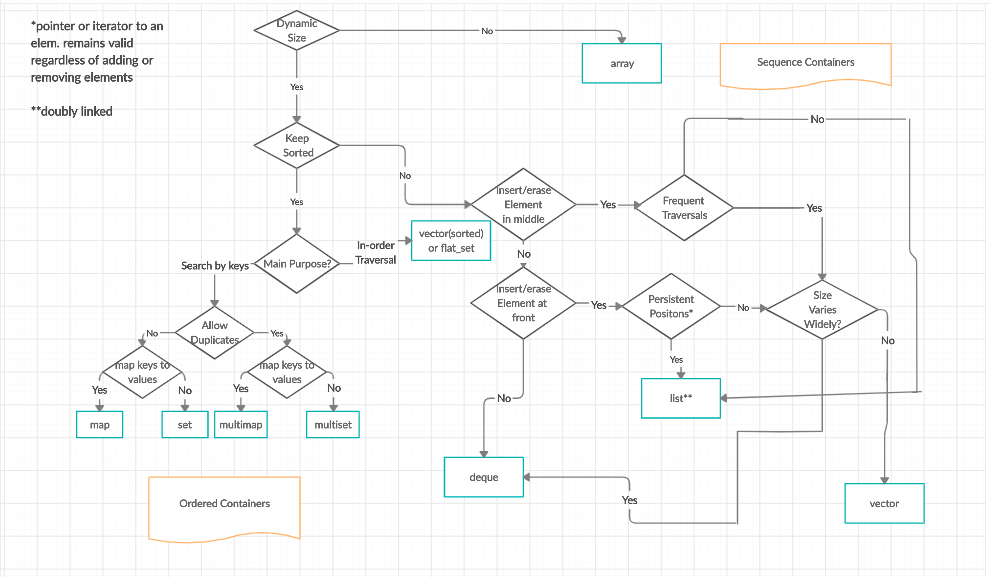

# The C++ Standard Template Library (STL)
The Standard Template Library (STL) is a set of C++ template classes to provide common programming data structures and functions such as lists, stacks, arrays, etc. It is a library of container classes, algorithms, and iterators. It is a generalized library and so, its components are parameterized. A working knowledge of template classes is a prerequisite for working with STL.

## Table of contents
1. [Algorithms](#1)
    1. [Algorithm](#1a)
        1. [Sorting](#1a1)
        1. [Searching](#1a2)
        1. [Important STL Algorithms](#1a3)
            1. [sort(first_iterator, last_iterator)](#1a3a1)
            1. [reverse(first_iterator, last_iterator)](#1a3a2)
            1. [*max_element (first_iterator, last_iterator)](#1a3a3)
            1. [*min_element (first_iterator, last_iterator)](#1a3a4)
            1. [accumulate(first_iterator, last_iterator, initial value of sum)](#1a3a5)
            1. [count(first_iterator, last_iterator,x)](#1a3a6)
            1. [find(first_iterator, last_iterator, x)](#1a3a7)
            1. [binary_search(first_iterator, last_iterator, x)](#1a3a8)
            1. [lower_bound(first_iterator, last_iterator, x)](#1a3a9)
            1. [upper_bound(first_iterator, last_iterator, x)](#1a3a10)
            1. [arr.erase(position to be deleted)](#1a3b1)
            1. [arr.erase(unique(arr.begin(),arr.end()),arr.end())](#1a3b2)
            1. [next_permutation(first_iterator, last_iterator)](#1a3b3)
            1. [prev_permutation(first_iterator, last_iterator)](#1a3b4)
            1. [distance(first_iterator,desired_position)](#1a3b5)
        1. [Useful Array algorithms](#1a4)
            1. [all_of](#1a4a)
            1. [any_of](#1a4b)
            1. [none_of](#1a4c)
            1. [copy_n](#1a4d)
            1. [iota](#1a4e)
        1. [Partition Operations](#1a5)
            1. [partition(beg, end, condition)](#1a5a)
            1. [is_partitioned(beg, end, condition)](#1a5b)
            1. [partition_point(beg, end, condition)](#1a5c)
            1. [stable_partition(beg, end, condition)](#1a5d)
            1. [partition_copy(beg, end, beg1, beg2, condition)](#1a5e)
    1. [Numeric](#1b)
        1. [valarray class](#1b1)
            1. [apply()](#1b1a)
            1. [sum()](#1b1b)
            1. [min()](#1b1c)
            1. [max()](#1b1d)
            1. [shift()](#1b1e)
            1. [Cshift()](#1b1f)
            1. [swap()](#1b1g)
1. [Containers](#2)
    1. [Sequence Containers](#2a)
        1. [vector](#2a1)
		    1. [Iterators](#2a1a)
			1. [Capacity](#2a1b)
			1. [Element access](#2a1c)
			1. [Modifiers](#2a1d)
        1. [list](#2a2)
        1. [deque](#2a3)
        1. [arrays](#2a4)
		    1. [at()](#2a4a)
			1. [get()](#2a4b)
			1. [operator[]](#2a4c)
			1. [front()](#2a4d)
			1. [back()](#2a4e)
			1. [size()](#2a4f)
			1. [max_size()](#2a4g)
			1. [swap()](#2a4h)
			1. [empty()](#2a4i)
			1. [fille()](#2a4j)
        1. [forward_list >= C++11](#2a5)
		    1. [assign()](#2a5a)
			1. [push_front()](#2a5b)
			1. [emplace_front()](#2a5c)
			1. [pop_front()](#2a5d)
			1. [insert_after()](#2a5e)
			1. [emplace_after()](#2a5f)
			1. [erase_after()](#2a5g)
			1. [remove()](#2a5h)
			1. [remove_if()](#2a5i)
			1. [splice_after()](#2a5j)
    1. [Container Adaptors](#2b)
        1. [queue](#2b1)
        1. [priority_queue](#2b2)
        1. [stack](#2b3)        
    1. [Associative Containers](#2C)
        1. [set](#2C1)
        1. [multiset](#2C2)
        1. [map](#2C3)
        1. [multimap](#2C4)
    1. [Unordered Associative Containers](#2d)
        1. [unordered_set >=C++11](#2d1)
        1. [unordered_multiset >=C++11](#2d2)
        1. [unordered_map >=C++11](#2d3)
        1. [unordered_multimap >=C++11](#2d4)
1. [Functions](#3)
    1. [Functors](#3a)
1. [Iterators](#4)
    1. [Iterators](#4a)
	    1. [begin()](#4a1)
		1. [end()](#4a2)
		1. [advance()](#4a3)
		1. [next()](#4a4)
		1. [prev()](#4a5)
		1. [inserter()](#4a6)
1. [Utility Library](#5)
    1. [Pair](#5a)
	    1. [Syntax](#5a1)
		1. [Initializing a pair](#5a2)
		1. [Member Functions](#5a3)
		    1. [make_pair()](#5a3a)
		    1. [operators(=, ==, !=, >=, <=) &swap()](#5a3b)
			1. [tie()](#5a3c)
1. [References](#6)


<a name="1"></a>
## Algorithms

<a name="1a"></a>
### Algorithm

<a name="1a1"></a>
* Sorting

<div class="text"><p><a href="https://www.geeksforgeeks.org/sorting-algorithms/">Sorting</a>
<p>The prototype for sort is :&nbsp;</p><pre>sort(startaddress, endaddress)

startaddress: the address of the first 
              element of the array
endaddress: the address of the next 
            contiguous location of the 
            last element of the array.
So actually sort() sorts in the 
range of [startaddress,endaddress)
</pre><div class="responsive-tabs"><h3 class="tabtitle">CPP</h3><div 
div>
```CPP
// C++ progrma to sort an array
#include <algorithm>
#include <iostream>
 
using namespace std;
 
void show(int a[], int array_size)
{
    for (int i = 0; i < array_size; ++i)
        cout << a[i] << " ";
}
 
// Driver code
int main()
{
    int a[] = { 1, 5, 8, 9, 6, 7, 3, 4, 2, 0 };
   
    // size of the array
    int asize = sizeof(a) / sizeof(a[0]);
    cout << "The array before sorting is : \n";
   
    // print the array
    show(a, asize);
 
      // sort the array
    sort(a, a + asize);
 
    cout << "\n\nThe array after sorting is :\n";
   
    // print the array after sorting
    show(a, asize);
 
    return 0;
}
```
<div class="code-output"><strong>Output</strong><pre>The array before sorting is : 
1 5 8 9 6 7 3 4 2 0 

The array after sorting is :
0 1 2 3 4 5 6 7 8 9 </pre></div>
<p>Refer <a href="https://www.geeksforgeeks.org/sort-c-stl/">std::sort()</a> for more details.


<a name="1a2"></a>
* Searching
<br>The prototype for binary search is :&nbsp;</p><pre><strong>binary_search(startaddress, 
              endaddress, valuetofind)</strong>
<strong>Parameters :</strong>
startaddress: the address of the first 
              element of the array.
endaddress: the address of the next contiguous 
            location of the last element of the array.
valuetofind: the target value which we have 
             to search for.
<strong>Returns :</strong>
true if an element equal to valuetofind is found, else false.</pre>

</pre><div class="responsive-tabs"><h3 class="tabtitle">CPP</h3><div 
div>

```CPP
// CPP program to implement
// Binary Search in
// Standard Template Library (STL)
#include <algorithm>
#include <iostream>

using namespace std;

void show(int a[], int arraysize)
{
	for (int i = 0; i < arraysize; ++i)
		cout << a[i] << ",";
}

int main()
{
	int a[] = { 1, 5, 8, 9, 6, 7, 3, 4, 2, 0 };
	int asize = sizeof(a) / sizeof(a[0]);
	cout << "\nThe array is : \n";
	show(a, asize);

	cout << "\n\nLet's say we want to search for ";
	cout << "\n2 in the array So, we first sort the array";
	sort(a, a + asize);
	cout << "\n\nThe array after sorting is : \n";
	show(a, asize);
	cout << "\n\nNow, we do the binary search";
	if (binary_search(a, a + asize, 2))
		cout << "\nElement found in the array";
	else
		cout << "\nElement not found in the array";

	cout << "\n\nNow, say we want to search for 10";
	if (binary_search(a, a + asize, 10))
		cout << "\nElement found in the array";
	else
		cout << "\nElement not found in the array";

	return 0;
}
```

<div class="code-output"><strong>Output</strong><pre>The array is : 
1,5,8,9,6,7,3,4,2,0,

Let's say we want to search for 
2 in the array So, we first sort the array

The array after sorting is : 
0,1,2,3,4,5,6,7,8,9,

Now, we do the binary search
Element found in the array

Now, say we want to search for 10
Element not found in the array</pre></div>
<p><strong>Related Article: </strong><a href="https://www.geeksforgeeks.org/stdbsearch-in-cpp/">std::bsearch in C++</a>&nbsp;


<a name="1a3"></a>
* Important STL Algorithms
<a name="1a3a"></a>
  * Non-Manipulating Algorithms
<a name="1a3a1"></a><a name="1a3a2"></a><a name="1a3a3"></a><a name="1a3a4"></a><a name="1a3a5"></a>

1. sort(first_iterator, last_iterator) – To sort the given vector.
2. reverse(first_iterator, last_iterator) – To reverse a vector.
3. *max_element (first_iterator, last_iterator) – To find the maximum element of a vector.
4. *min_element (first_iterator, last_iterator) – To find the minimum element of a vector.
5. accumulate(first_iterator, last_iterator, initial value of sum) – Does the summation of vector elements
   


```CPP
// A C++ program to demonstrate working of sort(),
// reverse()
#include <algorithm>
#include <iostream>
#include <vector>
#include <numeric> //For accumulate operation
using namespace std;
 
int main()
{
    // Initializing vector with array values
    int arr[] = {10, 20, 5, 23 ,42 , 15};
    int n = sizeof(arr)/sizeof(arr[0]);
    vector<int> vect(arr, arr+n);
 
    cout << "Vector is: ";
    for (int i=0; i<n; i++)
        cout << vect[i] << " ";
 
    // Sorting the Vector in Ascending order
    sort(vect.begin(), vect.end());
 
    cout << "\nVector after sorting is: ";
    for (int i=0; i<n; i++)
       cout << vect[i] << " ";
 
    // Reversing the Vector
    reverse(vect.begin(), vect.end());
 
    cout << "\nVector after reversing is: ";
    for (int i=0; i<6; i++)
        cout << vect[i] << " ";
 
    cout << "\nMaximum element of vector is: ";
    cout << *max_element(vect.begin(), vect.end());
 
    cout << "\nMinimum element of vector is: ";
    cout << *min_element(vect.begin(), vect.end());
 
    // Starting the summation from 0
    cout << "\nThe summation of vector elements is: ";
    cout << accumulate(vect.begin(), vect.end(), 0);
 
    return 0;
}
```
<div class="code-output"><strong>Output</strong><pre>Vector is: 10 20 5 23 42 15 
Vector after sorting is: 5 10 15 20 23 42 
Vector after reversing is: 42 23 20 15 10 5 
Maximum element of vector is: 42
Minimum element of vector is: 5
The summation of vector elements is: 115</pre></div>
  
<br>
<br>
<a name="1a3a6"></a><a name="1a3a7"></a>

6. count(first_iterator, last_iterator,x) – To count the occurrences of x in vector.
7. find(first_iterator, last_iterator, x) – Returns an iterator to the first occurence of x in vector and points to last address of vector ((name_of_vector).end()) if element is not present in vector.


```CPP
// C++ program to demonstrate working of count()
// and find()
#include <algorithm>
#include <iostream>
#include <vector>
using namespace std;

int main()
{
	// Initializing vector with array values
	int arr[] = {10, 20, 5, 23 ,42, 20, 15};
	int n = sizeof(arr)/sizeof(arr[0]);
	vector<int> vect(arr, arr+n);

	cout << "Occurrences of 20 in vector : ";

	// Counts the occurrences of 20 from 1st to
	// last element
	cout << count(vect.begin(), vect.end(), 20);

	// find() returns iterator to last address if
	// element not present
	find(vect.begin(), vect.end(),5) != vect.end()?
						cout << "\nElement found":
					cout << "\nElement not found";

	return 0;
}
```
<div class="code-output"><strong>Output</strong><pre>Occurrences of 20 in vector : 2
Element found</pre></div>


<a name="1a3a8"></a><a name="1a3a9"></a><a name="1a3a10"></a>
<br><br>

8. binary_search(first_iterator, last_iterator, x)<br> – Tests whether x exists in sorted vector or not.

9. lower_bound(first_iterator, last_iterator, x) <br>– returns an iterator pointing to the first element in the range [first,last) which         has a value not less than ‘x’.

10. upper_bound(first_iterator, last_iterator, x) <br>– returns an iterator pointing to the first element in the range [first,last)                  which has a value greater than ‘x’. 


```CPP
// C++ program to demonstrate working of lower_bound()
// and upper_bound().
#include <algorithm>
#include <iostream>
#include <vector>
using namespace std;

int main()
{
	// Initializing vector with array values
	int arr[] = {5, 10, 15, 20, 20, 23, 42, 45};
	int n = sizeof(arr)/sizeof(arr[0]);
	vector<int> vect(arr, arr+n);

	// Sort the array to make sure that lower_bound()
	// and upper_bound() work.
	sort(vect.begin(), vect.end());

	// Returns the first occurrence of 20
	auto q = lower_bound(vect.begin(), vect.end(), 20);

	// Returns the last occurrence of 20
	auto p = upper_bound(vect.begin(), vect.end(), 20);

	cout << "The lower bound is at position: ";
	cout << q-vect.begin() << endl;

	cout << "The upper bound is at position: ";
	cout << p-vect.begin() << endl;

	return 0;
}
```
<div class="code-output"><strong>Output</strong><pre>The lower bound is at position: 3
The upper bound is at position: 5</pre></div>


<a name="1a3b1"></a><a name="1a3b2"></a>

11. arr.erase(position to be deleted) <br>– This erases selected element in vector and shifts and resizes the vector elements accordingly.
12. arr.erase(unique(arr.begin(),arr.end()),arr.end()) <br>– This erases the duplicate occurrences in sorted vector in a single line.
 

```CPP
// C++ program to demonstrate working of erase()
#include <algorithm>
#include <iostream>
#include <vector>
using namespace std;

int main()
{
	// Initializing vector with array values
	int arr[] = {5, 10, 15, 20, 20, 23, 42, 45};
	int n = sizeof(arr)/sizeof(arr[0]);
	vector<int> vect(arr, arr+n);

	cout << "Vector is :";
	for (int i=0; i<vect.size(); i++)
		cout << vect[i]<<" ";

	// Delete second element of vector
	vect.erase(vect.begin()+1);

	cout << "\nVector after erasing the element: ";
	for (int i=0; i<vect.size(); i++)
		cout << vect[i] << " ";

	// sorting to enable use of unique()
	sort(vect.begin(), vect.end());

	cout << "\nVector before removing duplicate "
			" occurrences: ";
	for (int i=0; i<vect.size(); i++)
		cout << vect[i] << " ";

	// Deletes the duplicate occurrences
	vect.erase(unique(vect.begin(),vect.end()),vect.end());

	cout << "\nVector after deleting duplicates: ";
	for (int i=0; i< vect.size(); i++)
		cout << vect[i] << " ";

	return 0;
}
```
<div class="code-output"><strong>Output</strong><pre>Vector is :5 10 15 20 20 23 
Vector after erasing the element: 5 15 20 20 23 
Vector before removing duplicate  occurrences: 5 15 20 20 23 
Vector after deleting duplicates: 5 15 20 23 42 45 </pre></div>

<br><br>

<a name="1a3b4"></a><a name="1a3b3"></a>

13. next_permutation(first_iterator, last_iterator) – This modified the vector to its next permutation.
14. prev_permutation(first_iterator, last_iterator) – This modified the vector to its previous permutation. 


```CPP
// C++ program to demonstrate working
// of next_permutation()
// and prev_permutation()
#include <algorithm>
#include <iostream>
#include <vector>
using namespace std;

int main()
{
	// Initializing vector with array values
	int arr[] = {5, 10, 15, 20, 20, 23, 42, 45};
	int n = sizeof(arr)/sizeof(arr[0]);
	vector<int> vect(arr, arr+n);

	cout << "Given Vector is:\n";
	for (int i=0; i<n; i++)
		cout << vect[i] << " ";

	// modifies vector to its next permutation order
	next_permutation(vect.begin(), vect.end());
	cout << "\nVector after performing next permutation:\n";
	for (int i=0; i<n; i++)
		cout << vect[i] << " ";

	prev_permutation(vect.begin(), vect.end());
	cout << "\nVector after performing prev permutation:\n";
	for (int i=0; i<n; i++)
		cout << vect[i] << " ";

	return 0;
}

```
<div class="code-output"><strong>Output</strong><pre>Given Vector is:
5 10 15 20 20 23 42 45 
Vector after performing next permutation:
5 10 15 20 20 23 45 42 
Vector after performing prev permutation:
5 10 15 20 20 23 42 45 </pre></div>
<br><br>

<a name="1a3b5"></a>

15. distance(first_iterator,desired_position) – It returns the distance of desired position from the first iterator.This function               is very useful while finding the index.


```CPP
// C++ program to demonstrate working of distance()
#include <algorithm>
#include <iostream>
#include <vector>
using namespace std;

int main()
{
	// Initializing vector with array values
	int arr[] = {5, 10, 15, 20, 20, 23, 42, 45};
	int n = sizeof(arr)/sizeof(arr[0]);
	vector<int> vect(arr, arr+n);

	// Return distance of first to maximum element
	cout << "Distance between first to max element: ";
	cout << distance(vect.begin(),
					max_element(vect.begin(), vect.end()));
	return 0;
}
```
<div class="code-output"><strong>Output</strong><pre>Distance between first to max element: 7</pre></div>


<a name="1a4"></a>
* Useful Array algorithms
<a name="1a4a"></a>

1. all_of()<br> This function operates on whole range of array elements and can save time to run a loop to check each elements one by one. It checks for a given property on every element and returns true when each element in range satisfies specified property, else returns false.

```CPP
// C++ code to demonstrate working of all_of()
#include<iostream>
#include<algorithm> // for all_of()
using namespace std;
int main()
{
    // Initializing array
    int ar[6] =  {1, 2, 3, 4, 5, -6};
  
    // Checking if all elements are positive
    all_of(ar, ar+6, [](int x) { return x>0; })?
          cout << "All are positive elements" :
          cout << "All are not positive elements";
  
    return 0;
  
}
```
<p>Output</p>
<pre>All are not positive elements</pre>
In the above code, -6 being a negative element negates the condition and returns false.
<br>
<br>

<a name="1a4b"></a>

2. any_of() <br> This function checks for a given range if there’s even one element satisfying a given property mentioned in function. Returns true if at least one element satisfies the property else returns false.

```CPP
// C++ code to demonstrate working of any_of()
#include<iostream>
#include<algorithm> // for any_of()
using namespace std;
int main()
{
    // Initializing array
    int ar[6] =  {1, 2, 3, 4, 5, -6};
  
    // Checking if any element is negative
    any_of(ar, ar+6, [](int x){ return x<0; })?
          cout << "There exists a negative element" :
          cout << "All are positive elements";
  
    return 0;
  
}
```
<p>Output</p>
<pre>There exists a negative element</pre>
In above code, -6 makes the condition positive.
<br>
<br>

<a name="1a4c"></a>
3. none_of() <br>This function returns true if none of elements satisfies the given condition else returns false.

```CPP
// C++ code to demonstrate working of none_of()
#include<iostream>
#include<algorithm> // for none_of()
using namespace std;
int main()
{
    // Initializing array
    int ar[6] =  {1, 2, 3, 4, 5, 6};
  
    // Checking if no element is negative
    none_of(ar, ar+6, [](int x){ return x<0; })?
          cout << "No negative elements" :
          cout << "There are negative elements";
  
    return 0;
}
```
<p>Output</p>
<pre>No negative elements</pre>
Since all elements are positive, the function returns true.


<br>
<br>
<a name="1a4d"></a>
4. copy_n() <br>
copy_n() copies one array elements to new array. This type of copy creates a deep copy of array. This function takes 3 arguments, source array name, size of array and the target array name.

```CPP
// C++ code to demonstrate working of copy_n()
#include<iostream>
#include<algorithm> // for copy_n()
using namespace std;
int main()
{
    // Initializing array
    int ar[6] =  {1, 2, 3, 4, 5, 6};
  
    // Declaring second array
    int ar1[6];
  
    // Using copy_n() to copy contents
    copy_n(ar, 6, ar1);
  
    // Displaying the copied array
    cout << "The new array after copying is : ";
    for (int i=0; i<6 ; i++)
       cout << ar1[i] << " ";
  
    return 0;
  
}
```
<p>Output</p>
<pre>The new array after copying is : 1 2 3 4 5 6</pre>
In the above code, the elements of ar are copied in ar1 using copy_n()


<a name="1a4e"></a>
5. iota() <br>This function is used to assign continuous values to array. This function accepts 3 arguments, the array name, size, and the starting number.

```CPP
// C++ code to demonstrate working of iota()
#include<iostream>
#include<numeric> // for iota()
using namespace std;
int main()
{
    // Initializing array with 0 values
    int ar[6] =  {0};
  
    // Using iota() to assign values
    iota(ar, ar+6, 20);
  
    // Displaying the new array
    cout << "The new array after assigning values is : ";
    for (int i=0; i<6 ; i++)
       cout << ar[i] << " ";
  
    return 0;
  
}
```
<p>Output</p>
<pre>The new array after assigning values is : 20 21 22 23 24 25</pre>
In the above code, continuous values are assigned to array using iota().


<a name="1a5"></a>
* Partition Operations
<a name="1a5a"></a> <a name="1a5b"></a>
1. partition(beg, end, condition) :<br>- This function is used to partition the elements on basis of condition mentioned in its arguments.
2. is_partitioned(beg, end, condition) :<br>- This function returns boolean true if container is partitioned else returns false.


```CPP
// C++ code to demonstrate the working of
// partition() and is_partitioned()
#include<iostream>
#include<algorithm> // for partition algorithm
#include<vector> // for vector
using namespace std;
int main()
{
	// Initializing vector
	vector<int> vect = { 2, 1, 5, 6, 8, 7 };
	
	// Checking if vector is partitioned
	// using is_partitioned()
	is_partitioned(vect.begin(), vect.end(), [](int x)
	{
		return x%2==0;
		
	})?
	
	cout << "Vector is partitioned":
	cout << "Vector is not partitioned";
	cout << endl;
	
	// partitioning vector using partition()
	partition(vect.begin(), vect.end(), [](int x)
	{
		return x%2==0;
		
	});
	
	// Checking if vector is partitioned
	// using is_partitioned()
	is_partitioned(vect.begin(), vect.end(), [](int x)
	{
		return x%2==0;
		
	})?
	
	cout << "Now, vector is partitioned after partition operation":
	cout << "Vector is still not partitioned after partition operation";
	cout << endl;
	
	// Displaying partitioned Vector
	cout << "The partitioned vector is : ";
	for (int &x : vect) cout << x << " ";
	
	return 0;
	
}
```
<p>Output</p>
<pre>Vector is not partitioned
Now, vector is partitioned after partition operation
The partitioned vector is : 2 8 6 5 1 7</pre>

<br><br>
<a name="1a5c"></a><a name="1a5d"></a>

3. stable_partition(beg, end, condition) :<br>- This function is used to partition the elements on basis of condition mentioned in its arguments in such a way that the relative order of the elements is preserved..
4. partition_point(beg, end, condition) :<br>- This function returns an iterator pointing to the partition point of container i.e. the first element in the partitioned range [beg,end) for which condition is not true. The container should already be partitioned for this function to work.

```CPP
// C++ code to demonstrate the working of
// stable_partition() and partition_point()
#include<iostream>
#include<algorithm> // for partition algorithm
#include<vector> // for vector
using namespace std;
int main()
{
	// Initializing vector
	vector<int> vect = { 2, 1, 5, 6, 8, 7 };
	
	// partitioning vector using stable_partition()
	// in sorted order
	stable_partition(vect.begin(), vect.end(), [](int x)
	{
		return x%2 == 0;	
	});
	
	// Displaying partitioned Vector
	cout << "The partitioned vector is : ";
	for (int &x : vect) cout << x << " ";
	cout << endl;
	
	// Declaring iterator
	vector<int>::iterator it1;
	
	// using partition_point() to get ending position of partition
	auto it = partition_point(vect.begin(), vect.end(), [](int x)
	{
		return x%2==0;
	});
	
	// Displaying partitioned Vector
	cout << "The vector elements returning true for condition are : ";
	for ( it1= vect.begin(); it1!=it; it1++)
	cout << *it1 << " ";
	cout << endl;
	
	return 0;
	
}
```
<p>Output</p>
<pre>The partitioned vector is : 2 6 8 1 5 7 
The vector elements returning true for condition are : 2 6 8</pre>
<br><br>
<a name="1a5e"></a>
5. partition_copy(beg, end, beg1, beg2, condition) :<br>- This function copies the partitioned elements in the differenet containers mentioned in its arguments. It takes 5 arguments. Beginning and ending position of container, beginning position of new container where elements have to be copied (elements returning true for condition), beginning position of new container where other elements have to be copied (elements returning false for condition) and the condition. Resizing new containers is necessary for this function.

```CPP
// C++ code to demonstrate the working of
// partition_copy()
#include<iostream>
#include<algorithm> // for partition algorithm
#include<vector> // for vector
using namespace std;
int main()
{
	// Initializing vector
	vector<int> vect = { 2, 1, 5, 6, 8, 7 };
	
	// Declaring vector1
	vector<int> vect1;
	
	// Declaring vector1
	vector<int> vect2;
	
	// Resizing vectors to suitable size using count_if() and resize()
	int n = count_if (vect.begin(), vect.end(), [](int x)
	{
		return x%2==0;
		
	} );
	vect1.resize(n);
	vect2.resize(vect.size()-n);
	
	// Using partition_copy() to copy partitions
	partition_copy(vect.begin(), vect.end(), vect1.begin(),
									vect2.begin(), [](int x)
	{
		return x%2==0;
	});
	
	
	// Displaying partitioned Vector
	cout << "The elements that return true for condition are : ";
	for (int &x : vect1)
			cout << x << " ";
	cout << endl;
	
	// Displaying partitioned Vector
	cout << "The elements that return false for condition are : ";
	for (int &x : vect2)
			cout << x << " ";
	cout << endl;
	
	return 0;
}
```
<p>Output</p>
<pre>The elements that return true for condition are : 2 6 8 
The elements that return false for condition are : 1 5 7</pre>


<a name="1b"></a>
### Numeric
<a name="1b1"></a>
* valarray class

<a name="1b1a"></a>
Public member functions in valarray class :
1. apply() :- This function applies the manipulation given in its arguments to all the valarray elements at once and returns a new valarray with manipulated values.
<a name="1b1b"></a>
2. sum() :- This function returns the summation of all the elements of valarrays at
```CPP
// C++ code to demonstrate the working of
// apply() and sum()
#include<iostream>
#include<valarray> // for valarray functions
using namespace std;
int main()
{
	// Initializing valarray
	valarray<int> varr = { 10, 2, 20, 1, 30 };
	
	// Declaring new valarray
	valarray<int> varr1 ;
	
	// Using apply() to increment all elements by 5
	varr1 = varr.apply([](int x){return x=x+5;});
	
	// Displaying new elements value
	cout << "The new valarray with manipulated values is : ";
	for (int &x: varr1) cout << x << " ";
	cout << endl;
	
	// Displaying sum of both old and new valarray
	cout << "The sum of old valarray is : ";
	cout << varr.sum() << endl;
	cout << "The sum of new valarray is : ";
	cout << varr1.sum() << endl;

	return 0;
	
}
```
<p>Output</p>
<pre>The new valarray with manipulated values is : 15 7 25 6 35 
The sum of old valarray is : 63
The sum of new valarray is : 88</pre>


<a name="1b1c"></a>
3. min() :- This function returns the smallest element of valarray.
<a name="1b1d"></a>
4. max() :- This function returns the largest element of valarray.
```CPP
// C++ code to demonstrate the working of
// max() and min()
#include<iostream>
#include<valarray> // for valarray functions
using namespace std;
int main()
{
	// Initializing valarray
	valarray<int> varr = { 10, 2, 20, 1, 30 };
	
	// Displaying largest element of valarray
	cout << "The largest element of valarray is : ";
	cout << varr.max() << endl;
	
	// Displaying smallest element of valarray
	cout << "The smallest element of valarray is : ";
	cout << varr.min() << endl;

	return 0;
	
}
```
<p>Output</p>
<pre>The largest element of valarray is : 30
The smallest element of valarray is : 1</pre>


<a name="1b1e"></a>
5. shift() :- This function returns the new valarray after shifting elements by the number mentioned in its argument. If the number is positive, left-shift is applied, if number is negative, right-shift is applied.

<a name="1b1f"></a>
6. cshift() :- This function returns the new valarray after circularly shifting(rotating) elements by the number mentioned in its argument. If the number is positive, left-circular shift is applied, if number is negative, right-circular shift is applied.
```CPP
// C++ code to demonstrate the working of
// shift() and cshift()
#include<iostream>
#include<valarray> // for valarray functions
using namespace std;
int main()
{
	// Initializing valarray
	valarray<int> varr = { 10, 2, 20, 1, 30 };
	
	// Declaring new valarray
	valarray<int> varr1;
	
	// using shift() to shift elements to left
	// shifts valarray by 2 position
	varr1 = varr.shift(2);
	
	// Displaying elements of valarray after shifting
	cout << "The new valarray after shifting is : ";
	for ( int&x : varr1) cout << x << " ";
	cout << endl;
	
	// using cshift() to circulary shift elements to right
	// rotates valarray by 3 position
	varr1 = varr.cshift(-3);
	
	// Displaying elements of valarray after circular shifting
	cout << "The new valarray after circular shifting is : ";
	for ( int&x : varr1) cout << x << " ";
	cout << endl;

	return 0;
	
}
```
<p>Output</p>
<pre>The new valarray after shifting is : 20 1 30 0 0 
The new valarray after circular shifting is : 20 1 30 10 2</pre>

<a name="1b1g"></a>
7. swap() :- This function swaps one valarray with other.
```CPP
// C++ code to demonstrate the working of
// swap()
#include<iostream>
#include<valarray> // for valarray functions
using namespace std;
int main()
{
// Initializing 1st valarray
	valarray<int> varr1 = {1, 2, 3, 4};
	
	// Initializing 2nd valarray
	valarray<int> varr2 = {2, 4, 6, 8};
	
	// Displaying valarrays before swapping
	cout << "The contents of 1st valarray "
			"before swapping are : ";
	for (int &x : varr1)
		cout << x << " ";
	cout << endl;
	cout << "The contents of 2nd valarray "
			"before swapping are : ";
	for (int &x : varr2)
		cout << x << " ";
	cout << endl;
	
	// Use of swap() to swap the valarrays
	varr1.swap(varr2);
	
	// Displaying valarrays after swapping
	cout << "The contents of 1st valarray "
			"after swapping are : ";
	for (int &x : varr1)
		cout << x << " ";
	cout << endl;
	
	cout << "The contents of 2nd valarray "
			"after swapping are : ";
	for (int &x : varr2)
		cout << x << " ";
	cout << endl;

	return 0;
	
}
```
<p>Output</p>
<pre>The contents of 1st valarray before swapping are : 1 2 3 4 
The contents of 2nd valarray before swapping are : 2 4 6 8 
The contents of 1st valarray after swapping are : 2 4 6 8 
The contents of 2nd valarray after swapping are : 1 2 3 4 </pre>


<!----------------------------------->
<!-------------Containers------------>
<!----------------------------------->
<a name="2"></a>

## Containers

<h3>Sequence containers</h3>
Sequence containers implement data structures which can be accessed sequentially.
<table class="t-dsc-begin">

<tbody><tr class="t-dsc">
<td>  <div class="t-dsc-member-div"><div><a href="/w/cpp/container/array" title="cpp/container/array"> <span class="t-lines"><span>array</span></span></a></div><div><span class="t-lines"><span><span class="t-mark-rev t-since-cxx11">(C++11)</span></span></span></div></div>
</td>
<td>   static contiguous array  <br> <span class="t-mark">(class template)</span> <span class="editsection noprint plainlinks" title="Edit this template"><a rel="nofollow" class="external text" href="https://en.cppreference.com/mwiki/index.php?title=Template:cpp/container/dsc_array&amp;action=edit">[edit]</a></span>
</td></tr>

<tr class="t-dsc">
<td>  <div class="t-dsc-member-div"><div><a href="/w/cpp/container/vector" title="cpp/container/vector"> <span class="t-lines"><span>vector</span></span></a></div></div>
</td>
<td>   dynamic contiguous array <br> <span class="t-mark">(class template)</span> <span class="editsection noprint plainlinks" title="Edit this template"><a rel="nofollow" class="external text" href="https://en.cppreference.com/mwiki/index.php?title=Template:cpp/container/dsc_vector&amp;action=edit">[edit]</a></span>
</td></tr>

<tr class="t-dsc">
<td>  <div class="t-dsc-member-div"><div><a href="/w/cpp/container/deque" title="cpp/container/deque"> <span class="t-lines"><span>deque</span></span></a></div></div>
</td>
<td>   double-ended queue <br> <span class="t-mark">(class template)</span> <span class="editsection noprint plainlinks" title="Edit this template"><a rel="nofollow" class="external text" href="https://en.cppreference.com/mwiki/index.php?title=Template:cpp/container/dsc_deque&amp;action=edit">[edit]</a></span>
</td></tr>

<tr class="t-dsc">
<td>  <div class="t-dsc-member-div"><div><a href="/w/cpp/container/forward_list" title="cpp/container/forward list"> <span class="t-lines"><span>forward_list</span></span></a></div><div><span class="t-lines"><span><span class="t-mark-rev t-since-cxx11">(C++11)</span></span></span></div></div>
</td>
<td>   singly-linked list  <br> <span class="t-mark">(class template)</span> <span class="editsection noprint plainlinks" title="Edit this template"><a rel="nofollow" class="external text" href="https://en.cppreference.com/mwiki/index.php?title=Template:cpp/container/dsc_forward_list&amp;action=edit">[edit]</a></span>
</td></tr>

<tr class="t-dsc">
<td>  <div class="t-dsc-member-div"><div><a href="/w/cpp/container/list" title="cpp/container/list"> <span class="t-lines"><span>list</span></span></a></div></div>
</td>
<td>   doubly-linked list <br> <span class="t-mark">(class template)</span> <span class="editsection noprint plainlinks" title="Edit this template"><a rel="nofollow" class="external text" href="https://en.cppreference.com/mwiki/index.php?title=Template:cpp/container/dsc_list&amp;action=edit">[edit]</a></span>
</td></tr>
</tbody></table>

<h3>Associative containers</h3>
Associative containers implement sorted data structures that can be quickly searched (O(log n) complexity).
<table class="t-dsc-begin">

<tbody><tr class="t-dsc">
<td>  <div class="t-dsc-member-div"><div><a href="/w/cpp/container/set" title="cpp/container/set"> <span class="t-lines"><span>set</span></span></a></div></div>
</td>
<td>   collection of unique keys, sorted by keys <br> <span class="t-mark">(class template)</span> <span class="editsection noprint plainlinks" title="Edit this template"><a rel="nofollow" class="external text" href="https://en.cppreference.com/mwiki/index.php?title=Template:cpp/container/dsc_set&amp;action=edit">[edit]</a></span>
</td></tr>

<tr class="t-dsc">
<td>  <div class="t-dsc-member-div"><div><a href="/w/cpp/container/map" title="cpp/container/map"> <span class="t-lines"><span>map</span></span></a></div></div>
</td>
<td>   collection of key-value pairs, sorted by keys, keys are unique <br> <span class="t-mark">(class template)</span> <span class="editsection noprint plainlinks" title="Edit this template"><a rel="nofollow" class="external text" href="https://en.cppreference.com/mwiki/index.php?title=Template:cpp/container/dsc_map&amp;action=edit">[edit]</a></span>
</td></tr>

<tr class="t-dsc">
<td>  <div class="t-dsc-member-div"><div><a href="/w/cpp/container/multiset" title="cpp/container/multiset"> <span class="t-lines"><span>multiset</span></span></a></div></div>
</td>
<td>   collection of keys, sorted by keys <br> <span class="t-mark">(class template)</span> <span class="editsection noprint plainlinks" title="Edit this template"><a rel="nofollow" class="external text" href="https://en.cppreference.com/mwiki/index.php?title=Template:cpp/container/dsc_multiset&amp;action=edit">[edit]</a></span>
</td></tr>

<tr class="t-dsc">
<td>  <div class="t-dsc-member-div"><div><a href="/w/cpp/container/multimap" title="cpp/container/multimap"> <span class="t-lines"><span>multimap</span></span></a></div></div>
</td>
<td>   collection of key-value pairs, sorted by keys <br> <span class="t-mark">(class template)</span> <span class="editsection noprint plainlinks" title="Edit this template"><a rel="nofollow" class="external text" href="https://en.cppreference.com/mwiki/index.php?title=Template:cpp/container/dsc_multimap&amp;action=edit">[edit]</a></span>
</td></tr>
</tbody></table>

<h3>Unordered associative containers</h3>
Unordered associative containers implement unsorted (hashed) data structures that can be quickly searched (O(1) amortized, O(n) worst-case complexity).
<table class="t-dsc-begin">

<tbody><tr class="t-dsc">
<td>  <div class="t-dsc-member-div"><div><a href="/w/cpp/container/unordered_set" title="cpp/container/unordered set"> <span class="t-lines"><span>unordered_set</span></span></a></div><div><span class="t-lines"><span><span class="t-mark-rev t-since-cxx11">(C++11)</span></span></span></div></div>
</td>
<td>   collection of unique keys, hashed by keys  <br> <span class="t-mark">(class template)</span> <span class="editsection noprint plainlinks" title="Edit this template"><a rel="nofollow" class="external text" href="https://en.cppreference.com/mwiki/index.php?title=Template:cpp/container/dsc_unordered_set&amp;action=edit">[edit]</a></span>
</td></tr>

<tr class="t-dsc">
<td>  <div class="t-dsc-member-div"><div><a href="/w/cpp/container/unordered_map" title="cpp/container/unordered map"> <span class="t-lines"><span>unordered_map</span></span></a></div><div><span class="t-lines"><span><span class="t-mark-rev t-since-cxx11">(C++11)</span></span></span></div></div>
</td>
<td>   collection of key-value pairs, hashed by keys, keys are unique  <br> <span class="t-mark">(class template)</span> <span class="editsection noprint plainlinks" title="Edit this template"><a rel="nofollow" class="external text" href="https://en.cppreference.com/mwiki/index.php?title=Template:cpp/container/dsc_unordered_map&amp;action=edit">[edit]</a></span>
</td></tr>

<tr class="t-dsc">
<td>  <div class="t-dsc-member-div"><div><a href="/w/cpp/container/unordered_multiset" title="cpp/container/unordered multiset"> <span class="t-lines"><span>unordered_multiset</span></span></a></div><div><span class="t-lines"><span><span class="t-mark-rev t-since-cxx11">(C++11)</span></span></span></div></div>
</td>
<td>   collection of keys, hashed by keys  <br> <span class="t-mark">(class template)</span> <span class="editsection noprint plainlinks" title="Edit this template"><a rel="nofollow" class="external text" href="https://en.cppreference.com/mwiki/index.php?title=Template:cpp/container/dsc_unordered_multiset&amp;action=edit">[edit]</a></span>
</td></tr>

<tr class="t-dsc">
<td>  <div class="t-dsc-member-div"><div><a href="/w/cpp/container/unordered_multimap" title="cpp/container/unordered multimap"> <span class="t-lines"><span>unordered_multimap</span></span></a></div><div><span class="t-lines"><span><span class="t-mark-rev t-since-cxx11">(C++11)</span></span></span></div></div>
</td>
<td>   collection of key-value pairs, hashed by keys  <br> <span class="t-mark">(class template)</span> <span class="editsection noprint plainlinks" title="Edit this template"><a rel="nofollow" class="external text" href="https://en.cppreference.com/mwiki/index.php?title=Template:cpp/container/dsc_unordered_multimap&amp;action=edit">[edit]</a></span>
</td></tr>
</tbody></table>

<h3>Container adaptors</h3>
Container adaptors provide a different interface for sequential containers.
<table class="t-dsc-begin">

<tbody><tr class="t-dsc">
<td>  <div class="t-dsc-member-div"><div><a href="/w/cpp/container/stack" title="cpp/container/stack"> <span class="t-lines"><span>stack</span></span></a></div></div>
</td>
<td>   adapts a container to provide stack (LIFO data structure)  <br> <span class="t-mark">(class template)</span> <span class="editsection noprint plainlinks" title="Edit this template"><a rel="nofollow" class="external text" href="https://en.cppreference.com/mwiki/index.php?title=Template:cpp/container/dsc_stack&amp;action=edit">[edit]</a></span>
</td></tr>

<tr class="t-dsc">
<td>  <div class="t-dsc-member-div"><div><a href="/w/cpp/container/queue" title="cpp/container/queue"> <span class="t-lines"><span>queue</span></span></a></div></div>
</td>
<td>   adapts a container to provide queue (FIFO data structure)  <br> <span class="t-mark">(class template)</span> <span class="editsection noprint plainlinks" title="Edit this template"><a rel="nofollow" class="external text" href="https://en.cppreference.com/mwiki/index.php?title=Template:cpp/container/dsc_queue&amp;action=edit">[edit]</a></span>
</td></tr>

<tr class="t-dsc">
<td>  <div class="t-dsc-member-div"><div><a href="/w/cpp/container/priority_queue" title="cpp/container/priority queue"> <span class="t-lines"><span>priority_queue</span></span></a></div></div>
</td>
<td>   adapts a container to provide priority queue <br> <span class="t-mark">(class template)</span> <span class="editsection noprint plainlinks" title="Edit this template"><a rel="nofollow" class="external text" href="https://en.cppreference.com/mwiki/index.php?title=Template:cpp/container/dsc_priority_queue&amp;action=edit">[edit]</a></span>
</td></tr>
</tbody></table>


<h3>Iterator invalidation</h3>
Read-only methods never invalidate iterators or references. Methods which modify the contents of a container may invalidate iterators and/or references, as summarized in this table.
<table class="wikitable" style="font-size:0.8em; line-height:1em; text-align: center;">

<tbody><tr>
<th rowspan="2"> Category
</th>
<th rowspan="2"> Container
</th>
<td colspan="2"> After <b>insertion</b>, are...
</td>
<td colspan="2"> After <b>erasure</b>, are...
</td>
<th rowspan="2"> Conditionally
</th></tr>
<tr>
<td> <b>iterators</b> valid?
</td>
<td> <b>references</b> valid?
</td>
<td> <b>iterators</b> valid?
</td>
<td> <b>references</b> valid?
</td></tr>
<tr>
<th rowspan="8"> Sequence containers
</th>
<th> <a href="/w/cpp/container/array" title="cpp/container/array"><tt>array</tt></a>
</th>
<td colspan="2" style="background: #ececec; color: grey; vertical-align: middle; text-align: center;" class="table-na"> <small>N/A</small>
</td>
<td colspan="2" style="background: #ececec; color: grey; vertical-align: middle; text-align: center;" class="table-na"> <small>N/A</small>
</td>
<td>
</td></tr>
<tr>
<th rowspan="3"> <a href="/w/cpp/container/vector" title="cpp/container/vector"><tt>vector</tt></a>
</th>
<td colspan="2" style="background:#ff9090; color:black; vertical-align: middle; text-align: center;" class="table-no"> No
</td>
<td colspan="2" style="background: #ececec; color: grey; vertical-align: middle; text-align: center;" class="table-na"> <small>N/A</small>
</td>
<td> Insertion changed capacity
</td></tr>
<tr>
<td colspan="2" style="background: #90ff90; color: black; vertical-align: middle; text-align: center;" class="table-yes">Yes
</td>
<td colspan="2" style="background: #90ff90; color: black; vertical-align: middle; text-align: center;" class="table-yes">Yes
</td>
<td> Before modified element(s)
</td></tr>
<tr>
<td colspan="2" style="background:#ff9090; color:black; vertical-align: middle; text-align: center;" class="table-no"> No
</td>
<td colspan="2" style="background:#ff9090; color:black; vertical-align: middle; text-align: center;" class="table-no"> No
</td>
<td> At or after modified element(s)
</td></tr>
<tr>
<th rowspan="2"> <a href="/w/cpp/container/deque" title="cpp/container/deque"><tt>deque</tt></a>
</th>
<td rowspan="2" style="background:#ff9090; color:black; vertical-align: middle; text-align: center;" class="table-no"> No
</td>
<td style="background: #90ff90; color: black; vertical-align: middle; text-align: center;" class="table-yes">Yes
</td>
<td colspan="2" style="background: #ffff90; color: black; vertical-align: middle; text-align: center;" class="table-maybe">Yes, except erased element(s)
</td>
<td> Modified first or last element
</td></tr>
<tr>
<td style="background:#ff9090; color:black; vertical-align: middle; text-align: center;" class="table-no"> No
</td>
<td colspan="2" style="background:#ff9090; color:black; vertical-align: middle; text-align: center;" class="table-no"> No
</td>
<td> Modified middle only
</td></tr>
<tr>
<th> <a href="/w/cpp/container/list" title="cpp/container/list"><tt>list</tt></a>
</th>
<td colspan="2" style="background: #90ff90; color: black; vertical-align: middle; text-align: center;" class="table-yes">Yes
</td>
<td colspan="2" style="background: #ffff90; color: black; vertical-align: middle; text-align: center;" class="table-maybe">Yes, except erased element(s)
</td>
<td>
</td></tr>
<tr>
<th> <a href="/w/cpp/container/forward_list" title="cpp/container/forward list"><tt>forward_list</tt></a>
</th>
<td colspan="2" style="background: #90ff90; color: black; vertical-align: middle; text-align: center;" class="table-yes">Yes
</td>
<td colspan="2" style="background: #ffff90; color: black; vertical-align: middle; text-align: center;" class="table-maybe">Yes, except erased element(s)
</td>
<td>
</td></tr>
<tr>
<th> Associative containers
</th>
<th> <a href="/w/cpp/container/set" title="cpp/container/set"><tt>set</tt></a><br><a href="/w/cpp/container/multiset" title="cpp/container/multiset"><tt>multiset</tt></a><br><a href="/w/cpp/container/map" title="cpp/container/map"><tt>map</tt></a><br><a href="/w/cpp/container/multimap" title="cpp/container/multimap"><tt>multimap</tt></a>
</th>
<td colspan="2" style="background: #90ff90; color: black; vertical-align: middle; text-align: center;" class="table-yes">Yes
</td>
<td colspan="2" style="background: #ffff90; color: black; vertical-align: middle; text-align: center;" class="table-maybe">Yes, except erased element(s)
</td>
<td rowspan="1">
</td></tr>
<tr>
<th rowspan="2"> Unordered associative containers
</th>
<th rowspan="2"> <a href="/w/cpp/container/unordered_set" title="cpp/container/unordered set"><tt>unordered_set</tt></a><br><a href="/w/cpp/container/unordered_multiset" title="cpp/container/unordered multiset"><tt>unordered_multiset</tt></a><br><a href="/w/cpp/container/unordered_map" title="cpp/container/unordered map"><tt>unordered_map</tt></a><br><a href="/w/cpp/container/unordered_multimap" title="cpp/container/unordered multimap"><tt>unordered_multimap</tt></a>
</th>
<td style="background:#ff9090; color:black; vertical-align: middle; text-align: center;" class="table-no"> No
</td>
<td rowspan="2" style="background: #90ff90; color: black; vertical-align: middle; text-align: center;" class="table-yes">Yes
</td>
<td colspan="2" style="background: #ececec; color: grey; vertical-align: middle; text-align: center;" class="table-na"> <small>N/A</small>
</td>
<td> Insertion caused rehash
</td></tr>
<tr>
<td style="background: #90ff90; color: black; vertical-align: middle; text-align: center;" class="table-yes">Yes
</td>
<td colspan="2" style="background: #ffff90; color: black; vertical-align: middle; text-align: center;" class="table-maybe">Yes, except erased element(s)
</td>
<td> No rehash
</td></tr></tbody></table>


<h3>Member function table</h3>
<table>

<tbody><tr>
<td style="width:4em; background:#bcbcff;">
</td>
<td> - functions present in C++03
</td></tr>
<tr>
<td style="width:4em; background:#bcffbc;">
</td>
<td> - functions present since C++11
</td></tr>
<tr>
<td style="width:4em; background:#ffeebc;">
</td>
<td> - functions present since C++17
</td></tr>
<tr>
<td style="width:4em; background:#ffdb99;">
</td>
<td> - functions present since C++20
</td></tr></tbody></table>
<div style="display: inline-block;">
<div style="display: inline-block;">
<table class="wikitable" style="font-size:0.8em; line-height:1em; text-align: center;">

<tbody><tr>
<td colspan="2">
</td>
<th colspan="5"> Sequence containers
</th>
<th colspan="4"> Associative containers
</th>
<th colspan="4"> Unordered associative containers
</th>
<th colspan="3"> Container adaptors
</th></tr>
<tr>
<th colspan="2"> Header
</th>
<th> <code><a href="/w/cpp/header/array" title="cpp/header/array"><tt>&lt;array&gt;</tt></a></code>
</th>
<th> <code><a href="/w/cpp/header/vector" title="cpp/header/vector"><tt>&lt;vector&gt;</tt></a></code>
</th>
<th> <code><a href="/w/cpp/header/deque" title="cpp/header/deque"><tt>&lt;deque&gt;</tt></a></code>
</th>
<th> <code><a href="/w/cpp/header/forward_list" title="cpp/header/forward list"><tt>&lt;forward_list&gt;</tt></a></code>
</th>
<th> <code><a href="/w/cpp/header/list" title="cpp/header/list"><tt>&lt;list&gt;</tt></a></code>
</th>
<th colspan="2"> <code><a href="/w/cpp/header/set" title="cpp/header/set"><tt>&lt;set&gt;</tt></a></code>
</th>
<th colspan="2"> <code><a href="/w/cpp/header/map" title="cpp/header/map"><tt>&lt;map&gt;</tt></a></code>
</th>
<th colspan="2"> <code><a href="/w/cpp/header/unordered_set" title="cpp/header/unordered set"><tt>&lt;unordered_set&gt;</tt></a></code>
</th>
<th colspan="2"> <code><a href="/w/cpp/header/unordered_map" title="cpp/header/unordered map"><tt>&lt;unordered_map&gt;</tt></a></code>
</th>
<th> <code><a href="/w/cpp/header/stack" title="cpp/header/stack"><tt>&lt;stack&gt;</tt></a></code>
</th>
<th colspan="2"> <code><a href="/w/cpp/header/queue" title="cpp/header/queue"><tt>&lt;queue&gt;</tt></a></code>
</th></tr>
<tr>
<th colspan="2"> Container
</th>
<th style="padding: 0; background: #b0d0b0;"> <a href="/w/cpp/container/array" title="cpp/container/array"> <div style="padding: 0; margin: 0;">
<table style="border-spacing: 0px; border: none; vertical-align: middle; text-align: center; padding: 0; margin: 0; width: 100%; height: 100%;">

<tbody><tr style="background: #b0d0b0;">
<td style="border: none;"> <tt><b>array</b></tt>
</td></tr></tbody></table>
</div></a>
</th>
<th style="padding: 0; background: #b0b0d0;"> <a href="/w/cpp/container/vector" title="cpp/container/vector"> <div style="padding: 0; margin: 0;">
<table style="border-spacing: 0px; border: none; vertical-align: middle; text-align: center; padding: 0; margin: 0; width: 100%; height: 100%;">

<tbody><tr style="background: #b0b0d0;">
<td style="border: none;"> <tt><b>vector</b></tt>
</td></tr></tbody></table>
</div></a>
</th>
<th style="padding: 0; background: #b0b0d0;"> <a href="/w/cpp/container/deque" title="cpp/container/deque"> <div style="padding: 0; margin: 0;">
<table style="border-spacing: 0px; border: none; vertical-align: middle; text-align: center; padding: 0; margin: 0; width: 100%; height: 100%;">

<tbody><tr style="background: #b0b0d0;">
<td style="border: none;"> <tt><b>deque</b></tt>
</td></tr></tbody></table>
</div></a>
</th>
<th style="padding: 0; background: #b0d0b0;"> <a href="/w/cpp/container/forward_list" title="cpp/container/forward list"> <div style="padding: 0; margin: 0;">
<table style="border-spacing: 0px; border: none; vertical-align: middle; text-align: center; padding: 0; margin: 0; width: 100%; height: 100%;">

<tbody><tr style="background: #b0d0b0;">
<td style="border: none;"> <tt><b>forward_list</b></tt>
</td></tr></tbody></table>
</div></a>
</th>
<th style="padding: 0; background: #b0b0d0;"> <a href="/w/cpp/container/list" title="cpp/container/list"> <div style="padding: 0; margin: 0;">
<table style="border-spacing: 0px; border: none; vertical-align: middle; text-align: center; padding: 0; margin: 0; width: 100%; height: 100%;">
edeed
<tbody><tr style="background: #b0b0d0;">
<td style="border: none;"> <tt><b>list</b></tt>
</td></tr></tbody></table>
</div></a>
</th>
<th style="padding: 0; background: #b0b0d0;"> <a href="/w/cpp/container/set" title="cpp/container/set"> <div style="padding: 0; margin: 0;">
<table style="border-spacing: 0px; border: none; vertical-align: middle; text-align: center; padding: 0; margin: 0; width: 100%; height: 100%;">

<tbody><tr style="background: #b0b0d0;">
<td style="border: none;"> <tt><b>set</b></tt>
</td></tr></tbody></table>
</div></a>
</th>
<th style="padding: 0; background: #b0b0d0;"> <a href="/w/cpp/container/multiset" title="cpp/container/multiset"> <div style="padding: 0; margin: 0;">
<table style="border-spacing: 0px; border: none; vertical-align: middle; text-align: center; padding: 0; margin: 0; width: 100%; height: 100%;">

<tbody><tr style="background: #b0b0d0;">
<td style="border: none;"> <tt><b>multiset</b></tt>
</td></tr></tbody></table>
</div></a>
</th>
<th style="padding: 0; background: #b0b0d0;"> <a href="/w/cpp/container/map" title="cpp/container/map"> <div style="padding: 0; margin: 0;">
<table style="border-spacing: 0px; border: none; vertical-align: middle; text-align: center; padding: 0; margin: 0; width: 100%; height: 100%;">

<tbody><tr style="background: #b0b0d0;">
<td style="border: none;"> <tt><b>map</b></tt>
</td></tr></tbody></table>
</div></a>
</th>
<th style="padding: 0; background: #b0b0d0;"> <a href="/w/cpp/container/multimap" title="cpp/container/multimap"> <div style="padding: 0; margin: 0;">
<table style="border-spacing: 0px; border: none; vertical-align: middle; text-align: center; padding: 0; margin: 0; width: 100%; height: 100%;">

<tbody><tr style="background: #b0b0d0;">
<td style="border: none;"> <tt><b>multimap</b></tt>
</td></tr></tbody></table>
</div></a>
</th>
<th style="padding: 0; background: #b0d0b0;"> <a href="/w/cpp/container/unordered_set" title="cpp/container/unordered set"> <div style="padding: 0; margin: 0;">
<table style="border-spacing: 0px; border: none; vertical-align: middle; text-align: center; padding: 0; margin: 0; width: 100%; height: 100%;">

<tbody><tr style="background: #b0d0b0;">
<td style="border: none;"> <tt><b>unordered_set</b></tt>
</td></tr></tbody></table>
</div></a>
</th>
<th style="padding: 0; background: #b0d0b0;"> <a href="/w/cpp/container/unordered_multiset" title="cpp/container/unordered multiset"> <div style="padding: 0; margin: 0;">
<table style="border-spacing: 0px; border: none; vertical-align: middle; text-align: center; padding: 0; margin: 0; width: 100%; height: 100%;">

<tbody><tr style="background: #b0d0b0;">
<td style="border: none;"> <tt><b>unordered_multiset</b></tt>
</td></tr></tbody></table>
</div></a>
</th>
<th style="padding: 0; background: #b0d0b0;"> <a href="/w/cpp/container/unordered_map" title="cpp/container/unordered map"> <div style="padding: 0; margin: 0;">
<table style="border-spacing: 0px; border: none; vertical-align: middle; text-align: center; padding: 0; margin: 0; width: 100%; height: 100%;">

<tbody><tr style="background: #b0d0b0;">
<td style="border: none;"> <tt><b>unordered_map</b></tt>
</td></tr></tbody></table>
</div></a>
</th>
<th style="padding: 0; background: #b0d0b0;"> <a href="/w/cpp/container/unordered_multimap" title="cpp/container/unordered multimap"> <div style="padding: 0; margin: 0;">
<table style="border-spacing: 0px; border: none; vertical-align: middle; text-align: center; padding: 0; margin: 0; width: 100%; height: 100%;">

<tbody><tr style="background: #b0d0b0;">
<td style="border: none;"> <tt><b>unordered_multimap</b></tt>
</td></tr></tbody></table>
</div></a>
</th>
<th style="padding: 0; background: #b0b0d0;"> <a href="/w/cpp/container/stack" title="cpp/container/stack"> <div style="padding: 0; margin: 0;">
<table style="border-spacing: 0px; border: none; vertical-align: middle; text-align: center; padding: 0; margin: 0; width: 100%; height: 100%;">

<tbody><tr style="background: #b0b0d0;">
<td style="border: none;"> <tt><b>stack</b></tt>
</td></tr></tbody></table>
</div></a>
</th>
<th style="padding: 0; background: #b0b0d0;"> <a href="/w/cpp/container/queue" title="cpp/container/queue"> <div style="padding: 0; margin: 0;">
<table style="border-spacing: 0px; border: none; vertical-align: middle; text-align: center; padding: 0; margin: 0; width: 100%; height: 100%;">

<tbody><tr style="background: #b0b0d0;">
<td style="border: none;"> <tt><b>queue</b></tt>
</td></tr></tbody></table>
</div></a>
</th>
<th style="padding: 0; background: #b0b0d0;"> <a href="/w/cpp/container/priority_queue" title="cpp/container/priority queue"> <div style="padding: 0; margin: 0;">
<table style="border-spacing: 0px; border: none; vertical-align: middle; text-align: center; padding: 0; margin: 0; width: 100%; height: 100%;">

<tbody><tr style="background: #b0b0d0;">
<td style="border: none;"> <tt><b>priority_queue</b></tt>
</td></tr></tbody></table>
</div></a>
</th></tr>
<tr>
<th rowspan="4">
</th>
<td style="padding: 0; background: #b0b0d0;"> <div style="padding: 0; margin: 0;">
<table style="border-spacing: 0px; border: none; vertical-align: middle; text-align: center; padding: 0; margin: 0; width: 100%; height: 100%;">

<tbody><tr style="background: #b0b0d0;">
<td style="border: none;"> <tt> (constructor)</tt>
</td></tr></tbody></table>
</div>
</td>
<td> <span style="font-size:0.9em; color: #505050;">(implicit)</span>
</td>
<td style="padding: 0; background: #bcbcff;"> <a href="/w/cpp/container/vector/vector" title="cpp/container/vector/vector"> <div style="padding: 0; margin: 0;">
<table style="border-spacing: 0px; border: none; vertical-align: middle; padding: 0; margin: 0; width: 100%; height: 100%;">

<tbody><tr style="background: #bcbcff;">
<td style="border: none;"> <span style="font-size:0.9em; color: #505050;"><tt>vector</tt></span>
</td></tr></tbody></table>
</div></a>
</td>
<td style="padding: 0; background: #bcbcff;"> <a href="/w/cpp/container/deque/deque" title="cpp/container/deque/deque"> <div style="padding: 0; margin: 0;">
<table style="border-spacing: 0px; border: none; vertical-align: middle; padding: 0; margin: 0; width: 100%; height: 100%;">

<tbody><tr style="background: #bcbcff;">
<td style="border: none;"> <span style="font-size:0.9em; color: #505050;"><tt>deque</tt></span>
</td></tr></tbody></table>
</div></a>
</td>
<td style="padding: 0; background: #bcffbc;"> <a href="/w/cpp/container/forward_list/forward_list" title="cpp/container/forward list/forward list"> <div style="padding: 0; margin: 0;">
<table style="border-spacing: 0px; vertical-align: middle; padding: 0; margin: 0; width: 100%; height: 100%;">

<tbody><tr style="background: #bcffbc;">
<td style="border: none;"> <span style="font-size:0.9em; color: #505050;"><tt>forward_list</tt></span>
</td></tr></tbody></table>
</div></a>
</td>
<td style="padding: 0; background: #bcbcff;"> <a href="/w/cpp/container/list/list" title="cpp/container/list/list"> <div style="padding: 0; margin: 0;">
<table style="border-spacing: 0px; border: none; vertical-align: middle; padding: 0; margin: 0; width: 100%; height: 100%;">

<tbody><tr style="background: #bcbcff;">
<td style="border: none;"> <span style="font-size:0.9em; color: #505050;"><tt>list</tt></span>
</td></tr></tbody></table>
</div></a>
</td>
<td style="padding: 0; background: #bcbcff;"> <a href="/w/cpp/container/set/set" title="cpp/container/set/set"> <div style="padding: 0; margin: 0;">
<table style="border-spacing: 0px; border: none; vertical-align: middle; padding: 0; margin: 0; width: 100%; height: 100%;">

<tbody><tr style="background: #bcbcff;">
<td style="border: none;"> <span style="font-size:0.9em; color: #505050;"><tt>set</tt></span>
</td></tr></tbody></table>
</div></a>
</td>
<td style="padding: 0; background: #bcbcff;"> <a href="/w/cpp/container/multiset/multiset" title="cpp/container/multiset/multiset"> <div style="padding: 0; margin: 0;">
<table style="border-spacing: 0px; border: none; vertical-align: middle; padding: 0; margin: 0; width: 100%; height: 100%;">

<tbody><tr style="background: #bcbcff;">
<td style="border: none;"> <span style="font-size:0.9em; color: #505050;"><tt>multiset</tt></span>
</td></tr></tbody></table>
</div></a>
</td>
<td style="padding: 0; background: #bcbcff;"> <a href="/w/cpp/container/map/map" title="cpp/container/map/map"> <div style="padding: 0; margin: 0;">
<table style="border-spacing: 0px; border: none; vertical-align: middle; padding: 0; margin: 0; width: 100%; height: 100%;">

<tbody><tr style="background: #bcbcff;">
<td style="border: none;"> <span style="font-size:0.9em; color: #505050;"><tt>map</tt></span>
</td></tr></tbody></table>
</div></a>
</td>
<td style="padding: 0; background: #bcbcff;"> <a href="/w/cpp/container/multimap/multimap" title="cpp/container/multimap/multimap"> <div style="padding: 0; margin: 0;">
<table style="border-spacing: 0px; border: none; vertical-align: middle; padding: 0; margin: 0; width: 100%; height: 100%;">

<tbody><tr style="background: #bcbcff;">
<td style="border: none;"> <span style="font-size:0.9em; color: #505050;"><tt>multimap</tt></span>
</td></tr></tbody></table>
</div></a>
</td>
<td style="padding: 0; background: #bcffbc;"> <a href="/w/cpp/container/unordered_set/unordered_set" title="cpp/container/unordered set/unordered set"> <div style="padding: 0; margin: 0;">
<table style="border-spacing: 0px; vertical-align: middle; padding: 0; margin: 0; width: 100%; height: 100%;">

<tbody><tr style="background: #bcffbc;">
<td style="border: none;"> <span style="font-size:0.9em; color: #505050;"><tt>unordered_set</tt></span>
</td></tr></tbody></table>
</div></a>
</td>
<td style="padding: 0; background: #bcffbc;"> <a href="/w/cpp/container/unordered_multiset/unordered_multiset" title="cpp/container/unordered multiset/unordered multiset"> <div style="padding: 0; margin: 0;">
<table style="border-spacing: 0px; vertical-align: middle; padding: 0; margin: 0; width: 100%; height: 100%;">

<tbody><tr style="background: #bcffbc;">
<td style="border: none;"> <span style="font-size:0.9em; color: #505050;"><tt>unordered_multiset</tt></span>
</td></tr></tbody></table>
</div></a>
</td>
<td style="padding: 0; background: #bcffbc;"> <a href="/w/cpp/container/unordered_map/unordered_map" title="cpp/container/unordered map/unordered map"> <div style="padding: 0; margin: 0;">
<table style="border-spacing: 0px; vertical-align: middle; padding: 0; margin: 0; width: 100%; height: 100%;">

<tbody><tr style="background: #bcffbc;">
<td style="border: none;"> <span style="font-size:0.9em; color: #505050;"><tt>unordered_map</tt></span>
</td></tr></tbody></table>
</div></a>
</td>
<td style="padding: 0; background: #bcffbc;"> <a href="/w/cpp/container/unordered_multimap/unordered_multimap" title="cpp/container/unordered multimap/unordered multimap"> <div style="padding: 0; margin: 0;">
<table style="border-spacing: 0px; vertical-align: middle; padding: 0; margin: 0; width: 100%; height: 100%;">

<tbody><tr style="background: #bcffbc;">
<td style="border: none;"> <span style="font-size:0.9em; color: #505050;"><tt>unordered_multimap</tt></span>
</td></tr></tbody></table>
</div></a>
</td>
<td style="padding: 0; background: #bcbcff;"> <a href="/w/cpp/container/stack/stack" title="cpp/container/stack/stack"> <div style="padding: 0; margin: 0;">
<table style="border-spacing: 0px; border: none; vertical-align: middle; padding: 0; margin: 0; width: 100%; height: 100%;">

<tbody><tr style="background: #bcbcff;">
<td style="border: none;"> <span style="font-size:0.9em; color: #505050;"><tt>stack</tt></span>
</td></tr></tbody></table>
</div></a>
</td>
<td style="padding: 0; background: #bcbcff;"> <a href="/w/cpp/container/queue/queue" title="cpp/container/queue/queue"> <div style="padding: 0; margin: 0;">
<table style="border-spacing: 0px; border: none; vertical-align: middle; padding: 0; margin: 0; width: 100%; height: 100%;">

<tbody><tr style="background: #bcbcff;">
<td style="border: none;"> <span style="font-size:0.9em; color: #505050;"><tt>queue</tt></span>
</td></tr></tbody></table>
</div></a>
</td>
<td style="padding: 0; background: #bcbcff;"> <a href="/w/cpp/container/priority_queue/priority_queue" title="cpp/container/priority queue/priority queue"> <div style="padding: 0; margin: 0;">
<table style="border-spacing: 0px; border: none; vertical-align: middle; padding: 0; margin: 0; width: 100%; height: 100%;">

<tbody><tr style="background: #bcbcff;">
<td style="border: none;"> <span style="font-size:0.9em; color: #505050;"><tt>priority_queue</tt></span>
</td></tr></tbody></table>
</div></a>
</td></tr>
<tr>
<td style="padding: 0; background: #b0b0d0;"> <div style="padding: 0; margin: 0;">
<table style="border-spacing: 0px; border: none; vertical-align: middle; text-align: center; padding: 0; margin: 0; width: 100%; height: 100%;">

<tbody><tr style="background: #b0b0d0;">
<td style="border: none;"> <tt> (destructor)</tt>
</td></tr></tbody></table>
</div>
</td>
<td> <span style="font-size:0.9em; color: #505050;">(implicit)</span>
</td>
<td style="padding: 0; background: #bcbcff;"> <a href="/w/cpp/container/vector/%7Evector" title="cpp/container/vector/~vector"> <div style="padding: 0; margin: 0;">
<table style="border-spacing: 0px; border: none; vertical-align: middle; padding: 0; margin: 0; width: 100%; height: 100%;">

<tbody><tr style="background: #bcbcff;">
<td style="border: none;"> <span style="font-size:0.9em; color: #505050;"><tt>~vector</tt></span>
</td></tr></tbody></table>
</div></a>
</td>
<td style="padding: 0; background: #bcbcff;"> <a href="/w/cpp/container/deque/%7Edeque" title="cpp/container/deque/~deque"> <div style="padding: 0; margin: 0;">
<table style="border-spacing: 0px; border: none; vertical-align: middle; padding: 0; margin: 0; width: 100%; height: 100%;">

<tbody><tr style="background: #bcbcff;">
<td style="border: none;"> <span style="font-size:0.9em; color: #505050;"><tt>~deque</tt></span>
</td></tr></tbody></table>
</div></a>
</td>
<td style="padding: 0; background: #bcffbc;"> <a href="/w/cpp/container/forward_list/%7Eforward_list" title="cpp/container/forward list/~forward list"> <div style="padding: 0; margin: 0;">
<table style="border-spacing: 0px; vertical-align: middle; padding: 0; margin: 0; width: 100%; height: 100%;">

<tbody><tr style="background: #bcffbc;">
<td style="border: none;"> <span style="font-size:0.9em; color: #505050;"><tt>~forward_list</tt></span>
</td></tr></tbody></table>
</div></a>
</td>
<td style="padding: 0; background: #bcbcff;"> <a href="/w/cpp/container/list/%7Elist" title="cpp/container/list/~list"> <div style="padding: 0; margin: 0;">
<table style="border-spacing: 0px; border: none; vertical-align: middle; padding: 0; margin: 0; width: 100%; height: 100%;">

<tbody><tr style="background: #bcbcff;">
<td style="border: none;"> <span style="font-size:0.9em; color: #505050;"><tt>~list</tt></span>
</td></tr></tbody></table>
</div></a>
</td>
<td style="padding: 0; background: #bcbcff;"> <a href="/w/cpp/container/set/%7Eset" title="cpp/container/set/~set"> <div style="padding: 0; margin: 0;">
<table style="border-spacing: 0px; border: none; vertical-align: middle; padding: 0; margin: 0; width: 100%; height: 100%;">

<tbody><tr style="background: #bcbcff;">
<td style="border: none;"> <span style="font-size:0.9em; color: #505050;"><tt>~set</tt></span>
</td></tr></tbody></table>
</div></a>
</td>
<td style="padding: 0; background: #bcbcff;"> <a href="/w/cpp/container/multiset/%7Emultiset" title="cpp/container/multiset/~multiset"> <div style="padding: 0; margin: 0;">
<table style="border-spacing: 0px; border: none; vertical-align: middle; padding: 0; margin: 0; width: 100%; height: 100%;">

<tbody><tr style="background: #bcbcff;">
<td style="border: none;"> <span style="font-size:0.9em; color: #505050;"><tt>~multiset</tt></span>
</td></tr></tbody></table>
</div></a>
</td>
<td style="padding: 0; background: #bcbcff;"> <a href="/w/cpp/container/map/%7Emap" title="cpp/container/map/~map"> <div style="padding: 0; margin: 0;">
<table style="border-spacing: 0px; border: none; vertical-align: middle; padding: 0; margin: 0; width: 100%; height: 100%;">

<tbody><tr style="background: #bcbcff;">
<td style="border: none;"> <span style="font-size:0.9em; color: #505050;"><tt>~map</tt></span>
</td></tr></tbody></table>
</div></a>
</td>
<td style="padding: 0; background: #bcbcff;"> <a href="/w/cpp/container/multimap/%7Emultimap" title="cpp/container/multimap/~multimap"> <div style="padding: 0; margin: 0;">
<table style="border-spacing: 0px; border: none; vertical-align: middle; padding: 0; margin: 0; width: 100%; height: 100%;">

<tbody><tr style="background: #bcbcff;">
<td style="border: none;"> <span style="font-size:0.9em; color: #505050;"><tt>~multimap</tt></span>
</td></tr></tbody></table>
</div></a>
</td>
<td style="padding: 0; background: #bcffbc;"> <a href="/w/cpp/container/unordered_set/%7Eunordered_set" title="cpp/container/unordered set/~unordered set"> <div style="padding: 0; margin: 0;">
<table style="border-spacing: 0px; vertical-align: middle; padding: 0; margin: 0; width: 100%; height: 100%;">

<tbody><tr style="background: #bcffbc;">
<td style="border: none;"> <span style="font-size:0.9em; color: #505050;"><tt>~unordered_set</tt></span>
</td></tr></tbody></table>
</div></a>
</td>
<td style="padding: 0; background: #bcffbc;"> <a href="/w/cpp/container/unordered_multiset/%7Eunordered_multiset" title="cpp/container/unordered multiset/~unordered multiset"> <div style="padding: 0; margin: 0;">
<table style="border-spacing: 0px; vertical-align: middle; padding: 0; margin: 0; width: 100%; height: 100%;">

<tbody><tr style="background: #bcffbc;">
<td style="border: none;"> <span style="font-size:0.9em; color: #505050;"><tt>~unordered_multiset</tt></span>
</td></tr></tbody></table>
</div></a>
</td>
<td style="padding: 0; background: #bcffbc;"> <a href="/w/cpp/container/unordered_map/%7Eunordered_map" title="cpp/container/unordered map/~unordered map"> <div style="padding: 0; margin: 0;">
<table style="border-spacing: 0px; vertical-align: middle; padding: 0; margin: 0; width: 100%; height: 100%;">

<tbody><tr style="background: #bcffbc;">
<td style="border: none;"> <span style="font-size:0.9em; color: #505050;"><tt>~unordered_map</tt></span>
</td></tr></tbody></table>
</div></a>
</td>
<td style="padding: 0; background: #bcffbc;"> <a href="/w/cpp/container/unordered_multimap/%7Eunordered_multimap" title="cpp/container/unordered multimap/~unordered multimap"> <div style="padding: 0; margin: 0;">
<table style="border-spacing: 0px; vertical-align: middle; padding: 0; margin: 0; width: 100%; height: 100%;">

<tbody><tr style="background: #bcffbc;">
<td style="border: none;"> <span style="font-size:0.9em; color: #505050;"><tt>~unordered_multimap</tt></span>
</td></tr></tbody></table>
</div></a>
</td>
<td style="padding: 0; background: #bcbcff;"> <a href="/w/cpp/container/stack/%7Estack" title="cpp/container/stack/~stack"> <div style="padding: 0; margin: 0;">
<table style="border-spacing: 0px; border: none; vertical-align: middle; padding: 0; margin: 0; width: 100%; height: 100%;">

<tbody><tr style="background: #bcbcff;">
<td style="border: none;"> <span style="font-size:0.9em; color: #505050;"><tt>~stack</tt></span>
</td></tr></tbody></table>
</div></a>
</td>
<td style="padding: 0; background: #bcbcff;"> <a href="/w/cpp/container/queue/%7Equeue" title="cpp/container/queue/~queue"> <div style="padding: 0; margin: 0;">
<table style="border-spacing: 0px; border: none; vertical-align: middle; padding: 0; margin: 0; width: 100%; height: 100%;">

<tbody><tr style="background: #bcbcff;">
<td style="border: none;"> <span style="font-size:0.9em; color: #505050;"><tt>~queue</tt></span>
</td></tr></tbody></table>
</div></a>
</td>
<td style="padding: 0; background: #bcbcff;"> <a href="/w/cpp/container/priority_queue/%7Epriority_queue" title="cpp/container/priority queue/~priority queue"> <div style="padding: 0; margin: 0;">
<table style="border-spacing: 0px; border: none; vertical-align: middle; padding: 0; margin: 0; width: 100%; height: 100%;">

<tbody><tr style="background: #bcbcff;">
<td style="border: none;"> <span style="font-size:0.9em; color: #505050;"><tt>~priority_queue</tt></span>
</td></tr></tbody></table>
</div></a>
</td></tr>
<tr>
<td style="padding: 0; background: #b0b0d0;"> <div style="padding: 0; margin: 0;">
<table style="border-spacing: 0px; border: none; vertical-align: middle; text-align: center; padding: 0; margin: 0; width: 100%; height: 100%;">

<tbody><tr style="background: #b0b0d0;">
<td style="border: none;"> <tt> operator=</tt>
</td></tr></tbody></table>
</div>
</td>
<td> <span style="font-size:0.9em; color: #505050;">(implicit)</span>
</td>
<td style="padding: 0; background: #bcbcff;"> <a href="/w/cpp/container/vector/operator%3D" title="cpp/container/vector/operator="> <div style="padding: 0; margin: 0;">
<table style="border-spacing: 0px; border: none; vertical-align: middle; padding: 0; margin: 0; width: 100%; height: 100%;">

<tbody><tr style="background: #bcbcff;">
<td style="border: none;"> <span style="font-size:0.9em; color: #505050;"><tt>operator=</tt></span>
</td></tr></tbody></table>
</div></a>
</td>
<td style="padding: 0; background: #bcbcff;"> <a href="/w/cpp/container/deque/operator%3D" title="cpp/container/deque/operator="> <div style="padding: 0; margin: 0;">
<table style="border-spacing: 0px; border: none; vertical-align: middle; padding: 0; margin: 0; width: 100%; height: 100%;">

<tbody><tr style="background: #bcbcff;">
<td style="border: none;"> <span style="font-size:0.9em; color: #505050;"><tt>operator=</tt></span>
</td></tr></tbody></table>
</div></a>
</td>
<td style="padding: 0; background: #bcffbc;"> <a href="/w/cpp/container/forward_list/operator%3D" title="cpp/container/forward list/operator="> <div style="padding: 0; margin: 0;">
<table style="border-spacing: 0px; vertical-align: middle; padding: 0; margin: 0; width: 100%; height: 100%;">

<tbody><tr style="background: #bcffbc;">
<td style="border: none;"> <span style="font-size:0.9em; color: #505050;"><tt>operator=</tt></span>
</td></tr></tbody></table>
</div></a>
</td>
<td style="padding: 0; background: #bcbcff;"> <a href="/w/cpp/container/list/operator%3D" title="cpp/container/list/operator="> <div style="padding: 0; margin: 0;">
<table style="border-spacing: 0px; border: none; vertical-align: middle; padding: 0; margin: 0; width: 100%; height: 100%;">

<tbody><tr style="background: #bcbcff;">
<td style="border: none;"> <span style="font-size:0.9em; color: #505050;"><tt>operator=</tt></span>
</td></tr></tbody></table>
</div></a>
</td>
<td style="padding: 0; background: #bcbcff;"> <a href="/w/cpp/container/set/operator%3D" title="cpp/container/set/operator="> <div style="padding: 0; margin: 0;">
<table style="border-spacing: 0px; border: none; vertical-align: middle; padding: 0; margin: 0; width: 100%; height: 100%;">

<tbody><tr style="background: #bcbcff;">
<td style="border: none;"> <span style="font-size:0.9em; color: #505050;"><tt>operator=</tt></span>
</td></tr></tbody></table>
</div></a>
</td>
<td style="padding: 0; background: #bcbcff;"> <a href="/w/cpp/container/multiset/operator%3D" title="cpp/container/multiset/operator="> <div style="padding: 0; margin: 0;">
<table style="border-spacing: 0px; border: none; vertical-align: middle; padding: 0; margin: 0; width: 100%; height: 100%;">

<tbody><tr style="background: #bcbcff;">
<td style="border: none;"> <span style="font-size:0.9em; color: #505050;"><tt>operator=</tt></span>
</td></tr></tbody></table>
</div></a>
</td>
<td style="padding: 0; background: #bcbcff;"> <a href="/w/cpp/container/map/operator%3D" title="cpp/container/map/operator="> <div style="padding: 0; margin: 0;">
<table style="border-spacing: 0px; border: none; vertical-align: middle; padding: 0; margin: 0; width: 100%; height: 100%;">

<tbody><tr style="background: #bcbcff;">
<td style="border: none;"> <span style="font-size:0.9em; color: #505050;"><tt>operator=</tt></span>
</td></tr></tbody></table>
</div></a>
</td>
<td style="padding: 0; background: #bcbcff;"> <a href="/w/cpp/container/multimap/operator%3D" title="cpp/container/multimap/operator="> <div style="padding: 0; margin: 0;">
<table style="border-spacing: 0px; border: none; vertical-align: middle; padding: 0; margin: 0; width: 100%; height: 100%;">

<tbody><tr style="background: #bcbcff;">
<td style="border: none;"> <span style="font-size:0.9em; color: #505050;"><tt>operator=</tt></span>
</td></tr></tbody></table>
</div></a>
</td>
<td style="padding: 0; background: #bcffbc;"> <a href="/w/cpp/container/unordered_set/operator%3D" title="cpp/container/unordered set/operator="> <div style="padding: 0; margin: 0;">
<table style="border-spacing: 0px; vertical-align: middle; padding: 0; margin: 0; width: 100%; height: 100%;">

<tbody><tr style="background: #bcffbc;">
<td style="border: none;"> <span style="font-size:0.9em; color: #505050;"><tt>operator=</tt></span>
</td></tr></tbody></table>
</div></a>
</td>
<td style="padding: 0; background: #bcffbc;"> <a href="/w/cpp/container/unordered_multiset/operator%3D" title="cpp/container/unordered multiset/operator="> <div style="padding: 0; margin: 0;">
<table style="border-spacing: 0px; vertical-align: middle; padding: 0; margin: 0; width: 100%; height: 100%;">

<tbody><tr style="background: #bcffbc;">
<td style="border: none;"> <span style="font-size:0.9em; color: #505050;"><tt>operator=</tt></span>
</td></tr></tbody></table>
</div></a>
</td>
<td style="padding: 0; background: #bcffbc;"> <a href="/w/cpp/container/unordered_map/operator%3D" title="cpp/container/unordered map/operator="> <div style="padding: 0; margin: 0;">
<table style="border-spacing: 0px; vertical-align: middle; padding: 0; margin: 0; width: 100%; height: 100%;">

<tbody><tr style="background: #bcffbc;">
<td style="border: none;"> <span style="font-size:0.9em; color: #505050;"><tt>operator=</tt></span>
</td></tr></tbody></table>
</div></a>
</td>
<td style="padding: 0; background: #bcffbc;"> <a href="/w/cpp/container/unordered_multimap/operator%3D" title="cpp/container/unordered multimap/operator="> <div style="padding: 0; margin: 0;">
<table style="border-spacing: 0px; vertical-align: middle; padding: 0; margin: 0; width: 100%; height: 100%;">

<tbody><tr style="background: #bcffbc;">
<td style="border: none;"> <span style="font-size:0.9em; color: #505050;"><tt>operator=</tt></span>
</td></tr></tbody></table>
</div></a>
</td>
<td style="padding: 0; background: #bcbcff;"> <a href="/w/cpp/container/stack/operator%3D" title="cpp/container/stack/operator="> <div style="padding: 0; margin: 0;">
<table style="border-spacing: 0px; border: none; vertical-align: middle; padding: 0; margin: 0; width: 100%; height: 100%;">

<tbody><tr style="background: #bcbcff;">
<td style="border: none;"> <span style="font-size:0.9em; color: #505050;"><tt>operator=</tt></span>
</td></tr></tbody></table>
</div></a>
</td>
<td style="padding: 0; background: #bcbcff;"> <a href="/w/cpp/container/queue/operator%3D" title="cpp/container/queue/operator="> <div style="padding: 0; margin: 0;">
<table style="border-spacing: 0px; border: none; vertical-align: middle; padding: 0; margin: 0; width: 100%; height: 100%;">

<tbody><tr style="background: #bcbcff;">
<td style="border: none;"> <span style="font-size:0.9em; color: #505050;"><tt>operator=</tt></span>
</td></tr></tbody></table>
</div></a>
</td>
<td style="padding: 0; background: #bcbcff;"> <a href="/w/cpp/container/priority_queue/operator%3D" title="cpp/container/priority queue/operator="> <div style="padding: 0; margin: 0;">
<table style="border-spacing: 0px; border: none; vertical-align: middle; padding: 0; margin: 0; width: 100%; height: 100%;">

<tbody><tr style="background: #bcbcff;">
<td style="border: none;"> <span style="font-size:0.9em; color: #505050;"><tt>operator=</tt></span>
</td></tr></tbody></table>
</div></a>
</td></tr>
<tr>
<td style="padding: 0; background: #b0b0d0;"> <div style="padding: 0; margin: 0;">
<table style="border-spacing: 0px; border: none; vertical-align: middle; text-align: center; padding: 0; margin: 0; width: 100%; height: 100%;">

<tbody><tr style="background: #b0b0d0;">
<td style="border: none;"> <tt> assign</tt>
</td></tr></tbody></table>
</div>
</td>
<td style="background: #ececec; color: grey; vertical-align: middle; text-align: center;" class="table-na"> <small></small>
</td>
<td style="padding: 0; background: #bcbcff;"> <a href="/w/cpp/container/vector/assign" title="cpp/container/vector/assign"> <div style="padding: 0; margin: 0;">
<table style="border-spacing: 0px; border: none; vertical-align: middle; padding: 0; margin: 0; width: 100%; height: 100%;">

<tbody><tr style="background: #bcbcff;">
<td style="border: none;"> <span style="font-size:0.9em; color: #505050;"><tt>assign</tt></span>
</td></tr></tbody></table>
</div></a>
</td>
<td style="padding: 0; background: #bcbcff;"> <a href="/w/cpp/container/deque/assign" title="cpp/container/deque/assign"> <div style="padding: 0; margin: 0;">
<table style="border-spacing: 0px; border: none; vertical-align: middle; padding: 0; margin: 0; width: 100%; height: 100%;">

<tbody><tr style="background: #bcbcff;">
<td style="border: none;"> <span style="font-size:0.9em; color: #505050;"><tt>assign</tt></span>
</td></tr></tbody></table>
</div></a>
</td>
<td style="padding: 0; background: #bcffbc;"> <a href="/w/cpp/container/forward_list/assign" title="cpp/container/forward list/assign"> <div style="padding: 0; margin: 0;">
<table style="border-spacing: 0px; vertical-align: middle; padding: 0; margin: 0; width: 100%; height: 100%;">

<tbody><tr style="background: #bcffbc;">
<td style="border: none;"> <span style="font-size:0.9em; color: #505050;"><tt>assign</tt></span>
</td></tr></tbody></table>
</div></a>
</td>
<td style="padding: 0; background: #bcbcff;"> <a href="/w/cpp/container/list/assign" title="cpp/container/list/assign"> <div style="padding: 0; margin: 0;">
<table style="border-spacing: 0px; border: none; vertical-align: middle; padding: 0; margin: 0; width: 100%; height: 100%;">

<tbody><tr style="background: #bcbcff;">
<td style="border: none;"> <span style="font-size:0.9em; color: #505050;"><tt>assign</tt></span>
</td></tr></tbody></table>
</div></a>
</td>
<td style="background: #ececec; color: grey; vertical-align: middle; text-align: center;" class="table-na"> <small></small>
</td>
<td style="background: #ececec; color: grey; vertical-align: middle; text-align: center;" class="table-na"> <small></small>
</td>
<td style="background: #ececec; color: grey; vertical-align: middle; text-align: center;" class="table-na"> <small></small>
</td>
<td style="background: #ececec; color: grey; vertical-align: middle; text-align: center;" class="table-na"> <small></small>
</td>
<td style="background: #ececec; color: grey; vertical-align: middle; text-align: center;" class="table-na"> <small></small>
</td>
<td style="background: #ececec; color: grey; vertical-align: middle; text-align: center;" class="table-na"> <small></small>
</td>
<td style="background: #ececec; color: grey; vertical-align: middle; text-align: center;" class="table-na"> <small></small>
</td>
<td style="background: #ececec; color: grey; vertical-align: middle; text-align: center;" class="table-na"> <small></small>
</td>
<td style="background: #ececec; color: grey; vertical-align: middle; text-align: center;" class="table-na"> <small></small>
</td>
<td style="background: #ececec; color: grey; vertical-align: middle; text-align: center;" class="table-na"> <small></small>
</td>
<td style="background: #ececec; color: grey; vertical-align: middle; text-align: center;" class="table-na"> <small></small>
</td></tr>
<tr>
<th rowspan="4"> Iterators
</th>
<td style="padding: 0 0 0 0;">
<table width="100%" style="border-spacing: 0px; vertical-align: middle; text-align: center; padding: 0 0 0 0;">

<tbody><tr style="background: #b0b0d0;">
<td style="border: 0; border-bottom: 1px solid #AAAAAA;"> <tt> begin</tt>
</td></tr>
<tr style="background: #b0d0b0;">
<td style="border: 0;"> <tt>cbegin</tt>
</td></tr></tbody></table>
</td>
<td style="padding: 0 0 0 0;"> <a href="/w/cpp/container/array/begin" title="cpp/container/array/begin"> <div style="padding: 0 0 0 0;">
<table width="100%" style="border-spacing: 0px; vertical-align: middle; padding: 0 0 0 0;">

<tbody><tr style="background: #bcffbc;">
<td style="border: 0; border-bottom: 1px solid #AAAAAA;"> <span style="font-size:0.9em; color: #505050;"><tt>begin</tt></span>
</td></tr>
<tr style="background: #bcffbc;">
<td style="border: 0;"> <span style="font-size:0.9em; color: #505050;"><tt>cbegin</tt></span>
</td></tr></tbody></table>
</div></a>
</td>
<td style="padding: 0 0 0 0;"> <a href="/w/cpp/container/vector/begin" title="cpp/container/vector/begin"> <div style="padding: 0 0 0 0;">
<table width="100%" style="border-spacing: 0px; vertical-align: middle; padding: 0 0 0 0;">

<tbody><tr style="background: #bcbcff;">
<td style="border: 0; border-bottom: 1px solid #AAAAAA;"> <span style="font-size:0.9em; color: #505050;"><tt>begin</tt></span>
</td></tr>
<tr style="background: #bcffbc;">
<td style="border: 0;"> <span style="font-size:0.9em; color: #505050;"><tt>cbegin</tt></span>
</td></tr></tbody></table>
</div></a>
</td>
<td style="padding: 0 0 0 0;"> <a href="/w/cpp/container/deque/begin" title="cpp/container/deque/begin"> <div style="padding: 0 0 0 0;">
<table width="100%" style="border-spacing: 0px; vertical-align: middle; padding: 0 0 0 0;">

<tbody><tr style="background: #bcbcff;">
<td style="border: 0; border-bottom: 1px solid #AAAAAA;"> <span style="font-size:0.9em; color: #505050;"><tt>begin</tt></span>
</td></tr>
<tr style="background: #bcffbc;">
<td style="border: 0;"> <span style="font-size:0.9em; color: #505050;"><tt>cbegin</tt></span>
</td></tr></tbody></table>
</div></a>
</td>
<td style="padding: 0 0 0 0;"> <a href="/w/cpp/container/forward_list/begin" title="cpp/container/forward list/begin"> <div style="padding: 0 0 0 0;">
<table width="100%" style="border-spacing: 0px; vertical-align: middle; padding: 0 0 0 0;">

<tbody><tr style="background: #bcffbc;">
<td style="border: 0; border-bottom: 1px solid #AAAAAA;"> <span style="font-size:0.9em; color: #505050;"><tt>begin</tt></span>
</td></tr>
<tr style="background: #bcffbc;">
<td style="border: 0;"> <span style="font-size:0.9em; color: #505050;"><tt>cbegin</tt></span>
</td></tr></tbody></table>
</div></a>
</td>
<td style="padding: 0 0 0 0;"> <a href="/w/cpp/container/list/begin" title="cpp/container/list/begin"> <div style="padding: 0 0 0 0;">
<table width="100%" style="border-spacing: 0px; vertical-align: middle; padding: 0 0 0 0;">

<tbody><tr style="background: #bcbcff;">
<td style="border: 0; border-bottom: 1px solid #AAAAAA;"> <span style="font-size:0.9em; color: #505050;"><tt>begin</tt></span>
</td></tr>
<tr style="background: #bcffbc;">
<td style="border: 0;"> <span style="font-size:0.9em; color: #505050;"><tt>cbegin</tt></span>
</td></tr></tbody></table>
</div></a>
</td>
<td style="padding: 0 0 0 0;"> <a href="/w/cpp/container/set/begin" title="cpp/container/set/begin"> <div style="padding: 0 0 0 0;">
<table width="100%" style="border-spacing: 0px; vertical-align: middle; padding: 0 0 0 0;">

<tbody><tr style="background: #bcbcff;">
<td style="border: 0; border-bottom: 1px solid #AAAAAA;"> <span style="font-size:0.9em; color: #505050;"><tt>begin</tt></span>
</td></tr>
<tr style="background: #bcffbc;">
<td style="border: 0;"> <span style="font-size:0.9em; color: #505050;"><tt>cbegin</tt></span>
</td></tr></tbody></table>
</div></a>
</td>
<td style="padding: 0 0 0 0;"> <a href="/w/cpp/container/multiset/begin" title="cpp/container/multiset/begin"> <div style="padding: 0 0 0 0;">
<table width="100%" style="border-spacing: 0px; vertical-align: middle; padding: 0 0 0 0;">

<tbody><tr style="background: #bcbcff;">
<td style="border: 0; border-bottom: 1px solid #AAAAAA;"> <span style="font-size:0.9em; color: #505050;"><tt>begin</tt></span>
</td></tr>
<tr style="background: #bcffbc;">
<td style="border: 0;"> <span style="font-size:0.9em; color: #505050;"><tt>cbegin</tt></span>
</td></tr></tbody></table>
</div></a>
</td>
<td style="padding: 0 0 0 0;"> <a href="/w/cpp/container/map/begin" title="cpp/container/map/begin"> <div style="padding: 0 0 0 0;">
<table width="100%" style="border-spacing: 0px; vertical-align: middle; padding: 0 0 0 0;">

<tbody><tr style="background: #bcbcff;">
<td style="border: 0; border-bottom: 1px solid #AAAAAA;"> <span style="font-size:0.9em; color: #505050;"><tt>begin</tt></span>
</td></tr>
<tr style="background: #bcffbc;">
<td style="border: 0;"> <span style="font-size:0.9em; color: #505050;"><tt>cbegin</tt></span>
</td></tr></tbody></table>
</div></a>
</td>
<td style="padding: 0 0 0 0;"> <a href="/w/cpp/container/multimap/begin" title="cpp/container/multimap/begin"> <div style="padding: 0 0 0 0;">
<table width="100%" style="border-spacing: 0px; vertical-align: middle; padding: 0 0 0 0;">

<tbody><tr style="background: #bcbcff;">
<td style="border: 0; border-bottom: 1px solid #AAAAAA;"> <span style="font-size:0.9em; color: #505050;"><tt>begin</tt></span>
</td></tr>
<tr style="background: #bcffbc;">
<td style="border: 0;"> <span style="font-size:0.9em; color: #505050;"><tt>cbegin</tt></span>
</td></tr></tbody></table>
</div></a>
</td>
<td style="padding: 0 0 0 0;"> <a href="/w/cpp/container/unordered_set/begin" title="cpp/container/unordered set/begin"> <div style="padding: 0 0 0 0;">
<table width="100%" style="border-spacing: 0px; vertical-align: middle; padding: 0 0 0 0;">

<tbody><tr style="background: #bcffbc;">
<td style="border: 0; border-bottom: 1px solid #AAAAAA;"> <span style="font-size:0.9em; color: #505050;"><tt>begin</tt></span>
</td></tr>
<tr style="background: #bcffbc;">
<td style="border: 0;"> <span style="font-size:0.9em; color: #505050;"><tt>cbegin</tt></span>
</td></tr></tbody></table>
</div></a>
</td>
<td style="padding: 0 0 0 0;"> <a href="/w/cpp/container/unordered_multiset/begin" title="cpp/container/unordered multiset/begin"> <div style="padding: 0 0 0 0;">
<table width="100%" style="border-spacing: 0px; vertical-align: middle; padding: 0 0 0 0;">

<tbody><tr style="background: #bcffbc;">
<td style="border: 0; border-bottom: 1px solid #AAAAAA;"> <span style="font-size:0.9em; color: #505050;"><tt>begin</tt></span>
</td></tr>
<tr style="background: #bcffbc;">
<td style="border: 0;"> <span style="font-size:0.9em; color: #505050;"><tt>cbegin</tt></span>
</td></tr></tbody></table>
</div></a>
</td>
<td style="padding: 0 0 0 0;"> <a href="/w/cpp/container/unordered_map/begin" title="cpp/container/unordered map/begin"> <div style="padding: 0 0 0 0;">
<table width="100%" style="border-spacing: 0px; vertical-align: middle; padding: 0 0 0 0;">

<tbody><tr style="background: #bcffbc;">
<td style="border: 0; border-bottom: 1px solid #AAAAAA;"> <span style="font-size:0.9em; color: #505050;"><tt>begin</tt></span>
</td></tr>
<tr style="background: #bcffbc;">
<td style="border: 0;"> <span style="font-size:0.9em; color: #505050;"><tt>cbegin</tt></span>
</td></tr></tbody></table>
</div></a>
</td>
<td style="padding: 0 0 0 0;"> <a href="/w/cpp/container/unordered_multimap/begin" title="cpp/container/unordered multimap/begin"> <div style="padding: 0 0 0 0;">
<table width="100%" style="border-spacing: 0px; vertical-align: middle; padding: 0 0 0 0;">

<tbody><tr style="background: #bcffbc;">
<td style="border: 0; border-bottom: 1px solid #AAAAAA;"> <span style="font-size:0.9em; color: #505050;"><tt>begin</tt></span>
</td></tr>
<tr style="background: #bcffbc;">
<td style="border: 0;"> <span style="font-size:0.9em; color: #505050;"><tt>cbegin</tt></span>
</td></tr></tbody></table>
</div></a>
</td>
<td style="background: #ececec; color: grey; vertical-align: middle; text-align: center;" class="table-na"> <small></small>
</td>
<td style="background: #ececec; color: grey; vertical-align: middle; text-align: center;" class="table-na"> <small></small>
</td>
<td style="background: #ececec; color: grey; vertical-align: middle; text-align: center;" class="table-na"> <small></small>
</td></tr>
<tr>
<td style="padding: 0 0 0 0;">
<table width="100%" style="border-spacing: 0px; vertical-align: middle; text-align: center; padding: 0 0 0 0;">

<tbody><tr style="background: #b0b0d0;">
<td style="border: 0; border-bottom: 1px solid #AAAAAA;"> <tt> end</tt>
</td></tr>
<tr style="background: #b0d0b0;">
<td style="border: 0;"> <tt>cend</tt>
</td></tr></tbody></table>
</td>
<td style="padding: 0 0 0 0;"> <a href="/w/cpp/container/array/end" title="cpp/container/array/end"> <div style="padding: 0 0 0 0;">
<table width="100%" style="border-spacing: 0px; vertical-align: middle; padding: 0 0 0 0;">

<tbody><tr style="background: #bcffbc;">
<td style="border: 0; border-bottom: 1px solid #AAAAAA;"> <span style="font-size:0.9em; color: #505050;"><tt>end</tt></span>
</td></tr>
<tr style="background: #bcffbc;">
<td style="border: 0;"> <span style="font-size:0.9em; color: #505050;"><tt>cend</tt></span>
</td></tr></tbody></table>
</div></a>
</td>
<td style="padding: 0 0 0 0;"> <a href="/w/cpp/container/vector/end" title="cpp/container/vector/end"> <div style="padding: 0 0 0 0;">
<table width="100%" style="border-spacing: 0px; vertical-align: middle; padding: 0 0 0 0;">

<tbody><tr style="background: #bcbcff;">
<td style="border: 0; border-bottom: 1px solid #AAAAAA;"> <span style="font-size:0.9em; color: #505050;"><tt>end</tt></span>
</td></tr>
<tr style="background: #bcffbc;">
<td style="border: 0;"> <span style="font-size:0.9em; color: #505050;"><tt>cend</tt></span>
</td></tr></tbody></table>
</div></a>
</td>
<td style="padding: 0 0 0 0;"> <a href="/w/cpp/container/deque/end" title="cpp/container/deque/end"> <div style="padding: 0 0 0 0;">
<table width="100%" style="border-spacing: 0px; vertical-align: middle; padding: 0 0 0 0;">

<tbody><tr style="background: #bcbcff;">
<td style="border: 0; border-bottom: 1px solid #AAAAAA;"> <span style="font-size:0.9em; color: #505050;"><tt>end</tt></span>
</td></tr>
<tr style="background: #bcffbc;">
<td style="border: 0;"> <span style="font-size:0.9em; color: #505050;"><tt>cend</tt></span>
</td></tr></tbody></table>
</div></a>
</td>
<td style="padding: 0 0 0 0;"> <a href="/w/cpp/container/forward_list/end" title="cpp/container/forward list/end"> <div style="padding: 0 0 0 0;">
<table width="100%" style="border-spacing: 0px; vertical-align: middle; padding: 0 0 0 0;">

<tbody><tr style="background: #bcffbc;">
<td style="border: 0; border-bottom: 1px solid #AAAAAA;"> <span style="font-size:0.9em; color: #505050;"><tt>end</tt></span>
</td></tr>
<tr style="background: #bcffbc;">
<td style="border: 0;"> <span style="font-size:0.9em; color: #505050;"><tt>cend</tt></span>
</td></tr></tbody></table>
</div></a>
</td>
<td style="padding: 0 0 0 0;"> <a href="/w/cpp/container/list/end" title="cpp/container/list/end"> <div style="padding: 0 0 0 0;">
<table width="100%" style="border-spacing: 0px; vertical-align: middle; padding: 0 0 0 0;">

<tbody><tr style="background: #bcbcff;">
<td style="border: 0; border-bottom: 1px solid #AAAAAA;"> <span style="font-size:0.9em; color: #505050;"><tt>end</tt></span>
</td></tr>
<tr style="background: #bcffbc;">
<td style="border: 0;"> <span style="font-size:0.9em; color: #505050;"><tt>cend</tt></span>
</td></tr></tbody></table>
</div></a>
</td>
<td style="padding: 0 0 0 0;"> <a href="/w/cpp/container/set/end" title="cpp/container/set/end"> <div style="padding: 0 0 0 0;">
<table width="100%" style="border-spacing: 0px; vertical-align: middle; padding: 0 0 0 0;">

<tbody><tr style="background: #bcbcff;">
<td style="border: 0; border-bottom: 1px solid #AAAAAA;"> <span style="font-size:0.9em; color: #505050;"><tt>end</tt></span>
</td></tr>
<tr style="background: #bcffbc;">
<td style="border: 0;"> <span style="font-size:0.9em; color: #505050;"><tt>cend</tt></span>
</td></tr></tbody></table>
</div></a>
</td>
<td style="padding: 0 0 0 0;"> <a href="/w/cpp/container/multiset/end" title="cpp/container/multiset/end"> <div style="padding: 0 0 0 0;">
<table width="100%" style="border-spacing: 0px; vertical-align: middle; padding: 0 0 0 0;">

<tbody><tr style="background: #bcbcff;">
<td style="border: 0; border-bottom: 1px solid #AAAAAA;"> <span style="font-size:0.9em; color: #505050;"><tt>end</tt></span>
</td></tr>
<tr style="background: #bcffbc;">
<td style="border: 0;"> <span style="font-size:0.9em; color: #505050;"><tt>cend</tt></span>
</td></tr></tbody></table>
</div></a>
</td>
<td style="padding: 0 0 0 0;"> <a href="/w/cpp/container/map/end" title="cpp/container/map/end"> <div style="padding: 0 0 0 0;">
<table width="100%" style="border-spacing: 0px; vertical-align: middle; padding: 0 0 0 0;">

<tbody><tr style="background: #bcbcff;">
<td style="border: 0; border-bottom: 1px solid #AAAAAA;"> <span style="font-size:0.9em; color: #505050;"><tt>end</tt></span>
</td></tr>
<tr style="background: #bcffbc;">
<td style="border: 0;"> <span style="font-size:0.9em; color: #505050;"><tt>cend</tt></span>
</td></tr></tbody></table>
</div></a>
</td>
<td style="padding: 0 0 0 0;"> <a href="/w/cpp/container/multimap/end" title="cpp/container/multimap/end"> <div style="padding: 0 0 0 0;">
<table width="100%" style="border-spacing: 0px; vertical-align: middle; padding: 0 0 0 0;">

<tbody><tr style="background: #bcbcff;">
<td style="border: 0; border-bottom: 1px solid #AAAAAA;"> <span style="font-size:0.9em; color: #505050;"><tt>end</tt></span>
</td></tr>
<tr style="background: #bcffbc;">
<td style="border: 0;"> <span style="font-size:0.9em; color: #505050;"><tt>cend</tt></span>
</td></tr></tbody></table>
</div></a>
</td>
<td style="padding: 0 0 0 0;"> <a href="/w/cpp/container/unordered_set/end" title="cpp/container/unordered set/end"> <div style="padding: 0 0 0 0;">
<table width="100%" style="border-spacing: 0px; vertical-align: middle; padding: 0 0 0 0;">

<tbody><tr style="background: #bcffbc;">
<td style="border: 0; border-bottom: 1px solid #AAAAAA;"> <span style="font-size:0.9em; color: #505050;"><tt>end</tt></span>
</td></tr>
<tr style="background: #bcffbc;">
<td style="border: 0;"> <span style="font-size:0.9em; color: #505050;"><tt>cend</tt></span>
</td></tr></tbody></table>
</div></a>
</td>
<td style="padding: 0 0 0 0;"> <a href="/w/cpp/container/unordered_multiset/end" title="cpp/container/unordered multiset/end"> <div style="padding: 0 0 0 0;">
<table width="100%" style="border-spacing: 0px; vertical-align: middle; padding: 0 0 0 0;">

<tbody><tr style="background: #bcffbc;">
<td style="border: 0; border-bottom: 1px solid #AAAAAA;"> <span style="font-size:0.9em; color: #505050;"><tt>end</tt></span>
</td></tr>
<tr style="background: #bcffbc;">
<td style="border: 0;"> <span style="font-size:0.9em; color: #505050;"><tt>cend</tt></span>
</td></tr></tbody></table>
</div></a>
</td>
<td style="padding: 0 0 0 0;"> <a href="/w/cpp/container/unordered_map/end" title="cpp/container/unordered map/end"> <div style="padding: 0 0 0 0;">
<table width="100%" style="border-spacing: 0px; vertical-align: middle; padding: 0 0 0 0;">

<tbody><tr style="background: #bcffbc;">
<td style="border: 0; border-bottom: 1px solid #AAAAAA;"> <span style="font-size:0.9em; color: #505050;"><tt>end</tt></span>
</td></tr>
<tr style="background: #bcffbc;">
<td style="border: 0;"> <span style="font-size:0.9em; color: #505050;"><tt>cend</tt></span>
</td></tr></tbody></table>
</div></a>
</td>
<td style="padding: 0 0 0 0;"> <a href="/w/cpp/container/unordered_multimap/end" title="cpp/container/unordered multimap/end"> <div style="padding: 0 0 0 0;">
<table width="100%" style="border-spacing: 0px; vertical-align: middle; padding: 0 0 0 0;">

<tbody><tr style="background: #bcffbc;">
<td style="border: 0; border-bottom: 1px solid #AAAAAA;"> <span style="font-size:0.9em; color: #505050;"><tt>end</tt></span>
</td></tr>
<tr style="background: #bcffbc;">
<td style="border: 0;"> <span style="font-size:0.9em; color: #505050;"><tt>cend</tt></span>
</td></tr></tbody></table>
</div></a>
</td>
<td style="background: #ececec; color: grey; vertical-align: middle; text-align: center;" class="table-na"> <small></small>
</td>
<td style="background: #ececec; color: grey; vertical-align: middle; text-align: center;" class="table-na"> <small></small>
</td>
<td style="background: #ececec; color: grey; vertical-align: middle; text-align: center;" class="table-na"> <small></small>
</td></tr>
<tr>
<td style="padding: 0 0 0 0;">
<table width="100%" style="border-spacing: 0px; vertical-align: middle; text-align: center; padding: 0 0 0 0;">

<tbody><tr style="background: #b0b0d0;">
<td style="border: 0; border-bottom: 1px solid #AAAAAA;"> <tt> rbegin</tt>
</td></tr>
<tr style="background: #b0d0b0;">
<td style="border: 0;"> <tt>crbegin</tt>
</td></tr></tbody></table>
</td>
<td style="padding: 0 0 0 0;"> <a href="/w/cpp/container/array/rbegin" title="cpp/container/array/rbegin"> <div style="padding: 0 0 0 0;">
<table width="100%" style="border-spacing: 0px; vertical-align: middle; padding: 0 0 0 0;">

<tbody><tr style="background: #bcffbc;">
<td style="border: 0; border-bottom: 1px solid #AAAAAA;"> <span style="font-size:0.9em; color: #505050;"><tt>rbegin</tt></span>
</td></tr>
<tr style="background: #bcffbc;">
<td style="border: 0;"> <span style="font-size:0.9em; color: #505050;"><tt>crbegin</tt></span>
</td></tr></tbody></table>
</div></a>
</td>
<td style="padding: 0 0 0 0;"> <a href="/w/cpp/container/vector/rbegin" title="cpp/container/vector/rbegin"> <div style="padding: 0 0 0 0;">
<table width="100%" style="border-spacing: 0px; vertical-align: middle; padding: 0 0 0 0;">

<tbody><tr style="background: #bcbcff;">
<td style="border: 0; border-bottom: 1px solid #AAAAAA;"> <span style="font-size:0.9em; color: #505050;"><tt>rbegin</tt></span>
</td></tr>
<tr style="background: #bcffbc;">
<td style="border: 0;"> <span style="font-size:0.9em; color: #505050;"><tt>crbegin</tt></span>
</td></tr></tbody></table>
</div></a>
</td>
<td style="padding: 0 0 0 0;"> <a href="/w/cpp/container/deque/rbegin" title="cpp/container/deque/rbegin"> <div style="padding: 0 0 0 0;">
<table width="100%" style="border-spacing: 0px; vertical-align: middle; padding: 0 0 0 0;">

<tbody><tr style="background: #bcbcff;">
<td style="border: 0; border-bottom: 1px solid #AAAAAA;"> <span style="font-size:0.9em; color: #505050;"><tt>rbegin</tt></span>
</td></tr>
<tr style="background: #bcffbc;">
<td style="border: 0;"> <span style="font-size:0.9em; color: #505050;"><tt>crbegin</tt></span>
</td></tr></tbody></table>
</div></a>
</td>
<td style="background: #ececec; color: grey; vertical-align: middle; text-align: center;" class="table-na"> <small></small>
</td>
<td style="padding: 0 0 0 0;"> <a href="/w/cpp/container/list/rbegin" title="cpp/container/list/rbegin"> <div style="padding: 0 0 0 0;">
<table width="100%" style="border-spacing: 0px; vertical-align: middle; padding: 0 0 0 0;">

<tbody><tr style="background: #bcbcff;">
<td style="border: 0; border-bottom: 1px solid #AAAAAA;"> <span style="font-size:0.9em; color: #505050;"><tt>rbegin</tt></span>
</td></tr>
<tr style="background: #bcffbc;">
<td style="border: 0;"> <span style="font-size:0.9em; color: #505050;"><tt>crbegin</tt></span>
</td></tr></tbody></table>
</div></a>
</td>
<td style="padding: 0 0 0 0;"> <a href="/w/cpp/container/set/rbegin" title="cpp/container/set/rbegin"> <div style="padding: 0 0 0 0;">
<table width="100%" style="border-spacing: 0px; vertical-align: middle; padding: 0 0 0 0;">

<tbody><tr style="background: #bcbcff;">
<td style="border: 0; border-bottom: 1px solid #AAAAAA;"> <span style="font-size:0.9em; color: #505050;"><tt>rbegin</tt></span>
</td></tr>
<tr style="background: #bcffbc;">
<td style="border: 0;"> <span style="font-size:0.9em; color: #505050;"><tt>crbegin</tt></span>
</td></tr></tbody></table>
</div></a>
</td>
<td style="padding: 0 0 0 0;"> <a href="/w/cpp/container/multiset/rbegin" title="cpp/container/multiset/rbegin"> <div style="padding: 0 0 0 0;">
<table width="100%" style="border-spacing: 0px; vertical-align: middle; padding: 0 0 0 0;">

<tbody><tr style="background: #bcbcff;">
<td style="border: 0; border-bottom: 1px solid #AAAAAA;"> <span style="font-size:0.9em; color: #505050;"><tt>rbegin</tt></span>
</td></tr>
<tr style="background: #bcffbc;">
<td style="border: 0;"> <span style="font-size:0.9em; color: #505050;"><tt>crbegin</tt></span>
</td></tr></tbody></table>
</div></a>
</td>
<td style="padding: 0 0 0 0;"> <a href="/w/cpp/container/map/rbegin" title="cpp/container/map/rbegin"> <div style="padding: 0 0 0 0;">
<table width="100%" style="border-spacing: 0px; vertical-align: middle; padding: 0 0 0 0;">

<tbody><tr style="background: #bcbcff;">
<td style="border: 0; border-bottom: 1px solid #AAAAAA;"> <span style="font-size:0.9em; color: #505050;"><tt>rbegin</tt></span>
</td></tr>
<tr style="background: #bcffbc;">
<td style="border: 0;"> <span style="font-size:0.9em; color: #505050;"><tt>crbegin</tt></span>
</td></tr></tbody></table>
</div></a>
</td>
<td style="padding: 0 0 0 0;"> <a href="/w/cpp/container/multimap/rbegin" title="cpp/container/multimap/rbegin"> <div style="padding: 0 0 0 0;">
<table width="100%" style="border-spacing: 0px; vertical-align: middle; padding: 0 0 0 0;">

<tbody><tr style="background: #bcbcff;">
<td style="border: 0; border-bottom: 1px solid #AAAAAA;"> <span style="font-size:0.9em; color: #505050;"><tt>rbegin</tt></span>
</td></tr>
<tr style="background: #bcffbc;">
<td style="border: 0;"> <span style="font-size:0.9em; color: #505050;"><tt>crbegin</tt></span>
</td></tr></tbody></table>
</div></a>
</td>
<td style="background: #ececec; color: grey; vertical-align: middle; text-align: center;" class="table-na"> <small></small>
</td>
<td style="background: #ececec; color: grey; vertical-align: middle; text-align: center;" class="table-na"> <small></small>
</td>
<td style="background: #ececec; color: grey; vertical-align: middle; text-align: center;" class="table-na"> <small></small>
</td>
<td style="background: #ececec; color: grey; vertical-align: middle; text-align: center;" class="table-na"> <small></small>
</td>
<td style="background: #ececec; color: grey; vertical-align: middle; text-align: center;" class="table-na"> <small></small>
</td>
<td style="background: #ececec; color: grey; vertical-align: middle; text-align: center;" class="table-na"> <small></small>
</td>
<td style="background: #ececec; color: grey; vertical-align: middle; text-align: center;" class="table-na"> <small></small>
</td></tr>
<tr>
<td style="padding: 0 0 0 0;">
<table width="100%" style="border-spacing: 0px; vertical-align: middle; text-align: center; padding: 0 0 0 0;">

<tbody><tr style="background: #b0b0d0;">
<td style="border: 0; border-bottom: 1px solid #AAAAAA;"> <tt> rend</tt>
</td></tr>
<tr style="background: #b0d0b0;">
<td style="border: 0;"> <tt>crend</tt>
</td></tr></tbody></table>
</td>
<td style="padding: 0 0 0 0;"> <a href="/w/cpp/container/array/rend" title="cpp/container/array/rend"> <div style="padding: 0 0 0 0;">
<table width="100%" style="border-spacing: 0px; vertical-align: middle; padding: 0 0 0 0;">

<tbody><tr style="background: #bcffbc;">
<td style="border: 0; border-bottom: 1px solid #AAAAAA;"> <span style="font-size:0.9em; color: #505050;"><tt>rend</tt></span>
</td></tr>
<tr style="background: #bcffbc;">
<td style="border: 0;"> <span style="font-size:0.9em; color: #505050;"><tt>crend</tt></span>
</td></tr></tbody></table>
</div></a>
</td>
<td style="padding: 0 0 0 0;"> <a href="/w/cpp/container/vector/rend" title="cpp/container/vector/rend"> <div style="padding: 0 0 0 0;">
<table width="100%" style="border-spacing: 0px; vertical-align: middle; padding: 0 0 0 0;">

<tbody><tr style="background: #bcbcff;">
<td style="border: 0; border-bottom: 1px solid #AAAAAA;"> <span style="font-size:0.9em; color: #505050;"><tt>rend</tt></span>
</td></tr>
<tr style="background: #bcffbc;">
<td style="border: 0;"> <span style="font-size:0.9em; color: #505050;"><tt>crend</tt></span>
</td></tr></tbody></table>
</div></a>
</td>
<td style="padding: 0 0 0 0;"> <a href="/w/cpp/container/deque/rend" title="cpp/container/deque/rend"> <div style="padding: 0 0 0 0;">
<table width="100%" style="border-spacing: 0px; vertical-align: middle; padding: 0 0 0 0;">

<tbody><tr style="background: #bcbcff;">
<td style="border: 0; border-bottom: 1px solid #AAAAAA;"> <span style="font-size:0.9em; color: #505050;"><tt>rend</tt></span>
</td></tr>
<tr style="background: #bcffbc;">
<td style="border: 0;"> <span style="font-size:0.9em; color: #505050;"><tt>crend</tt></span>
</td></tr></tbody></table>
</div></a>
</td>
<td style="background: #ececec; color: grey; vertical-align: middle; text-align: center;" class="table-na"> <small></small>
</td>
<td style="padding: 0 0 0 0;"> <a href="/w/cpp/container/list/rend" title="cpp/container/list/rend"> <div style="padding: 0 0 0 0;">
<table width="100%" style="border-spacing: 0px; vertical-align: middle; padding: 0 0 0 0;">

<tbody><tr style="background: #bcbcff;">
<td style="border: 0; border-bottom: 1px solid #AAAAAA;"> <span style="font-size:0.9em; color: #505050;"><tt>rend</tt></span>
</td></tr>
<tr style="background: #bcffbc;">
<td style="border: 0;"> <span style="font-size:0.9em; color: #505050;"><tt>crend</tt></span>
</td></tr></tbody></table>
</div></a>
</td>
<td style="padding: 0 0 0 0;"> <a href="/w/cpp/container/set/rend" title="cpp/container/set/rend"> <div style="padding: 0 0 0 0;">
<table width="100%" style="border-spacing: 0px; vertical-align: middle; padding: 0 0 0 0;">

<tbody><tr style="background: #bcbcff;">
<td style="border: 0; border-bottom: 1px solid #AAAAAA;"> <span style="font-size:0.9em; color: #505050;"><tt>rend</tt></span>
</td></tr>
<tr style="background: #bcffbc;">
<td style="border: 0;"> <span style="font-size:0.9em; color: #505050;"><tt>crend</tt></span>
</td></tr></tbody></table>
</div></a>
</td>
<td style="padding: 0 0 0 0;"> <a href="/w/cpp/container/multiset/rend" title="cpp/container/multiset/rend"> <div style="padding: 0 0 0 0;">
<table width="100%" style="border-spacing: 0px; vertical-align: middle; padding: 0 0 0 0;">

<tbody><tr style="background: #bcbcff;">
<td style="border: 0; border-bottom: 1px solid #AAAAAA;"> <span style="font-size:0.9em; color: #505050;"><tt>rend</tt></span>
</td></tr>
<tr style="background: #bcffbc;">
<td style="border: 0;"> <span style="font-size:0.9em; color: #505050;"><tt>crend</tt></span>
</td></tr></tbody></table>
</div></a>
</td>
<td style="padding: 0 0 0 0;"> <a href="/w/cpp/container/map/rend" title="cpp/container/map/rend"> <div style="padding: 0 0 0 0;">
<table width="100%" style="border-spacing: 0px; vertical-align: middle; padding: 0 0 0 0;">

<tbody><tr style="background: #bcbcff;">
<td style="border: 0; border-bottom: 1px solid #AAAAAA;"> <span style="font-size:0.9em; color: #505050;"><tt>rend</tt></span>
</td></tr>
<tr style="background: #bcffbc;">
<td style="border: 0;"> <span style="font-size:0.9em; color: #505050;"><tt>crend</tt></span>
</td></tr></tbody></table>
</div></a>
</td>
<td style="padding: 0 0 0 0;"> <a href="/w/cpp/container/multimap/rend" title="cpp/container/multimap/rend"> <div style="padding: 0 0 0 0;">
<table width="100%" style="border-spacing: 0px; vertical-align: middle; padding: 0 0 0 0;">

<tbody><tr style="background: #bcbcff;">
<td style="border: 0; border-bottom: 1px solid #AAAAAA;"> <span style="font-size:0.9em; color: #505050;"><tt>rend</tt></span>
</td></tr>
<tr style="background: #bcffbc;">
<td style="border: 0;"> <span style="font-size:0.9em; color: #505050;"><tt>crend</tt></span>
</td></tr></tbody></table>
</div></a>
</td>
<td style="background: #ececec; color: grey; vertical-align: middle; text-align: center;" class="table-na"> <small></small>
</td>
<td style="background: #ececec; color: grey; vertical-align: middle; text-align: center;" class="table-na"> <small></small>
</td>
<td style="background: #ececec; color: grey; vertical-align: middle; text-align: center;" class="table-na"> <small></small>
</td>
<td style="background: #ececec; color: grey; vertical-align: middle; text-align: center;" class="table-na"> <small></small>
</td>
<td style="background: #ececec; color: grey; vertical-align: middle; text-align: center;" class="table-na"> <small></small>
</td>
<td style="background: #ececec; color: grey; vertical-align: middle; text-align: center;" class="table-na"> <small></small>
</td>
<td style="background: #ececec; color: grey; vertical-align: middle; text-align: center;" class="table-na"> <small></small>
</td></tr>
<tr>
<th rowspan="5"> Element <br> access
</th>
<td style="padding: 0; background: #b0b0d0;"> <div style="padding: 0; margin: 0;">
<table style="border-spacing: 0px; border: none; vertical-align: middle; text-align: center; padding: 0; margin: 0; width: 100%; height: 100%;">

<tbody><tr style="background: #b0b0d0;">
<td style="border: none;"> <tt> at</tt>
</td></tr></tbody></table>
</div>
</td>
<td style="padding: 0; background: #bcffbc;"> <a href="/w/cpp/container/array/at" title="cpp/container/array/at"> <div style="padding: 0; margin: 0;">
<table style="border-spacing: 0px; vertical-align: middle; padding: 0; margin: 0; width: 100%; height: 100%;">

<tbody><tr style="background: #bcffbc;">
<td style="border: none;"> <span style="font-size:0.9em; color: #505050;"><tt>at</tt></span>
</td></tr></tbody></table>
</div></a>
</td>
<td style="padding: 0; background: #bcbcff;"> <a href="/w/cpp/container/vector/at" title="cpp/container/vector/at"> <div style="padding: 0; margin: 0;">
<table style="border-spacing: 0px; border: none; vertical-align: middle; padding: 0; margin: 0; width: 100%; height: 100%;">

<tbody><tr style="background: #bcbcff;">
<td style="border: none;"> <span style="font-size:0.9em; color: #505050;"><tt>at</tt></span>
</td></tr></tbody></table>
</div></a>
</td>
<td style="padding: 0; background: #bcbcff;"> <a href="/w/cpp/container/deque/at" title="cpp/container/deque/at"> <div style="padding: 0; margin: 0;">
<table style="border-spacing: 0px; border: none; vertical-align: middle; padding: 0; margin: 0; width: 100%; height: 100%;">

<tbody><tr style="background: #bcbcff;">
<td style="border: none;"> <span style="font-size:0.9em; color: #505050;"><tt>at</tt></span>
</td></tr></tbody></table>
</div></a>
</td>
<td style="background: #ececec; color: grey; vertical-align: middle; text-align: center;" class="table-na"> <small></small>
</td>
<td style="background: #ececec; color: grey; vertical-align: middle; text-align: center;" class="table-na"> <small></small>
</td>
<td style="background: #ececec; color: grey; vertical-align: middle; text-align: center;" class="table-na"> <small></small>
</td>
<td style="background: #ececec; color: grey; vertical-align: middle; text-align: center;" class="table-na"> <small></small>
</td>
<td style="padding: 0; background: #bcffbc;"> <a href="/w/cpp/container/map/at" title="cpp/container/map/at"> <div style="padding: 0; margin: 0;">
<table style="border-spacing: 0px; vertical-align: middle; padding: 0; margin: 0; width: 100%; height: 100%;">

<tbody><tr style="background: #bcffbc;">
<td style="border: none;"> <span style="font-size:0.9em; color: #505050;"><tt>at</tt></span>
</td></tr></tbody></table>
</div></a>
</td>
<td style="background: #ececec; color: grey; vertical-align: middle; text-align: center;" class="table-na"> <small></small>
</td>
<td style="background: #ececec; color: grey; vertical-align: middle; text-align: center;" class="table-na"> <small></small>
</td>
<td style="background: #ececec; color: grey; vertical-align: middle; text-align: center;" class="table-na"> <small></small>
</td>
<td style="padding: 0; background: #bcffbc;"> <a href="/w/cpp/container/unordered_map/at" title="cpp/container/unordered map/at"> <div style="padding: 0; margin: 0;">
<table style="border-spacing: 0px; vertical-align: middle; padding: 0; margin: 0; width: 100%; height: 100%;">

<tbody><tr style="background: #bcffbc;">
<td style="border: none;"> <span style="font-size:0.9em; color: #505050;"><tt>at</tt></span>
</td></tr></tbody></table>
</div></a>
</td>
<td style="background: #ececec; color: grey; vertical-align: middle; text-align: center;" class="table-na"> <small></small>
</td>
<td style="background: #ececec; color: grey; vertical-align: middle; text-align: center;" class="table-na"> <small></small>
</td>
<td style="background: #ececec; color: grey; vertical-align: middle; text-align: center;" class="table-na"> <small></small>
</td>
<td style="background: #ececec; color: grey; vertical-align: middle; text-align: center;" class="table-na"> <small></small>
</td></tr>
<tr>
<td style="padding: 0; background: #b0b0d0;"> <div style="padding: 0; margin: 0;">
<table style="border-spacing: 0px; border: none; vertical-align: middle; text-align: center; padding: 0; margin: 0; width: 100%; height: 100%;">

<tbody><tr style="background: #b0b0d0;">
<td style="border: none;"> <tt> operator[]</tt>
</td></tr></tbody></table>
</div>
</td>
<td style="padding: 0; background: #bcffbc;"> <a href="/w/cpp/container/array/operator_at" title="cpp/container/array/operator at"> <div style="padding: 0; margin: 0;">
<table style="border-spacing: 0px; vertical-align: middle; padding: 0; margin: 0; width: 100%; height: 100%;">

<tbody><tr style="background: #bcffbc;">
<td style="border: none;"> <span style="font-size:0.9em; color: #505050;"><tt>operator[]</tt></span>
</td></tr></tbody></table>
</div></a>
</td>
<td style="padding: 0; background: #bcbcff;"> <a href="/w/cpp/container/vector/operator_at" title="cpp/container/vector/operator at"> <div style="padding: 0; margin: 0;">
<table style="border-spacing: 0px; border: none; vertical-align: middle; padding: 0; margin: 0; width: 100%; height: 100%;">

<tbody><tr style="background: #bcbcff;">
<td style="border: none;"> <span style="font-size:0.9em; color: #505050;"><tt>operator[]</tt></span>
</td></tr></tbody></table>
</div></a>
</td>
<td style="padding: 0; background: #bcbcff;"> <a href="/w/cpp/container/deque/operator_at" title="cpp/container/deque/operator at"> <div style="padding: 0; margin: 0;">
<table style="border-spacing: 0px; border: none; vertical-align: middle; padding: 0; margin: 0; width: 100%; height: 100%;">

<tbody><tr style="background: #bcbcff;">
<td style="border: none;"> <span style="font-size:0.9em; color: #505050;"><tt>operator[]</tt></span>
</td></tr></tbody></table>
</div></a>
</td>
<td style="background: #ececec; color: grey; vertical-align: middle; text-align: center;" class="table-na"> <small></small>
</td>
<td style="background: #ececec; color: grey; vertical-align: middle; text-align: center;" class="table-na"> <small></small>
</td>
<td style="background: #ececec; color: grey; vertical-align: middle; text-align: center;" class="table-na"> <small></small>
</td>
<td style="background: #ececec; color: grey; vertical-align: middle; text-align: center;" class="table-na"> <small></small>
</td>
<td style="padding: 0; background: #bcbcff;"> <a href="/w/cpp/container/map/operator_at" title="cpp/container/map/operator at"> <div style="padding: 0; margin: 0;">
<table style="border-spacing: 0px; border: none; vertical-align: middle; padding: 0; margin: 0; width: 100%; height: 100%;">

<tbody><tr style="background: #bcbcff;">
<td style="border: none;"> <span style="font-size:0.9em; color: #505050;"><tt>operator[]</tt></span>
</td></tr></tbody></table>
</div></a>
</td>
<td style="background: #ececec; color: grey; vertical-align: middle; text-align: center;" class="table-na"> <small></small>
</td>
<td style="background: #ececec; color: grey; vertical-align: middle; text-align: center;" class="table-na"> <small></small>
</td>
<td style="background: #ececec; color: grey; vertical-align: middle; text-align: center;" class="table-na"> <small></small>
</td>
<td style="padding: 0; background: #bcffbc;"> <a href="/w/cpp/container/unordered_map/operator_at" title="cpp/container/unordered map/operator at"> <div style="padding: 0; margin: 0;">
<table style="border-spacing: 0px; vertical-align: middle; padding: 0; margin: 0; width: 100%; height: 100%;">

<tbody><tr style="background: #bcffbc;">
<td style="border: none;"> <span style="font-size:0.9em; color: #505050;"><tt>operator[]</tt></span>
</td></tr></tbody></table>
</div></a>
</td>
<td style="background: #ececec; color: grey; vertical-align: middle; text-align: center;" class="table-na"> <small></small>
</td>
<td style="background: #ececec; color: grey; vertical-align: middle; text-align: center;" class="table-na"> <small></small>
</td>
<td style="background: #ececec; color: grey; vertical-align: middle; text-align: center;" class="table-na"> <small></small>
</td>
<td style="background: #ececec; color: grey; vertical-align: middle; text-align: center;" class="table-na"> <small></small>
</td></tr>
<tr>
<td style="padding: 0; background: #b0d0b0;"> <div style="padding: 0; margin: 0;">
<table style="border-spacing: 0px; border: none; vertical-align: middle; text-align: center; padding: 0; margin: 0; width: 100%; height: 100%;">

<tbody><tr style="background: #b0d0b0;">
<td style="border: none;"> <tt> data</tt>
</td></tr></tbody></table>
</div>
</td>
<td style="padding: 0; background: #bcffbc;"> <a href="/w/cpp/container/array/data" title="cpp/container/array/data"> <div style="padding: 0; margin: 0;">
<table style="border-spacing: 0px; vertical-align: middle; padding: 0; margin: 0; width: 100%; height: 100%;">

<tbody><tr style="background: #bcffbc;">
<td style="border: none;"> <span style="font-size:0.9em; color: #505050;"><tt>data</tt></span>
</td></tr></tbody></table>
</div></a>
</td>
<td style="padding: 0; background: #bcffbc;"> <a href="/w/cpp/container/vector/data" title="cpp/container/vector/data"> <div style="padding: 0; margin: 0;">
<table style="border-spacing: 0px; vertical-align: middle; padding: 0; margin: 0; width: 100%; height: 100%;">

<tbody><tr style="background: #bcffbc;">
<td style="border: none;"> <span style="font-size:0.9em; color: #505050;"><tt>data</tt></span>
</td></tr></tbody></table>
</div></a>
</td>
<td style="background: #ececec; color: grey; vertical-align: middle; text-align: center;" class="table-na"> <small></small>
</td>
<td style="background: #ececec; color: grey; vertical-align: middle; text-align: center;" class="table-na"> <small></small>
</td>
<td style="background: #ececec; color: grey; vertical-align: middle; text-align: center;" class="table-na"> <small></small>
</td>
<td style="background: #ececec; color: grey; vertical-align: middle; text-align: center;" class="table-na"> <small></small>
</td>
<td style="background: #ececec; color: grey; vertical-align: middle; text-align: center;" class="table-na"> <small></small>
</td>
<td style="background: #ececec; color: grey; vertical-align: middle; text-align: center;" class="table-na"> <small></small>
</td>
<td style="background: #ececec; color: grey; vertical-align: middle; text-align: center;" class="table-na"> <small></small>
</td>
<td style="background: #ececec; color: grey; vertical-align: middle; text-align: center;" class="table-na"> <small></small>
</td>
<td style="background: #ececec; color: grey; vertical-align: middle; text-align: center;" class="table-na"> <small></small>
</td>
<td style="background: #ececec; color: grey; vertical-align: middle; text-align: center;" class="table-na"> <small></small>
</td>
<td style="background: #ececec; color: grey; vertical-align: middle; text-align: center;" class="table-na"> <small></small>
</td>
<td style="background: #ececec; color: grey; vertical-align: middle; text-align: center;" class="table-na"> <small></small>
</td>
<td style="background: #ececec; color: grey; vertical-align: middle; text-align: center;" class="table-na"> <small></small>
</td>
<td style="background: #ececec; color: grey; vertical-align: middle; text-align: center;" class="table-na"> <small></small>
</td></tr>
<tr>
<td style="padding: 0; background: #b0b0d0;"> <div style="padding: 0; margin: 0;">
<table style="border-spacing: 0px; border: none; vertical-align: middle; text-align: center; padding: 0; margin: 0; width: 100%; height: 100%;">

<tbody><tr style="background: #b0b0d0;">
<td style="border: none;"> <tt> front</tt>
</td></tr></tbody></table>
</div>
</td>
<td style="padding: 0; background: #bcffbc;"> <a href="/w/cpp/container/array/front" title="cpp/container/array/front"> <div style="padding: 0; margin: 0;">
<table style="border-spacing: 0px; vertical-align: middle; padding: 0; margin: 0; width: 100%; height: 100%;">

<tbody><tr style="background: #bcffbc;">
<td style="border: none;"> <span style="font-size:0.9em; color: #505050;"><tt>front</tt></span>
</td></tr></tbody></table>
</div></a>
</td>
<td style="padding: 0; background: #bcbcff;"> <a href="/w/cpp/container/vector/front" title="cpp/container/vector/front"> <div style="padding: 0; margin: 0;">
<table style="border-spacing: 0px; border: none; vertical-align: middle; padding: 0; margin: 0; width: 100%; height: 100%;">

<tbody><tr style="background: #bcbcff;">
<td style="border: none;"> <span style="font-size:0.9em; color: #505050;"><tt>front</tt></span>
</td></tr></tbody></table>
</div></a>
</td>
<td style="padding: 0; background: #bcbcff;"> <a href="/w/cpp/container/deque/front" title="cpp/container/deque/front"> <div style="padding: 0; margin: 0;">
<table style="border-spacing: 0px; border: none; vertical-align: middle; padding: 0; margin: 0; width: 100%; height: 100%;">

<tbody><tr style="background: #bcbcff;">
<td style="border: none;"> <span style="font-size:0.9em; color: #505050;"><tt>front</tt></span>
</td></tr></tbody></table>
</div></a>
</td>
<td style="padding: 0; background: #bcffbc;"> <a href="/w/cpp/container/forward_list/front" title="cpp/container/forward list/front"> <div style="padding: 0; margin: 0;">
<table style="border-spacing: 0px; vertical-align: middle; padding: 0; margin: 0; width: 100%; height: 100%;">

<tbody><tr style="background: #bcffbc;">
<td style="border: none;"> <span style="font-size:0.9em; color: #505050;"><tt>front</tt></span>
</td></tr></tbody></table>
</div></a>
</td>
<td style="padding: 0; background: #bcbcff;"> <a href="/w/cpp/container/list/front" title="cpp/container/list/front"> <div style="padding: 0; margin: 0;">
<table style="border-spacing: 0px; border: none; vertical-align: middle; padding: 0; margin: 0; width: 100%; height: 100%;">

<tbody><tr style="background: #bcbcff;">
<td style="border: none;"> <span style="font-size:0.9em; color: #505050;"><tt>front</tt></span>
</td></tr></tbody></table>
</div></a>
</td>
<td style="background: #ececec; color: grey; vertical-align: middle; text-align: center;" class="table-na"> <small></small>
</td>
<td style="background: #ececec; color: grey; vertical-align: middle; text-align: center;" class="table-na"> <small></small>
</td>
<td style="background: #ececec; color: grey; vertical-align: middle; text-align: center;" class="table-na"> <small></small>
</td>
<td style="background: #ececec; color: grey; vertical-align: middle; text-align: center;" class="table-na"> <small></small>
</td>
<td style="background: #ececec; color: grey; vertical-align: middle; text-align: center;" class="table-na"> <small></small>
</td>
<td style="background: #ececec; color: grey; vertical-align: middle; text-align: center;" class="table-na"> <small></small>
</td>
<td style="background: #ececec; color: grey; vertical-align: middle; text-align: center;" class="table-na"> <small></small>
</td>
<td style="background: #ececec; color: grey; vertical-align: middle; text-align: center;" class="table-na"> <small></small>
</td>
<td style="background: #ececec; color: grey; vertical-align: middle; text-align: center;" class="table-na"> <small></small>
</td>
<td style="padding: 0; background: #bcbcff;"> <a href="/w/cpp/container/queue/front" title="cpp/container/queue/front"> <div style="padding: 0; margin: 0;">
<table style="border-spacing: 0px; border: none; vertical-align: middle; padding: 0; margin: 0; width: 100%; height: 100%;">

<tbody><tr style="background: #bcbcff;">
<td style="border: none;"> <span style="font-size:0.9em; color: #505050;"><tt>front</tt></span>
</td></tr></tbody></table>
</div></a>
</td>
<td style="padding: 0; background: #bcbcff;"> <a href="/w/cpp/container/priority_queue/top" title="cpp/container/priority queue/top"> <div style="padding: 0; margin: 0;">
<table style="border-spacing: 0px; border: none; vertical-align: middle; padding: 0; margin: 0; width: 100%; height: 100%;">

<tbody><tr style="background: #bcbcff;">
<td style="border: none;"> <span style="font-size:0.9em; color: #505050;"><tt> top </tt></span>
</td></tr></tbody></table>
</div></a>
</td></tr>
<tr>
<td style="padding: 0; background: #b0b0d0;"> <div style="padding: 0; margin: 0;">
<table style="border-spacing: 0px; border: none; vertical-align: middle; text-align: center; padding: 0; margin: 0; width: 100%; height: 100%;">

<tbody><tr style="background: #b0b0d0;">
<td style="border: none;"> <tt> back</tt>
</td></tr></tbody></table>
</div>
</td>
<td style="padding: 0; background: #bcffbc;"> <a href="/w/cpp/container/array/back" title="cpp/container/array/back"> <div style="padding: 0; margin: 0;">
<table style="border-spacing: 0px; vertical-align: middle; padding: 0; margin: 0; width: 100%; height: 100%;">

<tbody><tr style="background: #bcffbc;">
<td style="border: none;"> <span style="font-size:0.9em; color: #505050;"><tt>back</tt></span>
</td></tr></tbody></table>
</div></a>
</td>
<td style="padding: 0; background: #bcbcff;"> <a href="/w/cpp/container/vector/back" title="cpp/container/vector/back"> <div style="padding: 0; margin: 0;">
<table style="border-spacing: 0px; border: none; vertical-align: middle; padding: 0; margin: 0; width: 100%; height: 100%;">

<tbody><tr style="background: #bcbcff;">
<td style="border: none;"> <span style="font-size:0.9em; color: #505050;"><tt>back</tt></span>
</td></tr></tbody></table>
</div></a>
</td>
<td style="padding: 0; background: #bcbcff;"> <a href="/w/cpp/container/deque/back" title="cpp/container/deque/back"> <div style="padding: 0; margin: 0;">
<table style="border-spacing: 0px; border: none; vertical-align: middle; padding: 0; margin: 0; width: 100%; height: 100%;">

<tbody><tr style="background: #bcbcff;">
<td style="border: none;"> <span style="font-size:0.9em; color: #505050;"><tt>back</tt></span>
</td></tr></tbody></table>
</div></a>
</td>
<td style="background: #ececec; color: grey; vertical-align: middle; text-align: center;" class="table-na"> <small></small>
</td>
<td style="padding: 0; background: #bcbcff;"> <a href="/w/cpp/container/list/back" title="cpp/container/list/back"> <div style="padding: 0; margin: 0;">
<table style="border-spacing: 0px; border: none; vertical-align: middle; padding: 0; margin: 0; width: 100%; height: 100%;">

<tbody><tr style="background: #bcbcff;">
<td style="border: none;"> <span style="font-size:0.9em; color: #505050;"><tt>back</tt></span>
</td></tr></tbody></table>
</div></a>
</td>
<td style="background: #ececec; color: grey; vertical-align: middle; text-align: center;" class="table-na"> <small></small>
</td>
<td style="background: #ececec; color: grey; vertical-align: middle; text-align: center;" class="table-na"> <small></small>
</td>
<td style="background: #ececec; color: grey; vertical-align: middle; text-align: center;" class="table-na"> <small></small>
</td>
<td style="background: #ececec; color: grey; vertical-align: middle; text-align: center;" class="table-na"> <small></small>
</td>
<td style="background: #ececec; color: grey; vertical-align: middle; text-align: center;" class="table-na"> <small></small>
</td>
<td style="background: #ececec; color: grey; vertical-align: middle; text-align: center;" class="table-na"> <small></small>
</td>
<td style="background: #ececec; color: grey; vertical-align: middle; text-align: center;" class="table-na"> <small></small>
</td>
<td style="background: #ececec; color: grey; vertical-align: middle; text-align: center;" class="table-na"> <small></small>
</td>
<td style="padding: 0; background: #bcbcff;"> <a href="/w/cpp/container/stack/top" title="cpp/container/stack/top"> <div style="padding: 0; margin: 0;">
<table style="border-spacing: 0px; border: none; vertical-align: middle; padding: 0; margin: 0; width: 100%; height: 100%;">

<tbody><tr style="background: #bcbcff;">
<td style="border: none;"> <span style="font-size:0.9em; color: #505050;"><tt> top</tt></span>
</td></tr></tbody></table>
</div></a>
</td>
<td style="padding: 0; background: #bcbcff;"> <a href="/w/cpp/container/queue/back" title="cpp/container/queue/back"> <div style="padding: 0; margin: 0;">
<table style="border-spacing: 0px; border: none; vertical-align: middle; padding: 0; margin: 0; width: 100%; height: 100%;">

<tbody><tr style="background: #bcbcff;">
<td style="border: none;"> <span style="font-size:0.9em; color: #505050;"><tt>back</tt></span>
</td></tr></tbody></table>
</div></a>
</td>
<td style="background: #ececec; color: grey; vertical-align: middle; text-align: center;" class="table-na"> <small></small>
</td></tr>
<tr>
<th rowspan="7"> Capacity
</th>
<td style="padding: 0; background: #b0b0d0;"> <div style="padding: 0; margin: 0;">
<table style="border-spacing: 0px; border: none; vertical-align: middle; text-align: center; padding: 0; margin: 0; width: 100%; height: 100%;">

<tbody><tr style="background: #b0b0d0;">
<td style="border: none;"> <tt> empty</tt>
</td></tr></tbody></table>
</div>
</td>
<td style="padding: 0; background: #bcffbc;"> <a href="/w/cpp/container/array/empty" title="cpp/container/array/empty"> <div style="padding: 0; margin: 0;">
<table style="border-spacing: 0px; vertical-align: middle; padding: 0; margin: 0; width: 100%; height: 100%;">

<tbody><tr style="background: #bcffbc;">
<td style="border: none;"> <span style="font-size:0.9em; color: #505050;"><tt>empty</tt></span>
</td></tr></tbody></table>
</div></a>
</td>
<td style="padding: 0; background: #bcbcff;"> <a href="/w/cpp/container/vector/empty" title="cpp/container/vector/empty"> <div style="padding: 0; margin: 0;">
<table style="border-spacing: 0px; border: none; vertical-align: middle; padding: 0; margin: 0; width: 100%; height: 100%;">

<tbody><tr style="background: #bcbcff;">
<td style="border: none;"> <span style="font-size:0.9em; color: #505050;"><tt>empty</tt></span>
</td></tr></tbody></table>
</div></a>
</td>
<td style="padding: 0; background: #bcbcff;"> <a href="/w/cpp/container/deque/empty" title="cpp/container/deque/empty"> <div style="padding: 0; margin: 0;">
<table style="border-spacing: 0px; border: none; vertical-align: middle; padding: 0; margin: 0; width: 100%; height: 100%;">

<tbody><tr style="background: #bcbcff;">
<td style="border: none;"> <span style="font-size:0.9em; color: #505050;"><tt>empty</tt></span>
</td></tr></tbody></table>
</div></a>
</td>
<td style="padding: 0; background: #bcffbc;"> <a href="/w/cpp/container/forward_list/empty" title="cpp/container/forward list/empty"> <div style="padding: 0; margin: 0;">
<table style="border-spacing: 0px; vertical-align: middle; padding: 0; margin: 0; width: 100%; height: 100%;">

<tbody><tr style="background: #bcffbc;">
<td style="border: none;"> <span style="font-size:0.9em; color: #505050;"><tt>empty</tt></span>
</td></tr></tbody></table>
</div></a>
</td>
<td style="padding: 0; background: #bcbcff;"> <a href="/w/cpp/container/list/empty" title="cpp/container/list/empty"> <div style="padding: 0; margin: 0;">
<table style="border-spacing: 0px; border: none; vertical-align: middle; padding: 0; margin: 0; width: 100%; height: 100%;">

<tbody><tr style="background: #bcbcff;">
<td style="border: none;"> <span style="font-size:0.9em; color: #505050;"><tt>empty</tt></span>
</td></tr></tbody></table>
</div></a>
</td>
<td style="padding: 0; background: #bcbcff;"> <a href="/w/cpp/container/set/empty" title="cpp/container/set/empty"> <div style="padding: 0; margin: 0;">
<table style="border-spacing: 0px; border: none; vertical-align: middle; padding: 0; margin: 0; width: 100%; height: 100%;">

<tbody><tr style="background: #bcbcff;">
<td style="border: none;"> <span style="font-size:0.9em; color: #505050;"><tt>empty</tt></span>
</td></tr></tbody></table>
</div></a>
</td>
<td style="padding: 0; background: #bcbcff;"> <a href="/w/cpp/container/multiset/empty" title="cpp/container/multiset/empty"> <div style="padding: 0; margin: 0;">
<table style="border-spacing: 0px; border: none; vertical-align: middle; padding: 0; margin: 0; width: 100%; height: 100%;">

<tbody><tr style="background: #bcbcff;">
<td style="border: none;"> <span style="font-size:0.9em; color: #505050;"><tt>empty</tt></span>
</td></tr></tbody></table>
</div></a>
</td>
<td style="padding: 0; background: #bcbcff;"> <a href="/w/cpp/container/map/empty" title="cpp/container/map/empty"> <div style="padding: 0; margin: 0;">
<table style="border-spacing: 0px; border: none; vertical-align: middle; padding: 0; margin: 0; width: 100%; height: 100%;">

<tbody><tr style="background: #bcbcff;">
<td style="border: none;"> <span style="font-size:0.9em; color: #505050;"><tt>empty</tt></span>
</td></tr></tbody></table>
</div></a>
</td>
<td style="padding: 0; background: #bcbcff;"> <a href="/w/cpp/container/multimap/empty" title="cpp/container/multimap/empty"> <div style="padding: 0; margin: 0;">
<table style="border-spacing: 0px; border: none; vertical-align: middle; padding: 0; margin: 0; width: 100%; height: 100%;">

<tbody><tr style="background: #bcbcff;">
<td style="border: none;"> <span style="font-size:0.9em; color: #505050;"><tt>empty</tt></span>
</td></tr></tbody></table>
</div></a>
</td>
<td style="padding: 0; background: #bcffbc;"> <a href="/w/cpp/container/unordered_set/empty" title="cpp/container/unordered set/empty"> <div style="padding: 0; margin: 0;">
<table style="border-spacing: 0px; vertical-align: middle; padding: 0; margin: 0; width: 100%; height: 100%;">

<tbody><tr style="background: #bcffbc;">
<td style="border: none;"> <span style="font-size:0.9em; color: #505050;"><tt>empty</tt></span>
</td></tr></tbody></table>
</div></a>
</td>
<td style="padding: 0; background: #bcffbc;"> <a href="/w/cpp/container/unordered_multiset/empty" title="cpp/container/unordered multiset/empty"> <div style="padding: 0; margin: 0;">
<table style="border-spacing: 0px; vertical-align: middle; padding: 0; margin: 0; width: 100%; height: 100%;">

<tbody><tr style="background: #bcffbc;">
<td style="border: none;"> <span style="font-size:0.9em; color: #505050;"><tt>empty</tt></span>
</td></tr></tbody></table>
</div></a>
</td>
<td style="padding: 0; background: #bcffbc;"> <a href="/w/cpp/container/unordered_map/empty" title="cpp/container/unordered map/empty"> <div style="padding: 0; margin: 0;">
<table style="border-spacing: 0px; vertical-align: middle; padding: 0; margin: 0; width: 100%; height: 100%;">

<tbody><tr style="background: #bcffbc;">
<td style="border: none;"> <span style="font-size:0.9em; color: #505050;"><tt>empty</tt></span>
</td></tr></tbody></table>
</div></a>
</td>
<td style="padding: 0; background: #bcffbc;"> <a href="/w/cpp/container/unordered_multimap/empty" title="cpp/container/unordered multimap/empty"> <div style="padding: 0; margin: 0;">
<table style="border-spacing: 0px; vertical-align: middle; padding: 0; margin: 0; width: 100%; height: 100%;">

<tbody><tr style="background: #bcffbc;">
<td style="border: none;"> <span style="font-size:0.9em; color: #505050;"><tt>empty</tt></span>
</td></tr></tbody></table>
</div></a>
</td>
<td style="padding: 0; background: #bcbcff;"> <a href="/w/cpp/container/stack/empty" title="cpp/container/stack/empty"> <div style="padding: 0; margin: 0;">
<table style="border-spacing: 0px; border: none; vertical-align: middle; padding: 0; margin: 0; width: 100%; height: 100%;">

<tbody><tr style="background: #bcbcff;">
<td style="border: none;"> <span style="font-size:0.9em; color: #505050;"><tt>empty</tt></span>
</td></tr></tbody></table>
</div></a>
</td>
<td style="padding: 0; background: #bcbcff;"> <a href="/w/cpp/container/queue/empty" title="cpp/container/queue/empty"> <div style="padding: 0; margin: 0;">
<table style="border-spacing: 0px; border: none; vertical-align: middle; padding: 0; margin: 0; width: 100%; height: 100%;">

<tbody><tr style="background: #bcbcff;">
<td style="border: none;"> <span style="font-size:0.9em; color: #505050;"><tt>empty</tt></span>
</td></tr></tbody></table>
</div></a>
</td>
<td style="padding: 0; background: #bcbcff;"> <a href="/w/cpp/container/priority_queue/empty" title="cpp/container/priority queue/empty"> <div style="padding: 0; margin: 0;">
<table style="border-spacing: 0px; border: none; vertical-align: middle; padding: 0; margin: 0; width: 100%; height: 100%;">

<tbody><tr style="background: #bcbcff;">
<td style="border: none;"> <span style="font-size:0.9em; color: #505050;"><tt>empty</tt></span>
</td></tr></tbody></table>
</div></a>
</td></tr>
<tr>
<td style="padding: 0; background: #b0b0d0;"> <div style="padding: 0; margin: 0;">
<table style="border-spacing: 0px; border: none; vertical-align: middle; text-align: center; padding: 0; margin: 0; width: 100%; height: 100%;">

<tbody><tr style="background: #b0b0d0;">
<td style="border: none;"> <tt> size</tt>
</td></tr></tbody></table>
</div>
</td>
<td style="padding: 0; background: #bcffbc;"> <a href="/w/cpp/container/array/size" title="cpp/container/array/size"> <div style="padding: 0; margin: 0;">
<table style="border-spacing: 0px; vertical-align: middle; padding: 0; margin: 0; width: 100%; height: 100%;">

<tbody><tr style="background: #bcffbc;">
<td style="border: none;"> <span style="font-size:0.9em; color: #505050;"><tt>size</tt></span>
</td></tr></tbody></table>
</div></a>
</td>
<td style="padding: 0; background: #bcbcff;"> <a href="/w/cpp/container/vector/size" title="cpp/container/vector/size"> <div style="padding: 0; margin: 0;">
<table style="border-spacing: 0px; border: none; vertical-align: middle; padding: 0; margin: 0; width: 100%; height: 100%;">

<tbody><tr style="background: #bcbcff;">
<td style="border: none;"> <span style="font-size:0.9em; color: #505050;"><tt>size</tt></span>
</td></tr></tbody></table>
</div></a>
</td>
<td style="padding: 0; background: #bcbcff;"> <a href="/w/cpp/container/deque/size" title="cpp/container/deque/size"> <div style="padding: 0; margin: 0;">
<table style="border-spacing: 0px; border: none; vertical-align: middle; padding: 0; margin: 0; width: 100%; height: 100%;">

<tbody><tr style="background: #bcbcff;">
<td style="border: none;"> <span style="font-size:0.9em; color: #505050;"><tt>size</tt></span>
</td></tr></tbody></table>
</div></a>
</td>
<td style="background: #ececec; color: grey; vertical-align: middle; text-align: center;" class="table-na"> <small></small>
</td>
<td style="padding: 0; background: #bcbcff;"> <a href="/w/cpp/container/list/size" title="cpp/container/list/size"> <div style="padding: 0; margin: 0;">
<table style="border-spacing: 0px; border: none; vertical-align: middle; padding: 0; margin: 0; width: 100%; height: 100%;">

<tbody><tr style="background: #bcbcff;">
<td style="border: none;"> <span style="font-size:0.9em; color: #505050;"><tt>size</tt></span>
</td></tr></tbody></table>
</div></a>
</td>
<td style="padding: 0; background: #bcbcff;"> <a href="/w/cpp/container/set/size" title="cpp/container/set/size"> <div style="padding: 0; margin: 0;">
<table style="border-spacing: 0px; border: none; vertical-align: middle; padding: 0; margin: 0; width: 100%; height: 100%;">

<tbody><tr style="background: #bcbcff;">
<td style="border: none;"> <span style="font-size:0.9em; color: #505050;"><tt>size</tt></span>
</td></tr></tbody></table>
</div></a>
</td>
<td style="padding: 0; background: #bcbcff;"> <a href="/w/cpp/container/multiset/size" title="cpp/container/multiset/size"> <div style="padding: 0; margin: 0;">
<table style="border-spacing: 0px; border: none; vertical-align: middle; padding: 0; margin: 0; width: 100%; height: 100%;">

<tbody><tr style="background: #bcbcff;">
<td style="border: none;"> <span style="font-size:0.9em; color: #505050;"><tt>size</tt></span>
</td></tr></tbody></table>
</div></a>
</td>
<td style="padding: 0; background: #bcbcff;"> <a href="/w/cpp/container/map/size" title="cpp/container/map/size"> <div style="padding: 0; margin: 0;">
<table style="border-spacing: 0px; border: none; vertical-align: middle; padding: 0; margin: 0; width: 100%; height: 100%;">

<tbody><tr style="background: #bcbcff;">
<td style="border: none;"> <span style="font-size:0.9em; color: #505050;"><tt>size</tt></span>
</td></tr></tbody></table>
</div></a>
</td>
<td style="padding: 0; background: #bcbcff;"> <a href="/w/cpp/container/multimap/size" title="cpp/container/multimap/size"> <div style="padding: 0; margin: 0;">
<table style="border-spacing: 0px; border: none; vertical-align: middle; padding: 0; margin: 0; width: 100%; height: 100%;">

<tbody><tr style="background: #bcbcff;">
<td style="border: none;"> <span style="font-size:0.9em; color: #505050;"><tt>size</tt></span>
</td></tr></tbody></table>
</div></a>
</td>
<td style="padding: 0; background: #bcffbc;"> <a href="/w/cpp/container/unordered_set/size" title="cpp/container/unordered set/size"> <div style="padding: 0; margin: 0;">
<table style="border-spacing: 0px; vertical-align: middle; padding: 0; margin: 0; width: 100%; height: 100%;">

<tbody><tr style="background: #bcffbc;">
<td style="border: none;"> <span style="font-size:0.9em; color: #505050;"><tt>size</tt></span>
</td></tr></tbody></table>
</div></a>
</td>
<td style="padding: 0; background: #bcffbc;"> <a href="/w/cpp/container/unordered_multiset/size" title="cpp/container/unordered multiset/size"> <div style="padding: 0; margin: 0;">
<table style="border-spacing: 0px; vertical-align: middle; padding: 0; margin: 0; width: 100%; height: 100%;">

<tbody><tr style="background: #bcffbc;">
<td style="border: none;"> <span style="font-size:0.9em; color: #505050;"><tt>size</tt></span>
</td></tr></tbody></table>
</div></a>
</td>
<td style="padding: 0; background: #bcffbc;"> <a href="/w/cpp/container/unordered_map/size" title="cpp/container/unordered map/size"> <div style="padding: 0; margin: 0;">
<table style="border-spacing: 0px; vertical-align: middle; padding: 0; margin: 0; width: 100%; height: 100%;">

<tbody><tr style="background: #bcffbc;">
<td style="border: none;"> <span style="font-size:0.9em; color: #505050;"><tt>size</tt></span>
</td></tr></tbody></table>
</div></a>
</td>
<td style="padding: 0; background: #bcffbc;"> <a href="/w/cpp/container/unordered_multimap/size" title="cpp/container/unordered multimap/size"> <div style="padding: 0; margin: 0;">
<table style="border-spacing: 0px; vertical-align: middle; padding: 0; margin: 0; width: 100%; height: 100%;">

<tbody><tr style="background: #bcffbc;">
<td style="border: none;"> <span style="font-size:0.9em; color: #505050;"><tt>size</tt></span>
</td></tr></tbody></table>
</div></a>
</td>
<td style="padding: 0; background: #bcbcff;"> <a href="/w/cpp/container/stack/size" title="cpp/container/stack/size"> <div style="padding: 0; margin: 0;">
<table style="border-spacing: 0px; border: none; vertical-align: middle; padding: 0; margin: 0; width: 100%; height: 100%;">

<tbody><tr style="background: #bcbcff;">
<td style="border: none;"> <span style="font-size:0.9em; color: #505050;"><tt>size</tt></span>
</td></tr></tbody></table>
</div></a>
</td>
<td style="padding: 0; background: #bcbcff;"> <a href="/w/cpp/container/queue/size" title="cpp/container/queue/size"> <div style="padding: 0; margin: 0;">
<table style="border-spacing: 0px; border: none; vertical-align: middle; padding: 0; margin: 0; width: 100%; height: 100%;">

<tbody><tr style="background: #bcbcff;">
<td style="border: none;"> <span style="font-size:0.9em; color: #505050;"><tt>size</tt></span>
</td></tr></tbody></table>
</div></a>
</td>
<td style="padding: 0; background: #bcbcff;"> <a href="/w/cpp/container/priority_queue/size" title="cpp/container/priority queue/size"> <div style="padding: 0; margin: 0;">
<table style="border-spacing: 0px; border: none; vertical-align: middle; padding: 0; margin: 0; width: 100%; height: 100%;">

<tbody><tr style="background: #bcbcff;">
<td style="border: none;"> <span style="font-size:0.9em; color: #505050;"><tt>size</tt></span>
</td></tr></tbody></table>
</div></a>
</td></tr>
<tr>
<td style="padding: 0; background: #b0b0d0;"> <div style="padding: 0; margin: 0;">
<table style="border-spacing: 0px; border: none; vertical-align: middle; text-align: center; padding: 0; margin: 0; width: 100%; height: 100%;">

<tbody><tr style="background: #b0b0d0;">
<td style="border: none;"> <tt> max_size</tt>
</td></tr></tbody></table>
</div>
</td>
<td style="padding: 0; background: #bcffbc;"> <a href="/w/cpp/container/array/max_size" title="cpp/container/array/max size"> <div style="padding: 0; margin: 0;">
<table style="border-spacing: 0px; vertical-align: middle; padding: 0; margin: 0; width: 100%; height: 100%;">

<tbody><tr style="background: #bcffbc;">
<td style="border: none;"> <span style="font-size:0.9em; color: #505050;"><tt>max_size</tt></span>
</td></tr></tbody></table>
</div></a>
</td>
<td style="padding: 0; background: #bcbcff;"> <a href="/w/cpp/container/vector/max_size" title="cpp/container/vector/max size"> <div style="padding: 0; margin: 0;">
<table style="border-spacing: 0px; border: none; vertical-align: middle; padding: 0; margin: 0; width: 100%; height: 100%;">

<tbody><tr style="background: #bcbcff;">
<td style="border: none;"> <span style="font-size:0.9em; color: #505050;"><tt>max_size</tt></span>
</td></tr></tbody></table>
</div></a>
</td>
<td style="padding: 0; background: #bcbcff;"> <a href="/w/cpp/container/deque/max_size" title="cpp/container/deque/max size"> <div style="padding: 0; margin: 0;">
<table style="border-spacing: 0px; border: none; vertical-align: middle; padding: 0; margin: 0; width: 100%; height: 100%;">

<tbody><tr style="background: #bcbcff;">
<td style="border: none;"> <span style="font-size:0.9em; color: #505050;"><tt>max_size</tt></span>
</td></tr></tbody></table>
</div></a>
</td>
<td style="padding: 0; background: #bcffbc;"> <a href="/w/cpp/container/forward_list/max_size" title="cpp/container/forward list/max size"> <div style="padding: 0; margin: 0;">
<table style="border-spacing: 0px; vertical-align: middle; padding: 0; margin: 0; width: 100%; height: 100%;">

<tbody><tr style="background: #bcffbc;">
<td style="border: none;"> <span style="font-size:0.9em; color: #505050;"><tt>max_size</tt></span>
</td></tr></tbody></table>
</div></a>
</td>
<td style="padding: 0; background: #bcbcff;"> <a href="/w/cpp/container/list/max_size" title="cpp/container/list/max size"> <div style="padding: 0; margin: 0;">
<table style="border-spacing: 0px; border: none; vertical-align: middle; padding: 0; margin: 0; width: 100%; height: 100%;">

<tbody><tr style="background: #bcbcff;">
<td style="border: none;"> <span style="font-size:0.9em; color: #505050;"><tt>max_size</tt></span>
</td></tr></tbody></table>
</div></a>
</td>
<td style="padding: 0; background: #bcbcff;"> <a href="/w/cpp/container/set/max_size" title="cpp/container/set/max size"> <div style="padding: 0; margin: 0;">
<table style="border-spacing: 0px; border: none; vertical-align: middle; padding: 0; margin: 0; width: 100%; height: 100%;">

<tbody><tr style="background: #bcbcff;">
<td style="border: none;"> <span style="font-size:0.9em; color: #505050;"><tt>max_size</tt></span>
</td></tr></tbody></table>
</div></a>
</td>
<td style="padding: 0; background: #bcbcff;"> <a href="/w/cpp/container/multiset/max_size" title="cpp/container/multiset/max size"> <div style="padding: 0; margin: 0;">
<table style="border-spacing: 0px; border: none; vertical-align: middle; padding: 0; margin: 0; width: 100%; height: 100%;">

<tbody><tr style="background: #bcbcff;">
<td style="border: none;"> <span style="font-size:0.9em; color: #505050;"><tt>max_size</tt></span>
</td></tr></tbody></table>
</div></a>
</td>
<td style="padding: 0; background: #bcbcff;"> <a href="/w/cpp/container/map/max_size" title="cpp/container/map/max size"> <div style="padding: 0; margin: 0;">
<table style="border-spacing: 0px; border: none; vertical-align: middle; padding: 0; margin: 0; width: 100%; height: 100%;">

<tbody><tr style="background: #bcbcff;">
<td style="border: none;"> <span style="font-size:0.9em; color: #505050;"><tt>max_size</tt></span>
</td></tr></tbody></table>
</div></a>
</td>
<td style="padding: 0; background: #bcbcff;"> <a href="/w/cpp/container/multimap/max_size" title="cpp/container/multimap/max size"> <div style="padding: 0; margin: 0;">
<table style="border-spacing: 0px; border: none; vertical-align: middle; padding: 0; margin: 0; width: 100%; height: 100%;">

<tbody><tr style="background: #bcbcff;">
<td style="border: none;"> <span style="font-size:0.9em; color: #505050;"><tt>max_size</tt></span>
</td></tr></tbody></table>
</div></a>
</td>
<td style="padding: 0; background: #bcffbc;"> <a href="/w/cpp/container/unordered_set/max_size" title="cpp/container/unordered set/max size"> <div style="padding: 0; margin: 0;">
<table style="border-spacing: 0px; vertical-align: middle; padding: 0; margin: 0; width: 100%; height: 100%;">

<tbody><tr style="background: #bcffbc;">
<td style="border: none;"> <span style="font-size:0.9em; color: #505050;"><tt>max_size</tt></span>
</td></tr></tbody></table>
</div></a>
</td>
<td style="padding: 0; background: #bcffbc;"> <a href="/w/cpp/container/unordered_multiset/max_size" title="cpp/container/unordered multiset/max size"> <div style="padding: 0; margin: 0;">
<table style="border-spacing: 0px; vertical-align: middle; padding: 0; margin: 0; width: 100%; height: 100%;">

<tbody><tr style="background: #bcffbc;">
<td style="border: none;"> <span style="font-size:0.9em; color: #505050;"><tt>max_size</tt></span>
</td></tr></tbody></table>
</div></a>
</td>
<td style="padding: 0; background: #bcffbc;"> <a href="/w/cpp/container/unordered_map/max_size" title="cpp/container/unordered map/max size"> <div style="padding: 0; margin: 0;">
<table style="border-spacing: 0px; vertical-align: middle; padding: 0; margin: 0; width: 100%; height: 100%;">

<tbody><tr style="background: #bcffbc;">
<td style="border: none;"> <span style="font-size:0.9em; color: #505050;"><tt>max_size</tt></span>
</td></tr></tbody></table>
</div></a>
</td>
<td style="padding: 0; background: #bcffbc;"> <a href="/w/cpp/container/unordered_multimap/max_size" title="cpp/container/unordered multimap/max size"> <div style="padding: 0; margin: 0;">
<table style="border-spacing: 0px; vertical-align: middle; padding: 0; margin: 0; width: 100%; height: 100%;">

<tbody><tr style="background: #bcffbc;">
<td style="border: none;"> <span style="font-size:0.9em; color: #505050;"><tt>max_size</tt></span>
</td></tr></tbody></table>
</div></a>
</td>
<td style="background: #ececec; color: grey; vertical-align: middle; text-align: center;" class="table-na"> <small></small>
</td>
<td style="background: #ececec; color: grey; vertical-align: middle; text-align: center;" class="table-na"> <small></small>
</td>
<td style="background: #ececec; color: grey; vertical-align: middle; text-align: center;" class="table-na"> <small></small>
</td></tr>
<tr>
<td style="padding: 0; background: #b0b0d0;"> <div style="padding: 0; margin: 0;">
<table style="border-spacing: 0px; border: none; vertical-align: middle; text-align: center; padding: 0; margin: 0; width: 100%; height: 100%;">

<tbody><tr style="background: #b0b0d0;">
<td style="border: none;"> <tt> resize</tt>
</td></tr></tbody></table>
</div>
</td>
<td style="background: #ececec; color: grey; vertical-align: middle; text-align: center;" class="table-na"> <small></small>
</td>
<td style="padding: 0; background: #bcbcff;"> <a href="/w/cpp/container/vector/resize" title="cpp/container/vector/resize"> <div style="padding: 0; margin: 0;">
<table style="border-spacing: 0px; border: none; vertical-align: middle; padding: 0; margin: 0; width: 100%; height: 100%;">

<tbody><tr style="background: #bcbcff;">
<td style="border: none;"> <span style="font-size:0.9em; color: #505050;"><tt>resize</tt></span>
</td></tr></tbody></table>
</div></a>
</td>
<td style="padding: 0; background: #bcbcff;"> <a href="/w/cpp/container/deque/resize" title="cpp/container/deque/resize"> <div style="padding: 0; margin: 0;">
<table style="border-spacing: 0px; border: none; vertical-align: middle; padding: 0; margin: 0; width: 100%; height: 100%;">

<tbody><tr style="background: #bcbcff;">
<td style="border: none;"> <span style="font-size:0.9em; color: #505050;"><tt>resize</tt></span>
</td></tr></tbody></table>
</div></a>
</td>
<td style="padding: 0; background: #bcffbc;"> <a href="/w/cpp/container/forward_list/resize" title="cpp/container/forward list/resize"> <div style="padding: 0; margin: 0;">
<table style="border-spacing: 0px; vertical-align: middle; padding: 0; margin: 0; width: 100%; height: 100%;">

<tbody><tr style="background: #bcffbc;">
<td style="border: none;"> <span style="font-size:0.9em; color: #505050;"><tt>resize</tt></span>
</td></tr></tbody></table>
</div></a>
</td>
<td style="padding: 0; background: #bcbcff;"> <a href="/w/cpp/container/list/resize" title="cpp/container/list/resize"> <div style="padding: 0; margin: 0;">
<table style="border-spacing: 0px; border: none; vertical-align: middle; padding: 0; margin: 0; width: 100%; height: 100%;">

<tbody><tr style="background: #bcbcff;">
<td style="border: none;"> <span style="font-size:0.9em; color: #505050;"><tt>resize</tt></span>
</td></tr></tbody></table>
</div></a>
</td>
<td style="background: #ececec; color: grey; vertical-align: middle; text-align: center;" class="table-na"> <small></small>
</td>
<td style="background: #ececec; color: grey; vertical-align: middle; text-align: center;" class="table-na"> <small></small>
</td>
<td style="background: #ececec; color: grey; vertical-align: middle; text-align: center;" class="table-na"> <small></small>
</td>
<td style="background: #ececec; color: grey; vertical-align: middle; text-align: center;" class="table-na"> <small></small>
</td>
<td style="background: #ececec; color: grey; vertical-align: middle; text-align: center;" class="table-na"> <small></small>
</td>
<td style="background: #ececec; color: grey; vertical-align: middle; text-align: center;" class="table-na"> <small></small>
</td>
<td style="background: #ececec; color: grey; vertical-align: middle; text-align: center;" class="table-na"> <small></small>
</td>
<td style="background: #ececec; color: grey; vertical-align: middle; text-align: center;" class="table-na"> <small></small>
</td>
<td style="background: #ececec; color: grey; vertical-align: middle; text-align: center;" class="table-na"> <small></small>
</td>
<td style="background: #ececec; color: grey; vertical-align: middle; text-align: center;" class="table-na"> <small></small>
</td>
<td style="background: #ececec; color: grey; vertical-align: middle; text-align: center;" class="table-na"> <small></small>
</td></tr>
<tr>
<td style="padding: 0; background: #b0b0d0;"> <div style="padding: 0; margin: 0;">
<table style="border-spacing: 0px; border: none; vertical-align: middle; text-align: center; padding: 0; margin: 0; width: 100%; height: 100%;">

<tbody><tr style="background: #b0b0d0;">
<td style="border: none;"> <tt> capacity</tt>
</td></tr></tbody></table>
</div>
</td>
<td style="background: #ececec; color: grey; vertical-align: middle; text-align: center;" class="table-na"> <small></small>
</td>
<td style="padding: 0; background: #bcbcff;"> <a href="/w/cpp/container/vector/capacity" title="cpp/container/vector/capacity"> <div style="padding: 0; margin: 0;">
<table style="border-spacing: 0px; border: none; vertical-align: middle; padding: 0; margin: 0; width: 100%; height: 100%;">

<tbody><tr style="background: #bcbcff;">
<td style="border: none;"> <span style="font-size:0.9em; color: #505050;"><tt>capacity</tt></span>
</td></tr></tbody></table>
</div></a>
</td>
<td style="background: #ececec; color: grey; vertical-align: middle; text-align: center;" class="table-na"> <small></small>
</td>
<td style="background: #ececec; color: grey; vertical-align: middle; text-align: center;" class="table-na"> <small></small>
</td>
<td style="background: #ececec; color: grey; vertical-align: middle; text-align: center;" class="table-na"> <small></small>
</td>
<td style="background: #ececec; color: grey; vertical-align: middle; text-align: center;" class="table-na"> <small></small>
</td>
<td style="background: #ececec; color: grey; vertical-align: middle; text-align: center;" class="table-na"> <small></small>
</td>
<td style="background: #ececec; color: grey; vertical-align: middle; text-align: center;" class="table-na"> <small></small>
</td>
<td style="background: #ececec; color: grey; vertical-align: middle; text-align: center;" class="table-na"> <small></small>
</td>
<td style="padding: 0; background: #bcffbc;"> <a href="/w/cpp/container/unordered_set/bucket_count" title="cpp/container/unordered set/bucket count"> <div style="padding: 0; margin: 0;">
<table style="border-spacing: 0px; vertical-align: middle; padding: 0; margin: 0; width: 100%; height: 100%;">

<tbody><tr style="background: #bcffbc;">
<td style="border: none;"> <span style="font-size:0.9em; color: #505050;"><tt>bucket_count</tt></span>
</td></tr></tbody></table>
</div></a>
</td>
<td style="padding: 0; background: #bcffbc;"> <a href="/w/cpp/container/unordered_multiset/bucket_count" title="cpp/container/unordered multiset/bucket count"> <div style="padding: 0; margin: 0;">
<table style="border-spacing: 0px; vertical-align: middle; padding: 0; margin: 0; width: 100%; height: 100%;">

<tbody><tr style="background: #bcffbc;">
<td style="border: none;"> <span style="font-size:0.9em; color: #505050;"><tt>bucket_count</tt></span>
</td></tr></tbody></table>
</div></a>
</td>
<td style="padding: 0; background: #bcffbc;"> <a href="/w/cpp/container/unordered_map/bucket_count" title="cpp/container/unordered map/bucket count"> <div style="padding: 0; margin: 0;">
<table style="border-spacing: 0px; vertical-align: middle; padding: 0; margin: 0; width: 100%; height: 100%;">

<tbody><tr style="background: #bcffbc;">
<td style="border: none;"> <span style="font-size:0.9em; color: #505050;"><tt>bucket_count</tt></span>
</td></tr></tbody></table>
</div></a>
</td>
<td style="padding: 0; background: #bcffbc;"> <a href="/w/cpp/container/unordered_multimap/bucket_count" title="cpp/container/unordered multimap/bucket count"> <div style="padding: 0; margin: 0;">
<table style="border-spacing: 0px; vertical-align: middle; padding: 0; margin: 0; width: 100%; height: 100%;">

<tbody><tr style="background: #bcffbc;">
<td style="border: none;"> <span style="font-size:0.9em; color: #505050;"><tt>bucket_count</tt></span>
</td></tr></tbody></table>
</div></a>
</td>
<td style="background: #ececec; color: grey; vertical-align: middle; text-align: center;" class="table-na"> <small></small>
</td>
<td style="background: #ececec; color: grey; vertical-align: middle; text-align: center;" class="table-na"> <small></small>
</td>
<td style="background: #ececec; color: grey; vertical-align: middle; text-align: center;" class="table-na"> <small></small>
</td></tr>
<tr>
<td style="padding: 0; background: #b0b0d0;"> <div style="padding: 0; margin: 0;">
<table style="border-spacing: 0px; border: none; vertical-align: middle; text-align: center; padding: 0; margin: 0; width: 100%; height: 100%;">

<tbody><tr style="background: #b0b0d0;">
<td style="border: none;"> <tt> reserve</tt>
</td></tr></tbody></table>
</div>
</td>
<td style="background: #ececec; color: grey; vertical-align: middle; text-align: center;" class="table-na"> <small></small>
</td>
<td style="padding: 0; background: #bcbcff;"> <a href="/w/cpp/container/vector/reserve" title="cpp/container/vector/reserve"> <div style="padding: 0; margin: 0;">
<table style="border-spacing: 0px; border: none; vertical-align: middle; padding: 0; margin: 0; width: 100%; height: 100%;">

<tbody><tr style="background: #bcbcff;">
<td style="border: none;"> <span style="font-size:0.9em; color: #505050;"><tt>reserve</tt></span>
</td></tr></tbody></table>
</div></a>
</td>
<td style="background: #ececec; color: grey; vertical-align: middle; text-align: center;" class="table-na"> <small></small>
</td>
<td style="background: #ececec; color: grey; vertical-align: middle; text-align: center;" class="table-na"> <small></small>
</td>
<td style="background: #ececec; color: grey; vertical-align: middle; text-align: center;" class="table-na"> <small></small>
</td>
<td style="background: #ececec; color: grey; vertical-align: middle; text-align: center;" class="table-na"> <small></small>
</td>
<td style="background: #ececec; color: grey; vertical-align: middle; text-align: center;" class="table-na"> <small></small>
</td>
<td style="background: #ececec; color: grey; vertical-align: middle; text-align: center;" class="table-na"> <small></small>
</td>
<td style="background: #ececec; color: grey; vertical-align: middle; text-align: center;" class="table-na"> <small></small>
</td>
<td style="padding: 0; background: #bcffbc;"> <a href="/w/cpp/container/unordered_set/reserve" title="cpp/container/unordered set/reserve"> <div style="padding: 0; margin: 0;">
<table style="border-spacing: 0px; vertical-align: middle; padding: 0; margin: 0; width: 100%; height: 100%;">

<tbody><tr style="background: #bcffbc;">
<td style="border: none;"> <span style="font-size:0.9em; color: #505050;"><tt>reserve</tt></span>
</td></tr></tbody></table>
</div></a>
</td>
<td style="padding: 0; background: #bcffbc;"> <a href="/w/cpp/container/unordered_multiset/reserve" title="cpp/container/unordered multiset/reserve"> <div style="padding: 0; margin: 0;">
<table style="border-spacing: 0px; vertical-align: middle; padding: 0; margin: 0; width: 100%; height: 100%;">

<tbody><tr style="background: #bcffbc;">
<td style="border: none;"> <span style="font-size:0.9em; color: #505050;"><tt>reserve</tt></span>
</td></tr></tbody></table>
</div></a>
</td>
<td style="padding: 0; background: #bcffbc;"> <a href="/w/cpp/container/unordered_map/reserve" title="cpp/container/unordered map/reserve"> <div style="padding: 0; margin: 0;">
<table style="border-spacing: 0px; vertical-align: middle; padding: 0; margin: 0; width: 100%; height: 100%;">

<tbody><tr style="background: #bcffbc;">
<td style="border: none;"> <span style="font-size:0.9em; color: #505050;"><tt>reserve</tt></span>
</td></tr></tbody></table>
</div></a>
</td>
<td style="padding: 0; background: #bcffbc;"> <a href="/w/cpp/container/unordered_multimap/reserve" title="cpp/container/unordered multimap/reserve"> <div style="padding: 0; margin: 0;">
<table style="border-spacing: 0px; vertical-align: middle; padding: 0; margin: 0; width: 100%; height: 100%;">

<tbody><tr style="background: #bcffbc;">
<td style="border: none;"> <span style="font-size:0.9em; color: #505050;"><tt>reserve</tt></span>
</td></tr></tbody></table>
</div></a>
</td>
<td style="background: #ececec; color: grey; vertical-align: middle; text-align: center;" class="table-na"> <small></small>
</td>
<td style="background: #ececec; color: grey; vertical-align: middle; text-align: center;" class="table-na"> <small></small>
</td>
<td style="background: #ececec; color: grey; vertical-align: middle; text-align: center;" class="table-na"> <small></small>
</td></tr>
<tr>
<td style="padding: 0; background: #b0d0b0;"> <div style="padding: 0; margin: 0;">
<table style="border-spacing: 0px; border: none; vertical-align: middle; text-align: center; padding: 0; margin: 0; width: 100%; height: 100%;">

<tbody><tr style="background: #b0d0b0;">
<td style="border: none;"> <tt> shrink_to_fit</tt>
</td></tr></tbody></table>
</div>
</td>
<td style="background: #ececec; color: grey; vertical-align: middle; text-align: center;" class="table-na"> <small></small>
</td>
<td style="padding: 0; background: #bcffbc;"> <a href="/w/cpp/container/vector/shrink_to_fit" title="cpp/container/vector/shrink to fit"> <div style="padding: 0; margin: 0;">
<table style="border-spacing: 0px; vertical-align: middle; padding: 0; margin: 0; width: 100%; height: 100%;">

<tbody><tr style="background: #bcffbc;">
<td style="border: none;"> <span style="font-size:0.9em; color: #505050;"><tt>shrink_to_fit</tt></span>
</td></tr></tbody></table>
</div></a>
</td>
<td style="padding: 0; background: #bcffbc;"> <a href="/w/cpp/container/deque/shrink_to_fit" title="cpp/container/deque/shrink to fit"> <div style="padding: 0; margin: 0;">
<table style="border-spacing: 0px; vertical-align: middle; padding: 0; margin: 0; width: 100%; height: 100%;">

<tbody><tr style="background: #bcffbc;">
<td style="border: none;"> <span style="font-size:0.9em; color: #505050;"><tt>shrink_to_fit</tt></span>
</td></tr></tbody></table>
</div></a>
</td>
<td style="background: #ececec; color: grey; vertical-align: middle; text-align: center;" class="table-na"> <small></small>
</td>
<td style="background: #ececec; color: grey; vertical-align: middle; text-align: center;" class="table-na"> <small></small>
</td>
<td style="background: #ececec; color: grey; vertical-align: middle; text-align: center;" class="table-na"> <small></small>
</td>
<td style="background: #ececec; color: grey; vertical-align: middle; text-align: center;" class="table-na"> <small></small>
</td>
<td style="background: #ececec; color: grey; vertical-align: middle; text-align: center;" class="table-na"> <small></small>
</td>
<td style="background: #ececec; color: grey; vertical-align: middle; text-align: center;" class="table-na"> <small></small>
</td>
<td style="background: #ececec; color: grey; vertical-align: middle; text-align: center;" class="table-na"> <small></small>
</td>
<td style="background: #ececec; color: grey; vertical-align: middle; text-align: center;" class="table-na"> <small></small>
</td>
<td style="background: #ececec; color: grey; vertical-align: middle; text-align: center;" class="table-na"> <small></small>
</td>
<td style="background: #ececec; color: grey; vertical-align: middle; text-align: center;" class="table-na"> <small></small>
</td>
<td style="background: #ececec; color: grey; vertical-align: middle; text-align: center;" class="table-na"> <small></small>
</td>
<td style="background: #ececec; color: grey; vertical-align: middle; text-align: center;" class="table-na"> <small></small>
</td>
<td style="background: #ececec; color: grey; vertical-align: middle; text-align: center;" class="table-na"> <small></small>
</td></tr>
<tr>
<th rowspan="16"> Modifiers
</th>
<td style="padding: 0; background: #b0b0d0;"> <div style="padding: 0; margin: 0;">
<table style="border-spacing: 0px; border: none; vertical-align: middle; text-align: center; padding: 0; margin: 0; width: 100%; height: 100%;">

<tbody><tr style="background: #b0b0d0;">
<td style="border: none;"> <tt> clear</tt>
</td></tr></tbody></table>
</div>
</td>
<td style="background: #ececec; color: grey; vertical-align: middle; text-align: center;" class="table-na"> <small></small>
</td>
<td style="padding: 0; background: #bcbcff;"> <a href="/w/cpp/container/vector/clear" title="cpp/container/vector/clear"> <div style="padding: 0; margin: 0;">
<table style="border-spacing: 0px; border: none; vertical-align: middle; padding: 0; margin: 0; width: 100%; height: 100%;">

<tbody><tr style="background: #bcbcff;">
<td style="border: none;"> <span style="font-size:0.9em; color: #505050;"><tt>clear</tt></span>
</td></tr></tbody></table>
</div></a>
</td>
<td style="padding: 0; background: #bcbcff;"> <a href="/w/cpp/container/deque/clear" title="cpp/container/deque/clear"> <div style="padding: 0; margin: 0;">
<table style="border-spacing: 0px; border: none; vertical-align: middle; padding: 0; margin: 0; width: 100%; height: 100%;">

<tbody><tr style="background: #bcbcff;">
<td style="border: none;"> <span style="font-size:0.9em; color: #505050;"><tt>clear</tt></span>
</td></tr></tbody></table>
</div></a>
</td>
<td style="padding: 0; background: #bcffbc;"> <a href="/w/cpp/container/forward_list/clear" title="cpp/container/forward list/clear"> <div style="padding: 0; margin: 0;">
<table style="border-spacing: 0px; vertical-align: middle; padding: 0; margin: 0; width: 100%; height: 100%;">

<tbody><tr style="background: #bcffbc;">
<td style="border: none;"> <span style="font-size:0.9em; color: #505050;"><tt>clear</tt></span>
</td></tr></tbody></table>
</div></a>
</td>
<td style="padding: 0; background: #bcbcff;"> <a href="/w/cpp/container/list/clear" title="cpp/container/list/clear"> <div style="padding: 0; margin: 0;">
<table style="border-spacing: 0px; border: none; vertical-align: middle; padding: 0; margin: 0; width: 100%; height: 100%;">

<tbody><tr style="background: #bcbcff;">
<td style="border: none;"> <span style="font-size:0.9em; color: #505050;"><tt>clear</tt></span>
</td></tr></tbody></table>
</div></a>
</td>
<td style="padding: 0; background: #bcbcff;"> <a href="/w/cpp/container/set/clear" title="cpp/container/set/clear"> <div style="padding: 0; margin: 0;">
<table style="border-spacing: 0px; border: none; vertical-align: middle; padding: 0; margin: 0; width: 100%; height: 100%;">

<tbody><tr style="background: #bcbcff;">
<td style="border: none;"> <span style="font-size:0.9em; color: #505050;"><tt>clear</tt></span>
</td></tr></tbody></table>
</div></a>
</td>
<td style="padding: 0; background: #bcbcff;"> <a href="/w/cpp/container/multiset/clear" title="cpp/container/multiset/clear"> <div style="padding: 0; margin: 0;">
<table style="border-spacing: 0px; border: none; vertical-align: middle; padding: 0; margin: 0; width: 100%; height: 100%;">

<tbody><tr style="background: #bcbcff;">
<td style="border: none;"> <span style="font-size:0.9em; color: #505050;"><tt>clear</tt></span>
</td></tr></tbody></table>
</div></a>
</td>
<td style="padding: 0; background: #bcbcff;"> <a href="/w/cpp/container/map/clear" title="cpp/container/map/clear"> <div style="padding: 0; margin: 0;">
<table style="border-spacing: 0px; border: none; vertical-align: middle; padding: 0; margin: 0; width: 100%; height: 100%;">

<tbody><tr style="background: #bcbcff;">
<td style="border: none;"> <span style="font-size:0.9em; color: #505050;"><tt>clear</tt></span>
</td></tr></tbody></table>
</div></a>
</td>
<td style="padding: 0; background: #bcbcff;"> <a href="/w/cpp/container/multimap/clear" title="cpp/container/multimap/clear"> <div style="padding: 0; margin: 0;">
<table style="border-spacing: 0px; border: none; vertical-align: middle; padding: 0; margin: 0; width: 100%; height: 100%;">

<tbody><tr style="background: #bcbcff;">
<td style="border: none;"> <span style="font-size:0.9em; color: #505050;"><tt>clear</tt></span>
</td></tr></tbody></table>
</div></a>
</td>
<td style="padding: 0; background: #bcffbc;"> <a href="/w/cpp/container/unordered_set/clear" title="cpp/container/unordered set/clear"> <div style="padding: 0; margin: 0;">
<table style="border-spacing: 0px; vertical-align: middle; padding: 0; margin: 0; width: 100%; height: 100%;">

<tbody><tr style="background: #bcffbc;">
<td style="border: none;"> <span style="font-size:0.9em; color: #505050;"><tt>clear</tt></span>
</td></tr></tbody></table>
</div></a>
</td>
<td style="padding: 0; background: #bcffbc;"> <a href="/w/cpp/container/unordered_multiset/clear" title="cpp/container/unordered multiset/clear"> <div style="padding: 0; margin: 0;">
<table style="border-spacing: 0px; vertical-align: middle; padding: 0; margin: 0; width: 100%; height: 100%;">

<tbody><tr style="background: #bcffbc;">
<td style="border: none;"> <span style="font-size:0.9em; color: #505050;"><tt>clear</tt></span>
</td></tr></tbody></table>
</div></a>
</td>
<td style="padding: 0; background: #bcffbc;"> <a href="/w/cpp/container/unordered_map/clear" title="cpp/container/unordered map/clear"> <div style="padding: 0; margin: 0;">
<table style="border-spacing: 0px; vertical-align: middle; padding: 0; margin: 0; width: 100%; height: 100%;">

<tbody><tr style="background: #bcffbc;">
<td style="border: none;"> <span style="font-size:0.9em; color: #505050;"><tt>clear</tt></span>
</td></tr></tbody></table>
</div></a>
</td>
<td style="padding: 0; background: #bcffbc;"> <a href="/w/cpp/container/unordered_multimap/clear" title="cpp/container/unordered multimap/clear"> <div style="padding: 0; margin: 0;">
<table style="border-spacing: 0px; vertical-align: middle; padding: 0; margin: 0; width: 100%; height: 100%;">

<tbody><tr style="background: #bcffbc;">
<td style="border: none;"> <span style="font-size:0.9em; color: #505050;"><tt>clear</tt></span>
</td></tr></tbody></table>
</div></a>
</td>
<td style="background: #ececec; color: grey; vertical-align: middle; text-align: center;" class="table-na"> <small></small>
</td>
<td style="background: #ececec; color: grey; vertical-align: middle; text-align: center;" class="table-na"> <small></small>
</td>
<td style="background: #ececec; color: grey; vertical-align: middle; text-align: center;" class="table-na"> <small></small>
</td></tr>
<tr>
<td style="padding: 0; background: #b0b0d0;"> <div style="padding: 0; margin: 0;">
<table style="border-spacing: 0px; border: none; vertical-align: middle; text-align: center; padding: 0; margin: 0; width: 100%; height: 100%;">

<tbody><tr style="background: #b0b0d0;">
<td style="border: none;"> <tt> insert</tt>
</td></tr></tbody></table>
</div>
</td>
<td style="background: #ececec; color: grey; vertical-align: middle; text-align: center;" class="table-na"> <small></small>
</td>
<td style="padding: 0; background: #bcbcff;"> <a href="/w/cpp/container/vector/insert" title="cpp/container/vector/insert"> <div style="padding: 0; margin: 0;">
<table style="border-spacing: 0px; border: none; vertical-align: middle; padding: 0; margin: 0; width: 100%; height: 100%;">

<tbody><tr style="background: #bcbcff;">
<td style="border: none;"> <span style="font-size:0.9em; color: #505050;"><tt>insert</tt></span>
</td></tr></tbody></table>
</div></a>
</td>
<td style="padding: 0; background: #bcbcff;"> <a href="/w/cpp/container/deque/insert" title="cpp/container/deque/insert"> <div style="padding: 0; margin: 0;">
<table style="border-spacing: 0px; border: none; vertical-align: middle; padding: 0; margin: 0; width: 100%; height: 100%;">

<tbody><tr style="background: #bcbcff;">
<td style="border: none;"> <span style="font-size:0.9em; color: #505050;"><tt>insert</tt></span>
</td></tr></tbody></table>
</div></a>
</td>
<td style="padding: 0; background: #bcffbc;"> <a href="/w/cpp/container/forward_list/insert_after" title="cpp/container/forward list/insert after"> <div style="padding: 0; margin: 0;">
<table style="border-spacing: 0px; vertical-align: middle; padding: 0; margin: 0; width: 100%; height: 100%;">

<tbody><tr style="background: #bcffbc;">
<td style="border: none;"> <span style="font-size:0.9em; color: #505050;"><tt> insert_after</tt></span>
</td></tr></tbody></table>
</div></a>
</td>
<td style="padding: 0; background: #bcbcff;"> <a href="/w/cpp/container/list/insert" title="cpp/container/list/insert"> <div style="padding: 0; margin: 0;">
<table style="border-spacing: 0px; border: none; vertical-align: middle; padding: 0; margin: 0; width: 100%; height: 100%;">

<tbody><tr style="background: #bcbcff;">
<td style="border: none;"> <span style="font-size:0.9em; color: #505050;"><tt>insert</tt></span>
</td></tr></tbody></table>
</div></a>
</td>
<td style="padding: 0; background: #bcbcff;"> <a href="/w/cpp/container/set/insert" title="cpp/container/set/insert"> <div style="padding: 0; margin: 0;">
<table style="border-spacing: 0px; border: none; vertical-align: middle; padding: 0; margin: 0; width: 100%; height: 100%;">

<tbody><tr style="background: #bcbcff;">
<td style="border: none;"> <span style="font-size:0.9em; color: #505050;"><tt>insert</tt></span>
</td></tr></tbody></table>
</div></a>
</td>
<td style="padding: 0; background: #bcbcff;"> <a href="/w/cpp/container/multiset/insert" title="cpp/container/multiset/insert"> <div style="padding: 0; margin: 0;">
<table style="border-spacing: 0px; border: none; vertical-align: middle; padding: 0; margin: 0; width: 100%; height: 100%;">

<tbody><tr style="background: #bcbcff;">
<td style="border: none;"> <span style="font-size:0.9em; color: #505050;"><tt>insert</tt></span>
</td></tr></tbody></table>
</div></a>
</td>
<td style="padding: 0; background: #bcbcff;"> <a href="/w/cpp/container/map/insert" title="cpp/container/map/insert"> <div style="padding: 0; margin: 0;">
<table style="border-spacing: 0px; border: none; vertical-align: middle; padding: 0; margin: 0; width: 100%; height: 100%;">

<tbody><tr style="background: #bcbcff;">
<td style="border: none;"> <span style="font-size:0.9em; color: #505050;"><tt>insert</tt></span>
</td></tr></tbody></table>
</div></a>
</td>
<td style="padding: 0; background: #bcbcff;"> <a href="/w/cpp/container/multimap/insert" title="cpp/container/multimap/insert"> <div style="padding: 0; margin: 0;">
<table style="border-spacing: 0px; border: none; vertical-align: middle; padding: 0; margin: 0; width: 100%; height: 100%;">

<tbody><tr style="background: #bcbcff;">
<td style="border: none;"> <span style="font-size:0.9em; color: #505050;"><tt>insert</tt></span>
</td></tr></tbody></table>
</div></a>
</td>
<td style="padding: 0; background: #bcffbc;"> <a href="/w/cpp/container/unordered_set/insert" title="cpp/container/unordered set/insert"> <div style="padding: 0; margin: 0;">
<table style="border-spacing: 0px; vertical-align: middle; padding: 0; margin: 0; width: 100%; height: 100%;">

<tbody><tr style="background: #bcffbc;">
<td style="border: none;"> <span style="font-size:0.9em; color: #505050;"><tt>insert</tt></span>
</td></tr></tbody></table>
</div></a>
</td>
<td style="padding: 0; background: #bcffbc;"> <a href="/w/cpp/container/unordered_multiset/insert" title="cpp/container/unordered multiset/insert"> <div style="padding: 0; margin: 0;">
<table style="border-spacing: 0px; vertical-align: middle; padding: 0; margin: 0; width: 100%; height: 100%;">

<tbody><tr style="background: #bcffbc;">
<td style="border: none;"> <span style="font-size:0.9em; color: #505050;"><tt>insert</tt></span>
</td></tr></tbody></table>
</div></a>
</td>
<td style="padding: 0; background: #bcffbc;"> <a href="/w/cpp/container/unordered_map/insert" title="cpp/container/unordered map/insert"> <div style="padding: 0; margin: 0;">
<table style="border-spacing: 0px; vertical-align: middle; padding: 0; margin: 0; width: 100%; height: 100%;">

<tbody><tr style="background: #bcffbc;">
<td style="border: none;"> <span style="font-size:0.9em; color: #505050;"><tt>insert</tt></span>
</td></tr></tbody></table>
</div></a>
</td>
<td style="padding: 0; background: #bcffbc;"> <a href="/w/cpp/container/unordered_multimap/insert" title="cpp/container/unordered multimap/insert"> <div style="padding: 0; margin: 0;">
<table style="border-spacing: 0px; vertical-align: middle; padding: 0; margin: 0; width: 100%; height: 100%;">

<tbody><tr style="background: #bcffbc;">
<td style="border: none;"> <span style="font-size:0.9em; color: #505050;"><tt>insert</tt></span>
</td></tr></tbody></table>
</div></a>
</td>
<td style="background: #ececec; color: grey; vertical-align: middle; text-align: center;" class="table-na"> <small></small>
</td>
<td style="background: #ececec; color: grey; vertical-align: middle; text-align: center;" class="table-na"> <small></small>
</td>
<td style="background: #ececec; color: grey; vertical-align: middle; text-align: center;" class="table-na"> <small></small>
</td></tr>
<tr>
<td style="padding: 0; background: #eeddab;"> <div style="padding: 0; margin: 0;">
<table style="border-spacing: 0px; border: none; vertical-align: middle; text-align: center; padding: 0; margin: 0; width: 100%; height: 100%;">

<tbody><tr style="background: #eeddab;">
<td style="border: none;"> <tt> insert_or_assign</tt>
</td></tr></tbody></table>
</div>
</td>
<td style="background: #ececec; color: grey; vertical-align: middle; text-align: center;" class="table-na"> <small></small>
</td>
<td style="background: #ececec; color: grey; vertical-align: middle; text-align: center;" class="table-na"> <small></small>
</td>
<td style="background: #ececec; color: grey; vertical-align: middle; text-align: center;" class="table-na"> <small></small>
</td>
<td style="background: #ececec; color: grey; vertical-align: middle; text-align: center;" class="table-na"> <small></small>
</td>
<td style="background: #ececec; color: grey; vertical-align: middle; text-align: center;" class="table-na"> <small></small>
</td>
<td style="background: #ececec; color: grey; vertical-align: middle; text-align: center;" class="table-na"> <small></small>
</td>
<td style="background: #ececec; color: grey; vertical-align: middle; text-align: center;" class="table-na"> <small></small>
</td>
<td style="padding: 0; background: #ffeebc;"> <a href="/w/cpp/container/map/insert_or_assign" title="cpp/container/map/insert or assign"> <div style="padding: 0; margin: 0;">
<table style="border-spacing: 0px; border: none; vertical-align: middle; padding: 0; margin: 0; width: 100%; height: 100%;">

<tbody><tr style="background: #ffeebc;">
<td style="border: none;"> <span style="font-size:0.9em; color: #505050;"><tt>insert_or_assign</tt></span>
</td></tr></tbody></table>
</div></a>
</td>
<td style="background: #ececec; color: grey; vertical-align: middle; text-align: center;" class="table-na"> <small></small>
</td>
<td style="background: #ececec; color: grey; vertical-align: middle; text-align: center;" class="table-na"> <small></small>
</td>
<td style="background: #ececec; color: grey; vertical-align: middle; text-align: center;" class="table-na"> <small></small>
</td>
<td style="padding: 0; background: #ffeebc;"> <a href="/w/cpp/container/unordered_map/insert_or_assign" title="cpp/container/unordered map/insert or assign"> <div style="padding: 0; margin: 0;">
<table style="border-spacing: 0px; border: none; vertical-align: middle; padding: 0; margin: 0; width: 100%; height: 100%;">

<tbody><tr style="background: #ffeebc;">
<td style="border: none;"> <span style="font-size:0.9em; color: #505050;"><tt>insert_or_assign</tt></span>
</td></tr></tbody></table>
</div></a>
</td>
<td style="background: #ececec; color: grey; vertical-align: middle; text-align: center;" class="table-na"> <small></small>
</td>
<td style="background: #ececec; color: grey; vertical-align: middle; text-align: center;" class="table-na"> <small></small>
</td>
<td style="background: #ececec; color: grey; vertical-align: middle; text-align: center;" class="table-na"> <small></small>
</td>
<td style="background: #ececec; color: grey; vertical-align: middle; text-align: center;" class="table-na"> <small></small>
</td></tr>
<tr>
<td style="padding: 0; background: #b0d0b0;"> <div style="padding: 0; margin: 0;">
<table style="border-spacing: 0px; border: none; vertical-align: middle; text-align: center; padding: 0; margin: 0; width: 100%; height: 100%;">

<tbody><tr style="background: #b0d0b0;">
<td style="border: none;"> <tt> emplace</tt>
</td></tr></tbody></table>
</div>
</td>
<td style="background: #ececec; color: grey; vertical-align: middle; text-align: center;" class="table-na"> <small></small>
</td>
<td style="padding: 0; background: #bcffbc;"> <a href="/w/cpp/container/vector/emplace" title="cpp/container/vector/emplace"> <div style="padding: 0; margin: 0;">
<table style="border-spacing: 0px; vertical-align: middle; padding: 0; margin: 0; width: 100%; height: 100%;">

<tbody><tr style="background: #bcffbc;">
<td style="border: none;"> <span style="font-size:0.9em; color: #505050;"><tt>emplace</tt></span>
</td></tr></tbody></table>
</div></a>
</td>
<td style="padding: 0; background: #bcffbc;"> <a href="/w/cpp/container/deque/emplace" title="cpp/container/deque/emplace"> <div style="padding: 0; margin: 0;">
<table style="border-spacing: 0px; vertical-align: middle; padding: 0; margin: 0; width: 100%; height: 100%;">

<tbody><tr style="background: #bcffbc;">
<td style="border: none;"> <span style="font-size:0.9em; color: #505050;"><tt>emplace</tt></span>
</td></tr></tbody></table>
</div></a>
</td>
<td style="padding: 0; background: #bcffbc;"> <a href="/w/cpp/container/forward_list/emplace_after" title="cpp/container/forward list/emplace after"> <div style="padding: 0; margin: 0;">
<table style="border-spacing: 0px; vertical-align: middle; padding: 0; margin: 0; width: 100%; height: 100%;">

<tbody><tr style="background: #bcffbc;">
<td style="border: none;"> <span style="font-size:0.9em; color: #505050;"><tt> emplace_after</tt></span>
</td></tr></tbody></table>
</div></a>
</td>
<td style="padding: 0; background: #bcffbc;"> <a href="/w/cpp/container/list/emplace" title="cpp/container/list/emplace"> <div style="padding: 0; margin: 0;">
<table style="border-spacing: 0px; vertical-align: middle; padding: 0; margin: 0; width: 100%; height: 100%;">

<tbody><tr style="background: #bcffbc;">
<td style="border: none;"> <span style="font-size:0.9em; color: #505050;"><tt>emplace</tt></span>
</td></tr></tbody></table>
</div></a>
</td>
<td style="padding: 0; background: #bcffbc;"> <a href="/w/cpp/container/set/emplace" title="cpp/container/set/emplace"> <div style="padding: 0; margin: 0;">
<table style="border-spacing: 0px; vertical-align: middle; padding: 0; margin: 0; width: 100%; height: 100%;">

<tbody><tr style="background: #bcffbc;">
<td style="border: none;"> <span style="font-size:0.9em; color: #505050;"><tt>emplace</tt></span>
</td></tr></tbody></table>
</div></a>
</td>
<td style="padding: 0; background: #bcffbc;"> <a href="/w/cpp/container/multiset/emplace" title="cpp/container/multiset/emplace"> <div style="padding: 0; margin: 0;">
<table style="border-spacing: 0px; vertical-align: middle; padding: 0; margin: 0; width: 100%; height: 100%;">

<tbody><tr style="background: #bcffbc;">
<td style="border: none;"> <span style="font-size:0.9em; color: #505050;"><tt>emplace</tt></span>
</td></tr></tbody></table>
</div></a>
</td>
<td style="padding: 0; background: #bcffbc;"> <a href="/w/cpp/container/map/emplace" title="cpp/container/map/emplace"> <div style="padding: 0; margin: 0;">
<table style="border-spacing: 0px; vertical-align: middle; padding: 0; margin: 0; width: 100%; height: 100%;">

<tbody><tr style="background: #bcffbc;">
<td style="border: none;"> <span style="font-size:0.9em; color: #505050;"><tt>emplace</tt></span>
</td></tr></tbody></table>
</div></a>
</td>
<td style="padding: 0; background: #bcffbc;"> <a href="/w/cpp/container/multimap/emplace" title="cpp/container/multimap/emplace"> <div style="padding: 0; margin: 0;">
<table style="border-spacing: 0px; vertical-align: middle; padding: 0; margin: 0; width: 100%; height: 100%;">

<tbody><tr style="background: #bcffbc;">
<td style="border: none;"> <span style="font-size:0.9em; color: #505050;"><tt>emplace</tt></span>
</td></tr></tbody></table>
</div></a>
</td>
<td style="padding: 0; background: #bcffbc;"> <a href="/w/cpp/container/unordered_set/emplace" title="cpp/container/unordered set/emplace"> <div style="padding: 0; margin: 0;">
<table style="border-spacing: 0px; vertical-align: middle; padding: 0; margin: 0; width: 100%; height: 100%;">

<tbody><tr style="background: #bcffbc;">
<td style="border: none;"> <span style="font-size:0.9em; color: #505050;"><tt>emplace</tt></span>
</td></tr></tbody></table>
</div></a>
</td>
<td style="padding: 0; background: #bcffbc;"> <a href="/w/cpp/container/unordered_multiset/emplace" title="cpp/container/unordered multiset/emplace"> <div style="padding: 0; margin: 0;">
<table style="border-spacing: 0px; vertical-align: middle; padding: 0; margin: 0; width: 100%; height: 100%;">

<tbody><tr style="background: #bcffbc;">
<td style="border: none;"> <span style="font-size:0.9em; color: #505050;"><tt>emplace</tt></span>
</td></tr></tbody></table>
</div></a>
</td>
<td style="padding: 0; background: #bcffbc;"> <a href="/w/cpp/container/unordered_map/emplace" title="cpp/container/unordered map/emplace"> <div style="padding: 0; margin: 0;">
<table style="border-spacing: 0px; vertical-align: middle; padding: 0; margin: 0; width: 100%; height: 100%;">

<tbody><tr style="background: #bcffbc;">
<td style="border: none;"> <span style="font-size:0.9em; color: #505050;"><tt>emplace</tt></span>
</td></tr></tbody></table>
</div></a>
</td>
<td style="padding: 0; background: #bcffbc;"> <a href="/w/cpp/container/unordered_multimap/emplace" title="cpp/container/unordered multimap/emplace"> <div style="padding: 0; margin: 0;">
<table style="border-spacing: 0px; vertical-align: middle; padding: 0; margin: 0; width: 100%; height: 100%;">

<tbody><tr style="background: #bcffbc;">
<td style="border: none;"> <span style="font-size:0.9em; color: #505050;"><tt>emplace</tt></span>
</td></tr></tbody></table>
</div></a>
</td>
<td style="background: #ececec; color: grey; vertical-align: middle; text-align: center;" class="table-na"> <small></small>
</td>
<td style="background: #ececec; color: grey; vertical-align: middle; text-align: center;" class="table-na"> <small></small>
</td>
<td style="background: #ececec; color: grey; vertical-align: middle; text-align: center;" class="table-na"> <small></small>
</td></tr>
<tr>
<td style="padding: 0; background: #b0d0b0;"> <div style="padding: 0; margin: 0;">
<table style="border-spacing: 0px; border: none; vertical-align: middle; text-align: center; padding: 0; margin: 0; width: 100%; height: 100%;">

<tbody><tr style="background: #b0d0b0;">
<td style="border: none;"> <tt> emplace_hint</tt>
</td></tr></tbody></table>
</div>
</td>
<td style="background: #ececec; color: grey; vertical-align: middle; text-align: center;" class="table-na"> <small></small>
</td>
<td style="background: #ececec; color: grey; vertical-align: middle; text-align: center;" class="table-na"> <small></small>
</td>
<td style="background: #ececec; color: grey; vertical-align: middle; text-align: center;" class="table-na"> <small></small>
</td>
<td style="background: #ececec; color: grey; vertical-align: middle; text-align: center;" class="table-na"> <small></small>
</td>
<td style="background: #ececec; color: grey; vertical-align: middle; text-align: center;" class="table-na"> <small></small>
</td>
<td style="padding: 0; background: #bcffbc;"> <a href="/w/cpp/container/set/emplace_hint" title="cpp/container/set/emplace hint"> <div style="padding: 0; margin: 0;">
<table style="border-spacing: 0px; vertical-align: middle; padding: 0; margin: 0; width: 100%; height: 100%;">

<tbody><tr style="background: #bcffbc;">
<td style="border: none;"> <span style="font-size:0.9em; color: #505050;"><tt>emplace_hint</tt></span>
</td></tr></tbody></table>
</div></a>
</td>
<td style="padding: 0; background: #bcffbc;"> <a href="/w/cpp/container/multiset/emplace_hint" title="cpp/container/multiset/emplace hint"> <div style="padding: 0; margin: 0;">
<table style="border-spacing: 0px; vertical-align: middle; padding: 0; margin: 0; width: 100%; height: 100%;">

<tbody><tr style="background: #bcffbc;">
<td style="border: none;"> <span style="font-size:0.9em; color: #505050;"><tt>emplace_hint</tt></span>
</td></tr></tbody></table>
</div></a>
</td>
<td style="padding: 0; background: #bcffbc;"> <a href="/w/cpp/container/map/emplace_hint" title="cpp/container/map/emplace hint"> <div style="padding: 0; margin: 0;">
<table style="border-spacing: 0px; vertical-align: middle; padding: 0; margin: 0; width: 100%; height: 100%;">

<tbody><tr style="background: #bcffbc;">
<td style="border: none;"> <span style="font-size:0.9em; color: #505050;"><tt>emplace_hint</tt></span>
</td></tr></tbody></table>
</div></a>
</td>
<td style="padding: 0; background: #bcffbc;"> <a href="/w/cpp/container/multimap/emplace_hint" title="cpp/container/multimap/emplace hint"> <div style="padding: 0; margin: 0;">
<table style="border-spacing: 0px; vertical-align: middle; padding: 0; margin: 0; width: 100%; height: 100%;">

<tbody><tr style="background: #bcffbc;">
<td style="border: none;"> <span style="font-size:0.9em; color: #505050;"><tt>emplace_hint</tt></span>
</td></tr></tbody></table>
</div></a>
</td>
<td style="padding: 0; background: #bcffbc;"> <a href="/w/cpp/container/unordered_set/emplace_hint" title="cpp/container/unordered set/emplace hint"> <div style="padding: 0; margin: 0;">
<table style="border-spacing: 0px; vertical-align: middle; padding: 0; margin: 0; width: 100%; height: 100%;">

<tbody><tr style="background: #bcffbc;">
<td style="border: none;"> <span style="font-size:0.9em; color: #505050;"><tt>emplace_hint</tt></span>
</td></tr></tbody></table>
</div></a>
</td>
<td style="padding: 0; background: #bcffbc;"> <a href="/w/cpp/container/unordered_multiset/emplace_hint" title="cpp/container/unordered multiset/emplace hint"> <div style="padding: 0; margin: 0;">
<table style="border-spacing: 0px; vertical-align: middle; padding: 0; margin: 0; width: 100%; height: 100%;">

<tbody><tr style="background: #bcffbc;">
<td style="border: none;"> <span style="font-size:0.9em; color: #505050;"><tt>emplace_hint</tt></span>
</td></tr></tbody></table>
</div></a>
</td>
<td style="padding: 0; background: #bcffbc;"> <a href="/w/cpp/container/unordered_map/emplace_hint" title="cpp/container/unordered map/emplace hint"> <div style="padding: 0; margin: 0;">
<table style="border-spacing: 0px; vertical-align: middle; padding: 0; margin: 0; width: 100%; height: 100%;">

<tbody><tr style="background: #bcffbc;">
<td style="border: none;"> <span style="font-size:0.9em; color: #505050;"><tt>emplace_hint</tt></span>
</td></tr></tbody></table>
</div></a>
</td>
<td style="padding: 0; background: #bcffbc;"> <a href="/w/cpp/container/unordered_multimap/emplace_hint" title="cpp/container/unordered multimap/emplace hint"> <div style="padding: 0; margin: 0;">
<table style="border-spacing: 0px; vertical-align: middle; padding: 0; margin: 0; width: 100%; height: 100%;">

<tbody><tr style="background: #bcffbc;">
<td style="border: none;"> <span style="font-size:0.9em; color: #505050;"><tt>emplace_hint</tt></span>
</td></tr></tbody></table>
</div></a>
</td>
<td style="background: #ececec; color: grey; vertical-align: middle; text-align: center;" class="table-na"> <small></small>
</td>
<td style="background: #ececec; color: grey; vertical-align: middle; text-align: center;" class="table-na"> <small></small>
</td>
<td style="background: #ececec; color: grey; vertical-align: middle; text-align: center;" class="table-na"> <small></small>
</td></tr>
<tr>
<td style="padding: 0; background: #eeddab;"> <div style="padding: 0; margin: 0;">
<table style="border-spacing: 0px; border: none; vertical-align: middle; text-align: center; padding: 0; margin: 0; width: 100%; height: 100%;">

<tbody><tr style="background: #eeddab;">
<td style="border: none;"> <tt> try_emplace</tt>
</td></tr></tbody></table>
</div>
</td>
<td style="background: #ececec; color: grey; vertical-align: middle; text-align: center;" class="table-na"> <small></small>
</td>
<td style="background: #ececec; color: grey; vertical-align: middle; text-align: center;" class="table-na"> <small></small>
</td>
<td style="background: #ececec; color: grey; vertical-align: middle; text-align: center;" class="table-na"> <small></small>
</td>
<td style="background: #ececec; color: grey; vertical-align: middle; text-align: center;" class="table-na"> <small></small>
</td>
<td style="background: #ececec; color: grey; vertical-align: middle; text-align: center;" class="table-na"> <small></small>
</td>
<td style="background: #ececec; color: grey; vertical-align: middle; text-align: center;" class="table-na"> <small></small>
</td>
<td style="background: #ececec; color: grey; vertical-align: middle; text-align: center;" class="table-na"> <small></small>
</td>
<td style="padding: 0; background: #ffeebc;"> <a href="/w/cpp/container/map/try_emplace" title="cpp/container/map/try emplace"> <div style="padding: 0; margin: 0;">
<table style="border-spacing: 0px; border: none; vertical-align: middle; padding: 0; margin: 0; width: 100%; height: 100%;">

<tbody><tr style="background: #ffeebc;">
<td style="border: none;"> <span style="font-size:0.9em; color: #505050;"><tt>try_emplace</tt></span>
</td></tr></tbody></table>
</div></a>
</td>
<td style="background: #ececec; color: grey; vertical-align: middle; text-align: center;" class="table-na"> <small></small>
</td>
<td style="background: #ececec; color: grey; vertical-align: middle; text-align: center;" class="table-na"> <small></small>
</td>
<td style="background: #ececec; color: grey; vertical-align: middle; text-align: center;" class="table-na"> <small></small>
</td>
<td style="padding: 0; background: #ffeebc;"> <a href="/w/cpp/container/unordered_map/try_emplace" title="cpp/container/unordered map/try emplace"> <div style="padding: 0; margin: 0;">
<table style="border-spacing: 0px; border: none; vertical-align: middle; padding: 0; margin: 0; width: 100%; height: 100%;">

<tbody><tr style="background: #ffeebc;">
<td style="border: none;"> <span style="font-size:0.9em; color: #505050;"><tt>try_emplace</tt></span>
</td></tr></tbody></table>
</div></a>
</td>
<td style="background: #ececec; color: grey; vertical-align: middle; text-align: center;" class="table-na"> <small></small>
</td>
<td style="background: #ececec; color: grey; vertical-align: middle; text-align: center;" class="table-na"> <small></small>
</td>
<td style="background: #ececec; color: grey; vertical-align: middle; text-align: center;" class="table-na"> <small></small>
</td>
<td style="background: #ececec; color: grey; vertical-align: middle; text-align: center;" class="table-na"> <small></small>
</td></tr>
<tr>
<td style="padding: 0; background: #b0b0d0;"> <div style="padding: 0; margin: 0;">
<table style="border-spacing: 0px; border: none; vertical-align: middle; text-align: center; padding: 0; margin: 0; width: 100%; height: 100%;">

<tbody><tr style="background: #b0b0d0;">
<td style="border: none;"> <tt> erase</tt>
</td></tr></tbody></table>
</div>
</td>
<td style="background: #ececec; color: grey; vertical-align: middle; text-align: center;" class="table-na"> <small></small>
</td>
<td style="padding: 0; background: #bcbcff;"> <a href="/w/cpp/container/vector/erase" title="cpp/container/vector/erase"> <div style="padding: 0; margin: 0;">
<table style="border-spacing: 0px; border: none; vertical-align: middle; padding: 0; margin: 0; width: 100%; height: 100%;">

<tbody><tr style="background: #bcbcff;">
<td style="border: none;"> <span style="font-size:0.9em; color: #505050;"><tt>erase</tt></span>
</td></tr></tbody></table>
</div></a>
</td>
<td style="padding: 0; background: #bcbcff;"> <a href="/w/cpp/container/deque/erase" title="cpp/container/deque/erase"> <div style="padding: 0; margin: 0;">
<table style="border-spacing: 0px; border: none; vertical-align: middle; padding: 0; margin: 0; width: 100%; height: 100%;">

<tbody><tr style="background: #bcbcff;">
<td style="border: none;"> <span style="font-size:0.9em; color: #505050;"><tt>erase</tt></span>
</td></tr></tbody></table>
</div></a>
</td>
<td style="padding: 0; background: #bcffbc;"> <a href="/w/cpp/container/forward_list/erase_after" title="cpp/container/forward list/erase after"> <div style="padding: 0; margin: 0;">
<table style="border-spacing: 0px; vertical-align: middle; padding: 0; margin: 0; width: 100%; height: 100%;">

<tbody><tr style="background: #bcffbc;">
<td style="border: none;"> <span style="font-size:0.9em; color: #505050;"><tt> erase_after</tt></span>
</td></tr></tbody></table>
</div></a>
</td>
<td style="padding: 0; background: #bcbcff;"> <a href="/w/cpp/container/list/erase" title="cpp/container/list/erase"> <div style="padding: 0; margin: 0;">
<table style="border-spacing: 0px; border: none; vertical-align: middle; padding: 0; margin: 0; width: 100%; height: 100%;">

<tbody><tr style="background: #bcbcff;">
<td style="border: none;"> <span style="font-size:0.9em; color: #505050;"><tt>erase</tt></span>
</td></tr></tbody></table>
</div></a>
</td>
<td style="padding: 0; background: #bcbcff;"> <a href="/w/cpp/container/set/erase" title="cpp/container/set/erase"> <div style="padding: 0; margin: 0;">
<table style="border-spacing: 0px; border: none; vertical-align: middle; padding: 0; margin: 0; width: 100%; height: 100%;">

<tbody><tr style="background: #bcbcff;">
<td style="border: none;"> <span style="font-size:0.9em; color: #505050;"><tt>erase</tt></span>
</td></tr></tbody></table>
</div></a>
</td>
<td style="padding: 0; background: #bcbcff;"> <a href="/w/cpp/container/multiset/erase" title="cpp/container/multiset/erase"> <div style="padding: 0; margin: 0;">
<table style="border-spacing: 0px; border: none; vertical-align: middle; padding: 0; margin: 0; width: 100%; height: 100%;">

<tbody><tr style="background: #bcbcff;">
<td style="border: none;"> <span style="font-size:0.9em; color: #505050;"><tt>erase</tt></span>
</td></tr></tbody></table>
</div></a>
</td>
<td style="padding: 0; background: #bcbcff;"> <a href="/w/cpp/container/map/erase" title="cpp/container/map/erase"> <div style="padding: 0; margin: 0;">
<table style="border-spacing: 0px; border: none; vertical-align: middle; padding: 0; margin: 0; width: 100%; height: 100%;">

<tbody><tr style="background: #bcbcff;">
<td style="border: none;"> <span style="font-size:0.9em; color: #505050;"><tt>erase</tt></span>
</td></tr></tbody></table>
</div></a>
</td>
<td style="padding: 0; background: #bcbcff;"> <a href="/w/cpp/container/multimap/erase" title="cpp/container/multimap/erase"> <div style="padding: 0; margin: 0;">
<table style="border-spacing: 0px; border: none; vertical-align: middle; padding: 0; margin: 0; width: 100%; height: 100%;">

<tbody><tr style="background: #bcbcff;">
<td style="border: none;"> <span style="font-size:0.9em; color: #505050;"><tt>erase</tt></span>
</td></tr></tbody></table>
</div></a>
</td>
<td style="padding: 0; background: #bcffbc;"> <a href="/w/cpp/container/unordered_set/erase" title="cpp/container/unordered set/erase"> <div style="padding: 0; margin: 0;">
<table style="border-spacing: 0px; vertical-align: middle; padding: 0; margin: 0; width: 100%; height: 100%;">

<tbody><tr style="background: #bcffbc;">
<td style="border: none;"> <span style="font-size:0.9em; color: #505050;"><tt>erase</tt></span>
</td></tr></tbody></table>
</div></a>
</td>
<td style="padding: 0; background: #bcffbc;"> <a href="/w/cpp/container/unordered_multiset/erase" title="cpp/container/unordered multiset/erase"> <div style="padding: 0; margin: 0;">
<table style="border-spacing: 0px; vertical-align: middle; padding: 0; margin: 0; width: 100%; height: 100%;">

<tbody><tr style="background: #bcffbc;">
<td style="border: none;"> <span style="font-size:0.9em; color: #505050;"><tt>erase</tt></span>
</td></tr></tbody></table>
</div></a>
</td>
<td style="padding: 0; background: #bcffbc;"> <a href="/w/cpp/container/unordered_map/erase" title="cpp/container/unordered map/erase"> <div style="padding: 0; margin: 0;">
<table style="border-spacing: 0px; vertical-align: middle; padding: 0; margin: 0; width: 100%; height: 100%;">

<tbody><tr style="background: #bcffbc;">
<td style="border: none;"> <span style="font-size:0.9em; color: #505050;"><tt>erase</tt></span>
</td></tr></tbody></table>
</div></a>
</td>
<td style="padding: 0; background: #bcffbc;"> <a href="/w/cpp/container/unordered_multimap/erase" title="cpp/container/unordered multimap/erase"> <div style="padding: 0; margin: 0;">
<table style="border-spacing: 0px; vertical-align: middle; padding: 0; margin: 0; width: 100%; height: 100%;">

<tbody><tr style="background: #bcffbc;">
<td style="border: none;"> <span style="font-size:0.9em; color: #505050;"><tt>erase</tt></span>
</td></tr></tbody></table>
</div></a>
</td>
<td style="background: #ececec; color: grey; vertical-align: middle; text-align: center;" class="table-na"> <small></small>
</td>
<td style="background: #ececec; color: grey; vertical-align: middle; text-align: center;" class="table-na"> <small></small>
</td>
<td style="background: #ececec; color: grey; vertical-align: middle; text-align: center;" class="table-na"> <small></small>
</td></tr>
<tr>
<td style="padding: 0; background: #b0b0d0;"> <div style="padding: 0; margin: 0;">
<table style="border-spacing: 0px; border: none; vertical-align: middle; text-align: center; padding: 0; margin: 0; width: 100%; height: 100%;">

<tbody><tr style="background: #b0b0d0;">
<td style="border: none;"> <tt> push_front</tt>
</td></tr></tbody></table>
</div>
</td>
<td style="background: #ececec; color: grey; vertical-align: middle; text-align: center;" class="table-na"> <small></small>
</td>
<td style="background: #ececec; color: grey; vertical-align: middle; text-align: center;" class="table-na"> <small></small>
</td>
<td style="padding: 0; background: #bcbcff;"> <a href="/w/cpp/container/deque/push_front" title="cpp/container/deque/push front"> <div style="padding: 0; margin: 0;">
<table style="border-spacing: 0px; border: none; vertical-align: middle; padding: 0; margin: 0; width: 100%; height: 100%;">

<tbody><tr style="background: #bcbcff;">
<td style="border: none;"> <span style="font-size:0.9em; color: #505050;"><tt>push_front</tt></span>
</td></tr></tbody></table>
</div></a>
</td>
<td style="padding: 0; background: #bcffbc;"> <a href="/w/cpp/container/forward_list/push_front" title="cpp/container/forward list/push front"> <div style="padding: 0; margin: 0;">
<table style="border-spacing: 0px; vertical-align: middle; padding: 0; margin: 0; width: 100%; height: 100%;">

<tbody><tr style="background: #bcffbc;">
<td style="border: none;"> <span style="font-size:0.9em; color: #505050;"><tt>push_front</tt></span>
</td></tr></tbody></table>
</div></a>
</td>
<td style="padding: 0; background: #bcbcff;"> <a href="/w/cpp/container/list/push_front" title="cpp/container/list/push front"> <div style="padding: 0; margin: 0;">
<table style="border-spacing: 0px; border: none; vertical-align: middle; padding: 0; margin: 0; width: 100%; height: 100%;">

<tbody><tr style="background: #bcbcff;">
<td style="border: none;"> <span style="font-size:0.9em; color: #505050;"><tt>push_front</tt></span>
</td></tr></tbody></table>
</div></a>
</td>
<td style="background: #ececec; color: grey; vertical-align: middle; text-align: center;" class="table-na"> <small></small>
</td>
<td style="background: #ececec; color: grey; vertical-align: middle; text-align: center;" class="table-na"> <small></small>
</td>
<td style="background: #ececec; color: grey; vertical-align: middle; text-align: center;" class="table-na"> <small></small>
</td>
<td style="background: #ececec; color: grey; vertical-align: middle; text-align: center;" class="table-na"> <small></small>
</td>
<td style="background: #ececec; color: grey; vertical-align: middle; text-align: center;" class="table-na"> <small></small>
</td>
<td style="background: #ececec; color: grey; vertical-align: middle; text-align: center;" class="table-na"> <small></small>
</td>
<td style="background: #ececec; color: grey; vertical-align: middle; text-align: center;" class="table-na"> <small></small>
</td>
<td style="background: #ececec; color: grey; vertical-align: middle; text-align: center;" class="table-na"> <small></small>
</td>
<td style="background: #ececec; color: grey; vertical-align: middle; text-align: center;" class="table-na"> <small></small>
</td>
<td style="background: #ececec; color: grey; vertical-align: middle; text-align: center;" class="table-na"> <small></small>
</td>
<td style="background: #ececec; color: grey; vertical-align: middle; text-align: center;" class="table-na"> <small></small>
</td></tr>
<tr>
<td style="padding: 0; background: #b0d0b0;"> <div style="padding: 0; margin: 0;">
<table style="border-spacing: 0px; border: none; vertical-align: middle; text-align: center; padding: 0; margin: 0; width: 100%; height: 100%;">

<tbody><tr style="background: #b0d0b0;">
<td style="border: none;"> <tt> emplace_front</tt>
</td></tr></tbody></table>
</div>
</td>
<td style="background: #ececec; color: grey; vertical-align: middle; text-align: center;" class="table-na"> <small></small>
</td>
<td style="background: #ececec; color: grey; vertical-align: middle; text-align: center;" class="table-na"> <small></small>
</td>
<td style="padding: 0; background: #bcffbc;"> <a href="/w/cpp/container/deque/emplace_front" title="cpp/container/deque/emplace front"> <div style="padding: 0; margin: 0;">
<table style="border-spacing: 0px; vertical-align: middle; padding: 0; margin: 0; width: 100%; height: 100%;">

<tbody><tr style="background: #bcffbc;">
<td style="border: none;"> <span style="font-size:0.9em; color: #505050;"><tt>emplace_front</tt></span>
</td></tr></tbody></table>
</div></a>
</td>
<td style="padding: 0; background: #bcffbc;"> <a href="/w/cpp/container/forward_list/emplace_front" title="cpp/container/forward list/emplace front"> <div style="padding: 0; margin: 0;">
<table style="border-spacing: 0px; vertical-align: middle; padding: 0; margin: 0; width: 100%; height: 100%;">

<tbody><tr style="background: #bcffbc;">
<td style="border: none;"> <span style="font-size:0.9em; color: #505050;"><tt>emplace_front</tt></span>
</td></tr></tbody></table>
</div></a>
</td>
<td style="padding: 0; background: #bcffbc;"> <a href="/w/cpp/container/list/emplace_front" title="cpp/container/list/emplace front"> <div style="padding: 0; margin: 0;">
<table style="border-spacing: 0px; vertical-align: middle; padding: 0; margin: 0; width: 100%; height: 100%;">

<tbody><tr style="background: #bcffbc;">
<td style="border: none;"> <span style="font-size:0.9em; color: #505050;"><tt>emplace_front</tt></span>
</td></tr></tbody></table>
</div></a>
</td>
<td style="background: #ececec; color: grey; vertical-align: middle; text-align: center;" class="table-na"> <small></small>
</td>
<td style="background: #ececec; color: grey; vertical-align: middle; text-align: center;" class="table-na"> <small></small>
</td>
<td style="background: #ececec; color: grey; vertical-align: middle; text-align: center;" class="table-na"> <small></small>
</td>
<td style="background: #ececec; color: grey; vertical-align: middle; text-align: center;" class="table-na"> <small></small>
</td>
<td style="background: #ececec; color: grey; vertical-align: middle; text-align: center;" class="table-na"> <small></small>
</td>
<td style="background: #ececec; color: grey; vertical-align: middle; text-align: center;" class="table-na"> <small></small>
</td>
<td style="background: #ececec; color: grey; vertical-align: middle; text-align: center;" class="table-na"> <small></small>
</td>
<td style="background: #ececec; color: grey; vertical-align: middle; text-align: center;" class="table-na"> <small></small>
</td>
<td style="background: #ececec; color: grey; vertical-align: middle; text-align: center;" class="table-na"> <small></small>
</td>
<td style="background: #ececec; color: grey; vertical-align: middle; text-align: center;" class="table-na"> <small></small>
</td>
<td style="background: #ececec; color: grey; vertical-align: middle; text-align: center;" class="table-na"> <small></small>
</td></tr>
<tr>
<td style="padding: 0; background: #b0b0d0;"> <div style="padding: 0; margin: 0;">
<table style="border-spacing: 0px; border: none; vertical-align: middle; text-align: center; padding: 0; margin: 0; width: 100%; height: 100%;">

<tbody><tr style="background: #b0b0d0;">
<td style="border: none;"> <tt> pop_front</tt>
</td></tr></tbody></table>
</div>
</td>
<td style="background: #ececec; color: grey; vertical-align: middle; text-align: center;" class="table-na"> <small></small>
</td>
<td style="background: #ececec; color: grey; vertical-align: middle; text-align: center;" class="table-na"> <small></small>
</td>
<td style="padding: 0; background: #bcbcff;"> <a href="/w/cpp/container/deque/pop_front" title="cpp/container/deque/pop front"> <div style="padding: 0; margin: 0;">
<table style="border-spacing: 0px; border: none; vertical-align: middle; padding: 0; margin: 0; width: 100%; height: 100%;">

<tbody><tr style="background: #bcbcff;">
<td style="border: none;"> <span style="font-size:0.9em; color: #505050;"><tt>pop_front</tt></span>
</td></tr></tbody></table>
</div></a>
</td>
<td style="padding: 0; background: #bcffbc;"> <a href="/w/cpp/container/forward_list/pop_front" title="cpp/container/forward list/pop front"> <div style="padding: 0; margin: 0;">
<table style="border-spacing: 0px; vertical-align: middle; padding: 0; margin: 0; width: 100%; height: 100%;">

<tbody><tr style="background: #bcffbc;">
<td style="border: none;"> <span style="font-size:0.9em; color: #505050;"><tt>pop_front</tt></span>
</td></tr></tbody></table>
</div></a>
</td>
<td style="padding: 0; background: #bcbcff;"> <a href="/w/cpp/container/list/pop_front" title="cpp/container/list/pop front"> <div style="padding: 0; margin: 0;">
<table style="border-spacing: 0px; border: none; vertical-align: middle; padding: 0; margin: 0; width: 100%; height: 100%;">

<tbody><tr style="background: #bcbcff;">
<td style="border: none;"> <span style="font-size:0.9em; color: #505050;"><tt>pop_front</tt></span>
</td></tr></tbody></table>
</div></a> 
</td>
<td style="background: #ececec; color: grey; vertical-align: middle; text-align: center;" class="table-na"> <small></small>
</td>
<td style="background: #ececec; color: grey; vertical-align: middle; text-align: center;" class="table-na"> <small></small>
</td>
<td style="background: #ececec; color: grey; vertical-align: middle; text-align: center;" class="table-na"> <small></small>
</td>
<td style="background: #ececec; color: grey; vertical-align: middle; text-align: center;" class="table-na"> <small></small>
</td>
<td style="background: #ececec; color: grey; vertical-align: middle; text-align: center;" class="table-na"> <small></small>
</td>
<td style="background: #ececec; color: grey; vertical-align: middle; text-align: center;" class="table-na"> <small></small>
</td>
<td style="background: #ececec; color: grey; vertical-align: middle; text-align: center;" class="table-na"> <small></small>
</td>
<td style="background: #ececec; color: grey; vertical-align: middle; text-align: center;" class="table-na"> <small></small>
</td>
<td style="background: #ececec; color: grey; vertical-align: middle; text-align: center;" class="table-na"> <small></small>
</td>
<td style="padding: 0; background: #bcbcff;"> <a href="/w/cpp/container/queue/pop" title="cpp/container/queue/pop"> <div style="padding: 0; margin: 0;">
<table style="border-spacing: 0px; border: none; vertical-align: middle; padding: 0; margin: 0; width: 100%; height: 100%;">

<tbody><tr style="background: #bcbcff;">
<td style="border: none;"> <span style="font-size:0.9em; color: #505050;"><tt>pop</tt></span>
</td></tr></tbody></table>
</div></a>
</td>
<td style="padding: 0; background: #bcbcff;"> <a href="/w/cpp/container/priority_queue/pop" title="cpp/container/priority queue/pop"> <div style="padding: 0; margin: 0;">
<table style="border-spacing: 0px; border: none; vertical-align: middle; padding: 0; margin: 0; width: 100%; height: 100%;">

<tbody><tr style="background: #bcbcff;">
<td style="border: none;"> <span style="font-size:0.9em; color: #505050;"><tt>pop</tt></span>
</td></tr></tbody></table>
</div></a>
</td></tr>
<tr>
<td style="padding: 0; background: #b0b0d0;"> <div style="padding: 0; margin: 0;">
<table style="border-spacing: 0px; border: none; vertical-align: middle; text-align: center; padding: 0; margin: 0; width: 100%; height: 100%;">

<tbody><tr style="background: #b0b0d0;">
<td style="border: none;"> <tt> push_back</tt>
</td></tr></tbody></table>
</div>
</td>
<td style="background: #ececec; color: grey; vertical-align: middle; text-align: center;" class="table-na"> <small></small>
</td>
<td style="padding: 0; background: #bcbcff;"> <a href="/w/cpp/container/vector/push_back" title="cpp/container/vector/push back"> <div style="padding: 0; margin: 0;">
<table style="border-spacing: 0px; border: none; vertical-align: middle; padding: 0; margin: 0; width: 100%; height: 100%;">

<tbody><tr style="background: #bcbcff;">
<td style="border: none;"> <span style="font-size:0.9em; color: #505050;"><tt>push_back</tt></span>
</td></tr></tbody></table>
</div></a>
</td>
<td style="padding: 0; background: #bcbcff;"> <a href="/w/cpp/container/deque/push_back" title="cpp/container/deque/push back"> <div style="padding: 0; margin: 0;">
<table style="border-spacing: 0px; border: none; vertical-align: middle; padding: 0; margin: 0; width: 100%; height: 100%;">

<tbody><tr style="background: #bcbcff;">
<td style="border: none;"> <span style="font-size:0.9em; color: #505050;"><tt>push_back</tt></span>
</td></tr></tbody></table>
</div></a>
</td>
<td style="background: #ececec; color: grey; vertical-align: middle; text-align: center;" class="table-na"> <small></small>
</td>
<td style="padding: 0; background: #bcbcff;"> <a href="/w/cpp/container/list/push_back" title="cpp/container/list/push back"> <div style="padding: 0; margin: 0;">
<table style="border-spacing: 0px; border: none; vertical-align: middle; padding: 0; margin: 0; width: 100%; height: 100%;">

<tbody><tr style="background: #bcbcff;">
<td style="border: none;"> <span style="font-size:0.9em; color: #505050;"><tt>push_back</tt></span>
</td></tr></tbody></table>
</div></a>
</td>
<td style="background: #ececec; color: grey; vertical-align: middle; text-align: center;" class="table-na"> <small></small>
</td>
<td style="background: #ececec; color: grey; vertical-align: middle; text-align: center;" class="table-na"> <small></small>
</td>
<td style="background: #ececec; color: grey; vertical-align: middle; text-align: center;" class="table-na"> <small></small>
</td>
<td style="background: #ececec; color: grey; vertical-align: middle; text-align: center;" class="table-na"> <small></small>
</td>
<td style="background: #ececec; color: grey; vertical-align: middle; text-align: center;" class="table-na"> <small></small>
</td>
<td style="background: #ececec; color: grey; vertical-align: middle; text-align: center;" class="table-na"> <small></small>
</td>
<td style="background: #ececec; color: grey; vertical-align: middle; text-align: center;" class="table-na"> <small></small>
</td>
<td style="background: #ececec; color: grey; vertical-align: middle; text-align: center;" class="table-na"> <small></small>
</td>
<td style="padding: 0; background: #bcbcff;"> <a href="/w/cpp/container/stack/push" title="cpp/container/stack/push"> <div style="padding: 0; margin: 0;">
<table style="border-spacing: 0px; border: none; vertical-align: middle; padding: 0; margin: 0; width: 100%; height: 100%;">

<tbody><tr style="background: #bcbcff;">
<td style="border: none;"> <span style="font-size:0.9em; color: #505050;"><tt>push</tt></span>
</td></tr></tbody></table>
</div></a>
</td>
<td style="padding: 0; background: #bcbcff;"> <a href="/w/cpp/container/queue/push" title="cpp/container/queue/push"> <div style="padding: 0; margin: 0;">
<table style="border-spacing: 0px; border: none; vertical-align: middle; padding: 0; margin: 0; width: 100%; height: 100%;">

<tbody><tr style="background: #bcbcff;">
<td style="border: none;"> <span style="font-size:0.9em; color: #505050;"><tt>push</tt></span>
</td></tr></tbody></table>
</div></a>
</td>
<td style="padding: 0; background: #bcbcff;"> <a href="/w/cpp/container/priority_queue/push" title="cpp/container/priority queue/push"> <div style="padding: 0; margin: 0;">
<table style="border-spacing: 0px; border: none; vertical-align: middle; padding: 0; margin: 0; width: 100%; height: 100%;">

<tbody><tr style="background: #bcbcff;">
<td style="border: none;"> <span style="font-size:0.9em; color: #505050;"><tt>push</tt></span>
</td></tr></tbody></table>
</div></a>
</td></tr>
<tr>
<td style="padding: 0; background: #b0d0b0;"> <div style="padding: 0; margin: 0;">
<table style="border-spacing: 0px; border: none; vertical-align: middle; text-align: center; padding: 0; margin: 0; width: 100%; height: 100%;">

<tbody><tr style="background: #b0d0b0;">
<td style="border: none;"> <tt> emplace_back</tt>
</td></tr></tbody></table>
</div>
</td>
<td style="background: #ececec; color: grey; vertical-align: middle; text-align: center;" class="table-na"> <small></small>
</td>
<td style="padding: 0; background: #bcffbc;"> <a href="/w/cpp/container/vector/emplace_back" title="cpp/container/vector/emplace back"> <div style="padding: 0; margin: 0;">
<table style="border-spacing: 0px; vertical-align: middle; padding: 0; margin: 0; width: 100%; height: 100%;">

<tbody><tr style="background: #bcffbc;">
<td style="border: none;"> <span style="font-size:0.9em; color: #505050;"><tt>emplace_back</tt></span>
</td></tr></tbody></table>
</div></a>
</td>
<td style="padding: 0; background: #bcffbc;"> <a href="/w/cpp/container/deque/emplace_back" title="cpp/container/deque/emplace back"> <div style="padding: 0; margin: 0;">
<table style="border-spacing: 0px; vertical-align: middle; padding: 0; margin: 0; width: 100%; height: 100%;">

<tbody><tr style="background: #bcffbc;">
<td style="border: none;"> <span style="font-size:0.9em; color: #505050;"><tt>emplace_back</tt></span>
</td></tr></tbody></table>
</div></a>
</td>
<td style="background: #ececec; color: grey; vertical-align: middle; text-align: center;" class="table-na"> <small></small>
</td>
<td style="padding: 0; background: #bcffbc;"> <a href="/w/cpp/container/list/emplace_back" title="cpp/container/list/emplace back"> <div style="padding: 0; margin: 0;">
<table style="border-spacing: 0px; vertical-align: middle; padding: 0; margin: 0; width: 100%; height: 100%;">

<tbody><tr style="background: #bcffbc;">
<td style="border: none;"> <span style="font-size:0.9em; color: #505050;"><tt>emplace_back</tt></span>
</td></tr></tbody></table>
</div></a> 
</td>
<td style="background: #ececec; color: grey; vertical-align: middle; text-align: center;" class="table-na"> <small></small>
</td>
<td style="background: #ececec; color: grey; vertical-align: middle; text-align: center;" class="table-na"> <small></small>
</td>
<td style="background: #ececec; color: grey; vertical-align: middle; text-align: center;" class="table-na"> <small></small>
</td>
<td style="background: #ececec; color: grey; vertical-align: middle; text-align: center;" class="table-na"> <small></small>
</td>
<td style="background: #ececec; color: grey; vertical-align: middle; text-align: center;" class="table-na"> <small></small>
</td>
<td style="background: #ececec; color: grey; vertical-align: middle; text-align: center;" class="table-na"> <small></small>
</td>
<td style="background: #ececec; color: grey; vertical-align: middle; text-align: center;" class="table-na"> <small></small>
</td>
<td style="background: #ececec; color: grey; vertical-align: middle; text-align: center;" class="table-na"> <small></small>
</td>
<td style="padding: 0; background: #bcffbc;"> <a href="/w/cpp/container/stack/emplace" title="cpp/container/stack/emplace"> <div style="padding: 0; margin: 0;">
<table style="border-spacing: 0px; vertical-align: middle; padding: 0; margin: 0; width: 100%; height: 100%;">

<tbody><tr style="background: #bcffbc;">
<td style="border: none;"> <span style="font-size:0.9em; color: #505050;"><tt>emplace</tt></span>
</td></tr></tbody></table>
</div></a>
</td>
<td style="padding: 0; background: #bcffbc;"> <a href="/w/cpp/container/queue/emplace" title="cpp/container/queue/emplace"> <div style="padding: 0; margin: 0;">
<table style="border-spacing: 0px; vertical-align: middle; padding: 0; margin: 0; width: 100%; height: 100%;">

<tbody><tr style="background: #bcffbc;">
<td style="border: none;"> <span style="font-size:0.9em; color: #505050;"><tt>emplace</tt></span>
</td></tr></tbody></table>
</div></a>
</td>
<td style="padding: 0; background: #bcffbc;"> <a href="/w/cpp/container/priority_queue/emplace" title="cpp/container/priority queue/emplace"> <div style="padding: 0; margin: 0;">
<table style="border-spacing: 0px; vertical-align: middle; padding: 0; margin: 0; width: 100%; height: 100%;">

<tbody><tr style="background: #bcffbc;">
<td style="border: none;"> <span style="font-size:0.9em; color: #505050;"><tt>emplace</tt></span>
</td></tr></tbody></table>
</div></a>
</td></tr>
<tr>
<td style="padding: 0; background: #b0b0d0;"> <div style="padding: 0; margin: 0;">
<table style="border-spacing: 0px; border: none; vertical-align: middle; text-align: center; padding: 0; margin: 0; width: 100%; height: 100%;">

<tbody><tr style="background: #b0b0d0;">
<td style="border: none;"> <tt> pop_back</tt>
</td></tr></tbody></table>
</div>
</td>
<td style="background: #ececec; color: grey; vertical-align: middle; text-align: center;" class="table-na"> <small></small>
</td>
<td style="padding: 0; background: #bcbcff;"> <a href="/w/cpp/container/vector/pop_back" title="cpp/container/vector/pop back"> <div style="padding: 0; margin: 0;">
<table style="border-spacing: 0px; border: none; vertical-align: middle; padding: 0; margin: 0; width: 100%; height: 100%;">

<tbody><tr style="background: #bcbcff;">
<td style="border: none;"> <span style="font-size:0.9em; color: #505050;"><tt>pop_back</tt></span>
</td></tr></tbody></table>
</div></a>
</td>
<td style="padding: 0; background: #bcbcff;"> <a href="/w/cpp/container/deque/pop_back" title="cpp/container/deque/pop back"> <div style="padding: 0; margin: 0;">
<table style="border-spacing: 0px; border: none; vertical-align: middle; padding: 0; margin: 0; width: 100%; height: 100%;">

<tbody><tr style="background: #bcbcff;">
<td style="border: none;"> <span style="font-size:0.9em; color: #505050;"><tt>pop_back</tt></span>
</td></tr></tbody></table>
</div></a>
</td>
<td style="background: #ececec; color: grey; vertical-align: middle; text-align: center;" class="table-na"> <small></small>
</td>
<td style="padding: 0; background: #bcbcff;"> <a href="/w/cpp/container/list/pop_back" title="cpp/container/list/pop back"> <div style="padding: 0; margin: 0;">
<table style="border-spacing: 0px; border: none; vertical-align: middle; padding: 0; margin: 0; width: 100%; height: 100%;">

<tbody><tr style="background: #bcbcff;">
<td style="border: none;"> <span style="font-size:0.9em; color: #505050;"><tt>pop_back</tt></span>
</td></tr></tbody></table>
</div></a>
</td>
<td style="background: #ececec; color: grey; vertical-align: middle; text-align: center;" class="table-na"> <small></small>
</td>
<td style="background: #ececec; color: grey; vertical-align: middle; text-align: center;" class="table-na"> <small></small>
</td>
<td style="background: #ececec; color: grey; vertical-align: middle; text-align: center;" class="table-na"> <small></small>
</td>
<td style="background: #ececec; color: grey; vertical-align: middle; text-align: center;" class="table-na"> <small></small>
</td>
<td style="background: #ececec; color: grey; vertical-align: middle; text-align: center;" class="table-na"> <small></small>
</td>
<td style="background: #ececec; color: grey; vertical-align: middle; text-align: center;" class="table-na"> <small></small>
</td>
<td style="background: #ececec; color: grey; vertical-align: middle; text-align: center;" class="table-na"> <small></small>
</td>
<td style="background: #ececec; color: grey; vertical-align: middle; text-align: center;" class="table-na"> <small></small>
</td>
<td style="padding: 0; background: #bcbcff;"> <a href="/w/cpp/container/stack/pop" title="cpp/container/stack/pop"> <div style="padding: 0; margin: 0;">
<table style="border-spacing: 0px; border: none; vertical-align: middle; padding: 0; margin: 0; width: 100%; height: 100%;">

<tbody><tr style="background: #bcbcff;">
<td style="border: none;"> <span style="font-size:0.9em; color: #505050;"><tt>pop</tt></span>
</td></tr></tbody></table>
</div></a>
</td>
<td style="background: #ececec; color: grey; vertical-align: middle; text-align: center;" class="table-na"> <small></small>
</td>
<td style="background: #ececec; color: grey; vertical-align: middle; text-align: center;" class="table-na"> <small></small>
</td></tr>
<tr>
<td style="padding: 0; background: #b0b0d0;"> <div style="padding: 0; margin: 0;">
<table style="border-spacing: 0px; border: none; vertical-align: middle; text-align: center; padding: 0; margin: 0; width: 100%; height: 100%;">

<tbody><tr style="background: #b0b0d0;">
<td style="border: none;"> <tt> swap</tt>
</td></tr></tbody></table>
</div>
</td>
<td style="padding: 0; background: #bcffbc;"> <a href="/w/cpp/container/array/swap" title="cpp/container/array/swap"> <div style="padding: 0; margin: 0;">
<table style="border-spacing: 0px; vertical-align: middle; padding: 0; margin: 0; width: 100%; height: 100%;">

<tbody><tr style="background: #bcffbc;">
<td style="border: none;"> <span style="font-size:0.9em; color: #505050;"><tt>swap</tt></span>
</td></tr></tbody></table>
</div></a>
</td>
<td style="padding: 0; background: #bcbcff;"> <a href="/w/cpp/container/vector/swap" title="cpp/container/vector/swap"> <div style="padding: 0; margin: 0;">
<table style="border-spacing: 0px; border: none; vertical-align: middle; padding: 0; margin: 0; width: 100%; height: 100%;">

<tbody><tr style="background: #bcbcff;">
<td style="border: none;"> <span style="font-size:0.9em; color: #505050;"><tt>swap</tt></span>
</td></tr></tbody></table>
</div></a>
</td>
<td style="padding: 0; background: #bcbcff;"> <a href="/w/cpp/container/deque/swap" title="cpp/container/deque/swap"> <div style="padding: 0; margin: 0;">
<table style="border-spacing: 0px; border: none; vertical-align: middle; padding: 0; margin: 0; width: 100%; height: 100%;">

<tbody><tr style="background: #bcbcff;">
<td style="border: none;"> <span style="font-size:0.9em; color: #505050;"><tt>swap</tt></span>
</td></tr></tbody></table>
</div></a>
</td>
<td style="padding: 0; background: #bcffbc;"> <a href="/w/cpp/container/forward_list/swap" title="cpp/container/forward list/swap"> <div style="padding: 0; margin: 0;">
<table style="border-spacing: 0px; vertical-align: middle; padding: 0; margin: 0; width: 100%; height: 100%;">

<tbody><tr style="background: #bcffbc;">
<td style="border: none;"> <span style="font-size:0.9em; color: #505050;"><tt>swap</tt></span>
</td></tr></tbody></table>
</div></a>
</td>
<td style="padding: 0; background: #bcbcff;"> <a href="/w/cpp/container/list/swap" title="cpp/container/list/swap"> <div style="padding: 0; margin: 0;">
<table style="border-spacing: 0px; border: none; vertical-align: middle; padding: 0; margin: 0; width: 100%; height: 100%;">

<tbody><tr style="background: #bcbcff;">
<td style="border: none;"> <span style="font-size:0.9em; color: #505050;"><tt>swap</tt></span>
</td></tr></tbody></table>
</div></a>
</td>
<td style="padding: 0; background: #bcbcff;"> <a href="/w/cpp/container/set/swap" title="cpp/container/set/swap"> <div style="padding: 0; margin: 0;">
<table style="border-spacing: 0px; border: none; vertical-align: middle; padding: 0; margin: 0; width: 100%; height: 100%;">

<tbody><tr style="background: #bcbcff;">
<td style="border: none;"> <span style="font-size:0.9em; color: #505050;"><tt>swap</tt></span>
</td></tr></tbody></table>
</div></a>
</td>
<td style="padding: 0; background: #bcbcff;"> <a href="/w/cpp/container/multiset/swap" title="cpp/container/multiset/swap"> <div style="padding: 0; margin: 0;">
<table style="border-spacing: 0px; border: none; vertical-align: middle; padding: 0; margin: 0; width: 100%; height: 100%;">

<tbody><tr style="background: #bcbcff;">
<td style="border: none;"> <span style="font-size:0.9em; color: #505050;"><tt>swap</tt></span>
</td></tr></tbody></table>
</div></a>
</td>
<td style="padding: 0; background: #bcbcff;"> <a href="/w/cpp/container/map/swap" title="cpp/container/map/swap"> <div style="padding: 0; margin: 0;">
<table style="border-spacing: 0px; border: none; vertical-align: middle; padding: 0; margin: 0; width: 100%; height: 100%;">

<tbody><tr style="background: #bcbcff;">
<td style="border: none;"> <span style="font-size:0.9em; color: #505050;"><tt>swap</tt></span>
</td></tr></tbody></table>
</div></a>
</td>
<td style="padding: 0; background: #bcbcff;"> <a href="/w/cpp/container/multimap/swap" title="cpp/container/multimap/swap"> <div style="padding: 0; margin: 0;">
<table style="border-spacing: 0px; border: none; vertical-align: middle; padding: 0; margin: 0; width: 100%; height: 100%;">

<tbody><tr style="background: #bcbcff;">
<td style="border: none;"> <span style="font-size:0.9em; color: #505050;"><tt>swap</tt></span>
</td></tr></tbody></table>
</div></a>
</td>
<td style="padding: 0; background: #bcffbc;"> <a href="/w/cpp/container/unordered_set/swap" title="cpp/container/unordered set/swap"> <div style="padding: 0; margin: 0;">
<table style="border-spacing: 0px; vertical-align: middle; padding: 0; margin: 0; width: 100%; height: 100%;">

<tbody><tr style="background: #bcffbc;">
<td style="border: none;"> <span style="font-size:0.9em; color: #505050;"><tt>swap</tt></span>
</td></tr></tbody></table>
</div></a>
</td>
<td style="padding: 0; background: #bcffbc;"> <a href="/w/cpp/container/unordered_multiset/swap" title="cpp/container/unordered multiset/swap"> <div style="padding: 0; margin: 0;">
<table style="border-spacing: 0px; vertical-align: middle; padding: 0; margin: 0; width: 100%; height: 100%;">

<tbody><tr style="background: #bcffbc;">
<td style="border: none;"> <span style="font-size:0.9em; color: #505050;"><tt>swap</tt></span>
</td></tr></tbody></table>
</div></a>
</td>
<td style="padding: 0; background: #bcffbc;"> <a href="/w/cpp/container/unordered_map/swap" title="cpp/container/unordered map/swap"> <div style="padding: 0; margin: 0;">
<table style="border-spacing: 0px; vertical-align: middle; padding: 0; margin: 0; width: 100%; height: 100%;">

<tbody><tr style="background: #bcffbc;">
<td style="border: none;"> <span style="font-size:0.9em; color: #505050;"><tt>swap</tt></span>
</td></tr></tbody></table>
</div></a>
</td>
<td style="padding: 0; background: #bcffbc;"> <a href="/w/cpp/container/unordered_multimap/swap" title="cpp/container/unordered multimap/swap"> <div style="padding: 0; margin: 0;">
<table style="border-spacing: 0px; vertical-align: middle; padding: 0; margin: 0; width: 100%; height: 100%;">

<tbody><tr style="background: #bcffbc;">
<td style="border: none;"> <span style="font-size:0.9em; color: #505050;"><tt>swap</tt></span>
</td></tr></tbody></table>
</div></a>
</td>
<td style="padding: 0; background: #bcffbc;"> <a href="/w/cpp/container/stack/swap" title="cpp/container/stack/swap"> <div style="padding: 0; margin: 0;">
<table style="border-spacing: 0px; vertical-align: middle; padding: 0; margin: 0; width: 100%; height: 100%;">

<tbody><tr style="background: #bcffbc;">
<td style="border: none;"> <span style="font-size:0.9em; color: #505050;"><tt>swap</tt></span>
</td></tr></tbody></table>
</div></a>
</td>
<td style="padding: 0; background: #bcffbc;"> <a href="/w/cpp/container/queue/swap" title="cpp/container/queue/swap"> <div style="padding: 0; margin: 0;">
<table style="border-spacing: 0px; vertical-align: middle; padding: 0; margin: 0; width: 100%; height: 100%;">

<tbody><tr style="background: #bcffbc;">
<td style="border: none;"> <span style="font-size:0.9em; color: #505050;"><tt>swap</tt></span>
</td></tr></tbody></table>
</div></a>
</td>
<td style="padding: 0; background: #bcffbc;"> <a href="/w/cpp/container/priority_queue/swap" title="cpp/container/priority queue/swap"> <div style="padding: 0; margin: 0;">
<table style="border-spacing: 0px; vertical-align: middle; padding: 0; margin: 0; width: 100%; height: 100%;">

<tbody><tr style="background: #bcffbc;">
<td style="border: none;"> <span style="font-size:0.9em; color: #505050;"><tt>swap</tt></span>
</td></tr></tbody></table>
</div></a>
</td></tr>
<tr>
<td style="padding: 0; background: #b0b0d0;"> <div style="padding: 0; margin: 0;">
<table style="border-spacing: 0px; border: none; vertical-align: middle; text-align: center; padding: 0; margin: 0; width: 100%; height: 100%;">

<tbody><tr style="background: #b0b0d0;">
<td style="border: none;"> <tt> merge </tt>
</td></tr></tbody></table>
</div>
</td>
<td style="background: #ececec; color: grey; vertical-align: middle; text-align: center;" class="table-na"> <small></small>
</td>
<td style="background: #ececec; color: grey; vertical-align: middle; text-align: center;" class="table-na"> <small></small>
</td>
<td style="background: #ececec; color: grey; vertical-align: middle; text-align: center;" class="table-na"> <small></small>
</td>
<td style="padding: 0; background: #bcffbc;"> <a href="/w/cpp/container/forward_list/merge" title="cpp/container/forward list/merge"> <div style="padding: 0; margin: 0;">
<table style="border-spacing: 0px; vertical-align: middle; padding: 0; margin: 0; width: 100%; height: 100%;">

<tbody><tr style="background: #bcffbc;">
<td style="border: none;"> <span style="font-size:0.9em; color: #505050;"><tt>merge</tt></span>
</td></tr></tbody></table>
</div></a>
</td>
<td style="padding: 0; background: #bcbcff;"> <a href="/w/cpp/container/list/merge" title="cpp/container/list/merge"> <div style="padding: 0; margin: 0;">
<table style="border-spacing: 0px; border: none; vertical-align: middle; padding: 0; margin: 0; width: 100%; height: 100%;">

<tbody><tr style="background: #bcbcff;">
<td style="border: none;"> <span style="font-size:0.9em; color: #505050;"><tt>merge</tt></span>
</td></tr></tbody></table>
</div></a>
</td>
<td style="padding: 0; background: #ffeebc;"> <a href="/w/cpp/container/set/merge" title="cpp/container/set/merge"> <div style="padding: 0; margin: 0;">
<table style="border-spacing: 0px; border: none; vertical-align: middle; padding: 0; margin: 0; width: 100%; height: 100%;">

<tbody><tr style="background: #ffeebc;">
<td style="border: none;"> <span style="font-size:0.9em; color: #505050;"><tt>merge</tt></span>
</td></tr></tbody></table>
</div></a>
</td>
<td style="padding: 0; background: #ffeebc;"> <a href="/w/cpp/container/multiset/merge" title="cpp/container/multiset/merge"> <div style="padding: 0; margin: 0;">
<table style="border-spacing: 0px; border: none; vertical-align: middle; padding: 0; margin: 0; width: 100%; height: 100%;">

<tbody><tr style="background: #ffeebc;">
<td style="border: none;"> <span style="font-size:0.9em; color: #505050;"><tt>merge</tt></span>
</td></tr></tbody></table>
</div></a>
</td>
<td style="padding: 0; background: #ffeebc;"> <a href="/w/cpp/container/map/merge" title="cpp/container/map/merge"> <div style="padding: 0; margin: 0;">
<table style="border-spacing: 0px; border: none; vertical-align: middle; padding: 0; margin: 0; width: 100%; height: 100%;">

<tbody><tr style="background: #ffeebc;">
<td style="border: none;"> <span style="font-size:0.9em; color: #505050;"><tt>merge</tt></span>
</td></tr></tbody></table>
</div></a>
</td>
<td style="padding: 0; background: #ffeebc;"> <a href="/w/cpp/container/multimap/merge" title="cpp/container/multimap/merge"> <div style="padding: 0; margin: 0;">
<table style="border-spacing: 0px; border: none; vertical-align: middle; padding: 0; margin: 0; width: 100%; height: 100%;">

<tbody><tr style="background: #ffeebc;">
<td style="border: none;"> <span style="font-size:0.9em; color: #505050;"><tt>merge</tt></span>
</td></tr></tbody></table>
</div></a>
</td>
<td style="padding: 0; background: #ffeebc;"> <a href="/w/cpp/container/unordered_set/merge" title="cpp/container/unordered set/merge"> <div style="padding: 0; margin: 0;">
<table style="border-spacing: 0px; border: none; vertical-align: middle; padding: 0; margin: 0; width: 100%; height: 100%;">

<tbody><tr style="background: #ffeebc;">
<td style="border: none;"> <span style="font-size:0.9em; color: #505050;"><tt>merge</tt></span>
</td></tr></tbody></table>
</div></a>
</td>
<td style="padding: 0; background: #ffeebc;"> <a href="/w/cpp/container/unordered_multiset/merge" title="cpp/container/unordered multiset/merge"> <div style="padding: 0; margin: 0;">
<table style="border-spacing: 0px; border: none; vertical-align: middle; padding: 0; margin: 0; width: 100%; height: 100%;">

<tbody><tr style="background: #ffeebc;">
<td style="border: none;"> <span style="font-size:0.9em; color: #505050;"><tt>merge</tt></span>
</td></tr></tbody></table>
</div></a>
</td>
<td style="padding: 0; background: #ffeebc;"> <a href="/w/cpp/container/unordered_map/merge" title="cpp/container/unordered map/merge"> <div style="padding: 0; margin: 0;">
<table style="border-spacing: 0px; border: none; vertical-align: middle; padding: 0; margin: 0; width: 100%; height: 100%;">

<tbody><tr style="background: #ffeebc;">
<td style="border: none;"> <span style="font-size:0.9em; color: #505050;"><tt>merge</tt></span>
</td></tr></tbody></table>
</div></a>
</td>
<td style="padding: 0; background: #ffeebc;"> <a href="/w/cpp/container/unordered_multimap/merge" title="cpp/container/unordered multimap/merge"> <div style="padding: 0; margin: 0;">
<table style="border-spacing: 0px; border: none; vertical-align: middle; padding: 0; margin: 0; width: 100%; height: 100%;">

<tbody><tr style="background: #ffeebc;">
<td style="border: none;"> <span style="font-size:0.9em; color: #505050;"><tt>merge</tt></span>
</td></tr></tbody></table>
</div></a>
</td>
<td style="background: #ececec; color: grey; vertical-align: middle; text-align: center;" class="table-na"> <small></small>
</td>
<td style="background: #ececec; color: grey; vertical-align: middle; text-align: center;" class="table-na"> <small></small>
</td>
<td style="background: #ececec; color: grey; vertical-align: middle; text-align: center;" class="table-na"> <small></small>
</td></tr>
<tr>
<td style="padding: 0; background: #eeddab;"> <div style="padding: 0; margin: 0;">
<table style="border-spacing: 0px; border: none; vertical-align: middle; text-align: center; padding: 0; margin: 0; width: 100%; height: 100%;">

<tbody><tr style="background: #eeddab;">
<td style="border: none;"> <tt> extract</tt>
</td></tr></tbody></table>
</div>
</td>
<td style="background: #ececec; color: grey; vertical-align: middle; text-align: center;" class="table-na"> <small></small>
</td>
<td style="background: #ececec; color: grey; vertical-align: middle; text-align: center;" class="table-na"> <small></small>
</td>
<td style="background: #ececec; color: grey; vertical-align: middle; text-align: center;" class="table-na"> <small></small>
</td>
<td style="background: #ececec; color: grey; vertical-align: middle; text-align: center;" class="table-na"> <small></small>
</td>
<td style="background: #ececec; color: grey; vertical-align: middle; text-align: center;" class="table-na"> <small></small>
</td>
<td style="padding: 0; background: #ffeebc;"> <a href="/w/cpp/container/set/extract" title="cpp/container/set/extract"> <div style="padding: 0; margin: 0;">
<table style="border-spacing: 0px; border: none; vertical-align: middle; padding: 0; margin: 0; width: 100%; height: 100%;">

<tbody><tr style="background: #ffeebc;">
<td style="border: none;"> <span style="font-size:0.9em; color: #505050;"><tt>extract</tt></span>
</td></tr></tbody></table>
</div></a>
</td>
<td style="padding: 0; background: #ffeebc;"> <a href="/w/cpp/container/multiset/extract" title="cpp/container/multiset/extract"> <div style="padding: 0; margin: 0;">
<table style="border-spacing: 0px; border: none; vertical-align: middle; padding: 0; margin: 0; width: 100%; height: 100%;">

<tbody><tr style="background: #ffeebc;">
<td style="border: none;"> <span style="font-size:0.9em; color: #505050;"><tt>extract</tt></span>
</td></tr></tbody></table>
</div></a>
</td>
<td style="padding: 0; background: #ffeebc;"> <a href="/w/cpp/container/map/extract" title="cpp/container/map/extract"> <div style="padding: 0; margin: 0;">
<table style="border-spacing: 0px; border: none; vertical-align: middle; padding: 0; margin: 0; width: 100%; height: 100%;">

<tbody><tr style="background: #ffeebc;">
<td style="border: none;"> <span style="font-size:0.9em; color: #505050;"><tt>extract</tt></span>
</td></tr></tbody></table>
</div></a>
</td>
<td style="padding: 0; background: #ffeebc;"> <a href="/w/cpp/container/multimap/extract" title="cpp/container/multimap/extract"> <div style="padding: 0; margin: 0;">
<table style="border-spacing: 0px; border: none; vertical-align: middle; padding: 0; margin: 0; width: 100%; height: 100%;">

<tbody><tr style="background: #ffeebc;">
<td style="border: none;"> <span style="font-size:0.9em; color: #505050;"><tt>extract</tt></span>
</td></tr></tbody></table>
</div></a>
</td>
<td style="padding: 0; background: #ffeebc;"> <a href="/w/cpp/container/unordered_set/extract" title="cpp/container/unordered set/extract"> <div style="padding: 0; margin: 0;">
<table style="border-spacing: 0px; border: none; vertical-align: middle; padding: 0; margin: 0; width: 100%; height: 100%;">

<tbody><tr style="background: #ffeebc;">
<td style="border: none;"> <span style="font-size:0.9em; color: #505050;"><tt>extract</tt></span>
</td></tr></tbody></table>
</div></a>
</td>
<td style="padding: 0; background: #ffeebc;"> <a href="/w/cpp/container/unordered_multiset/extract" title="cpp/container/unordered multiset/extract"> <div style="padding: 0; margin: 0;">
<table style="border-spacing: 0px; border: none; vertical-align: middle; padding: 0; margin: 0; width: 100%; height: 100%;">

<tbody><tr style="background: #ffeebc;">
<td style="border: none;"> <span style="font-size:0.9em; color: #505050;"><tt>extract</tt></span>
</td></tr></tbody></table>
</div></a>
</td>
<td style="padding: 0; background: #ffeebc;"> <a href="/w/cpp/container/unordered_map/extract" title="cpp/container/unordered map/extract"> <div style="padding: 0; margin: 0;">
<table style="border-spacing: 0px; border: none; vertical-align: middle; padding: 0; margin: 0; width: 100%; height: 100%;">

<tbody><tr style="background: #ffeebc;">
<td style="border: none;"> <span style="font-size:0.9em; color: #505050;"><tt>extract</tt></span>
</td></tr></tbody></table>
</div></a>
</td>
<td style="padding: 0; background: #ffeebc;"> <a href="/w/cpp/container/unordered_multimap/extract" title="cpp/container/unordered multimap/extract"> <div style="padding: 0; margin: 0;">
<table style="border-spacing: 0px; border: none; vertical-align: middle; padding: 0; margin: 0; width: 100%; height: 100%;">

<tbody><tr style="background: #ffeebc;">
<td style="border: none;"> <span style="font-size:0.9em; color: #505050;"><tt>extract</tt></span>
</td></tr></tbody></table>
</div></a>
</td>
<td style="background: #ececec; color: grey; vertical-align: middle; text-align: center;" class="table-na"> <small></small>
</td>
<td style="background: #ececec; color: grey; vertical-align: middle; text-align: center;" class="table-na"> <small></small>
</td>
<td style="background: #ececec; color: grey; vertical-align: middle; text-align: center;" class="table-na"> <small></small>
</td></tr>
<tr>
<th rowspan="6"> List operations
</th>
<td style="padding: 0; background: #b0b0d0;"> <div style="padding: 0; margin: 0;">
<table style="border-spacing: 0px; border: none; vertical-align: middle; text-align: center; padding: 0; margin: 0; width: 100%; height: 100%;">

<tbody><tr style="background: #b0b0d0;">
<td style="border: none;"> <tt> splice </tt>
</td></tr></tbody></table>
</div>
</td>
<td style="background: #ececec; color: grey; vertical-align: middle; text-align: center;" class="table-na"> <small></small>
</td>
<td style="background: #ececec; color: grey; vertical-align: middle; text-align: center;" class="table-na"> <small></small>
</td>
<td style="background: #ececec; color: grey; vertical-align: middle; text-align: center;" class="table-na"> <small></small>
</td>
<td style="padding: 0; background: #bcffbc;"> <a href="/w/cpp/container/forward_list/splice_after" title="cpp/container/forward list/splice after"> <div style="padding: 0; margin: 0;">
<table style="border-spacing: 0px; vertical-align: middle; padding: 0; margin: 0; width: 100%; height: 100%;">

<tbody><tr style="background: #bcffbc;">
<td style="border: none;"> <span style="font-size:0.9em; color: #505050;"><tt> splice_after </tt></span>
</td></tr></tbody></table>
</div></a>
</td>
<td style="padding: 0; background: #bcbcff;"> <a href="/w/cpp/container/list/splice" title="cpp/container/list/splice"> <div style="padding: 0; margin: 0;">
<table style="border-spacing: 0px; border: none; vertical-align: middle; padding: 0; margin: 0; width: 100%; height: 100%;">

<tbody><tr style="background: #bcbcff;">
<td style="border: none;"> <span style="font-size:0.9em; color: #505050;"><tt>splice</tt></span>
</td></tr></tbody></table>
</div></a>
</td>
<td style="background: #ececec; color: grey; vertical-align: middle; text-align: center;" class="table-na"> <small></small>
</td>
<td style="background: #ececec; color: grey; vertical-align: middle; text-align: center;" class="table-na"> <small></small>
</td>
<td style="background: #ececec; color: grey; vertical-align: middle; text-align: center;" class="table-na"> <small></small>
</td>
<td style="background: #ececec; color: grey; vertical-align: middle; text-align: center;" class="table-na"> <small></small>
</td>
<td style="background: #ececec; color: grey; vertical-align: middle; text-align: center;" class="table-na"> <small></small>
</td>
<td style="background: #ececec; color: grey; vertical-align: middle; text-align: center;" class="table-na"> <small></small>
</td>
<td style="background: #ececec; color: grey; vertical-align: middle; text-align: center;" class="table-na"> <small></small>
</td>
<td style="background: #ececec; color: grey; vertical-align: middle; text-align: center;" class="table-na"> <small></small>
</td>
<td style="background: #ececec; color: grey; vertical-align: middle; text-align: center;" class="table-na"> <small></small>
</td>
<td style="background: #ececec; color: grey; vertical-align: middle; text-align: center;" class="table-na"> <small></small>
</td>
<td style="background: #ececec; color: grey; vertical-align: middle; text-align: center;" class="table-na"> <small></small>
</td></tr>
<tr>
<td style="padding: 0; background: #b0b0d0;"> <div style="padding: 0; margin: 0;">
<table style="border-spacing: 0px; border: none; vertical-align: middle; text-align: center; padding: 0; margin: 0; width: 100%; height: 100%;">

<tbody><tr style="background: #b0b0d0;">
<td style="border: none;"> <tt> remove </tt>
</td></tr></tbody></table>
</div>
</td>
<td style="background: #ececec; color: grey; vertical-align: middle; text-align: center;" class="table-na"> <small></small>
</td>
<td style="background: #ececec; color: grey; vertical-align: middle; text-align: center;" class="table-na"> <small></small>
</td>
<td style="background: #ececec; color: grey; vertical-align: middle; text-align: center;" class="table-na"> <small></small>
</td>
<td style="padding: 0; background: #bcffbc;"> <a href="/w/cpp/container/forward_list/remove" title="cpp/container/forward list/remove"> <div style="padding: 0; margin: 0;">
<table style="border-spacing: 0px; vertical-align: middle; padding: 0; margin: 0; width: 100%; height: 100%;">

<tbody><tr style="background: #bcffbc;">
<td style="border: none;"> <span style="font-size:0.9em; color: #505050;"><tt>remove</tt></span>
</td></tr></tbody></table>
</div></a>
</td>
<td style="padding: 0; background: #bcbcff;"> <a href="/w/cpp/container/list/remove" title="cpp/container/list/remove"> <div style="padding: 0; margin: 0;">
<table style="border-spacing: 0px; border: none; vertical-align: middle; padding: 0; margin: 0; width: 100%; height: 100%;">

<tbody><tr style="background: #bcbcff;">
<td style="border: none;"> <span style="font-size:0.9em; color: #505050;"><tt>remove</tt></span>
</td></tr></tbody></table>
</div></a>
</td>
<td style="background: #ececec; color: grey; vertical-align: middle; text-align: center;" class="table-na"> <small></small>
</td>
<td style="background: #ececec; color: grey; vertical-align: middle; text-align: center;" class="table-na"> <small></small>
</td>
<td style="background: #ececec; color: grey; vertical-align: middle; text-align: center;" class="table-na"> <small></small>
</td>
<td style="background: #ececec; color: grey; vertical-align: middle; text-align: center;" class="table-na"> <small></small>
</td>
<td style="background: #ececec; color: grey; vertical-align: middle; text-align: center;" class="table-na"> <small></small>
</td>
<td style="background: #ececec; color: grey; vertical-align: middle; text-align: center;" class="table-na"> <small></small>
</td>
<td style="background: #ececec; color: grey; vertical-align: middle; text-align: center;" class="table-na"> <small></small>
</td>
<td style="background: #ececec; color: grey; vertical-align: middle; text-align: center;" class="table-na"> <small></small>
</td>
<td style="background: #ececec; color: grey; vertical-align: middle; text-align: center;" class="table-na"> <small></small>
</td>
<td style="background: #ececec; color: grey; vertical-align: middle; text-align: center;" class="table-na"> <small></small>
</td>
<td style="background: #ececec; color: grey; vertical-align: middle; text-align: center;" class="table-na"> <small></small>
</td></tr>
<tr>
<td style="padding: 0; background: #b0b0d0;"> <div style="padding: 0; margin: 0;">
<table style="border-spacing: 0px; border: none; vertical-align: middle; text-align: center; padding: 0; margin: 0; width: 100%; height: 100%;">

<tbody><tr style="background: #b0b0d0;">
<td style="border: none;"> <tt> remove_if </tt>
</td></tr></tbody></table>
</div>
</td>
<td style="background: #ececec; color: grey; vertical-align: middle; text-align: center;" class="table-na"> <small></small>
</td>
<td style="background: #ececec; color: grey; vertical-align: middle; text-align: center;" class="table-na"> <small></small>
</td>
<td style="background: #ececec; color: grey; vertical-align: middle; text-align: center;" class="table-na"> <small></small>
</td>
<td style="padding: 0; background: #bcffbc;"> <a href="/w/cpp/container/forward_list/remove" title="cpp/container/forward list/remove"> <div style="padding: 0; margin: 0;">
<table style="border-spacing: 0px; vertical-align: middle; padding: 0; margin: 0; width: 100%; height: 100%;">

<tbody><tr style="background: #bcffbc;">
<td style="border: none;"> <span style="font-size:0.9em; color: #505050;"><tt> remove_if </tt></span>
</td></tr></tbody></table>
</div></a>
</td>
<td style="padding: 0; background: #bcbcff;"> <a href="/w/cpp/container/list/remove" title="cpp/container/list/remove"> <div style="padding: 0; margin: 0;">
<table style="border-spacing: 0px; border: none; vertical-align: middle; padding: 0; margin: 0; width: 100%; height: 100%;">

<tbody><tr style="background: #bcbcff;">
<td style="border: none;"> <span style="font-size:0.9em; color: #505050;"><tt> remove_if </tt></span>
</td></tr></tbody></table>
</div></a>
</td>
<td style="background: #ececec; color: grey; vertical-align: middle; text-align: center;" class="table-na"> <small></small>
</td>
<td style="background: #ececec; color: grey; vertical-align: middle; text-align: center;" class="table-na"> <small></small>
</td>
<td style="background: #ececec; color: grey; vertical-align: middle; text-align: center;" class="table-na"> <small></small>
</td>
<td style="background: #ececec; color: grey; vertical-align: middle; text-align: center;" class="table-na"> <small></small>
</td>
<td style="background: #ececec; color: grey; vertical-align: middle; text-align: center;" class="table-na"> <small></small>
</td>
<td style="background: #ececec; color: grey; vertical-align: middle; text-align: center;" class="table-na"> <small></small>
</td>
<td style="background: #ececec; color: grey; vertical-align: middle; text-align: center;" class="table-na"> <small></small>
</td>
<td style="background: #ececec; color: grey; vertical-align: middle; text-align: center;" class="table-na"> <small></small>
</td>
<td style="background: #ececec; color: grey; vertical-align: middle; text-align: center;" class="table-na"> <small></small>
</td>
<td style="background: #ececec; color: grey; vertical-align: middle; text-align: center;" class="table-na"> <small></small>
</td>
<td style="background: #ececec; color: grey; vertical-align: middle; text-align: center;" class="table-na"> <small></small>
</td></tr>
<tr>
<td style="padding: 0; background: #b0b0d0;"> <div style="padding: 0; margin: 0;">
<table style="border-spacing: 0px; border: none; vertical-align: middle; text-align: center; padding: 0; margin: 0; width: 100%; height: 100%;">

<tbody><tr style="background: #b0b0d0;">
<td style="border: none;"> <tt> reverse </tt>
</td></tr></tbody></table>
</div>
</td>
<td style="background: #ececec; color: grey; vertical-align: middle; text-align: center;" class="table-na"> <small></small>
</td>
<td style="background: #ececec; color: grey; vertical-align: middle; text-align: center;" class="table-na"> <small></small>
</td>
<td style="background: #ececec; color: grey; vertical-align: middle; text-align: center;" class="table-na"> <small></small>
</td>
<td style="padding: 0; background: #bcffbc;"> <a href="/w/cpp/container/forward_list/reverse" title="cpp/container/forward list/reverse"> <div style="padding: 0; margin: 0;">
<table style="border-spacing: 0px; vertical-align: middle; padding: 0; margin: 0; width: 100%; height: 100%;">

<tbody><tr style="background: #bcffbc;">
<td style="border: none;"> <span style="font-size:0.9em; color: #505050;"><tt>reverse</tt></span>
</td></tr></tbody></table>
</div></a>
</td>
<td style="padding: 0; background: #bcbcff;"> <a href="/w/cpp/container/list/reverse" title="cpp/container/list/reverse"> <div style="padding: 0; margin: 0;">
<table style="border-spacing: 0px; border: none; vertical-align: middle; padding: 0; margin: 0; width: 100%; height: 100%;">

<tbody><tr style="background: #bcbcff;">
<td style="border: none;"> <span style="font-size:0.9em; color: #505050;"><tt>reverse</tt></span>
</td></tr></tbody></table>
</div></a>
</td>
<td style="background: #ececec; color: grey; vertical-align: middle; text-align: center;" class="table-na"> <small></small>
</td>
<td style="background: #ececec; color: grey; vertical-align: middle; text-align: center;" class="table-na"> <small></small>
</td>
<td style="background: #ececec; color: grey; vertical-align: middle; text-align: center;" class="table-na"> <small></small>
</td>
<td style="background: #ececec; color: grey; vertical-align: middle; text-align: center;" class="table-na"> <small></small>
</td>
<td style="background: #ececec; color: grey; vertical-align: middle; text-align: center;" class="table-na"> <small></small>
</td>
<td style="background: #ececec; color: grey; vertical-align: middle; text-align: center;" class="table-na"> <small></small>
</td>
<td style="background: #ececec; color: grey; vertical-align: middle; text-align: center;" class="table-na"> <small></small>
</td>
<td style="background: #ececec; color: grey; vertical-align: middle; text-align: center;" class="table-na"> <small></small>
</td>
<td style="background: #ececec; color: grey; vertical-align: middle; text-align: center;" class="table-na"> <small></small>
</td>
<td style="background: #ececec; color: grey; vertical-align: middle; text-align: center;" class="table-na"> <small></small>
</td>
<td style="background: #ececec; color: grey; vertical-align: middle; text-align: center;" class="table-na"> <small></small>
</td></tr>
<tr>
<td style="padding: 0; background: #b0b0d0;"> <div style="padding: 0; margin: 0;">
<table style="border-spacing: 0px; border: none; vertical-align: middle; text-align: center; padding: 0; margin: 0; width: 100%; height: 100%;">

<tbody><tr style="background: #b0b0d0;">
<td style="border: none;"> <tt> unique </tt>
</td></tr></tbody></table>
</div>
</td>
<td style="background: #ececec; color: grey; vertical-align: middle; text-align: center;" class="table-na"> <small></small>
</td>
<td style="background: #ececec; color: grey; vertical-align: middle; text-align: center;" class="table-na"> <small></small>
</td>
<td style="background: #ececec; color: grey; vertical-align: middle; text-align: center;" class="table-na"> <small></small>
</td>
<td style="padding: 0; background: #bcffbc;"> <a href="/w/cpp/container/forward_list/unique" title="cpp/container/forward list/unique"> <div style="padding: 0; margin: 0;">
<table style="border-spacing: 0px; vertical-align: middle; padding: 0; margin: 0; width: 100%; height: 100%;">

<tbody><tr style="background: #bcffbc;">
<td style="border: none;"> <span style="font-size:0.9em; color: #505050;"><tt>unique</tt></span>
</td></tr></tbody></table>
</div></a>
</td>
<td style="padding: 0; background: #bcbcff;"> <a href="/w/cpp/container/list/unique" title="cpp/container/list/unique"> <div style="padding: 0; margin: 0;">
<table style="border-spacing: 0px; border: none; vertical-align: middle; padding: 0; margin: 0; width: 100%; height: 100%;">

<tbody><tr style="background: #bcbcff;">
<td style="border: none;"> <span style="font-size:0.9em; color: #505050;"><tt>unique</tt></span>
</td></tr></tbody></table>
</div></a>
</td>
<td style="background: #ececec; color: grey; vertical-align: middle; text-align: center;" class="table-na"> <small></small>
</td>
<td style="background: #ececec; color: grey; vertical-align: middle; text-align: center;" class="table-na"> <small></small>
</td>
<td style="background: #ececec; color: grey; vertical-align: middle; text-align: center;" class="table-na"> <small></small>
</td>
<td style="background: #ececec; color: grey; vertical-align: middle; text-align: center;" class="table-na"> <small></small>
</td>
<td style="background: #ececec; color: grey; vertical-align: middle; text-align: center;" class="table-na"> <small></small>
</td>
<td style="background: #ececec; color: grey; vertical-align: middle; text-align: center;" class="table-na"> <small></small>
</td>
<td style="background: #ececec; color: grey; vertical-align: middle; text-align: center;" class="table-na"> <small></small>
</td>
<td style="background: #ececec; color: grey; vertical-align: middle; text-align: center;" class="table-na"> <small></small>
</td>
<td style="background: #ececec; color: grey; vertical-align: middle; text-align: center;" class="table-na"> <small></small>
</td>
<td style="background: #ececec; color: grey; vertical-align: middle; text-align: center;" class="table-na"> <small></small>
</td>
<td style="background: #ececec; color: grey; vertical-align: middle; text-align: center;" class="table-na"> <small></small>
</td></tr>
<tr>
<td style="padding: 0; background: #b0b0d0;"> <div style="padding: 0; margin: 0;">
<table style="border-spacing: 0px; border: none; vertical-align: middle; text-align: center; padding: 0; margin: 0; width: 100%; height: 100%;">

<tbody><tr style="background: #b0b0d0;">
<td style="border: none;"> <tt> sort </tt>
</td></tr></tbody></table>
</div>
</td>
<td style="background: #ececec; color: grey; vertical-align: middle; text-align: center;" class="table-na"> <small></small>
</td>
<td style="background: #ececec; color: grey; vertical-align: middle; text-align: center;" class="table-na"> <small></small>
</td>
<td style="background: #ececec; color: grey; vertical-align: middle; text-align: center;" class="table-na"> <small></small>
</td>
<td style="padding: 0; background: #bcffbc;"> <a href="/w/cpp/container/forward_list/sort" title="cpp/container/forward list/sort"> <div style="padding: 0; margin: 0;">
<table style="border-spacing: 0px; vertical-align: middle; padding: 0; margin: 0; width: 100%; height: 100%;">

<tbody><tr style="background: #bcffbc;">
<td style="border: none;"> <span style="font-size:0.9em; color: #505050;"><tt>sort</tt></span>
</td></tr></tbody></table>
</div></a>
</td>
<td style="padding: 0; background: #bcbcff;"> <a href="/w/cpp/container/list/sort" title="cpp/container/list/sort"> <div style="padding: 0; margin: 0;">
<table style="border-spacing: 0px; border: none; vertical-align: middle; padding: 0; margin: 0; width: 100%; height: 100%;">

<tbody><tr style="background: #bcbcff;">
<td style="border: none;"> <span style="font-size:0.9em; color: #505050;"><tt>sort</tt></span>
</td></tr></tbody></table>
</div></a>
</td>
<td style="background: #ececec; color: grey; vertical-align: middle; text-align: center;" class="table-na"> <small></small>
</td>
<td style="background: #ececec; color: grey; vertical-align: middle; text-align: center;" class="table-na"> <small></small>
</td>
<td style="background: #ececec; color: grey; vertical-align: middle; text-align: center;" class="table-na"> <small></small>
</td>
<td style="background: #ececec; color: grey; vertical-align: middle; text-align: center;" class="table-na"> <small></small>
</td>
<td style="background: #ececec; color: grey; vertical-align: middle; text-align: center;" class="table-na"> <small></small>
</td>
<td style="background: #ececec; color: grey; vertical-align: middle; text-align: center;" class="table-na"> <small></small>
</td>
<td style="background: #ececec; color: grey; vertical-align: middle; text-align: center;" class="table-na"> <small></small>
</td>
<td style="background: #ececec; color: grey; vertical-align: middle; text-align: center;" class="table-na"> <small></small>
</td>
<td style="background: #ececec; color: grey; vertical-align: middle; text-align: center;" class="table-na"> <small></small>
</td>
<td style="background: #ececec; color: grey; vertical-align: middle; text-align: center;" class="table-na"> <small></small>
</td>
<td style="background: #ececec; color: grey; vertical-align: middle; text-align: center;" class="table-na"> <small></small>
</td></tr>
<tr>
<th rowspan="6"> Lookup
</th>
<td style="padding: 0; background: #b0b0d0;"> <div style="padding: 0; margin: 0;">
<table style="border-spacing: 0px; border: none; vertical-align: middle; text-align: center; padding: 0; margin: 0; width: 100%; height: 100%;">

<tbody><tr style="background: #b0b0d0;">
<td style="border: none;"> <tt> count</tt>
</td></tr></tbody></table>
</div>
</td>
<td style="background: #ececec; color: grey; vertical-align: middle; text-align: center;" class="table-na"> <small></small>
</td>
<td style="background: #ececec; color: grey; vertical-align: middle; text-align: center;" class="table-na"> <small></small>
</td>
<td style="background: #ececec; color: grey; vertical-align: middle; text-align: center;" class="table-na"> <small></small>
</td>
<td style="background: #ececec; color: grey; vertical-align: middle; text-align: center;" class="table-na"> <small></small>
</td>
<td style="background: #ececec; color: grey; vertical-align: middle; text-align: center;" class="table-na"> <small></small>
</td>
<td style="padding: 0; background: #bcbcff;"> <a href="/w/cpp/container/set/count" title="cpp/container/set/count"> <div style="padding: 0; margin: 0;">
<table style="border-spacing: 0px; border: none; vertical-align: middle; padding: 0; margin: 0; width: 100%; height: 100%;">

<tbody><tr style="background: #bcbcff;">
<td style="border: none;"> <span style="font-size:0.9em; color: #505050;"><tt>count</tt></span>
</td></tr></tbody></table>
</div></a>
</td>
<td style="padding: 0; background: #bcbcff;"> <a href="/w/cpp/container/multiset/count" title="cpp/container/multiset/count"> <div style="padding: 0; margin: 0;">
<table style="border-spacing: 0px; border: none; vertical-align: middle; padding: 0; margin: 0; width: 100%; height: 100%;">

<tbody><tr style="background: #bcbcff;">
<td style="border: none;"> <span style="font-size:0.9em; color: #505050;"><tt>count</tt></span>
</td></tr></tbody></table>
</div></a>
</td>
<td style="padding: 0; background: #bcbcff;"> <a href="/w/cpp/container/map/count" title="cpp/container/map/count"> <div style="padding: 0; margin: 0;">
<table style="border-spacing: 0px; border: none; vertical-align: middle; padding: 0; margin: 0; width: 100%; height: 100%;">

<tbody><tr style="background: #bcbcff;">
<td style="border: none;"> <span style="font-size:0.9em; color: #505050;"><tt>count</tt></span>
</td></tr></tbody></table>
</div></a>
</td>
<td style="padding: 0; background: #bcbcff;"> <a href="/w/cpp/container/multimap/count" title="cpp/container/multimap/count"> <div style="padding: 0; margin: 0;">
<table style="border-spacing: 0px; border: none; vertical-align: middle; padding: 0; margin: 0; width: 100%; height: 100%;">

<tbody><tr style="background: #bcbcff;">
<td style="border: none;"> <span style="font-size:0.9em; color: #505050;"><tt>count</tt></span>
</td></tr></tbody></table>
</div></a>
</td>
<td style="padding: 0; background: #bcffbc;"> <a href="/w/cpp/container/unordered_set/count" title="cpp/container/unordered set/count"> <div style="padding: 0; margin: 0;">
<table style="border-spacing: 0px; vertical-align: middle; padding: 0; margin: 0; width: 100%; height: 100%;">

<tbody><tr style="background: #bcffbc;">
<td style="border: none;"> <span style="font-size:0.9em; color: #505050;"><tt>count</tt></span>
</td></tr></tbody></table>
</div></a>
</td>
<td style="padding: 0; background: #bcffbc;"> <a href="/w/cpp/container/unordered_multiset/count" title="cpp/container/unordered multiset/count"> <div style="padding: 0; margin: 0;">
<table style="border-spacing: 0px; vertical-align: middle; padding: 0; margin: 0; width: 100%; height: 100%;">

<tbody><tr style="background: #bcffbc;">
<td style="border: none;"> <span style="font-size:0.9em; color: #505050;"><tt>count</tt></span>
</td></tr></tbody></table>
</div></a>
</td>
<td style="padding: 0; background: #bcffbc;"> <a href="/w/cpp/container/unordered_map/count" title="cpp/container/unordered map/count"> <div style="padding: 0; margin: 0;">
<table style="border-spacing: 0px; vertical-align: middle; padding: 0; margin: 0; width: 100%; height: 100%;">

<tbody><tr style="background: #bcffbc;">
<td style="border: none;"> <span style="font-size:0.9em; color: #505050;"><tt>count</tt></span>
</td></tr></tbody></table>
</div></a>
</td>
<td style="padding: 0; background: #bcffbc;"> <a href="/w/cpp/container/unordered_multimap/count" title="cpp/container/unordered multimap/count"> <div style="padding: 0; margin: 0;">
<table style="border-spacing: 0px; vertical-align: middle; padding: 0; margin: 0; width: 100%; height: 100%;">

<tbody><tr style="background: #bcffbc;">
<td style="border: none;"> <span style="font-size:0.9em; color: #505050;"><tt>count</tt></span>
</td></tr></tbody></table>
</div></a>
</td>
<td style="background: #ececec; color: grey; vertical-align: middle; text-align: center;" class="table-na"> <small></small>
</td>
<td style="background: #ececec; color: grey; vertical-align: middle; text-align: center;" class="table-na"> <small></small>
</td>
<td style="background: #ececec; color: grey; vertical-align: middle; text-align: center;" class="table-na"> <small></small>
</td></tr>
<tr>
<td style="padding: 0; background: #b0b0d0;"> <div style="padding: 0; margin: 0;">
<table style="border-spacing: 0px; border: none; vertical-align: middle; text-align: center; padding: 0; margin: 0; width: 100%; height: 100%;">

<tbody><tr style="background: #b0b0d0;">
<td style="border: none;"> <tt> find</tt>
</td></tr></tbody></table>
</div>
</td>
<td style="background: #ececec; color: grey; vertical-align: middle; text-align: center;" class="table-na"> <small></small>
</td>
<td style="background: #ececec; color: grey; vertical-align: middle; text-align: center;" class="table-na"> <small></small>
</td>
<td style="background: #ececec; color: grey; vertical-align: middle; text-align: center;" class="table-na"> <small></small>
</td>
<td style="background: #ececec; color: grey; vertical-align: middle; text-align: center;" class="table-na"> <small></small>
</td>
<td style="background: #ececec; color: grey; vertical-align: middle; text-align: center;" class="table-na"> <small></small>
</td>
<td style="padding: 0; background: #bcbcff;"> <a href="/w/cpp/container/set/find" title="cpp/container/set/find"> <div style="padding: 0; margin: 0;">
<table style="border-spacing: 0px; border: none; vertical-align: middle; padding: 0; margin: 0; width: 100%; height: 100%;">

<tbody><tr style="background: #bcbcff;">
<td style="border: none;"> <span style="font-size:0.9em; color: #505050;"><tt>find</tt></span>
</td></tr></tbody></table>
</div></a>
</td>
<td style="padding: 0; background: #bcbcff;"> <a href="/w/cpp/container/multiset/find" title="cpp/container/multiset/find"> <div style="padding: 0; margin: 0;">
<table style="border-spacing: 0px; border: none; vertical-align: middle; padding: 0; margin: 0; width: 100%; height: 100%;">

<tbody><tr style="background: #bcbcff;">
<td style="border: none;"> <span style="font-size:0.9em; color: #505050;"><tt>find</tt></span>
</td></tr></tbody></table>
</div></a>
</td>
<td style="padding: 0; background: #bcbcff;"> <a href="/w/cpp/container/map/find" title="cpp/container/map/find"> <div style="padding: 0; margin: 0;">
<table style="border-spacing: 0px; border: none; vertical-align: middle; padding: 0; margin: 0; width: 100%; height: 100%;">

<tbody><tr style="background: #bcbcff;">
<td style="border: none;"> <span style="font-size:0.9em; color: #505050;"><tt>find</tt></span>
</td></tr></tbody></table>
</div></a>
</td>
<td style="padding: 0; background: #bcbcff;"> <a href="/w/cpp/container/multimap/find" title="cpp/container/multimap/find"> <div style="padding: 0; margin: 0;">
<table style="border-spacing: 0px; border: none; vertical-align: middle; padding: 0; margin: 0; width: 100%; height: 100%;">

<tbody><tr style="background: #bcbcff;">
<td style="border: none;"> <span style="font-size:0.9em; color: #505050;"><tt>find</tt></span>
</td></tr></tbody></table>
</div></a>
</td>
<td style="padding: 0; background: #bcffbc;"> <a href="/w/cpp/container/unordered_set/find" title="cpp/container/unordered set/find"> <div style="padding: 0; margin: 0;">
<table style="border-spacing: 0px; vertical-align: middle; padding: 0; margin: 0; width: 100%; height: 100%;">

<tbody><tr style="background: #bcffbc;">
<td style="border: none;"> <span style="font-size:0.9em; color: #505050;"><tt>find</tt></span>
</td></tr></tbody></table>
</div></a>
</td>
<td style="padding: 0; background: #bcffbc;"> <a href="/w/cpp/container/unordered_multiset/find" title="cpp/container/unordered multiset/find"> <div style="padding: 0; margin: 0;">
<table style="border-spacing: 0px; vertical-align: middle; padding: 0; margin: 0; width: 100%; height: 100%;">

<tbody><tr style="background: #bcffbc;">
<td style="border: none;"> <span style="font-size:0.9em; color: #505050;"><tt>find</tt></span>
</td></tr></tbody></table>
</div></a>
</td>
<td style="padding: 0; background: #bcffbc;"> <a href="/w/cpp/container/unordered_map/find" title="cpp/container/unordered map/find"> <div style="padding: 0; margin: 0;">
<table style="border-spacing: 0px; vertical-align: middle; padding: 0; margin: 0; width: 100%; height: 100%;">

<tbody><tr style="background: #bcffbc;">
<td style="border: none;"> <span style="font-size:0.9em; color: #505050;"><tt>find</tt></span>
</td></tr></tbody></table>
</div></a>
</td>
<td style="padding: 0; background: #bcffbc;"> <a href="/w/cpp/container/unordered_multimap/find" title="cpp/container/unordered multimap/find"> <div style="padding: 0; margin: 0;">
<table style="border-spacing: 0px; vertical-align: middle; padding: 0; margin: 0; width: 100%; height: 100%;">

<tbody><tr style="background: #bcffbc;">
<td style="border: none;"> <span style="font-size:0.9em; color: #505050;"><tt>find</tt></span>
</td></tr></tbody></table>
</div></a>
</td>
<td style="background: #ececec; color: grey; vertical-align: middle; text-align: center;" class="table-na"> <small></small>
</td>
<td style="background: #ececec; color: grey; vertical-align: middle; text-align: center;" class="table-na"> <small></small>
</td>
<td style="background: #ececec; color: grey; vertical-align: middle; text-align: center;" class="table-na"> <small></small>
</td></tr>
<tr>
<td style="padding: 0; background: #ffaf1a;"> <div style="padding: 0; margin: 0;">
<table style="border-spacing: 0px; border: none; vertical-align: middle; text-align: center; padding: 0; margin: 0; width: 100%; height: 100%;">

<tbody><tr style="background: #ffaf1a;">
<td style="border: none;"> <tt> contains</tt>
</td></tr></tbody></table>
</div>
</td>
<td style="background: #ececec; color: grey; vertical-align: middle; text-align: center;" class="table-na"> <small></small>
</td>
<td style="background: #ececec; color: grey; vertical-align: middle; text-align: center;" class="table-na"> <small></small>
</td>
<td style="background: #ececec; color: grey; vertical-align: middle; text-align: center;" class="table-na"> <small></small>
</td>
<td style="background: #ececec; color: grey; vertical-align: middle; text-align: center;" class="table-na"> <small></small>
</td>
<td style="background: #ececec; color: grey; vertical-align: middle; text-align: center;" class="table-na"> <small></small>
</td>
<td style="padding: 0; background: #ffdb99;"> <a href="/w/cpp/container/set/contains" title="cpp/container/set/contains"> <div style="padding: 0; margin: 0;">
<table style="border-spacing: 0px; border: none; vertical-align: middle; padding: 0; margin: 0; width: 100%; height: 100%;">

<tbody><tr style="background: #ffdb99;">
<td style="border: none;"> <span style="font-size:0.9em; color: #505050;"><tt>contains</tt></span>
</td></tr></tbody></table>
</div></a>
</td>
<td style="padding: 0; background: #ffdb99;"> <a href="/w/cpp/container/multiset/contains" title="cpp/container/multiset/contains"> <div style="padding: 0; margin: 0;">
<table style="border-spacing: 0px; border: none; vertical-align: middle; padding: 0; margin: 0; width: 100%; height: 100%;">

<tbody><tr style="background: #ffdb99;">
<td style="border: none;"> <span style="font-size:0.9em; color: #505050;"><tt>contains</tt></span>
</td></tr></tbody></table>
</div></a>
</td>
<td style="padding: 0; background: #ffdb99;"> <a href="/w/cpp/container/map/contains" title="cpp/container/map/contains"> <div style="padding: 0; margin: 0;">
<table style="border-spacing: 0px; border: none; vertical-align: middle; padding: 0; margin: 0; width: 100%; height: 100%;">

<tbody><tr style="background: #ffdb99;">
<td style="border: none;"> <span style="font-size:0.9em; color: #505050;"><tt>contains</tt></span>
</td></tr></tbody></table>
</div></a>
</td>
<td style="padding: 0; background: #ffdb99;"> <a href="/w/cpp/container/multimap/contains" title="cpp/container/multimap/contains"> <div style="padding: 0; margin: 0;">
<table style="border-spacing: 0px; border: none; vertical-align: middle; padding: 0; margin: 0; width: 100%; height: 100%;">

<tbody><tr style="background: #ffdb99;">
<td style="border: none;"> <span style="font-size:0.9em; color: #505050;"><tt>contains</tt></span>
</td></tr></tbody></table>
</div></a>
</td>
<td style="padding: 0; background: #ffdb99;"> <a href="/w/cpp/container/unordered_set/contains" title="cpp/container/unordered set/contains"> <div style="padding: 0; margin: 0;">
<table style="border-spacing: 0px; border: none; vertical-align: middle; padding: 0; margin: 0; width: 100%; height: 100%;">

<tbody><tr style="background: #ffdb99;">
<td style="border: none;"> <span style="font-size:0.9em; color: #505050;"><tt>contains</tt></span>
</td></tr></tbody></table>
</div></a>
</td>
<td style="padding: 0; background: #ffdb99;"> <a href="/w/cpp/container/unordered_multiset/contains" title="cpp/container/unordered multiset/contains"> <div style="padding: 0; margin: 0;">
<table style="border-spacing: 0px; border: none; vertical-align: middle; padding: 0; margin: 0; width: 100%; height: 100%;">

<tbody><tr style="background: #ffdb99;">
<td style="border: none;"> <span style="font-size:0.9em; color: #505050;"><tt>contains</tt></span>
</td></tr></tbody></table>
</div></a>
</td>
<td style="padding: 0; background: #ffdb99;"> <a href="/w/cpp/container/unordered_map/contains" title="cpp/container/unordered map/contains"> <div style="padding: 0; margin: 0;">
<table style="border-spacing: 0px; border: none; vertical-align: middle; padding: 0; margin: 0; width: 100%; height: 100%;">

<tbody><tr style="background: #ffdb99;">
<td style="border: none;"> <span style="font-size:0.9em; color: #505050;"><tt>contains</tt></span>
</td></tr></tbody></table>
</div></a>
</td>
<td style="padding: 0; background: #ffdb99;"> <a href="/w/cpp/container/unordered_multimap/contains" title="cpp/container/unordered multimap/contains"> <div style="padding: 0; margin: 0;">
<table style="border-spacing: 0px; border: none; vertical-align: middle; padding: 0; margin: 0; width: 100%; height: 100%;">

<tbody><tr style="background: #ffdb99;">
<td style="border: none;"> <span style="font-size:0.9em; color: #505050;"><tt>contains</tt></span>
</td></tr></tbody></table>
</div></a>
</td>
<td style="background: #ececec; color: grey; vertical-align: middle; text-align: center;" class="table-na"> <small></small>
</td>
<td style="background: #ececec; color: grey; vertical-align: middle; text-align: center;" class="table-na"> <small></small>
</td>
<td style="background: #ececec; color: grey; vertical-align: middle; text-align: center;" class="table-na"> <small></small>
</td></tr>
<tr>
<td style="padding: 0; background: #b0b0d0;"> <div style="padding: 0; margin: 0;">
<table style="border-spacing: 0px; border: none; vertical-align: middle; text-align: center; padding: 0; margin: 0; width: 100%; height: 100%;">

<tbody><tr style="background: #b0b0d0;">
<td style="border: none;"> <tt> lower_bound</tt>
</td></tr></tbody></table>
</div>
</td>
<td style="background: #ececec; color: grey; vertical-align: middle; text-align: center;" class="table-na"> <small></small>
</td>
<td style="background: #ececec; color: grey; vertical-align: middle; text-align: center;" class="table-na"> <small></small>
</td>
<td style="background: #ececec; color: grey; vertical-align: middle; text-align: center;" class="table-na"> <small></small>
</td>
<td style="background: #ececec; color: grey; vertical-align: middle; text-align: center;" class="table-na"> <small></small>
</td>
<td style="background: #ececec; color: grey; vertical-align: middle; text-align: center;" class="table-na"> <small></small>
</td>
<td style="padding: 0; background: #bcbcff;"> <a href="/w/cpp/container/set/lower_bound" title="cpp/container/set/lower bound"> <div style="padding: 0; margin: 0;">
<table style="border-spacing: 0px; border: none; vertical-align: middle; padding: 0; margin: 0; width: 100%; height: 100%;">

<tbody><tr style="background: #bcbcff;">
<td style="border: none;"> <span style="font-size:0.9em; color: #505050;"><tt>lower_bound</tt></span>
</td></tr></tbody></table>
</div></a>
</td>
<td style="padding: 0; background: #bcbcff;"> <a href="/w/cpp/container/multiset/lower_bound" title="cpp/container/multiset/lower bound"> <div style="padding: 0; margin: 0;">
<table style="border-spacing: 0px; border: none; vertical-align: middle; padding: 0; margin: 0; width: 100%; height: 100%;">

<tbody><tr style="background: #bcbcff;">
<td style="border: none;"> <span style="font-size:0.9em; color: #505050;"><tt>lower_bound</tt></span>
</td></tr></tbody></table>
</div></a>
</td>
<td style="padding: 0; background: #bcbcff;"> <a href="/w/cpp/container/map/lower_bound" title="cpp/container/map/lower bound"> <div style="padding: 0; margin: 0;">
<table style="border-spacing: 0px; border: none; vertical-align: middle; padding: 0; margin: 0; width: 100%; height: 100%;">

<tbody><tr style="background: #bcbcff;">
<td style="border: none;"> <span style="font-size:0.9em; color: #505050;"><tt>lower_bound</tt></span>
</td></tr></tbody></table>
</div></a>
</td>
<td style="padding: 0; background: #bcbcff;"> <a href="/w/cpp/container/multimap/lower_bound" title="cpp/container/multimap/lower bound"> <div style="padding: 0; margin: 0;">
<table style="border-spacing: 0px; border: none; vertical-align: middle; padding: 0; margin: 0; width: 100%; height: 100%;">

<tbody><tr style="background: #bcbcff;">
<td style="border: none;"> <span style="font-size:0.9em; color: #505050;"><tt>lower_bound</tt></span>
</td></tr></tbody></table>
</div></a>
</td>
<td style="background: #ececec; color: grey; vertical-align: middle; text-align: center;" class="table-na"> <small></small>
</td>
<td style="background: #ececec; color: grey; vertical-align: middle; text-align: center;" class="table-na"> <small></small>
</td>
<td style="background: #ececec; color: grey; vertical-align: middle; text-align: center;" class="table-na"> <small></small>
</td>
<td style="background: #ececec; color: grey; vertical-align: middle; text-align: center;" class="table-na"> <small></small>
</td>
<td style="background: #ececec; color: grey; vertical-align: middle; text-align: center;" class="table-na"> <small></small>
</td>
<td style="background: #ececec; color: grey; vertical-align: middle; text-align: center;" class="table-na"> <small></small>
</td>
<td style="background: #ececec; color: grey; vertical-align: middle; text-align: center;" class="table-na"> <small></small>
</td></tr>
<tr>
<td style="padding: 0; background: #b0b0d0;"> <div style="padding: 0; margin: 0;">
<table style="border-spacing: 0px; border: none; vertical-align: middle; text-align: center; padding: 0; margin: 0; width: 100%; height: 100%;">

<tbody><tr style="background: #b0b0d0;">
<td style="border: none;"> <tt> upper_bound</tt>
</td></tr></tbody></table>
</div>
</td>
<td style="background: #ececec; color: grey; vertical-align: middle; text-align: center;" class="table-na"> <small></small>
</td>
<td style="background: #ececec; color: grey; vertical-align: middle; text-align: center;" class="table-na"> <small></small>
</td>
<td style="background: #ececec; color: grey; vertical-align: middle; text-align: center;" class="table-na"> <small></small>
</td>
<td style="background: #ececec; color: grey; vertical-align: middle; text-align: center;" class="table-na"> <small></small>
</td>
<td style="background: #ececec; color: grey; vertical-align: middle; text-align: center;" class="table-na"> <small></small>
</td>
<td style="padding: 0; background: #bcbcff;"> <a href="/w/cpp/container/set/upper_bound" title="cpp/container/set/upper bound"> <div style="padding: 0; margin: 0;">
<table style="border-spacing: 0px; border: none; vertical-align: middle; padding: 0; margin: 0; width: 100%; height: 100%;">

<tbody><tr style="background: #bcbcff;">
<td style="border: none;"> <span style="font-size:0.9em; color: #505050;"><tt>upper_bound</tt></span>
</td></tr></tbody></table>
</div></a>
</td>
<td style="padding: 0; background: #bcbcff;"> <a href="/w/cpp/container/multiset/upper_bound" title="cpp/container/multiset/upper bound"> <div style="padding: 0; margin: 0;">
<table style="border-spacing: 0px; border: none; vertical-align: middle; padding: 0; margin: 0; width: 100%; height: 100%;">

<tbody><tr style="background: #bcbcff;">
<td style="border: none;"> <span style="font-size:0.9em; color: #505050;"><tt>upper_bound</tt></span>
</td></tr></tbody></table>
</div></a>
</td>
<td style="padding: 0; background: #bcbcff;"> <a href="/w/cpp/container/map/upper_bound" title="cpp/container/map/upper bound"> <div style="padding: 0; margin: 0;">
<table style="border-spacing: 0px; border: none; vertical-align: middle; padding: 0; margin: 0; width: 100%; height: 100%;">

<tbody><tr style="background: #bcbcff;">
<td style="border: none;"> <span style="font-size:0.9em; color: #505050;"><tt>upper_bound</tt></span>
</td></tr></tbody></table>
</div></a>
</td>
<td style="padding: 0; background: #bcbcff;"> <a href="/w/cpp/container/multimap/upper_bound" title="cpp/container/multimap/upper bound"> <div style="padding: 0; margin: 0;">
<table style="border-spacing: 0px; border: none; vertical-align: middle; padding: 0; margin: 0; width: 100%; height: 100%;">

<tbody><tr style="background: #bcbcff;">
<td style="border: none;"> <span style="font-size:0.9em; color: #505050;"><tt>upper_bound</tt></span>
</td></tr></tbody></table>
</div></a>
</td>
<td style="background: #ececec; color: grey; vertical-align: middle; text-align: center;" class="table-na"> <small></small>
</td>
<td style="background: #ececec; color: grey; vertical-align: middle; text-align: center;" class="table-na"> <small></small>
</td>
<td style="background: #ececec; color: grey; vertical-align: middle; text-align: center;" class="table-na"> <small></small>
</td>
<td style="background: #ececec; color: grey; vertical-align: middle; text-align: center;" class="table-na"> <small></small>
</td>
<td style="background: #ececec; color: grey; vertical-align: middle; text-align: center;" class="table-na"> <small></small>
</td>
<td style="background: #ececec; color: grey; vertical-align: middle; text-align: center;" class="table-na"> <small></small>
</td>
<td style="background: #ececec; color: grey; vertical-align: middle; text-align: center;" class="table-na"> <small></small>
</td></tr>
<tr>
<td style="padding: 0; background: #b0b0d0;"> <div style="padding: 0; margin: 0;">
<table style="border-spacing: 0px; border: none; vertical-align: middle; text-align: center; padding: 0; margin: 0; width: 100%; height: 100%;">

<tbody><tr style="background: #b0b0d0;">
<td style="border: none;"> <tt> equal_range</tt>
</td></tr></tbody></table>
</div>
</td>
<td style="background: #ececec; color: grey; vertical-align: middle; text-align: center;" class="table-na"> <small></small>
</td>
<td style="background: #ececec; color: grey; vertical-align: middle; text-align: center;" class="table-na"> <small></small>
</td>
<td style="background: #ececec; color: grey; vertical-align: middle; text-align: center;" class="table-na"> <small></small>
</td>
<td style="background: #ececec; color: grey; vertical-align: middle; text-align: center;" class="table-na"> <small></small>
</td>
<td style="background: #ececec; color: grey; vertical-align: middle; text-align: center;" class="table-na"> <small></small>
</td>
<td style="padding: 0; background: #bcbcff;"> <a href="/w/cpp/container/set/equal_range" title="cpp/container/set/equal range"> <div style="padding: 0; margin: 0;">
<table style="border-spacing: 0px; border: none; vertical-align: middle; padding: 0; margin: 0; width: 100%; height: 100%;">

<tbody><tr style="background: #bcbcff;">
<td style="border: none;"> <span style="font-size:0.9em; color: #505050;"><tt>equal_range</tt></span>
</td></tr></tbody></table>
</div></a>
</td>
<td style="padding: 0; background: #bcbcff;"> <a href="/w/cpp/container/multiset/equal_range" title="cpp/container/multiset/equal range"> <div style="padding: 0; margin: 0;">
<table style="border-spacing: 0px; border: none; vertical-align: middle; padding: 0; margin: 0; width: 100%; height: 100%;">

<tbody><tr style="background: #bcbcff;">
<td style="border: none;"> <span style="font-size:0.9em; color: #505050;"><tt>equal_range</tt></span>
</td></tr></tbody></table>
</div></a>
</td>
<td style="padding: 0; background: #bcbcff;"> <a href="/w/cpp/container/map/equal_range" title="cpp/container/map/equal range"> <div style="padding: 0; margin: 0;">
<table style="border-spacing: 0px; border: none; vertical-align: middle; padding: 0; margin: 0; width: 100%; height: 100%;">

<tbody><tr style="background: #bcbcff;">
<td style="border: none;"> <span style="font-size:0.9em; color: #505050;"><tt>equal_range</tt></span>
</td></tr></tbody></table>
</div></a>
</td>
<td style="padding: 0; background: #bcbcff;"> <a href="/w/cpp/container/multimap/equal_range" title="cpp/container/multimap/equal range"> <div style="padding: 0; margin: 0;">
<table style="border-spacing: 0px; border: none; vertical-align: middle; padding: 0; margin: 0; width: 100%; height: 100%;">

<tbody><tr style="background: #bcbcff;">
<td style="border: none;"> <span style="font-size:0.9em; color: #505050;"><tt>equal_range</tt></span>
</td></tr></tbody></table>
</div></a>
</td>
<td style="padding: 0; background: #bcffbc;"> <a href="/w/cpp/container/unordered_set/equal_range" title="cpp/container/unordered set/equal range"> <div style="padding: 0; margin: 0;">
<table style="border-spacing: 0px; vertical-align: middle; padding: 0; margin: 0; width: 100%; height: 100%;">

<tbody><tr style="background: #bcffbc;">
<td style="border: none;"> <span style="font-size:0.9em; color: #505050;"><tt>equal_range</tt></span>
</td></tr></tbody></table>
</div></a>
</td>
<td style="padding: 0; background: #bcffbc;"> <a href="/w/cpp/container/unordered_multiset/equal_range" title="cpp/container/unordered multiset/equal range"> <div style="padding: 0; margin: 0;">
<table style="border-spacing: 0px; vertical-align: middle; padding: 0; margin: 0; width: 100%; height: 100%;">

<tbody><tr style="background: #bcffbc;">
<td style="border: none;"> <span style="font-size:0.9em; color: #505050;"><tt>equal_range</tt></span>
</td></tr></tbody></table>
</div></a>
</td>
<td style="padding: 0; background: #bcffbc;"> <a href="/w/cpp/container/unordered_map/equal_range" title="cpp/container/unordered map/equal range"> <div style="padding: 0; margin: 0;">
<table style="border-spacing: 0px; vertical-align: middle; padding: 0; margin: 0; width: 100%; height: 100%;">

<tbody><tr style="background: #bcffbc;">
<td style="border: none;"> <span style="font-size:0.9em; color: #505050;"><tt>equal_range</tt></span>
</td></tr></tbody></table>
</div></a>
</td>
<td style="padding: 0; background: #bcffbc;"> <a href="/w/cpp/container/unordered_multimap/equal_range" title="cpp/container/unordered multimap/equal range"> <div style="padding: 0; margin: 0;">
<table style="border-spacing: 0px; vertical-align: middle; padding: 0; margin: 0; width: 100%; height: 100%;">

<tbody><tr style="background: #bcffbc;">
<td style="border: none;"> <span style="font-size:0.9em; color: #505050;"><tt>equal_range</tt></span>
</td></tr></tbody></table>
</div></a>
</td>
<td style="background: #ececec; color: grey; vertical-align: middle; text-align: center;" class="table-na"> <small></small>
</td>
<td style="background: #ececec; color: grey; vertical-align: middle; text-align: center;" class="table-na"> <small></small>
</td>
<td style="background: #ececec; color: grey; vertical-align: middle; text-align: center;" class="table-na"> <small></small>
</td></tr>
<tr>
<th rowspan="4"> Observers
</th>
<td style="padding: 0; background: #b0b0d0;"> <div style="padding: 0; margin: 0;">
<table style="border-spacing: 0px; border: none; vertical-align: middle; text-align: center; padding: 0; margin: 0; width: 100%; height: 100%;">

<tbody><tr style="background: #b0b0d0;">
<td style="border: none;"> <tt> key_comp</tt>
</td></tr></tbody></table>
</div>
</td>
<td style="background: #ececec; color: grey; vertical-align: middle; text-align: center;" class="table-na"> <small></small>
</td>
<td style="background: #ececec; color: grey; vertical-align: middle; text-align: center;" class="table-na"> <small></small>
</td>
<td style="background: #ececec; color: grey; vertical-align: middle; text-align: center;" class="table-na"> <small></small>
</td>
<td style="background: #ececec; color: grey; vertical-align: middle; text-align: center;" class="table-na"> <small></small>
</td>
<td style="background: #ececec; color: grey; vertical-align: middle; text-align: center;" class="table-na"> <small></small>
</td>
<td style="padding: 0; background: #bcbcff;"> <a href="/w/cpp/container/set/key_comp" title="cpp/container/set/key comp"> <div style="padding: 0; margin: 0;">
<table style="border-spacing: 0px; border: none; vertical-align: middle; padding: 0; margin: 0; width: 100%; height: 100%;">

<tbody><tr style="background: #bcbcff;">
<td style="border: none;"> <span style="font-size:0.9em; color: #505050;"><tt>key_comp</tt></span>
</td></tr></tbody></table>
</div></a>
</td>
<td style="padding: 0; background: #bcbcff;"> <a href="/w/cpp/container/multiset/key_comp" title="cpp/container/multiset/key comp"> <div style="padding: 0; margin: 0;">
<table style="border-spacing: 0px; border: none; vertical-align: middle; padding: 0; margin: 0; width: 100%; height: 100%;">

<tbody><tr style="background: #bcbcff;">
<td style="border: none;"> <span style="font-size:0.9em; color: #505050;"><tt>key_comp</tt></span>
</td></tr></tbody></table>
</div></a>
</td>
<td style="padding: 0; background: #bcbcff;"> <a href="/w/cpp/container/map/key_comp" title="cpp/container/map/key comp"> <div style="padding: 0; margin: 0;">
<table style="border-spacing: 0px; border: none; vertical-align: middle; padding: 0; margin: 0; width: 100%; height: 100%;">

<tbody><tr style="background: #bcbcff;">
<td style="border: none;"> <span style="font-size:0.9em; color: #505050;"><tt>key_comp</tt></span>
</td></tr></tbody></table>
</div></a>
</td>
<td style="padding: 0; background: #bcbcff;"> <a href="/w/cpp/container/multimap/key_comp" title="cpp/container/multimap/key comp"> <div style="padding: 0; margin: 0;">
<table style="border-spacing: 0px; border: none; vertical-align: middle; padding: 0; margin: 0; width: 100%; height: 100%;">

<tbody><tr style="background: #bcbcff;">
<td style="border: none;"> <span style="font-size:0.9em; color: #505050;"><tt>key_comp</tt></span>
</td></tr></tbody></table>
</div></a>
</td>
<td style="background: #ececec; color: grey; vertical-align: middle; text-align: center;" class="table-na"> <small></small>
</td>
<td style="background: #ececec; color: grey; vertical-align: middle; text-align: center;" class="table-na"> <small></small>
</td>
<td style="background: #ececec; color: grey; vertical-align: middle; text-align: center;" class="table-na"> <small></small>
</td>
<td style="background: #ececec; color: grey; vertical-align: middle; text-align: center;" class="table-na"> <small></small>
</td>
<td style="background: #ececec; color: grey; vertical-align: middle; text-align: center;" class="table-na"> <small></small>
</td>
<td style="background: #ececec; color: grey; vertical-align: middle; text-align: center;" class="table-na"> <small></small>
</td>
<td style="background: #ececec; color: grey; vertical-align: middle; text-align: center;" class="table-na"> <small></small>
</td></tr>
<tr>
<td style="padding: 0; background: #b0b0d0;"> <div style="padding: 0; margin: 0;">
<table style="border-spacing: 0px; border: none; vertical-align: middle; text-align: center; padding: 0; margin: 0; width: 100%; height: 100%;">

<tbody><tr style="background: #b0b0d0;">
<td style="border: none;"> <tt> value_comp</tt>
</td></tr></tbody></table>
</div>
</td>
<td style="background: #ececec; color: grey; vertical-align: middle; text-align: center;" class="table-na"> <small></small>
</td>
<td style="background: #ececec; color: grey; vertical-align: middle; text-align: center;" class="table-na"> <small></small>
</td>
<td style="background: #ececec; color: grey; vertical-align: middle; text-align: center;" class="table-na"> <small></small>
</td>
<td style="background: #ececec; color: grey; vertical-align: middle; text-align: center;" class="table-na"> <small></small>
</td>
<td style="background: #ececec; color: grey; vertical-align: middle; text-align: center;" class="table-na"> <small></small>
</td>
<td style="padding: 0; background: #bcbcff;"> <a href="/w/cpp/container/set/value_comp" title="cpp/container/set/value comp"> <div style="padding: 0; margin: 0;">
<table style="border-spacing: 0px; border: none; vertical-align: middle; padding: 0; margin: 0; width: 100%; height: 100%;">

<tbody><tr style="background: #bcbcff;">
<td style="border: none;"> <span style="font-size:0.9em; color: #505050;"><tt>value_comp</tt></span>
</td></tr></tbody></table>
</div></a>
</td>
<td style="padding: 0; background: #bcbcff;"> <a href="/w/cpp/container/multiset/value_comp" title="cpp/container/multiset/value comp"> <div style="padding: 0; margin: 0;">
<table style="border-spacing: 0px; border: none; vertical-align: middle; padding: 0; margin: 0; width: 100%; height: 100%;">

<tbody><tr style="background: #bcbcff;">
<td style="border: none;"> <span style="font-size:0.9em; color: #505050;"><tt>value_comp</tt></span>
</td></tr></tbody></table>
</div></a>
</td>
<td style="padding: 0; background: #bcbcff;"> <a href="/w/cpp/container/map/value_comp" title="cpp/container/map/value comp"> <div style="padding: 0; margin: 0;">
<table style="border-spacing: 0px; border: none; vertical-align: middle; padding: 0; margin: 0; width: 100%; height: 100%;">

<tbody><tr style="background: #bcbcff;">
<td style="border: none;"> <span style="font-size:0.9em; color: #505050;"><tt>value_comp</tt></span>
</td></tr></tbody></table>
</div></a>
</td>
<td style="padding: 0; background: #bcbcff;"> <a href="/w/cpp/container/multimap/value_comp" title="cpp/container/multimap/value comp"> <div style="padding: 0; margin: 0;">
<table style="border-spacing: 0px; border: none; vertical-align: middle; padding: 0; margin: 0; width: 100%; height: 100%;">

<tbody><tr style="background: #bcbcff;">
<td style="border: none;"> <span style="font-size:0.9em; color: #505050;"><tt>value_comp</tt></span>
</td></tr></tbody></table>
</div></a>
</td>
<td style="background: #ececec; color: grey; vertical-align: middle; text-align: center;" class="table-na"> <small></small>
</td>
<td style="background: #ececec; color: grey; vertical-align: middle; text-align: center;" class="table-na"> <small></small>
</td>
<td style="background: #ececec; color: grey; vertical-align: middle; text-align: center;" class="table-na"> <small></small>
</td>
<td style="background: #ececec; color: grey; vertical-align: middle; text-align: center;" class="table-na"> <small></small>
</td>
<td style="background: #ececec; color: grey; vertical-align: middle; text-align: center;" class="table-na"> <small></small>
</td>
<td style="background: #ececec; color: grey; vertical-align: middle; text-align: center;" class="table-na"> <small></small>
</td>
<td style="background: #ececec; color: grey; vertical-align: middle; text-align: center;" class="table-na"> <small></small>
</td></tr>
<tr>
<td style="padding: 0; background: #b0d0b0;"> <div style="padding: 0; margin: 0;">
<table style="border-spacing: 0px; border: none; vertical-align: middle; text-align: center; padding: 0; margin: 0; width: 100%; height: 100%;">

<tbody><tr style="background: #b0d0b0;">
<td style="border: none;"> <tt> hash_function</tt>
</td></tr></tbody></table>
</div>
</td>
<td style="background: #ececec; color: grey; vertical-align: middle; text-align: center;" class="table-na"> <small></small>
</td>
<td style="background: #ececec; color: grey; vertical-align: middle; text-align: center;" class="table-na"> <small></small>
</td>
<td style="background: #ececec; color: grey; vertical-align: middle; text-align: center;" class="table-na"> <small></small>
</td>
<td style="background: #ececec; color: grey; vertical-align: middle; text-align: center;" class="table-na"> <small></small>
</td>
<td style="background: #ececec; color: grey; vertical-align: middle; text-align: center;" class="table-na"> <small></small>
</td>
<td style="background: #ececec; color: grey; vertical-align: middle; text-align: center;" class="table-na"> <small></small>
</td>
<td style="background: #ececec; color: grey; vertical-align: middle; text-align: center;" class="table-na"> <small></small>
</td>
<td style="background: #ececec; color: grey; vertical-align: middle; text-align: center;" class="table-na"> <small></small>
</td>
<td style="background: #ececec; color: grey; vertical-align: middle; text-align: center;" class="table-na"> <small></small>
</td>
<td style="padding: 0; background: #bcffbc;"> <a href="/w/cpp/container/unordered_set/hash_function" title="cpp/container/unordered set/hash function"> <div style="padding: 0; margin: 0;">
<table style="border-spacing: 0px; vertical-align: middle; padding: 0; margin: 0; width: 100%; height: 100%;">

<tbody><tr style="background: #bcffbc;">
<td style="border: none;"> <span style="font-size:0.9em; color: #505050;"><tt>hash_function</tt></span>
</td></tr></tbody></table>
</div></a>
</td>
<td style="padding: 0; background: #bcffbc;"> <a href="/w/cpp/container/unordered_multiset/hash_function" title="cpp/container/unordered multiset/hash function"> <div style="padding: 0; margin: 0;">
<table style="border-spacing: 0px; vertical-align: middle; padding: 0; margin: 0; width: 100%; height: 100%;">

<tbody><tr style="background: #bcffbc;">
<td style="border: none;"> <span style="font-size:0.9em; color: #505050;"><tt>hash_function</tt></span>
</td></tr></tbody></table>
</div></a>
</td>
<td style="padding: 0; background: #bcffbc;"> <a href="/w/cpp/container/unordered_map/hash_function" title="cpp/container/unordered map/hash function"> <div style="padding: 0; margin: 0;">
<table style="border-spacing: 0px; vertical-align: middle; padding: 0; margin: 0; width: 100%; height: 100%;">

<tbody><tr style="background: #bcffbc;">
<td style="border: none;"> <span style="font-size:0.9em; color: #505050;"><tt>hash_function</tt></span>
</td></tr></tbody></table>
</div></a>
</td>
<td style="padding: 0; background: #bcffbc;"> <a href="/w/cpp/container/unordered_multimap/hash_function" title="cpp/container/unordered multimap/hash function"> <div style="padding: 0; margin: 0;">
<table style="border-spacing: 0px; vertical-align: middle; padding: 0; margin: 0; width: 100%; height: 100%;">

<tbody><tr style="background: #bcffbc;">
<td style="border: none;"> <span style="font-size:0.9em; color: #505050;"><tt>hash_function</tt></span>
</td></tr></tbody></table>
</div></a>
</td>
<td style="background: #ececec; color: grey; vertical-align: middle; text-align: center;" class="table-na"> <small></small>
</td>
<td style="background: #ececec; color: grey; vertical-align: middle; text-align: center;" class="table-na"> <small></small>
</td>
<td style="background: #ececec; color: grey; vertical-align: middle; text-align: center;" class="table-na"> <small></small>
</td></tr>
<tr>
<td style="padding: 0; background: #b0d0b0;"> <div style="padding: 0; margin: 0;">
<table style="border-spacing: 0px; border: none; vertical-align: middle; text-align: center; padding: 0; margin: 0; width: 100%; height: 100%;">

<tbody><tr style="background: #b0d0b0;">
<td style="border: none;"> <tt> key_eq</tt>
</td></tr></tbody></table>
</div>
</td>
<td style="background: #ececec; color: grey; vertical-align: middle; text-align: center;" class="table-na"> <small></small>
</td>
<td style="background: #ececec; color: grey; vertical-align: middle; text-align: center;" class="table-na"> <small></small>
</td>
<td style="background: #ececec; color: grey; vertical-align: middle; text-align: center;" class="table-na"> <small></small>
</td>
<td style="background: #ececec; color: grey; vertical-align: middle; text-align: center;" class="table-na"> <small></small>
</td>
<td style="background: #ececec; color: grey; vertical-align: middle; text-align: center;" class="table-na"> <small></small>
</td>
<td style="background: #ececec; color: grey; vertical-align: middle; text-align: center;" class="table-na"> <small></small>
</td>
<td style="background: #ececec; color: grey; vertical-align: middle; text-align: center;" class="table-na"> <small></small>
</td>
<td style="background: #ececec; color: grey; vertical-align: middle; text-align: center;" class="table-na"> <small></small>
</td>
<td style="background: #ececec; color: grey; vertical-align: middle; text-align: center;" class="table-na"> <small></small>
</td>
<td style="padding: 0; background: #bcffbc;"> <a href="/w/cpp/container/unordered_set/key_eq" title="cpp/container/unordered set/key eq"> <div style="padding: 0; margin: 0;">
<table style="border-spacing: 0px; vertical-align: middle; padding: 0; margin: 0; width: 100%; height: 100%;">

<tbody><tr style="background: #bcffbc;">
<td style="border: none;"> <span style="font-size:0.9em; color: #505050;"><tt>key_eq</tt></span>
</td></tr></tbody></table>
</div></a>
</td>
<td style="padding: 0; background: #bcffbc;"> <a href="/w/cpp/container/unordered_multiset/key_eq" title="cpp/container/unordered multiset/key eq"> <div style="padding: 0; margin: 0;">
<table style="border-spacing: 0px; vertical-align: middle; padding: 0; margin: 0; width: 100%; height: 100%;">

<tbody><tr style="background: #bcffbc;">
<td style="border: none;"> <span style="font-size:0.9em; color: #505050;"><tt>key_eq</tt></span>
</td></tr></tbody></table>
</div></a>
</td>
<td style="padding: 0; background: #bcffbc;"> <a href="/w/cpp/container/unordered_map/key_eq" title="cpp/container/unordered map/key eq"> <div style="padding: 0; margin: 0;">
<table style="border-spacing: 0px; vertical-align: middle; padding: 0; margin: 0; width: 100%; height: 100%;">

<tbody><tr style="background: #bcffbc;">
<td style="border: none;"> <span style="font-size:0.9em; color: #505050;"><tt>key_eq</tt></span>
</td></tr></tbody></table>
</div></a>
</td>
<td style="padding: 0; background: #bcffbc;"> <a href="/w/cpp/container/unordered_multimap/key_eq" title="cpp/container/unordered multimap/key eq"> <div style="padding: 0; margin: 0;">
<table style="border-spacing: 0px; vertical-align: middle; padding: 0; margin: 0; width: 100%; height: 100%;">

<tbody><tr style="background: #bcffbc;">
<td style="border: none;"> <span style="font-size:0.9em; color: #505050;"><tt>key_eq</tt></span>
</td></tr></tbody></table>
</div></a>
</td>
<td style="background: #ececec; color: grey; vertical-align: middle; text-align: center;" class="table-na"> <small></small>
</td>
<td style="background: #ececec; color: grey; vertical-align: middle; text-align: center;" class="table-na"> <small></small>
</td>
<td style="background: #ececec; color: grey; vertical-align: middle; text-align: center;" class="table-na"> <small></small>
</td></tr>
<tr>
<th> Allocator
</th>
<td style="padding: 0; background: #b0b0d0;"> <div style="padding: 0; margin: 0;">
<table style="border-spacing: 0px; border: none; vertical-align: middle; text-align: center; padding: 0; margin: 0; width: 100%; height: 100%;">

<tbody><tr style="background: #b0b0d0;">
<td style="border: none;"> <tt> get_allocator</tt>
</td></tr></tbody></table>
</div>
</td>
<td style="background: #ececec; color: grey; vertical-align: middle; text-align: center;" class="table-na"> <small></small>
</td>
<td style="padding: 0; background: #bcbcff;"> <a href="/w/cpp/container/vector/get_allocator" title="cpp/container/vector/get allocator"> <div style="padding: 0; margin: 0;">
<table style="border-spacing: 0px; border: none; vertical-align: middle; padding: 0; margin: 0; width: 100%; height: 100%;">

<tbody><tr style="background: #bcbcff;">
<td style="border: none;"> <span style="font-size:0.9em; color: #505050;"><tt>get_allocator</tt></span>
</td></tr></tbody></table>
</div></a>
</td>
<td style="padding: 0; background: #bcbcff;"> <a href="/w/cpp/container/deque/get_allocator" title="cpp/container/deque/get allocator"> <div style="padding: 0; margin: 0;">
<table style="border-spacing: 0px; border: none; vertical-align: middle; padding: 0; margin: 0; width: 100%; height: 100%;">

<tbody><tr style="background: #bcbcff;">
<td style="border: none;"> <span style="font-size:0.9em; color: #505050;"><tt>get_allocator</tt></span>
</td></tr></tbody></table>
</div></a>
</td>
<td style="padding: 0; background: #bcffbc;"> <a href="/w/cpp/container/forward_list/get_allocator" title="cpp/container/forward list/get allocator"> <div style="padding: 0; margin: 0;">
<table style="border-spacing: 0px; vertical-align: middle; padding: 0; margin: 0; width: 100%; height: 100%;">

<tbody><tr style="background: #bcffbc;">
<td style="border: none;"> <span style="font-size:0.9em; color: #505050;"><tt>get_allocator</tt></span>
</td></tr></tbody></table>
</div></a>
</td>
<td style="padding: 0; background: #bcbcff;"> <a href="/w/cpp/container/list/get_allocator" title="cpp/container/list/get allocator"> <div style="padding: 0; margin: 0;">
<table style="border-spacing: 0px; border: none; vertical-align: middle; padding: 0; margin: 0; width: 100%; height: 100%;">

<tbody><tr style="background: #bcbcff;">
<td style="border: none;"> <span style="font-size:0.9em; color: #505050;"><tt>get_allocator</tt></span>
</td></tr></tbody></table>
</div></a>
</td>
<td style="padding: 0; background: #bcbcff;"> <a href="/w/cpp/container/set/get_allocator" title="cpp/container/set/get allocator"> <div style="padding: 0; margin: 0;">
<table style="border-spacing: 0px; border: none; vertical-align: middle; padding: 0; margin: 0; width: 100%; height: 100%;">

<tbody><tr style="background: #bcbcff;">
<td style="border: none;"> <span style="font-size:0.9em; color: #505050;"><tt>get_allocator</tt></span>
</td></tr></tbody></table>
</div></a>
</td>
<td style="padding: 0; background: #bcbcff;"> <a href="/w/cpp/container/multiset/get_allocator" title="cpp/container/multiset/get allocator"> <div style="padding: 0; margin: 0;">
<table style="border-spacing: 0px; border: none; vertical-align: middle; padding: 0; margin: 0; width: 100%; height: 100%;">

<tbody><tr style="background: #bcbcff;">
<td style="border: none;"> <span style="font-size:0.9em; color: #505050;"><tt>get_allocator</tt></span>
</td></tr></tbody></table>
</div></a>
</td>
<td style="padding: 0; background: #bcbcff;"> <a href="/w/cpp/container/map/get_allocator" title="cpp/container/map/get allocator"> <div style="padding: 0; margin: 0;">
<table style="border-spacing: 0px; border: none; vertical-align: middle; padding: 0; margin: 0; width: 100%; height: 100%;">

<tbody><tr style="background: #bcbcff;">
<td style="border: none;"> <span style="font-size:0.9em; color: #505050;"><tt>get_allocator</tt></span>
</td></tr></tbody></table>
</div></a>
</td>
<td style="padding: 0; background: #bcbcff;"> <a href="/w/cpp/container/multimap/get_allocator" title="cpp/container/multimap/get allocator"> <div style="padding: 0; margin: 0;">
<table style="border-spacing: 0px; border: none; vertical-align: middle; padding: 0; margin: 0; width: 100%; height: 100%;">

<tbody><tr style="background: #bcbcff;">
<td style="border: none;"> <span style="font-size:0.9em; color: #505050;"><tt>get_allocator</tt></span>
</td></tr></tbody></table>
</div></a>
</td>
<td style="padding: 0; background: #bcffbc;"> <a href="/w/cpp/container/unordered_set/get_allocator" title="cpp/container/unordered set/get allocator"> <div style="padding: 0; margin: 0;">
<table style="border-spacing: 0px; vertical-align: middle; padding: 0; margin: 0; width: 100%; height: 100%;">

<tbody><tr style="background: #bcffbc;">
<td style="border: none;"> <span style="font-size:0.9em; color: #505050;"><tt>get_allocator</tt></span>
</td></tr></tbody></table>
</div></a>
</td>
<td style="padding: 0; background: #bcffbc;"> <a href="/w/cpp/container/unordered_multiset/get_allocator" title="cpp/container/unordered multiset/get allocator"> <div style="padding: 0; margin: 0;">
<table style="border-spacing: 0px; vertical-align: middle; padding: 0; margin: 0; width: 100%; height: 100%;">

<tbody><tr style="background: #bcffbc;">
<td style="border: none;"> <span style="font-size:0.9em; color: #505050;"><tt>get_allocator</tt></span>
</td></tr></tbody></table>
</div></a>
</td>
<td style="padding: 0; background: #bcffbc;"> <a href="/w/cpp/container/unordered_map/get_allocator" title="cpp/container/unordered map/get allocator"> <div style="padding: 0; margin: 0;">
<table style="border-spacing: 0px; vertical-align: middle; padding: 0; margin: 0; width: 100%; height: 100%;">

<tbody><tr style="background: #bcffbc;">
<td style="border: none;"> <span style="font-size:0.9em; color: #505050;"><tt>get_allocator</tt></span>
</td></tr></tbody></table>
</div></a>
</td>
<td style="padding: 0; background: #bcffbc;"> <a href="/w/cpp/container/unordered_multimap/get_allocator" title="cpp/container/unordered multimap/get allocator"> <div style="padding: 0; margin: 0;">
<table style="border-spacing: 0px; vertical-align: middle; padding: 0; margin: 0; width: 100%; height: 100%;">

<tbody><tr style="background: #bcffbc;">
<td style="border: none;"> <span style="font-size:0.9em; color: #505050;"><tt>get_allocator</tt></span>
</td></tr></tbody></table>
</div></a>
</td>
<td style="background: #ececec; color: grey; vertical-align: middle; text-align: center;" class="table-na"> <small></small>
</td>
<td style="background: #ececec; color: grey; vertical-align: middle; text-align: center;" class="table-na"> <small></small>
</td>
<td style="background: #ececec; color: grey; vertical-align: middle; text-align: center;" class="table-na"> <small></small>
</td></tr>
<tr>
<th colspan="2"> Container
</th>
<th style="padding: 0; background: #b0d0b0;"> <a href="/w/cpp/container/array" title="cpp/container/array"> <div style="padding: 0; margin: 0;">
<table style="border-spacing: 0px; border: none; vertical-align: middle; text-align: center; padding: 0; margin: 0; width: 100%; height: 100%;">

<tbody><tr style="background: #b0d0b0;">
<td style="border: none;"> <tt><b>array</b></tt>
</td></tr></tbody></table>
</div></a>
</th>
<th style="padding: 0; background: #b0b0d0;"> <a href="/w/cpp/container/vector" title="cpp/container/vector"> <div style="padding: 0; margin: 0;">
<table style="border-spacing: 0px; border: none; vertical-align: middle; text-align: center; padding: 0; margin: 0; width: 100%; height: 100%;">

<tbody><tr style="background: #b0b0d0;">
<td style="border: none;"> <tt><b>vector</b></tt>
</td></tr></tbody></table>
</div></a>
</th>
<th style="padding: 0; background: #b0b0d0;"> <a href="/w/cpp/container/deque" title="cpp/container/deque"> <div style="padding: 0; margin: 0;">
<table style="border-spacing: 0px; border: none; vertical-align: middle; text-align: center; padding: 0; margin: 0; width: 100%; height: 100%;">

<tbody><tr style="background: #b0b0d0;">
<td style="border: none;"> <tt><b>deque</b></tt>
</td></tr></tbody></table>
</div></a>
</th>
<th style="padding: 0; background: #b0d0b0;"> <a href="/w/cpp/container/forward_list" title="cpp/container/forward list"> <div style="padding: 0; margin: 0;">
<table style="border-spacing: 0px; border: none; vertical-align: middle; text-align: center; padding: 0; margin: 0; width: 100%; height: 100%;">

<tbody><tr style="background: #b0d0b0;">
<td style="border: none;"> <tt><b>forward_list</b></tt>
</td></tr></tbody></table>
</div></a>
</th>
<th style="padding: 0; background: #b0b0d0;"> <a href="/w/cpp/container/list" title="cpp/container/list"> <div style="padding: 0; margin: 0;">
<table style="border-spacing: 0px; border: none; vertical-align: middle; text-align: center; padding: 0; margin: 0; width: 100%; height: 100%;">

<tbody><tr style="background: #b0b0d0;">
<td style="border: none;"> <tt><b>list</b></tt>
</td></tr></tbody></table>
</div></a>
</th>
<th style="padding: 0; background: #b0b0d0;"> <a href="/w/cpp/container/set" title="cpp/container/set"> <div style="padding: 0; margin: 0;">
<table style="border-spacing: 0px; border: none; vertical-align: middle; text-align: center; padding: 0; margin: 0; width: 100%; height: 100%;">

<tbody><tr style="background: #b0b0d0;">
<td style="border: none;"> <tt><b>set</b></tt>
</td></tr></tbody></table>
</div></a>
</th>
<th style="padding: 0; background: #b0b0d0;"> <a href="/w/cpp/container/multiset" title="cpp/container/multiset"> <div style="padding: 0; margin: 0;">
<table style="border-spacing: 0px; border: none; vertical-align: middle; text-align: center; padding: 0; margin: 0; width: 100%; height: 100%;">

<tbody><tr style="background: #b0b0d0;">
<td style="border: none;"> <tt><b>multiset</b></tt>
</td></tr></tbody></table>
</div></a>
</th>
<th style="padding: 0; background: #b0b0d0;"> <a href="/w/cpp/container/map" title="cpp/container/map"> <div style="padding: 0; margin: 0;">
<table style="border-spacing: 0px; border: none; vertical-align: middle; text-align: center; padding: 0; margin: 0; width: 100%; height: 100%;">

<tbody><tr style="background: #b0b0d0;">
<td style="border: none;"> <tt><b>map</b></tt>
</td></tr></tbody></table>
</div></a>
</th>
<th style="padding: 0; background: #b0b0d0;"> <a href="/w/cpp/container/multimap" title="cpp/container/multimap"> <div style="padding: 0; margin: 0;">
<table style="border-spacing: 0px; border: none; vertical-align: middle; text-align: center; padding: 0; margin: 0; width: 100%; height: 100%;">

<tbody><tr style="background: #b0b0d0;">
<td style="border: none;"> <tt><b>multimap</b></tt>
</td></tr></tbody></table>
</div></a>
</th>
<th style="padding: 0; background: #b0d0b0;"> <a href="/w/cpp/container/unordered_set" title="cpp/container/unordered set"> <div style="padding: 0; margin: 0;">
<table style="border-spacing: 0px; border: none; vertical-align: middle; text-align: center; padding: 0; margin: 0; width: 100%; height: 100%;">

<tbody><tr style="background: #b0d0b0;">
<td style="border: none;"> <tt><b>unordered_set</b></tt>
</td></tr></tbody></table>
</div></a>
</th>
<th style="padding: 0; background: #b0d0b0;"> <a href="/w/cpp/container/unordered_multiset" title="cpp/container/unordered multiset"> <div style="padding: 0; margin: 0;">
<table style="border-spacing: 0px; border: none; vertical-align: middle; text-align: center; padding: 0; margin: 0; width: 100%; height: 100%;">

<tbody><tr style="background: #b0d0b0;">
<td style="border: none;"> <tt><b>unordered_multiset</b></tt>
</td></tr></tbody></table>
</div></a>
</th>
<th style="padding: 0; background: #b0d0b0;"> <a href="/w/cpp/container/unordered_map" title="cpp/container/unordered map"> <div style="padding: 0; margin: 0;">
<table style="border-spacing: 0px; border: none; vertical-align: middle; text-align: center; padding: 0; margin: 0; width: 100%; height: 100%;">

<tbody><tr style="background: #b0d0b0;">
<td style="border: none;"> <tt><b>unordered_map</b></tt>
</td></tr></tbody></table>
</div></a>
</th>
<th style="padding: 0; background: #b0d0b0;"> <a href="/w/cpp/container/unordered_multimap" title="cpp/container/unordered multimap"> <div style="padding: 0; margin: 0;">
<table style="border-spacing: 0px; border: none; vertical-align: middle; text-align: center; padding: 0; margin: 0; width: 100%; height: 100%;">

<tbody><tr style="background: #b0d0b0;">
<td style="border: none;"> <tt><b>unordered_multimap</b></tt>
</td></tr></tbody></table>
</div></a>
</th>
<th style="padding: 0; background: #b0b0d0;"> <a href="/w/cpp/container/stack" title="cpp/container/stack"> <div style="padding: 0; margin: 0;">
<table style="border-spacing: 0px; border: none; vertical-align: middle; text-align: center; padding: 0; margin: 0; width: 100%; height: 100%;">

<tbody><tr style="background: #b0b0d0;">
<td style="border: none;"> <tt><b>stack</b></tt>
</td></tr></tbody></table>
</div></a>
</th>
<th style="padding: 0; background: #b0b0d0;"> <a href="/w/cpp/container/queue" title="cpp/container/queue"> <div style="padding: 0; margin: 0;">
<table style="border-spacing: 0px; border: none; vertical-align: middle; text-align: center; padding: 0; margin: 0; width: 100%; height: 100%;">

<tbody><tr style="background: #b0b0d0;">
<td style="border: none;"> <tt><b>queue</b></tt>
</td></tr></tbody></table>
</div></a>
</th>
<th style="padding: 0; background: #b0b0d0;"> <a href="/w/cpp/container/priority_queue" title="cpp/container/priority queue"> <div style="padding: 0; margin: 0;">
<table style="border-spacing: 0px; border: none; vertical-align: middle; text-align: center; padding: 0; margin: 0; width: 100%; height: 100%;">

<tbody><tr style="background: #b0b0d0;">
<td style="border: none;"> <tt><b>priority_queue</b></tt>
</td></tr></tbody></table>
</div></a>
</th></tr>
<tr>
<td colspan="2">
</td>
<th colspan="5"> Sequence containers
</th>
<th colspan="4"> Associative containers
</th>
<th colspan="4"> Unordered associative containers
</th>
<th colspan="3"> Container adaptors
</th></tr></tbody></table>
</div>
</div>


<a name="2a"></a>
### Sequence Containers: implement data structures which can be accessed in a sequential manner.
<a name="2a1"></a>

* vector <br>
Certain functions associated with the vector are:
<a name="2a1a"></a>	 

<h4>Iterators</h4>

1. begin() – Returns an iterator pointing to the first element in the vector
1. end() – Returns an iterator pointing to the theoretical element that follows the last element in the vector
2. rbegin() – Returns a reverse iterator pointing to the last element in the vector (reverse beginning). It moves from last to first element
3. rend() – Returns a reverse iterator pointing to the theoretical element preceding the first element in the vector (considered as reverse end)
4. cbegin() – Returns a constant iterator pointing to the first element in the vector.
5. cend() – Returns a constant iterator pointing to the theoretical element that follows the last element in the vector.
6. crbegin() – Returns a constant reverse iterator pointing to the last element in the vector (reverse beginning). It moves from last to first element
7. crend() – Returns a constant reverse iterator pointing to the theoretical element preceding the first element in the vector (considered as reverse end)
```CPP
// C++ program to illustrate the
// iterators in vector
#include <iostream>
#include <vector>

using namespace std;

int main()
{
	vector<int> g1;

	for (int i = 1; i <= 5; i++)
		g1.push_back(i);

	cout << "Output of begin and end: ";
	for (auto i = g1.begin(); i != g1.end(); ++i)
		cout << *i << " ";

	cout << "\nOutput of cbegin and cend: ";
	for (auto i = g1.cbegin(); i != g1.cend(); ++i)
		cout << *i << " ";

	cout << "\nOutput of rbegin and rend: ";
	for (auto ir = g1.rbegin(); ir != g1.rend(); ++ir)
		cout << *ir << " ";

	cout << "\nOutput of crbegin and crend : ";
	for (auto ir = g1.crbegin(); ir != g1.crend(); ++ir)
		cout << *ir << " ";

	return 0;
}
```
<p>Output</p>
<pre>Output of begin and end: 1 2 3 4 5 
Output of cbegin and cend: 1 2 3 4 5 
Output of rbegin and rend: 5 4 3 2 1 
Output of crbegin and crend : 5 4 3 2 1</pre>

<a name="2a1b"></a>	

<h4>Cpacity</h4>

1. size() – Returns the number of elements in the vector.
2. max_size() – Returns the maximum number of elements that the vector can hold.
3. capacity() – Returns the size of the storage space currently allocated to the vector expressed as number of elements.
4. resize(n) – Resizes the container so that it contains ‘n’ elements.
5. empty() – Returns whether the container is empty.
6. shrink_to_fit() – Reduces the capacity of the container to fit its size and destroys all elements beyond the capacity.
7. reserve() – Requests that the vector capacity be at least enough to contain n elements.
8. std::fill - fill( ForwardIt first, ForwardIt last, const T& value );
```CPP
// C++ program to illustrate the
// capacity function in vector
#include <iostream>
#include <vector>

using namespace std;

int main()
{
	vector<int> g1;

	for (int i = 1; i <= 5; i++)
		g1.push_back(i);

	cout << "Size : " << g1.size();
	cout << "\nCapacity : " << g1.capacity();
	cout << "\nMax_Size : " << g1.max_size();

	// resizes the vector size to 4
	g1.resize(4);

	// prints the vector size after resize()
	cout << "\nSize : " << g1.size();

	// checks if the vector is empty or not
	if (g1.empty() == false)
		cout << "\nVector is not empty";
	else
		cout << "\nVector is empty";

	// Shrinks the vector
	g1.shrink_to_fit();
	cout << "\nVector elements are: ";
	for (auto it = g1.begin(); it != g1.end(); it++)
		cout << *it << " ";

	return 0;
}
```
<p>Output</p>
<pre>
Size : 5
Capacity : 8
Max_Size : 4611686018427387903
Size : 4
Vector is not empty
Vector elements are: 1 2 3 4
</pre>


<a name="2a1c"></a>	

<h4>Element access</h4>

1. reference operator [g] – Returns a reference to the element at position ‘g’ in the vector
2. at(g) – Returns a reference to the element at position ‘g’ in the vector
3. front() – Returns a reference to the first element in the vector
4. back() – Returns a reference to the last element in the vector
5. data() – Returns a direct pointer to the memory array used internally by the vector to store its owned elements.

```CPP
// C++ program to illustrate the
// element accesser in vector
#include <bits/stdc++.h>
using namespace std;

int main()
{
	vector<int> g1;

	for (int i = 1; i <= 10; i++)
		g1.push_back(i * 10);

	cout << "\nReference operator [g] : g1[2] = " << g1[2];

	cout << "\nat : g1.at(4) = " << g1.at(4);

	cout << "\nfront() : g1.front() = " << g1.front();

	cout << "\nback() : g1.back() = " << g1.back();

	// pointer to the first element
	int* pos = g1.data();

	cout << "\nThe first element is " << *pos;
	return 0;
}

```
<p>Output</p>
<pre>Reference operator [g] : g1[2] = 30
at : g1.at(4) = 50
front() : g1.front() = 10
back() : g1.back() = 100
The first element is 10</pre>


<a name="2a1d"></a>	

<h4>Modifiers</h4>


1. assign() – It assigns new value to the vector elements by replacing old ones
2. push_back() – It push the elements into a vector from the back
3. pop_back() – It is used to pop or remove elements from a vector from the back.
4. insert() – It inserts new elements before the element at the specified position
5. erase() – It is used to remove elements from a container from the specified position or range.
6. swap() – It is used to swap the contents of one vector with another vector of same type. Sizes may differ.
7. clear() – It is used to remove all the elements of the vector container
8. emplace() – It extends the container by inserting new element at position
9. emplace_back() – It is used to insert a new element into the vector container, the new element is added to the end of the vector
```CPP
// C++ program to illustrate the
// Modifiers in vector
#include <bits/stdc++.h>
#include <vector>
using namespace std;

int main()
{
	// Assign vector
	vector<int> v;

	// fill the array with 10 five times
	v.assign(5, 10);

	cout << "The vector elements are: ";
	for (int i = 0; i < v.size(); i++)
		cout << v[i] << " ";

	// inserts 15 to the last position
	v.push_back(15);
	int n = v.size();
	cout << "\nThe last element is: " << v[n - 1];

	// removes last element
	v.pop_back();

	// prints the vector
	cout << "\nThe vector elements are: ";
	for (int i = 0; i < v.size(); i++)
		cout << v[i] << " ";

	// inserts 5 at the beginning
	v.insert(v.begin(), 5);

	cout << "\nThe first element is: " << v[0];

	// removes the first element
	v.erase(v.begin());

	cout << "\nThe first element is: " << v[0];

	// inserts at the beginning
	v.emplace(v.begin(), 5);
	cout << "\nThe first element is: " << v[0];

	// Inserts 20 at the end
	v.emplace_back(20);
	n = v.size();
	cout << "\nThe last element is: " << v[n - 1];

	// erases the vector
	v.clear();
	cout << "\nVector size after erase(): " << v.size();

	// two vector to perform swap
	vector<int> v1, v2;
	v1.push_back(1);
	v1.push_back(2);
	v2.push_back(3);
	v2.push_back(4);

	cout << "\n\nVector 1: ";
	for (int i = 0; i < v1.size(); i++)
		cout << v1[i] << " ";

	cout << "\nVector 2: ";
	for (int i = 0; i < v2.size(); i++)
		cout << v2[i] << " ";

	// Swaps v1 and v2
	v1.swap(v2);

	cout << "\nAfter Swap \nVector 1: ";
	for (int i = 0; i < v1.size(); i++)
		cout << v1[i] << " ";

	cout << "\nVector 2: ";
	for (int i = 0; i < v2.size(); i++)
		cout << v2[i] << " ";
}

```
<p>Output</p>
<pre>The vector elements are: 10 10 10 10 10 
The last element is: 15
The vector elements are: 10 10 10 10 10 
The first element is: 5
The first element is: 10
The first element is: 5
The last element is: 20
Vector size after erase(): 0

Vector 1: 1 2 
Vector 2: 3 4 
After Swap 
Vector 1: 3 4 
Vector 2: 1 2</pre>

10. partial_sum()
```CPP
#include <vector>
#include <numeric>
#include <algorithm>
#include <iterator>
#include <iostream>
#include <functional>

 struct DivisibleBy
    {
        const int d;
        DivisibleBy(int n) : d(n) {}
        bool operator()(int n) const { return n % d == 0; }
    };
 
int main()
{
    std::vector<int> v(10, 2);
    std::partial_sum(v.cbegin(), v.cend(), v.begin());
    std::cout << "Vect = : ";
    std::copy(v.cbegin(), v.cend(), std::ostream_iterator<int>(std::cout, " "));
    std::cout << '\n';
 
   
 
    if (std::any_of(v.cbegin(), v.cend(), DivisibleBy(7))) {
        std::cout << "At least one number is divisible by 7\n";
    }
}
```
<p>Output</p>
<pre>Vect = : 2 4 6 8 10 12 14 16 18 20 
At least one number is divisible by 7</pre>

<strong>All Vector Functions :</strong>

<div>
<div style="width:50%;float:left;text-align:left">
	<ul>
		<li>
			<a href="https://www.geeksforgeeks.org/vectorbegin-vectorend-c-stl/">vector::begin() and vector::end()</a>
		</li>
		<li>
			<a href="https://www.geeksforgeeks.org/vector-rbegin-and-rend-function-in-c-stl/">vector rbegin() and rend()</a></li><li><a href="https://www.geeksforgeeks.org/vector-cbegin-vector-cend-c-stl/">vector::cbegin() and vector::cend()</a>
		</li>
		<li>
			<a href="https://www.geeksforgeeks.org/vectorcrend-vectorcrbegin-examples/">vector::crend() and vector::crbegin()</a></li><li><a href="https://www.geeksforgeeks.org/vector-assign-in-c-stl/">vector::assign()</a>
		</li>
		<li>
			<a href="https://www.geeksforgeeks.org/vectorat-vectorswap-c-stl/">vector::at()</a>
		</li>
		<li>
			<a href="https://www.geeksforgeeks.org/vectorfront-vectorback-c-stl/">vector::back()</a>
		</li>
		<li>
			<a href="https://www.geeksforgeeks.org/vector-capacity-function-in-c-stl/">vector::capacity()</a></li><li><a href="https://www.geeksforgeeks.org/vectorclear-vectorerase-c-stl/">vector::clear()</a></li><li><a href="https://www.geeksforgeeks.org/vectorpush_back-vectorpop_back-c-stl/">vector::push_back()</a>
		</li>
		<li>
			<a href="https://www.geeksforgeeks.org/vectorpush_back-vectorpop_back-c-stl/">vector::pop_back()</a>
		</li>
		<li>
			<a href="https://www.geeksforgeeks.org/vectorempty-vectorsize-c-stl/">vector::empty()</a>
		</li>
		<li>
			<a href="https://www.geeksforgeeks.org/vectorclear-vectorerase-c-stl/">vector::erase()</a>
		</li>
	</ul>
</div>
<div style="width:50%;float:right;text-align:left">
	<ul>
		<li>
			<a href="https://www.geeksforgeeks.org/vectorempty-vectorsize-c-stl/">vector::size()</a>
		</li>
		<li>
			<a href="https://www.geeksforgeeks.org/vectorat-vectorswap-c-stl/">vector::swap()</a>
		</li>
		<li>
			<a href="https://www.geeksforgeeks.org/using-stdvectorreserve-whenever-possible/">vector::reserve()</a>
		</li>
		<li>
			<a href="https://www.geeksforgeeks.org/vector-resize-c-stl/">vector::resize()</a>
		</li>
		<li>
			<a href="https://www.geeksforgeeks.org/vector-shrink_to_fit-function-in-c-stl/">vector::shrink_to_fit()</a>
		</li>
		<li>
			<a href="https://www.geeksforgeeks.org/vectoroperator-vectoroperator-c-stl/">vector::operator=</a>
		</li>
		<li>
			<a href="https://www.geeksforgeeks.org/vectoroperator-vectoroperator-c-stl/">vector::operator[]</a>
		</li>
		<li>
			<a href="https://www.geeksforgeeks.org/vectorfront-vectorback-c-stl/">vector::front()</a>
		</li>
		<li>
			<a href="https://www.geeksforgeeks.org/vector-data-function-in-c-stl/">vector::data()</a>
		</li>
		<li>
			<a href="https://www.geeksforgeeks.org/vectoremplace_back-c-stl/">vector::emplace_back()</a>
		</li>
		<li>
			<a href="https://www.geeksforgeeks.org/vector-emplace-function-in-c-stl/">vector::emplace()</a>
		</li>
		<li>
			<a href="https://www.geeksforgeeks.org/vector-max_size-function-in-c-stl/">vector::max_size()</a>
		</li>
		<li>
			<a href="https://www.geeksforgeeks.org/vector-insert-function-in-c-stl/">vector::insert()</a>
		</li>
	</ul>	
</div>
</div>


<br><br><br>

<a name="2a2"></a>

* list <br>
Lists are sequence containers that allow non-contiguous memory allocation. As compared to vector, list has slow traversal, but once a position has been found, insertion and deletion are quick. Normally, when we say a List, we talk about doubly linked list. For implementing a singly linked list, we use forward list.

Below is the program to show the working of some functions of List:
```CPP
#include <iostream>
#include <list>
#include <iterator>
using namespace std;

//function for printing the elements in a list
void showlist(list <int> g)
{
	list <int> :: iterator it;
	for(it = g.begin(); it != g.end(); ++it)
		cout << '\t' << *it;
	cout << '\n';
}

int main()
{

	list <int> gqlist1, gqlist2;


	for (int i = 0; i < 10; ++i)
	{
		gqlist1.push_back(i * 2);
		gqlist2.push_front(i * 3);
	}
	cout << "\nList 1 (gqlist1) is : ";
	showlist(gqlist1);

	cout << "\nList 2 (gqlist2) is : ";
	showlist(gqlist2);

	cout << "\ngqlist1.front() : " << gqlist1.front();
	cout << "\ngqlist1.back() : " << gqlist1.back();

	cout << "\ngqlist1.pop_front() : ";
	gqlist1.pop_front();
	showlist(gqlist1);

	cout << "\ngqlist2.pop_back() : ";
	gqlist2.pop_back();
	showlist(gqlist2);

	cout << "\ngqlist1.reverse() : ";
	gqlist1.reverse();
	showlist(gqlist1);

	cout << "\ngqlist2.sort(): ";
	gqlist2.sort();
	showlist(gqlist2);

	return 0;

}
```
<p>Output</p>
<pre>List 1 (gqlist1) is :     0    2    4    6    
8    10    12    14    16    18

List 2 (gqlist2) is :     27    24    21    18    
15    12    9    6    3    0

gqlist1.front() : 0
gqlist1.back() : 18
gqlist1.pop_front() :     2    4    6    8    
10    12    14    16    18

gqlist2.pop_back() :     27    24    21    18    
15    12    9    6    3

gqlist1.reverse() :     18    16    14    12    
10    8    6    4    2

gqlist2.sort():     3    6    9    12    
15    18    21    24    27</pre>

<p><strong>Functions used with List:</strong></p>
<ul><li><a href="https://www.geeksforgeeks.org/list-front-function-in-c-stl/" rel="noopener" target="_blank">front()</a> – Returns the value of the first element in the list.</li><li><a href="https://www.geeksforgeeks.org/list-back-function-in-c-stl/" rel="noopener" target="_blank">back()</a> – Returns the value of the last element in the list .</li><li><a href="https://www.geeksforgeeks.org/list-push_front-function-in-c-stl/" rel="noopener" target="_blank">push_front(g)</a> – Adds a new element ‘g’ at the beginning of the list .</li><li><a href="https://www.geeksforgeeks.org/list-push_back-function-in-c-stl/" rel="noopener" target="_blank">push_back(g)</a> – Adds a new element ‘g’ at the end of the list.</li><li><a href="https://www.geeksforgeeks.org/list-pop_front-function-in-c-stl/" rel="noopener" target="_blank">pop_front()</a> – Removes the first element of the list, and reduces size of the list by 1.</li><li><a href="https://www.geeksforgeeks.org/list-pop_back-function-in-c-stl/" rel="noopener" target="_blank">pop_back()</a> – Removes the last element of the list, and reduces size of the list by 1</li><li><a href="https://www.geeksforgeeks.org/listbegin-listend-c-stl/" rel="noopener" target="_blank">list::begin() and list::end() in C++ STL</a>– <strong>begin()</strong> function returns an iterator pointing to the first element of the list</li><li><a href="https://www.geeksforgeeks.org/list-end-function-in-c-stl/" rel="noopener" target="_blank">end()</a>– <strong>end()</strong> function returns an iterator pointing to the theoretical last element which follows the last element.</li><li><a href="https://www.geeksforgeeks.org/list-rbegin-and-rend-function-in-c-stl/" rel="noopener" target="_blank">list rbegin() and rend() function in C++ STL</a>– <strong>rbegin()</strong> returns a reverse iterator which points to the last element of the list. <strong>rend() </strong>returns a reverse iterator which points to the position before the beginning of the list.</li><li><a href="https://www.geeksforgeeks.org/list-cbegin-and-cend-function-in-c-stl/" rel="noopener" target="_blank">list cbegin() and cend() function in C++ STL</a>– <strong>cbegin()</strong> returns a constant random access iterator which points to the beginning of the list. <strong>cend()</strong> returns a constant random access iterator which points to the end of the list.</li><li><a href="https://www.geeksforgeeks.org/list-crbegin-and-crend-function-in-c-stl/" rel="noopener" target="_blank">list crbegin() and crend() function in C++ STL</a>– <strong>crbegin()</strong> returns a constant reverse iterator which points to the last element of the list i.e reversed beginning of container. <strong>crend()</strong> returns a constant reverse iterator which points to the theoretical element preceding the first element in the list i.e. the reverse end of the list.</li><li><a href="https://www.geeksforgeeks.org/list-empty-function-in-c-stl/" rel="noopener" target="_blank">empty()</a> – Returns whether the list is empty(1) or not(0).</li><li><a href="https://www.geeksforgeeks.org/list-insert-in-c-stl/" rel="noopener" target="_blank">insert()</a> – Inserts new elements in the list before the element at a specified position.</li><li><a href="https://www.geeksforgeeks.org/list-erase-function-in-c-stl/" rel="noopener" target="_blank">erase()</a> – Removes a single element or a range of elements from the list.</li><li><a href="https://www.geeksforgeeks.org/list-assign-function-in-c-stl/" rel="noopener" target="_blank">assign()</a> – Assigns new elements to list by replacing current elements and resizes the list.</li><li><a href="https://www.geeksforgeeks.org/list-remove-function-in-c-stl/" rel="noopener" target="_blank">remove()</a> – Removes all the elements from the list, which are equal to given element.</li><li><a href="https://www.geeksforgeeks.org/listremove-listremove_if-c-stl/" rel="noopener" target="_blank">list::remove_if() in C++ STL</a>– Used to remove all the values from the list that correspond true to the predicate or condition given as parameter to the function.</li><li><a href="https://www.geeksforgeeks.org/list-reverse-function-in-c-stl/" rel="noopener" target="_blank">reverse()</a> – Reverses the list.</li><li><a href="https://www.geeksforgeeks.org/list-size-function-in-c-stl/" rel="noopener" target="_blank">size()</a> – Returns the number of elements in the list.</li><li><a href="https://www.geeksforgeeks.org/list-resize-function-in-c-stl/" rel="noopener" target="_blank">list resize()function in C++ STL</a>– Used to resize a list container.</li><li><a href="https://www.geeksforgeeks.org/stdlistsort-c-stl/" rel="noopener" target="_blank">sort()</a> – Sorts the list in increasing order.</li><li><a href="https://www.geeksforgeeks.org/list-max_size-function-in-c-stl/" rel="noopener" target="_blank">list max_size() function in C++ STL</a>– Returns the maximum number of elements a list container can hold.</li><li><a href="https://www.geeksforgeeks.org/list-unique-in-c-stl/" rel="noopener" target="_blank">list unique() in C++ STL</a>– Removes all duplicate consecutive elements from the list.</li><li><a href="https://www.geeksforgeeks.org/listemplace_front-listemplace_back-c-stl/" rel="noopener" target="_blank">list::emplace_front() and list::emplace_back() in C++ STL</a>– <strong>emplace_front()</strong> function is used to insert a new element into the list container, the new element is added to the beginning of the list. <strong>emplace_back()</strong> function is used to insert a new element into the list container, the new element is added to the end of the list.</li><li><a href="https://www.geeksforgeeks.org/listclear-c-stl/" rel="noopener" target="_blank">list::clear() in C++ STL</a>– <strong>clear() </strong>function is used to remove all the elements of the list container, thus making it size 0.</li><li><a href="https://www.geeksforgeeks.org/listoperator-c-stl/" rel="noopener" target="_blank">list::operator= in C++ STL</a>– This operator is used to assign new contents to the container by replacing the existing contents.</li><li><a href="https://www.geeksforgeeks.org/listswap-c-stl/" rel="noopener" target="_blank">list::swap() in C++ STL</a>– This function is used to swap the contents of one list with another list of same type and size.</li><li><a href="https://www.geeksforgeeks.org/list-splice-function-in-c-stl/" rel="noopener" target="_blank">list splice() function in C++ STL</a>– Used to transfer elements from one list to another.</li><li><a href="https://www.geeksforgeeks.org/list-merge-function-in-c-stl/" rel="noopener" target="_blank">list merge() function in C++ STL</a>– Merges two sorted lists into one</li><li><a href="https://www.geeksforgeeks.org/list-emplace-function-in-c-stl/" rel="noopener" target="_blank">list emplace() function in C++ STL</a>– Extends list by inserting new element at a given position.</li></ul>


<br><br><br>

<a name="2a3"></a>

* deque <br>
Double ended queues are sequence containers with the feature of expansion and contraction on both the ends.
They are similar to vectors, but are more efficient in case of insertion and deletion of elements. Unlike vectors, contiguous storage allocation may not be guaranteed.
Double Ended Queues are basically an implementation of the data structure double ended queue. A queue data structure allows insertion only at the end and deletion from the front. This is like a queue in real life, wherein people are removed from the front and added at the back. Double ended queues are a special case of queues where insertion and deletion operations are possible at both the ends.

The functions for deque are same as vector, with an addition of push and pop operations for both front and back.

```CPP
#include <iostream>
#include <deque>

using namespace std;

void showdq(deque <int> g)
{
	deque <int> :: iterator it;
	for (it = g.begin(); it != g.end(); ++it)
		cout << '\t' << *it;
	cout << '\n';
}

int main()
{
	deque <int> gquiz;
	gquiz.push_back(10);
	gquiz.push_front(20);
	gquiz.push_back(30);
	gquiz.push_front(15);
	cout << "The deque gquiz is : ";
	showdq(gquiz);

	cout << "\ngquiz.size() : " << gquiz.size();
	cout << "\ngquiz.max_size() : " << gquiz.max_size();

	cout << "\ngquiz.at(2) : " << gquiz.at(2);
	cout << "\ngquiz.front() : " << gquiz.front();
	cout << "\ngquiz.back() : " << gquiz.back();

	cout << "\ngquiz.pop_front() : ";
	gquiz.pop_front();
	showdq(gquiz);

	cout << "\ngquiz.pop_back() : ";
	gquiz.pop_back();
	showdq(gquiz);

	return 0;
}
```
<p>Output</p>
<pre>The deque gquiz is :     15    20    10    30

gquiz.size() : 4
gquiz.max_size() : 4611686018427387903
gquiz.at(2) : 10
gquiz.front() : 15
gquiz.back() : 30
gquiz.pop_front() :     20    10    30

gquiz.pop_back() :     20    10</pre>


<p><strong>Methods of Deque:</strong></p>
<ul><li><a href="https://www.geeksforgeeks.org/deque-insert-function-in-c-stl/" rel="noopener" target="_blank">deque insert() function in C++ STL</a>: Inserts an element. And returns an iterator that points to the first of the newly inserted elements.</li><li><a href="https://www.geeksforgeeks.org/deque-rbegin-function-in-c-stl/" rel="noopener" target="_blank">deque rbegin() function in C++ STL</a>: Returns a reverse iterator which points to the last element of the deque (i.e., its reverse beginning).</li><li><a href="https://www.geeksforgeeks.org/deque-rend-function-in-c-stl/" rel="noopener" target="_blank">deque rend() function in C++ STL</a>: Returns a reverse iterator which points to the position before the beginning of the deque (which is considered its reverse end).</li><li><a href="https://www.geeksforgeeks.org/deque-cbegin-in-c-stl/" rel="noopener" target="_blank">deque cbegin() in C++ STL</a>: Returns a constant iterator pointing to the first element of the container, that is, the iterator cannot be used to modify, only traverse the deque.</li><li><a href="https://www.geeksforgeeks.org/deque-max_size-function-in-c-stl/" rel="noopener" target="_blank">deque max_size() function in C++ STL</a>: Returns the maximum number of elements that a deque container can hold.</li><li><a href="https://www.geeksforgeeks.org/deque-assign-function-in-c-stl/" rel="noopener" target="_blank">deque assign() function in C++ STL</a>: Assign values to the same or different deque container.</li><li><a href="https://www.geeksforgeeks.org/deque-resize-function-in-c-stl/" rel="noopener" target="_blank">deque resize() function in C++ STL</a>: Function which changes the size of the deque.</li><li><a href="https://www.geeksforgeeks.org/dequepush_front-c-stl/" rel="noopener" target="_blank">deque::push_front() in C++ STL</a>: This function is used to push elements into a deque from the front.</li><li><a href="https://www.geeksforgeeks.org/dequepush_back-c-stl/" rel="noopener" target="_blank">deque::push_back() in C++ STL</a>: This function is used to push elements into a deque from the back.</li><li><a href="https://www.geeksforgeeks.org/dequepop_front-dequepop_back-c-stl/" rel="noopener" target="_blank">deque::pop_front() and deque::pop_back() in C++ STL</a>: <strong>pop_front()</strong> function is used to pop or remove elements from a deque from the front. <strong>pop_back()</strong> function is used to pop or remove elements from a deque from the back.</li><li><a href="https://www.geeksforgeeks.org/dequefront-dequeback-c-stl/" rel="noopener" target="_blank">deque::front() and deque::back() in C++ STL</a>: <strong>front()</strong> function is used to reference the first element of the deque container. <strong>back()</strong> function is used to reference the last element of the deque container.</li><li><a href="https://www.geeksforgeeks.org/dequeclear-dequeerase-c-stl/" rel="noopener" target="_blank">deque::clear() and deque::erase() in C++ STL</a>: <strong>clear()</strong> function is used to remove all the elements of the deque container, thus making its size 0. <strong>erase()</strong> function is used to remove elements from a container from the specified position or range.</li><li><a href="https://www.geeksforgeeks.org/dequeempty-dequesize-c-stl/" rel="noopener" target="_blank">deque::empty() and deque::size() in C++ STL</a>: <strong>empty()</strong> function is used to check if the deque container is empty or not. <strong>size()</strong> function is used to return the size of the deque container or the number of elements in the deque container.</li><li><a href="https://www.geeksforgeeks.org/dequeoperator-dequeoperator-c-stl/" rel="noopener" target="_blank">deque::operator= and deque::operator[] in C++ STL</a>:<br><strong>operator=</strong> operator is used to assign new contents to the container by replacing the existing contents. <strong>operator[]</strong> operator is used to reference the element present at position given inside the operator.</li><li><a href="https://www.geeksforgeeks.org/dequeat-dequeswap-c-stl/" rel="noopener" target="_blank">deque::at() and deque::swap() in C++ STL</a>: <strong>at()</strong> function is used reference the element present at the position given as the parameter to the function. <strong>swap()</strong> function is used to swap the contents of one deque with another deque of same type and size.</li><li><a href="https://www.geeksforgeeks.org/dequebegin-dequeend-c-stl/" rel="noopener" target="_blank">deque::begin() and deque::end in C++ STL</a>: <strong>begin() </strong>function is used to return an iterator pointing to the first element of the deque container. <strong>end()</strong> function is used to return an iterator pointing to the last element of the deque container.</li><li><a href="https://www.geeksforgeeks.org/deque-emplace_front-deque-emplace_back-cpp-stl/" rel="noopener" target="_blank">deque::emplace_front() and deque::emplace_back() in C++ STL</a>: <strong>emplace_front()</strong> function is used to insert a new element into the deque container. The new element is added to the beginning of the deque. <strong>emplace_back()</strong> function is used to insert a new element into the deque container. The new element is added to the end of the deque.</li></ul>


<br><br><br>

<a name="2a4"></a>

* arrays <br>

<a name="2a4a"></a><a name="2a4b"></a><a name="2a4c"></a>

1. at() :- This function is used to access the elements of array. 
2. get() :- This function is also used to access the elements of array. This function is not the member of array class but overloaded function from class tuple. 
3. operator[] :- This is similar to C-style arrays. This method is also used to access array elements.
```CPP
// C++ code to demonstrate working of array,
// to() and get()
#include<iostream>
#include<array> // for array, at()
#include<tuple> // for get()
using namespace std;
int main()
{
	// Initializing the array elements
	array<int,6> ar = {1, 2, 3, 4, 5, 6};

	// Printing array elements using at()
	cout << "The array elements are (using at()) : ";
	for ( int i=0; i<6; i++)
	cout << ar.at(i) << " ";
	cout << endl;

	// Printing array elements using get()
	cout << "The array elements are (using get()) : ";
	cout << get<0>(ar) << " " << get<1>(ar) << " ";
	cout << get<2>(ar) << " " << get<3>(ar) << " ";
	cout << get<4>(ar) << " " << get<5>(ar) << " ";
	cout << endl;

	// Printing array elements using operator[]
	cout << "The array elements are (using operator[]) : ";
	for ( int i=0; i<6; i++)
	cout << ar[i] << " ";
	cout << endl;

	return 0;

}
```
<p>Output</p>
<pre>The array elements are (using at()) : 1 2 3 4 5 6 
The array elements are (using get()) : 1 2 3 4 5 6 
The array elements are (using operator[]) : 1 2 3 4 5 6 </pre>
<br><br>

<a name="2a4d"></a><a name="2a4e">

4. front() :- This returns the first element of array. 
5. back() :- This returns the last element of array.
```CPP
// C++ code to demonstrate working of
// front() and back()
#include<iostream>
#include<array> // for front() and back()
using namespace std;
int main()
{
	// Initializing the array elements
	array<int,6> ar = {1, 2, 3, 4, 5, 6};

	// Printing first element of array
	cout << "First element of array is : ";
	cout << ar.front() << endl;

	// Printing last element of array
	cout << "Last element of array is : ";
	cout << ar.back() << endl;

	return 0;

}
```
<p>Output</p>
<pre>First element of array is : 1
Last element of array is : 6</pre>
<br><br>

<a name="2a4f"></a><a name="2a4g">

6. size() :- It returns the number of elements in array. This is a property that C-style arrays lack. 
7. max_size() :- It returns the maximum number of elements array can hold i.e, the size with which array is declared. The size() and max_size() return the same value.
```CPP
// C++ code to demonstrate working of
// size() and max_size()
#include<iostream>
#include<array> // for size() and max_size()
using namespace std;
int main()
{
	// Initializing the array elements
	array<int,6> ar = {1, 2, 3, 4, 5, 6};

	// Printing number of array elements
	cout << "The number of array elements is : ";
	cout << ar.size() << endl;

	// Printing maximum elements array can hold
	cout << "Maximum elements array can hold is : ";
	cout << ar.max_size() << endl;

	return 0;

}
```
<p>Output</p>
<pre>The number of array elements is : 6
Maximum elements array can hold is : 6</pre>
<br><br>

<a name="2a4h"></a>

8. swap() :- The swap() swaps all elements of one array with other.
```CPP
// C++ code to demonstrate working of swap()
#include<iostream>
#include<array> // for swap() and array
using namespace std;
int main()
{

	// Initializing 1st array
	array<int,6> ar = {1, 2, 3, 4, 5, 6};

	// Initializing 2nd array
	array<int,6> ar1 = {7, 8, 9, 10, 11, 12};

	// Printing 1st and 2nd array before swapping
	cout << "The first array elements before swapping are : ";
	for (int i=0; i<6; i++)
	cout << ar[i] << " ";
	cout << endl;
	cout << "The second array elements before swapping are : ";
	for (int i=0; i<6; i++)
	cout << ar1[i] << " ";
	cout << endl;

	// Swapping ar1 values with ar
	ar.swap(ar1);

	// Printing 1st and 2nd array after swapping
	cout << "The first array elements after swapping are : ";
	for (int i=0; i<6; i++)
	cout << ar[i] << " ";
	cout << endl;
	cout << "The second array elements after swapping are : ";
	for (int i=0; i<6; i++)
	cout << ar1[i] << " ";
	cout << endl;

	return 0;

}
```
<p>Output</p>
<pre>The first array elements before swapping are : 1 2 3 4 5 6 
The second array elements before swapping are : 7 8 9 10 11 12 
The first array elements after swapping are : 7 8 9 10 11 12 
The second array elements after swapping are : 1 2 3 4 5 6 </pre>
<br><br>


<a name="2a4i"></a><a name="2a4j">

9. empty() :- This function returns true when the array size is zero else returns false. 
10. fill() :- This function is used to fill the entire array with a particular value.
```CPP
// C++ code to demonstrate working of empty()
// and fill()
#include<iostream>
#include<array> // for fill() and empty()
using namespace std;
int main()
{

	// Declaring 1st array
	array<int,6> ar;

	// Declaring 2nd array
	array<int,0> ar1;

	// Checking size of array if it is empty
	ar1.empty()? cout << "Array empty":
		cout << "Array not empty";
	cout << endl;

	// Filling array with 0
	ar.fill(0);

	// Displaying array after filling
	cout << "Array after filling operation is : ";
	for ( int i=0; i<6; i++)
		cout << ar[i] << " ";

	return 0;

}
```
<p>Output</p>
<pre>Array empty
Array after filling operation is : 0 0 0 0 0 0 </pre>


<br><br><br>

<a name="2a5"></a>

* forward_list >= C++11 <br>

<a name="2a5a"></a>

1. assign() :- This function is used to assign values to forward list, its another variant is used to assign repeated elements

```CPP
// C++ code to demonstrate forward list
// and assign()
#include<iostream>
#include<forward_list>
using namespace std;

int main()
{
	// Declaring forward list
	forward_list<int> flist1;

	// Declaring another forward list
	forward_list<int> flist2;

	// Assigning values using assign()
	flist1.assign({1, 2, 3});

	// Assigning repeating values using assign()
	// 5 elements with value 10
	flist2.assign(5, 10);

	// Displaying forward lists
	cout << "The elements of first forward list are : ";
	for (int&a : flist1)
		cout << a << " ";
	cout << endl;
	
	cout << "The elements of second forward list are : ";
	for (int&b : flist2)
		cout << b << " ";
	cout << endl;

	return 0;
}
```
<p>Output</p>
<pre>The elements of first forward list are : 1 2 3 
The elements of second forward list are : 10 10 10 10 10</pre>
<br><br>


<a name="2a5b"></a><a name="2a5c"></a><a name="2a5d"></a>

2. push_front() :- This function is used to insert the element at the first position on forward list. The value from this function is copied to the space before first element in the container. The size of forward list increases by 1.
3. emplace_front() :- This function is similar to the previous function but in this no copying operation occurs, the element is created directly at the memory before the first element of the forward list.
4. pop_front() :- This function is used to delete the first element of list.
```CPP
// C++ code to demonstrate working of
// push_front(), emplace_front() and pop_front()
#include<iostream>
#include<forward_list>
using namespace std;

int main()
{
	// Initializing forward list
	forward_list<int> flist = {10, 20, 30, 40, 50};

	// Inserting value using push_front()
	// Inserts 60 at front
	flist.push_front(60);
	
	// Displaying the forward list
	cout << "The forward list after push_front operation : ";
	for (int&c : flist)
		cout << c << " ";
	cout << endl;
	
	// Inserting value using emplace_front()
	// Inserts 70 at front
	flist.emplace_front(70);
	
	// Displaying the forward list
	cout << "The forward list after emplace_front operation : ";
	for (int&c : flist)
	cout << c << " ";
	cout << endl;
	
	// Deleting first value using pop_front()
	// Pops 70
	flist.pop_front();
	
	// Displaying the forward list
	cout << "The forward list after pop_front operation : ";
	for (int&c : flist)
		cout << c << " ";
	cout << endl;

	return 0;
}
```
<p>Output</p>
<pre>The forward list after push_front operation : 60 10 20 30 40 50 
The forward list after emplace_front operation : 70 60 10 20 30 40 50 
The forward list after pop_front operation : 60 10 20 30 40 50</pre>
<br><br>


<a name="2a5e"></a><a name="2a5f"></a><a name="2a5g"></a>

5. insert_after() This function gives us a choice to insert elements at any position in forward list. The arguments in this function are copied at the desired position.
6. emplace_after() This function also does the same operation as above function but the elements are directly made without any copy operation.
7. erase_after() This function is used to erase elements from a particular position in the forward list.
```CPP
// C++ code to demonstrate working of
// insert_after(), emplace_after() and erase_after()
#include<iostream>
#include<forward_list>
using namespace std;

int main()
{
	// Initializing forward list
	forward_list<int> flist = {10, 20, 30} ;
	
	// Declaring a forward list iterator
	forward_list<int>::iterator ptr;

	// Inserting value using insert_after()
	// starts insertion from second position
	ptr = flist.insert_after(flist.begin(), {1, 2, 3});
	
	// Displaying the forward list
	cout << "The forward list after insert_after operation : ";
	for (int&c : flist)
		cout << c << " ";
	cout << endl;
	
	// Inserting value using emplace_after()
	// inserts 2 after ptr
	ptr = flist.emplace_after(ptr,2);
	
	// Displaying the forward list
	cout << "The forward list after emplace_after operation : ";
	for (int&c : flist)
		cout << c << " ";
	cout << endl;
	
	// Deleting value using erase.after Deleted 2
	// after ptr
	ptr = flist.erase_after(ptr);
	
	// Displaying the forward list
	cout << "The forward list after erase_after operation : ";
	for (int&c : flist)
		cout << c << " ";
	cout << endl;

	return 0;
}
```
<p>Output</p>
<pre>The forward list after insert_after operation : 10 1 2 3 20 30 
The forward list after emplace_after operation : 10 1 2 3 2 20 30 
The forward list after erase_after operation : 10 1 2 3 2 30</pre>
<br><br>


<a name="2a5h"></a><a name="2a5i"></a>

8. remove() :- This function removes the particular element from the forward list mentioned in its argument.
9. remove_if() :- This function removes according to the condition in its argument.
```CPP
// C++ code to demonstrate working of remove() and
// remove_if()
#include<iostream>
#include<forward_list>
using namespace std;

int main()
{
	// Initializing forward list
	forward_list<int> flist = {10, 20, 30, 25, 40, 40};
	
	// Removing element using remove()
	// Removes all occurrences of 40
	flist.remove(40);
	
	// Displaying the forward list
	cout << "The forward list after remove operation : ";
	for (int&c : flist)
		cout << c << " ";
	cout << endl;
	
	// Removing according to condition. Removes
	// elements greater than 20. Removes 25 and 30
	flist.remove_if([](int x){ return x>20;});
	
	// Displaying the forward list
	cout << "The forward list after remove_if operation : ";
	for (int&c : flist)
	cout << c << " ";
	cout << endl;

	return 0;

}
```
<p>Output</p>
<pre>The forward list after remove operation : 10 20 30 25 
The forward list after remove_if operation : 10 20</pre>
<br><br>


<a name="2a5j"></a>

10. splice_after() :- This function transfers elements from one forward list to other. 
```CPP
// C++ code to demonstrate working of
// splice_after()
#include<iostream>
#include<forward_list> // for splice_after()
using namespace std;

int main()
{
	// Initializing forward list
	forward_list<int> flist1 = {10, 20, 30};
	
	// Initializing second list
	forward_list<int> flist2 = {40, 50, 60};
	
	// Shifting elements from first to second
	// forward list after 1st position
	flist2.splice_after(flist2.begin(),flist1);
	
	// Displaying the forward list
	cout << "The forward list after splice_after operation : ";
	for (int&c : flist2)
	cout << c << " ";
	cout << endl;

	return 0;
}
```
<p>Output</p>
<pre>The forward list after splice_after operation : 40 10 20 30 50 60</pre>
<br><br>

<p><strong>Some more methods of forward_list:</strong></p>
<ul><li><a href="https://www.geeksforgeeks.org/forward_listfront-forward_listempty-c-stl/">front()</a>– This function is used to reference the first element of the forward list container.</li><li><a href="https://www.geeksforgeeks.org/forward_listbegin-forward_listend-c-stl/">begin()</a>– begin() function is used to return an iterator pointing to the first element of the forward list container.</li><li><a href="https://www.geeksforgeeks.org/forward_listbegin-forward_listend-c-stl/">end()</a>– end() function is used to return an iterator pointing to the last element of the list container.</li><li><a href="https://www.geeksforgeeks.org/forward_list-cbegin-in-c-stl/">cbegin()</a>– Returns a constant iterator pointing to the first element of the forward_list.</li><li><a href="https://www.geeksforgeeks.org/forward_listcend-in-c-stl-with-example/">cend()</a>– Returns a constant iterator pointing to the past-the-last element of the forward_list.</li><li><a href="https://www.geeksforgeeks.org/forward_listbefore_begin-in-c-stl/">before_begin()</a>– Returns a iterator which points to the position before the first element of the forward_list.</li><li><a href="https://www.geeksforgeeks.org/forward_listcbefore_begin-in-c-stl/">cbefore_begin()</a>– Returns a constant random access iterator which points to the position before the first element of the forward_list.</li><li><a href="https://www.geeksforgeeks.org/forward_listmax_size-in-c-stl/">max_size()</a>– Returns the maximum number of elements can be held by forward_list.</li><li><a href="https://www.geeksforgeeks.org/forward_list-resize-function-in-c-stl/">resize()</a>– Changes the size of forward_list.</li></ul>


<a name="2b"></a>
### Container Adaptors : provide a different interface for sequential containers.
<br>
<p align="center">
  
</p>
<p align="center">
  
</p>

<br>
<a name="2b1"></a>

* queue

1. empty() – Returns whether the queue is empty.
2. size() – Returns the size of the queue.
3. queue::swap() in C++ STL: Exchange the contents of two queues but the queues must be of same type, although sizes may differ.
4. queue::emplace() in C++ STL: Insert a new element into the queue container, the new element is added to the end of the queue.
5. queue::front() and queue::back() in C++ STL– front() function returns a reference to the first element of the queue. back() function returns a reference to the last element of the queue.
6. push(g) and pop() – push() function adds the element ‘g’ at the end of the queue. pop() function deletes the first element of the queue.

```CPP
// CPP code to illustrate
// Queue in Standard Template Library (STL)
#include <iostream>
#include <queue>

using namespace std;

// Print the queue
void showq(queue<int> gq)
{
	queue<int> g = gq;
	while (!g.empty()) {
		cout << '\t' << g.front();
		g.pop();
	}
	cout << '\n';
}

// Driver Code
int main()
{
	queue<int> gquiz;
	gquiz.push(10);
	gquiz.push(20);
	gquiz.push(30);

	cout << "The queue gquiz is : ";
	showq(gquiz);

	cout << "\ngquiz.size() : " << gquiz.size();
	cout << "\ngquiz.front() : " << gquiz.front();
	cout << "\ngquiz.back() : " << gquiz.back();

	cout << "\ngquiz.pop() : ";
	gquiz.pop();
	showq(gquiz);

	return 0;
}
```
<p>Output</p>
<pre>The queue gquiz is :     10    20    30

gquiz.size() : 3
gquiz.front() : 10
gquiz.back() : 30
gquiz.pop() :     20    30</pre>
<br><br>


<a name="2b2"></a>

* priority_queue

```CPP
// Note that by default C++ creates a max-heap
// for priority queue
#include <iostream>
#include <queue>

using namespace std;

void showpq(priority_queue<int> gq)
{
	priority_queue<int> g = gq;
	while (!g.empty()) {
		cout << '\t' << g.top();
		g.pop();
	}
	cout << '\n';
}

int main()
{
	priority_queue<int> gquiz;
	gquiz.push(10);
	gquiz.push(30);
	gquiz.push(20);
	gquiz.push(5);
	gquiz.push(1);

	cout << "The priority queue gquiz is : ";
	showpq(gquiz);

	cout << "\ngquiz.size() : " << gquiz.size();
	cout << "\ngquiz.top() : " << gquiz.top();

	cout << "\ngquiz.pop() : ";
	gquiz.pop();
	showpq(gquiz);

	return 0;
}
```
<p>Output</p>
<pre>The priority queue gquiz is :     30    20    10    5    1

gquiz.size() : 5
gquiz.top() : 30
gquiz.pop() :     20    10    5    1</pre>
<br><br>

How to create a min heap for priority queue?
```CPP
// C++ program to demonstrate min heap
#include <iostream>
#include <queue>

using namespace std;

void showpq(
	priority_queue<int, vector<int>, greater<int> > g)
{
	while (!g.empty()) {
		cout << '\t' << g.top();
		g.pop();
	}
	cout << '\n';
}

int main()
{
	priority_queue<int, vector<int>,
					greater<int> > gquiz;
	gquiz.push(10);
	gquiz.push(30);
	gquiz.push(20);
	gquiz.push(5);
	gquiz.push(1);

	cout << "The priority queue gquiz is : ";
	showpq(gquiz);

	cout << "\ngquiz.size() : " << gquiz.size();
	cout << "\ngquiz.top() : " << gquiz.top();

	cout << "\ngquiz.pop() : ";
	gquiz.pop();
	showpq(gquiz);

	return 0;
}
```
<p>Output</p>
<pre>The priority queue gquiz is :     1    5    10    20    30

gquiz.size() : 5
gquiz.top() : 1
gquiz.pop() :     5    10    20    30</pre>
<br><br>

<p><strong>Methods of priority queue are:</strong></p>
<ul><li><a href="https://www.geeksforgeeks.org/priority_queueempty-priority_queuesize-c-stl/">priority_queue::empty() in C++ STL</a>– <strong>empty()</strong> function returns whether the queue is empty.</li><li><a href="https://www.geeksforgeeks.org/priority_queueempty-priority_queuesize-c-stl/">priority_queue::size() in C++ STL</a>– <strong>size()</strong> function returns the size of the queue.</li><li><a href="https://www.geeksforgeeks.org/priority_queuetop-c-stl/">priority_queue::top() in C++ STL</a>– Returns a reference to the top most element of the queue</li><li><a href="https://www.geeksforgeeks.org/priority_queuepush-priority_queuepop-c-stl/">priority_queue::push() in C++ STL</a><strong>– push(g)</strong> function adds the element ‘g’ at the end of the queue.</li><li><a href="https://www.geeksforgeeks.org/priority_queuepush-priority_queuepop-c-stl/">priority_queue::pop() in C++ STL</a>– <strong>pop()</strong> function deletes the first element of the queue.</li><li><a href="https://www.geeksforgeeks.org/priority_queueswap-c-stl/">priority_queue::swap() in C++ STL</a>– This function is used to swap the contents of one priority queue with another priority queue of same type and size.</li><li><a href="https://www.geeksforgeeks.org/priority_queueemplace-c-stl/">priority_queue::emplace() in C++ STL </a>– This function is used to insert a new element into the priority queue container, the new element is added to the top of the priority queue.</li><li><a href="https://www.geeksforgeeks.org/priority_queue-value_type-in-c-stl/">priority_queue value_type in C++ STL</a>– Represents the type of object stored as an element in a priority_queue. It acts as a synonym for the template parameter.</li></ul>

<br><br>

<a name="2b3"></a>

* stack
<br>The functions associated with stack are:&nbsp;<br><a href="https://www.geeksforgeeks.org/stack-empty-and-stack-size-in-c-stl/">empty()</a> – Returns whether the stack is empty – Time Complexity : O(1)&nbsp;<br><a href="https://www.geeksforgeeks.org/stack-empty-and-stack-size-in-c-stl/">size()</a> – Returns the size of the stack – Time Complexity : O(1)&nbsp;<br><a href="https://www.geeksforgeeks.org/stack-top-c-stl/">top()</a> – Returns a reference to the top most element of the stack – Time Complexity : O(1)&nbsp;<br><a href="https://www.geeksforgeeks.org/stack-push-and-pop-in-c-stl/">push(g)</a> – Adds the element ‘g’ at the top of the stack – Time Complexity : O(1)&nbsp;<br><a href="https://www.geeksforgeeks.org/stack-push-and-pop-in-c-stl/">pop()</a> – Deletes the top most element of the stack – Time Complexity : O(1)&nbsp;</p> 

```CPP
#include <iostream>
#include <stack>
using namespace std;
int main() {
	stack<int> stack;
	stack.push(21);
	stack.push(22);
	stack.push(24);
	stack.push(25);
	
		stack.pop();
	stack.pop();

	while (!stack.empty()) {
		cout << ' ' << stack.top();
		stack.pop();
	}
}
```
<p>Output</p>
<pre>22 21</pre>
<p><strong>List of functions of Stack:</strong></p>
<ul><li><a href="https://www.geeksforgeeks.org/stacktop-c-stl/">stack::top() in C++ STL</a></li><li><a href="https://www.geeksforgeeks.org/stackempty-stacksize-c-stl/">stack::empty() and stack::size() in C++ STL</a></li><li><a href="https://www.geeksforgeeks.org/stackpush-stackpop-c-stl/">stack::push() and stack::pop() in C++ STL</a></li><li><a href="https://www.geeksforgeeks.org/stackswap-c-stl/">stack::swap() in C++ STL</a></li><li><a href="https://www.geeksforgeeks.org/stackemplace-c-stl/">stack::emplace() in C++ STL</a></li><li><a href="https://www.geeksforgeeks.org/tag/cpp-stack/">Recent Articles on C++ Stack</a></li></ul>
<br><br>

<a name="2c"></a>

### Associative Containers : implement sorted data structures that can be quickly searched (O(log n) complexity).

<a name="2c1"></a>

* set 
<br>
Some basic functions associated with Set:
	<ul><li><a href="https://www.geeksforgeeks.org/setbegin-setend-c-stl/">begin()</a> – Returns an iterator to the first element in the set.</li><li><a href="https://www.geeksforgeeks.org/setbegin-setend-c-stl/">end()</a> – Returns an iterator to the theoretical element that follows last element in the set.</li><li><a href="https://www.geeksforgeeks.org/setsize-c-stl/">size()</a> – Returns the number of elements in the set.</li><li><a href="https://www.geeksforgeeks.org/set-max_size-function-in-c-stl/">max_size()</a> – Returns the maximum number of elements that the set can hold.</li><li><a href="https://www.geeksforgeeks.org/setempty-c-stl/">empty()</a> – Returns whether the set is empty.</li></ul>

```CPP
#include <iostream>
#include <iterator>
#include <set>

using namespace std;

int main()
{
	// empty set container
	set<int, greater<int> > s1;

	// insert elements in random order
	s1.insert(40);
	s1.insert(30);
	s1.insert(60);
	s1.insert(20);
	s1.insert(50);
	
	// only one 50 will be added to the set
	s1.insert(50);
	s1.insert(10);

	// printing set s1
	set<int, greater<int> >::iterator itr;
	cout << "\nThe set s1 is : \n";
	for (itr = s1.begin(); itr != s1.end(); itr++)
	{
		cout << *itr<<" ";
	}
	cout << endl;

	// assigning the elements from s1 to s2
	set<int> s2(s1.begin(), s1.end());

	// print all elements of the set s2
	cout << "\nThe set s2 after assign from s1 is : \n";
	for (itr = s2.begin(); itr != s2.end(); itr++)
	{
		cout << *itr<<" ";
	}
	cout << endl;

	// remove all elements up to 30 in s2
	cout
		<< "\ns2 after removal of elements less than 30 :\n";
	s2.erase(s2.begin(), s2.find(30));
	for (itr = s2.begin(); itr != s2.end(); itr++) {
		cout <<*itr<<" ";
	}

	// remove element with value 50 in s2
	int num;
	num = s2.erase(50);
	cout << "\ns2.erase(50) : ";
	cout << num << " removed\n";
	for (itr = s2.begin(); itr != s2.end(); itr++)
	{
		cout <<*itr<<" ";
	}

	cout << endl;

	// lower bound and upper bound for set s1
	cout << "s1.lower_bound(40) : \n"
		<< *s1.lower_bound(40)
		<< endl;
	cout << "s1.upper_bound(40) : \n"
		<< *s1.upper_bound(40)
		<< endl;

	// lower bound and upper bound for set s2
	cout << "s2.lower_bound(40) :\n"
		<< *s2.lower_bound(40)
		<< endl;
	cout << "s2.upper_bound(40) : \n"
		<< *s2.upper_bound(40)
		<< endl;

	return 0;
}
```
<p>Output</p>
<pre>The set s1 is : 
60 50 40 30 20 10 

The set s2 after assign from s1 is : 
10 20 30 40 50 60 

s2 after removal of elements less than 30 :
30 40 50 60 
s2.erase(50) : 1 removed
30 40 60 
s1.lower_bound(40) : 
40
s1.upper_bound(40) : 
30
s2.lower_bound(40) :
40
s2.upper_bound(40) : 
60</pre>
<p><strong>Methods of set:</strong></p>
<ul><li><a href="https://www.geeksforgeeks.org/setbegin-setend-c-stl/">begin()</a> – Returns an iterator to the first element in the set.</li><li><a href="https://www.geeksforgeeks.org/setbegin-setend-c-stl/">end()</a> – Returns an iterator to the theoretical element that follows last element in the set.</li><li><a href="https://www.geeksforgeeks.org/setrbegin-and-setrend-in-c-stl/">rbegin()</a>– Returns a reverse iterator pointing to the last element in the container.</li><li><a href="https://www.geeksforgeeks.org/setrbegin-and-setrend-in-c-stl/">rend()</a>– Returns a reverse iterator pointing to the theoretical element right before the first element in the set container.</li><li><a href="https://www.geeksforgeeks.org/set-crbegin-and-crend-function-in-c-stl/">crbegin()</a>– Returns a constant iterator pointing to the last element in the container.</li><li><a href="https://www.geeksforgeeks.org/set-crbegin-and-crend-function-in-c-stl/">crend() </a>– Returns a constant iterator pointing to the position just before the first element in the container.</li><li><a href="https://www.geeksforgeeks.org/set-cbegin-and-cend-function-in-c-stl/">cbegin()</a>– Returns a constant iterator pointing to the first element in the container.</li><li><a href="https://www.geeksforgeeks.org/set-cbegin-and-cend-function-in-c-stl/">cend() </a>– Returns a constant iterator pointing to the position past the last element in the container.</li><li><a href="https://www.geeksforgeeks.org/setsize-c-stl/">size()</a> – Returns the number of elements in the set.</li><li><a href="https://www.geeksforgeeks.org/set-max_size-function-in-c-stl/">max_size()</a> – Returns the maximum number of elements that the set can hold.</li><li><a href="https://www.geeksforgeeks.org/setempty-c-stl/">empty()</a> – Returns whether the set is empty.</li><li><a href="https://www.geeksforgeeks.org/set-insert-function-in-c-stl/">insert(const g)</a> – Adds a new element ‘g’ to the set.</li><li><a href="https://www.geeksforgeeks.org/set-insert-function-in-c-stl/">iterator insert (iterator position, const g)</a> – Adds a new element ‘g’ at the position pointed by iterator.</li><li><a href="https://www.geeksforgeeks.org/seterase-c-stl/">erase(iterator position)</a> – Removes the element at the position pointed by the iterator.</li><li><a href="https://www.geeksforgeeks.org/seterase-c-stl/">erase(const g)</a>– Removes the value ‘g’ from the set.</li><li><a href="https://www.geeksforgeeks.org/setclear-c-stl/">clear()</a> – Removes all the elements from the set.</li><li><a href="https://www.geeksforgeeks.org/setkey_comp-in-c-stl/">key_comp()</a> / <a href="https://www.geeksforgeeks.org/set-value_comp-function-in-c-stl/">value_comp()</a> – Returns the object that determines how the elements in the set are ordered (‘&lt;‘ by default).</li><li><a href="https://www.geeksforgeeks.org/set-find-function-in-c-stl/">find(const g)</a> – Returns an iterator to the element ‘g’ in the set if found, else returns the iterator to end.</li><li><a href="https://www.geeksforgeeks.org/set-count-function-in-c-stl/">count(const g)</a> – Returns 1 or 0 based on the element ‘g’ is present in the set or not.</li><li><a href="https://www.geeksforgeeks.org/set-lower_bound-function-in-c-stl/">lower_bound(const g)</a> – Returns an iterator to the first element that is equivalent to ‘g’ or definitely will not go before the element ‘g’ in the set.</li><li><a href="https://www.geeksforgeeks.org/set-upper_bound-function-in-c-stl/">upper_bound(const g)</a> – Returns an iterator to the first element that will go after the element ‘g’ in the set.</li><li><a href="https://www.geeksforgeeks.org/set-equal_range-function-in-c-stl/">equal_range()</a>– The function returns an iterator of pairs. (key_comp). The pair refers to the range that includes all the elements in the container which have a key equivalent to k.</li><li><a href="https://www.geeksforgeeks.org/setemplace-c-stl/">emplace()</a>– This function is used to insert a new element into the set container, only if the element to be inserted is unique and does not already exists in the set.</li><li><a href="https://www.geeksforgeeks.org/set-emplace_hint-function-in-c-stl/">emplace_hint()</a>– Returns an iterator pointing to the position where the insertion is done. If the element passed in the parameter already exists, then it returns an iterator pointing to the position where the existing element is.</li><li><a href="https://www.geeksforgeeks.org/setswap-c-stl/">swap()</a>– This function is used to exchange the contents of two sets but the sets must be of same type, although sizes may differ.</li><li><a href="https://www.geeksforgeeks.org/set-operator-in-c-stl/">operator= </a>– The ‘=’ is an operator in C++ STL which copies (or moves) a set to another set and set::operator= is the corresponding operator function.</li><li><a href="https://www.geeksforgeeks.org/set-get_allocator-in-c-stl/">get_allocator()</a>– Returns the copy of the allocator object associated with the set.</li></ul>

<br><br>

<a name="2c2"></a>

* multiset
<br>
Some Basic Functions associated with multiset: 
<br><a href="https://www.geeksforgeeks.org/multiset-begin-and-end-function-in-c-stl/">begin()</a> – Returns an iterator to the first element in the multiset&nbsp;<br><a href="https://www.geeksforgeeks.org/multiset-begin-and-end-function-in-c-stl/">end()</a> – Returns an iterator to the theoretical element that follows last element in the multiset&nbsp;<br><a href="https://www.geeksforgeeks.org/multiset-size-in-c-stl-with-examples/">size()</a> – Returns the number of elements in the multiset&nbsp;<br><a href="https://www.geeksforgeeks.org/multiset-max_size-in-c-stl/">max_size()</a> – Returns the maximum number of elements that the multiset can hold&nbsp;<br><a href="https://www.geeksforgeeks.org/multiset-empty-function-in-c-stl/">empty()</a> – Returns whether the multiset is empty</p>

```CPP
#include <iostream>
#include <set>
#include <iterator>

using namespace std;

int main()
{
	// empty multiset container
	multiset <int, greater <int> > gquiz1;	

	// insert elements in random order
	gquiz1.insert(40);
	gquiz1.insert(30);
	gquiz1.insert(60);
	gquiz1.insert(20);
	gquiz1.insert(50);
	
	// 50 will be added again to
	// the multiset unlike set
	gquiz1.insert(50);
	gquiz1.insert(10);

	// printing multiset gquiz1
	multiset <int, greater <int> > :: iterator itr;
	cout << "\nThe multiset gquiz1 is : \n";
	for (itr = gquiz1.begin(); itr
		!= gquiz1.end(); ++itr)
	{
		cout << *itr << " ";
	}
	cout << endl;

	// assigning the elements from gquiz1 to gquiz2
	multiset <int> gquiz2(gquiz1.begin()
						, gquiz1.end());

	// print all elements of the multiset gquiz2
	cout << "\nThe multiset gquiz2 \n"
			"after assign from gquiz1 is : \n";
	for (itr = gquiz2.begin(); itr
		!= gquiz2.end(); ++itr)
	{
		cout << *itr <<" ";
	}
	cout << endl;

	// remove all elements up to element
// with value 30 in gquiz2
	cout << "\ngquiz2 after removal \n"
			"of elements less than 30 : \n";
	gquiz2.erase(gquiz2.begin()
				, gquiz2.find(30));
	for (itr = gquiz2.begin(); itr
		!= gquiz2.end(); ++itr)
	{
		cout << *itr << " " ;
	}

	// remove all elements with value 50 in gquiz2
	int num;
	num = gquiz2.erase(50);
	cout << "\ngquiz2.erase(50) : \n";
	cout << num << " removed \n" ;
	for (itr = gquiz2.begin(); itr
		!= gquiz2.end(); ++itr)
	{
		cout << *itr << " ";
	}

	cout << endl;

	//lower bound and upper bound for multiset gquiz1
	cout << "\ngquiz1.lower_bound(40) : \n"
		<< *gquiz1.lower_bound(40) << endl;
	cout << "gquiz1.upper_bound(40) : \n"
		<< *gquiz1.upper_bound(40) << endl;

	//lower bound and upper bound for multiset gquiz2
	cout << "gquiz2.lower_bound(40) : \n"
		<< *gquiz2.lower_bound(40) << endl;
	cout << "gquiz2.upper_bound(40) : \n"
		<< *gquiz2.upper_bound(40) << endl;
		
		return 0;

}
```
<p>Output</p>
<pre>The multiset gquiz1 is : 
60 50 50 40 30 20 10 

The multiset gquiz2 
after assign from gquiz1 is : 
10 20 30 40 50 50 60 

gquiz2 after removal 
of elements less than 30 : 
30 40 50 50 60 
gquiz2.erase(50) : 
2 removed 
30 40 60 

gquiz1.lower_bound(40) : 
40
gquiz1.upper_bound(40) : 
30
gquiz2.lower_bound(40) : 
40
gquiz2.upper_bound(40) : 
60</pre>


Removing Element from multiset which have same value
1. erase() – Remove all instance of element from multiset having same value
2. erase(a.find()) – Remove only one instance of element from multiset having same value
```CPP
#include <bits/stdc++.h>
using namespace std;

int main()
{
	multiset<int> a;
	a.insert(10);
	a.insert(10);
	a.insert(10);

	// it will give output 3
	cout << a.count(10) << endl;

	// removing single instance from multiset

	// it will remove only one value of
	// 10 from multiset
	a.erase(a.find(10));
	
	// it will give output 2
	cout << a.count(10) << endl;

	// removing all instance of element from multiset
	// it will remove all instance of value 10
	a.erase(10);

	// it will give output 0 because all
	// instance of value is removed from
	// mulitset
	cout << a.count(10)
		<< endl;

	return 0;
}
```
<p>Output</p>
<pre>3
2
0</pre>

<p><strong>List of functions of Multiset:</strong>&nbsp;</p>
<ul><li><a href="https://www.geeksforgeeks.org/multiset-begin-and-end-function-in-c-stl/">begin()</a> – Returns an iterator to the first element in the multiset.</li><li><a href="https://www.geeksforgeeks.org/multiset-begin-and-end-function-in-c-stl/">end()</a> – Returns an iterator to the theoretical element that follows last element in the multiset.</li><li><a href="https://www.geeksforgeeks.org/multiset-size-in-c-stl-with-examples/">size()</a> – Returns the number of elements in the multiset.</li><li><a href="https://www.geeksforgeeks.org/multiset-max_size-in-c-stl/">max_size()</a>– Returns the maximum number of elements that the multiset can hold.</li><li><a href="https://www.geeksforgeeks.org/multiset-empty-function-in-c-stl/">empty()</a> – Returns whether the multiset is empty.</li><li><a href="https://www.geeksforgeeks.org/multiset-insert-function-in-c-stl/">pair insert(const g)</a> – Adds a new element ‘g’ to the multiset.</li><li><a href="https://www.geeksforgeeks.org/multiset-insert-function-in-c-stl/">iterator insert (iterator position,const g)</a> – Adds a new element ‘g’ at the position pointed by iterator.</li><li><a href="https://www.geeksforgeeks.org/multiset-erase-in-c-stl/">erase(iterator position)</a>– Removes the element at the position pointed by the iterator.</li><li><a href="https://www.geeksforgeeks.org/multiset-erase-in-c-stl/">erase(const g)</a>– Removes the value ‘g’ from the multiset.</li><li><a href="https://www.geeksforgeeks.org/multiset-clear-function-in-c-stl/">clear()</a>– Removes all the elements from the multiset.</li><li><a href="https://www.geeksforgeeks.org/multiset-key_comp-function-in-c-stl/">key_comp()</a> / <a href="https://www.geeksforgeeks.org/multiset-value_comp-method-in-c-stl/">value_comp()</a>– Returns the object that determines how the elements in the multiset are ordered (‘&lt;‘ by default).</li><li><a href="https://www.geeksforgeeks.org/multiset-find-function-in-c-stl/">find(const g)</a>– Returns an iterator to the element ‘g’ in the multiset if found, else returns the iterator to end.</li><li><a href="https://www.geeksforgeeks.org/multiset-count-function-in-c-stl/">count(const g)</a>– Returns the number of matches to element ‘g’ in the multiset.</li><li><a href="https://www.geeksforgeeks.org/multiset-lower_bound-in-cpp-stl-with-examples/">lower_bound(const g)</a>– Returns an iterator to the first element that is equivalent to ‘g’ or definitely will not go before the element ‘g’ in the multiset if found, else returns the iterator to end.</li><li><a href="https://www.geeksforgeeks.org/multiset-upper_bound-in-cpp-stl-with-examples/">upper_bound(const g)</a>– Returns an iterator to the first element that is equivalent to ‘g’ or definitely will go after the element ‘g’ in the multiset if found, else returns the iterator to end.</li><li><a href="https://www.geeksforgeeks.org/multisetswap-c-stl/">multiset::swap()</a>– This function is used to exchange the contents of two multisets but the sets must be of same type, although sizes may differ.</li><li><a href="https://www.geeksforgeeks.org/multisetoperator-c-stl/">multiset::operator=</a>– This operator is used to assign new contents to the container by replacing the existing contents.</li><li><a href="https://www.geeksforgeeks.org/multisetemplace-c-stl/">multiset::emplace()</a>– This function is used to insert a new element into the multiset container.</li><li><a href="https://www.geeksforgeeks.org/multiset-equal_range-function-in-c-stl/">multiset equal_range()</a>– Returns an iterator of pairs. The pair refers to the range that includes all the elements in the container which have a key equivalent to k.</li><li><a href="https://www.geeksforgeeks.org/multiset-emplace_hint-function-in-c-stl/">multiset::emplace_hint() </a>– Inserts a new element in the multiset.</li><li><a href="https://www.geeksforgeeks.org/multiset-rbegin-and-rend-function-in-c-stl/">multiset::rbegin()</a>– Returns a reverse iterator pointing to the last element in the multiset container.</li><li><a href="https://www.geeksforgeeks.org/multiset-rbegin-and-rend-function-in-c-stl/">multiset::rend()</a>– Returns a reverse iterator pointing to the theoretical element right before the first element in the multiset container.</li><li><a href="https://www.geeksforgeeks.org/multiset-cbegin-and-cend-function-in-c-stl/">multiset::cbegin()</a>– Returns a constant iterator pointing to the first element in the container.</li><li><a href="https://www.geeksforgeeks.org/multiset-cbegin-and-cend-function-in-c-stl/">multiset::cend()</a>– Returns a constant iterator pointing to the position past the last element in the container.</li><li><a href="https://www.geeksforgeeks.org/multiset-crbegin-and-crend-function-in-c-stl/">multiset::crbegin()</a>– Returns a constant reverse iterator pointing to the last element in the container.</li><li><a href="https://www.geeksforgeeks.org/multiset-crbegin-and-crend-function-in-c-stl/">multiset::crend()</a>– Returns a constant reverse iterator pointing to the position just before the first element in the container.</li><li><a href="https://www.geeksforgeeks.org/multiset-get_allocator-function-in-c-stl/">multiset::get_allocator()</a>– Returns a copy of the allocator object associated with the multiset.</li></ul>


<a name="2c3"></a>

* map

<p>Maps are associative containers that store elements in a mapped fashion. Each element has a key value and a mapped value. No two mapped values can have same key values.<br><br>&nbsp;<br>Some basic functions associated with Map:<br><a href="https://www.geeksforgeeks.org/mapbegin-end-c-stl/" rel="noopener" target="_blank">begin()</a> – Returns an iterator to the first element in the map<br><a href="https://www.geeksforgeeks.org/mapbegin-end-c-stl/" rel="noopener" target="_blank">end()</a> – Returns an iterator to the theoretical element that follows last element in the map<br><a href="https://www.geeksforgeeks.org/mapsize-c-stl/" rel="noopener" target="_blank">size()</a> – Returns the number of elements in the map<br><a href="https://www.geeksforgeeks.org/map-max_size-in-c-stl/" rel="noopener" target="_blank">max_size()</a> – Returns the maximum number of elements that the map can hold<br><a href="https://www.geeksforgeeks.org/mapempty-c-stl/" rel="noopener" target="_blank">empty()</a> – Returns whether the map is empty<br><a href="https://www.geeksforgeeks.org/map-insert-in-c-stl/" rel="noopener" target="_blank">pair insert(keyvalue, mapvalue)</a> – Adds a new element to the map<br><a href="https://www.geeksforgeeks.org/map-erase-function-in-c-stl/" rel="noopener" target="_blank">erase(iterator position)</a> – Removes the element at the position pointed by the iterator<br><a href="https://www.geeksforgeeks.org/map-erase-function-in-c-stl/" rel="noopener" target="_blank">erase(const g)</a>– Removes the key value ‘g’ from the map<br><a href="https://www.geeksforgeeks.org/mapclear-c-stl/" rel="noopener" target="_blank">clear()</a> – Removes all the elements from the map</p>

```CPP
#include <iostream>
#include <iterator>
#include <map>

using namespace std;

int main()
{

	// empty map container
	map<int, int> gquiz1;

	// insert elements in random order
	gquiz1.insert(pair<int, int>(1, 40));
	gquiz1.insert(pair<int, int>(2, 30));
	gquiz1.insert(pair<int, int>(3, 60));
	gquiz1.insert(pair<int, int>(4, 20));
	gquiz1.insert(pair<int, int>(5, 50));
	gquiz1.insert(pair<int, int>(6, 50));
	gquiz1.insert(pair<int, int>(7, 10));

	// printing map gquiz1
	map<int, int>::iterator itr;
	cout << "\nThe map gquiz1 is : \n";
	cout << "\tKEY\tELEMENT\n";
	for (itr = gquiz1.begin(); itr != gquiz1.end(); ++itr) {
		cout << '\t' << itr->first
			<< '\t' << itr->second << '\n';
	}
	cout << endl;

	// assigning the elements from gquiz1 to gquiz2
	map<int, int> gquiz2(gquiz1.begin(), gquiz1.end());

	// print all elements of the map gquiz2
	cout << "\nThe map gquiz2 after"
		<< " assign from gquiz1 is : \n";
	cout << "\tKEY\tELEMENT\n";
	for (itr = gquiz2.begin(); itr != gquiz2.end(); ++itr) {
		cout << '\t' << itr->first
			<< '\t' << itr->second << '\n';
	}
	cout << endl;

	// remove all elements up to
	// element with key=3 in gquiz2
	cout << "\ngquiz2 after removal of"
			" elements less than key=3 : \n";
	cout << "\tKEY\tELEMENT\n";
	gquiz2.erase(gquiz2.begin(), gquiz2.find(3));
	for (itr = gquiz2.begin(); itr != gquiz2.end(); ++itr) {
		cout << '\t' << itr->first
			<< '\t' << itr->second << '\n';
	}

	// remove all elements with key = 4
	int num;
	num = gquiz2.erase(4);
	cout << "\ngquiz2.erase(4) : ";
	cout << num << " removed \n";
	cout << "\tKEY\tELEMENT\n";
	for (itr = gquiz2.begin(); itr != gquiz2.end(); ++itr) {
		cout << '\t' << itr->first
			<< '\t' << itr->second << '\n';
	}

	cout << endl;

	// lower bound and upper bound for map gquiz1 key = 5
	cout << "gquiz1.lower_bound(5) : "
		<< "\tKEY = ";
	cout << gquiz1.lower_bound(5)->first << '\t';
	cout << "\tELEMENT = "
		<< gquiz1.lower_bound(5)->second << endl;
	cout << "gquiz1.upper_bound(5) : "
		<< "\tKEY = ";
	cout << gquiz1.upper_bound(5)->first << '\t';
	cout << "\tELEMENT = "
		<< gquiz1.upper_bound(5)->second << endl;

	return 0;
}
```


<p>Output</p>
<pre>The map gquiz1 is : 
    KEY    ELEMENT
    1    40
    2    30
    3    60
    4    20
    5    50
    6    50
    7    10


The map gquiz2 after assign from gquiz1 is : 
    KEY    ELEMENT
    1    40
    2    30
    3    60
    4    20
    5    50
    6    50
    7    10


gquiz2 after removal of elements less than key=3 : 
    KEY    ELEMENT
    3    60
    4    20
    5    50
    6    50
    7    10

gquiz2.erase(4) : 1 removed 
    KEY    ELEMENT
    3    60
    5    50
    6    50
    7    10

gquiz1.lower_bound(5) :     KEY = 5        ELEMENT = 50
gquiz1.upper_bound(5) :     KEY = 6        ELEMENT = 50</pre>
<p><strong>List of all functions of Map:</strong></p>
<ul><li><a href="https://www.geeksforgeeks.org/map-insert-in-c-stl/" rel="noopener" target="_blank">map insert() in C++ STL</a>– Insert elements with a particular key in the map container. .</li><li><a href="https://www.geeksforgeeks.org/map-count-function-in-c-stl/" rel="noopener" target="_blank">map count() function in C++ STL</a>– Returns the number of matches to element with key value ‘g’ in the map.</li><li><a href="https://www.geeksforgeeks.org/map-equal_range-in-c-stl/" rel="noopener" target="_blank">map equal_range() in C++ STL</a>– Returns an iterator of pairs. The pair refers to the bounds of a range that includes all the elements in the container which have a key equivalent to k.</li><li><a href="https://www.geeksforgeeks.org/map-erase-function-in-c-stl/" rel="noopener" target="_blank">map erase() function in C++ STL</a>– Used to erase element from the container.</li><li><a href="https://www.geeksforgeeks.org/map-rend-function-in-c-stl/" rel="noopener" target="_blank">map rend() function in C++ STL</a>– Returns a reverse iterator pointing to the theoretical element right before the first key-value pair in the map(which is considered its reverse end).</li><li><a href="https://www.geeksforgeeks.org/map-rbegin-function-in-c-stl-2/" rel="noopener" target="_blank">map rbegin() function in C++ STL</a>– Returns a reverse iterator which points to the last element of the map.</li><li><a href="https://www.geeksforgeeks.org/map-find-function-in-c-stl/" rel="noopener" target="_blank">map find() function in C++ STL</a>– Returns an iterator to the element with key value ‘g’ in the map if found, else returns the iterator to end.</li><li><a href="https://www.geeksforgeeks.org/map-crbegin-and-crend-function-in-c-stl/" rel="noopener" target="_blank">map crbegin() and crend() function in C++ STL</a>– <strong>crbegin()</strong> returns a constant reverse iterator referring to the last element in the map container. <strong>crend()</strong> returns a constant reverse iterator pointing to the theoretical element before the first element in the map.</li><li><a href="https://www.geeksforgeeks.org/map-cbegin-and-cend-function-in-c-stl/" rel="noopener" target="_blank">map cbegin() and cend() function in C++ STL</a>– <strong>cbegin()</strong> returns a constant iterator referring to the first element in the map container. <strong>cend()</strong> returns a constant iterator pointing to the theoretical element that follows last element in the multimap.</li><li><a href="https://www.geeksforgeeks.org/map-emplace-in-c-stl/" rel="noopener" target="_blank">map emplace() in C++ STL</a>– Inserts the key and its element in the map container.</li><li><a href="https://www.geeksforgeeks.org/map-max_size-in-c-stl/" rel="noopener" target="_blank">map max_size() in C++ STL</a>– Returns the maximum number of elements a map container can hold.</li><li><a href="https://www.geeksforgeeks.org/map-upper_bound-function-in-c-stl/" rel="noopener" target="_blank">map upper_bound() function in C++ STL</a>– Returns an iterator to the first element that is equivalent to mapped value with key value ‘g’ or definitely will go after the element with key value ‘g’ in the map</li><li><a href="https://www.geeksforgeeks.org/map-operator-in-c-stl/" rel="noopener" target="_blank">map operator= in C++ STL</a>– Assigns contents of a container to a different container, replacing its current content.</li><li><a href="https://www.geeksforgeeks.org/map-lower_bound-function-in-c-stl/" rel="noopener" target="_blank">map lower_bound() function in C++ STL</a>– Returns an iterator to the first element that is equivalent to mapped value with key value ‘g’ or definitely will not go before the element with key value ‘g’ in the map.</li><li><a href="https://www.geeksforgeeks.org/map-emplace_hint-function-in-c-stl/" rel="noopener" target="_blank">map emplace_hint() function in C++ STL</a>– Inserts the key and its element in the map container with a given hint.</li><li><a href="https://www.geeksforgeeks.org/map-value_comp-in-c-stl/" rel="noopener" target="_blank">map value_comp() in C++ STL</a>– Returns the object that determines how the elements in the map are ordered (‘&lt;' by default).</li><li><a href="https://www.geeksforgeeks.org/map-key_comp-function-in-c-stl/" rel="noopener" target="_blank">map key_comp() function in C++ STL</a>– Returns the object that determines how the elements in the map are ordered (‘&lt;' by default).</li><li><a href="https://www.geeksforgeeks.org/mapsize-c-stl/" rel="noopener" target="_blank">map::size() in C++ STL</a>– Returns the number of elements in the map.</li><li><a href="https://www.geeksforgeeks.org/mapempty-c-stl/" rel="noopener" target="_blank">map::empty() in C++ STL</a>– Returns whether the map is empty.</li><li><a href="https://www.geeksforgeeks.org/mapbegin-end-c-stl/" rel="noopener" target="_blank">map::begin() and end() in C++ STL</a>– <strong>begin()</strong> returns an iterator to the first element in the map. <strong>end()</strong> returns an iterator to the theoretical element that follows last element in the map</li><li><a href="https://www.geeksforgeeks.org/map-operator-cpp-stl/" rel="noopener" target="_blank">map::operator[] in C++ STL</a>– This operator is used to reference the element present at position given inside the operator.</li><li><a href="https://www.geeksforgeeks.org/mapclear-c-stl/" rel="noopener" target="_blank">map::clear() in C++ STL</a>– Removes all the elements from the map.</li><li><a href="https://www.geeksforgeeks.org/mapat-mapswap-c-stl/" rel="noopener" target="_blank">map::at() and map::swap() in C++ STL</a>– <strong>at()</strong> function is used to return the reference to the element associated with the key k. <strong>swap()</strong> function is used to exchange the contents of two maps but the maps must be of same type, although sizes may differ.</li></ul>


<br><br>
<a name="2c4"></a>

* multimap

<p>Multimap is similar to <a href="http://www.geeksforgeeks.org/map-associative-containers-the-c-standard-template-library-stl/">map</a> with an addition that multiple elements can have same keys. Also, it is NOT required that the key value and mapped value pair has to be unique in this case. One important thing to note about multimap is that multimap keeps all the keys in sorted order always. These properties of multimap makes it very much useful in competitive programming.<br><strong>Some Basic Functions associated with multimap:</strong>&nbsp;</p>

<ul><li><a href="https://www.geeksforgeeks.org/multimapbegin-and-multimapend-in-c-stl/"><strong>begin()</strong></a> – Returns an iterator to the first element in the multimap</li><li><a href="https://www.geeksforgeeks.org/multimapbegin-and-multimapend-in-c-stl/"><strong>end()</strong></a> – Returns an iterator to the theoretical element that follows last element in the multimap</li><li><a href="https://www.geeksforgeeks.org/multimap-size-function-in-c-stl/"><strong>size()</strong></a> – Returns the number of elements in the multimap</li><li><a href="https://www.geeksforgeeks.org/multimap-maxsize-in-c-stl/"><strong>max_size()</strong></a> – Returns the maximum number of elements that the multimap can hold</li><li><a href="https://www.geeksforgeeks.org/multimap-empty-function-in-c-stl/"><strong>empty()</strong></a> – Returns whether the multimap is empty</li><li><a href="https://www.geeksforgeeks.org/multimap-insert-in-c-stl/"><strong>pair&lt;int,int&gt; insert(keyvalue,multimapvalue</strong>)</a> – Adds a new element to the multimap</li></ul>

```CPP
#include <iostream>
#include <map>
#include <iterator>

using namespace std;

int main()
{
	multimap <int, int> gquiz1; // empty multimap container

	// insert elements in random order
	gquiz1.insert(pair <int, int> (1, 40));
	gquiz1.insert(pair <int, int> (2, 30));
	gquiz1.insert(pair <int, int> (3, 60));
	gquiz1.insert(pair <int, int> (6, 50));
	gquiz1.insert(pair <int, int> (6, 10));

	// printing multimap gquiz1
	multimap <int, int> :: iterator itr;
	cout << "\nThe multimap gquiz1 is : \n";
	cout << "\tKEY\tELEMENT\n";
	for (itr = gquiz1.begin(); itr != gquiz1.end(); ++itr)
	{
		cout << '\t' << itr->first
			<< '\t' << itr->second << '\n';
	}
	cout << endl;

	//adding elements randomly,
	// to check the sorted keys property
	gquiz1.insert(pair <int, int> (4, 50));
	gquiz1.insert(pair <int, int> (5, 10));
	
	// printing multimap gquiz1 again
	
	cout << "\nThe multimap gquiz1 after adding extra elements is : \n";
	cout << "\tKEY\tELEMENT\n";
	for (itr = gquiz1.begin(); itr != gquiz1.end(); ++itr)
	{
		cout << '\t' << itr->first
			<< '\t' << itr->second << '\n';
	}
	cout << endl;


	// assigning the elements from gquiz1 to gquiz2
	multimap <int, int> gquiz2(gquiz1.begin(),
								gquiz1.end());

	// print all elements of the multimap gquiz2
	cout << "\nThe multimap gquiz2 after assign from gquiz1 is : \n";
	cout << "\tKEY\tELEMENT\n";
	for (itr = gquiz2.begin(); itr != gquiz2.end(); ++itr)
	{
		cout << '\t' << itr->first
			<< '\t' << itr->second << '\n';
	}
	cout << endl;

	// remove all elements up to
	// key with value 3 in gquiz2
	cout << "\ngquiz2 after removal of elements less than key=3 : \n";
	cout << "\tKEY\tELEMENT\n";
	gquiz2.erase(gquiz2.begin(), gquiz2.find(3));
	for (itr = gquiz2.begin(); itr != gquiz2.end(); ++itr)
	{
		cout << '\t' << itr->first
			<< '\t' << itr->second << '\n';
	}

	// remove all elements with key = 4
	int num;
	num = gquiz2.erase(4);
	cout << "\ngquiz2.erase(4) : ";
	cout << num << " removed \n" ;
	cout << "\tKEY\tELEMENT\n";
	for (itr = gquiz2.begin(); itr != gquiz2.end(); ++itr)
	{
		cout << '\t' << itr->first
			<< '\t' << itr->second << '\n';
	}

	cout << endl;

	//lower bound and upper bound for multimap gquiz1 key = 5
	cout << "gquiz1.lower_bound(5) : " << "\tKEY = ";
	cout << gquiz1.lower_bound(5)->first << '\t';
	cout << "\tELEMENT = " << gquiz1.lower_bound(5)->second << endl;
	cout << "gquiz1.upper_bound(5) : " << "\tKEY = ";
	cout << gquiz1.upper_bound(5)->first << '\t';
	cout << "\tELEMENT = " << gquiz1.upper_bound(5)->second << endl;

	return 0;
}
```

<p>Output</p>
<pre>The multimap gquiz1 is : 
    KEY    ELEMENT
    1    40
    2    30
    3    60
    6    50
    6    10


The multimap gquiz1 after adding extra elements is : 
    KEY    ELEMENT
    1    40
    2    30
    3    60
    4    50
    5    10
    6    50
    6    10


The multimap gquiz2 after assign from gquiz1 is : 
    KEY    ELEMENT
    1    40
    2    30
    3    60
    4    50
    5    10
    6    50
    6    10


gquiz2 after removal of elements less than key=3 : 
    KEY    ELEMENT
    3    60
    4    50
    5    10
    6    50
    6    10

gquiz2.erase(4) : 1 removed 
    KEY    ELEMENT
    3    60
    5    10
    6    50
    6    10

gquiz1.lower_bound(5) :     KEY = 5        ELEMENT = 10
gquiz1.upper_bound(5) :     KEY = 6        ELEMENT = 50</pre>

<p><strong>List of Functions of Multimap:</strong></p>
<ul><li><a href="https://www.geeksforgeeks.org/multimapoperator-c-stl/">multimap::operator= in C++ STL</a>– It is used to assign new contents to the container by replacing the existing contents.</li><li><a href="https://www.geeksforgeeks.org/multimapcrbegin-and-multimapcrend-in-c-stl/">multimap::crbegin() and multimap::crend() in C++ STL</a>– <strong>crbegin()</strong> returns a constant reverse iterator referring to the last element in the multimap container. <strong>crend()</strong> returns a constant reverse iterator pointing to the theoretical element before the first element in the multimap.</li><li><a href="https://www.geeksforgeeks.org/multimapemplace_hint-in-c-stl/">multimap::emplace_hint() in C++ STL</a>– Inserts the key and its element in the multimap container with a given hint.</li><li><a href="https://www.geeksforgeeks.org/multimap-clear-function-in-c-stl/">multimap clear() function in C++ STL</a>– Removes all the elements from the multimap.</li><li><a href="https://www.geeksforgeeks.org/multimap-empty-function-in-c-stl/">multimap empty() function in C++ STL</a>– Returns whether the multimap is empty.</li><li><a href="https://www.geeksforgeeks.org/multimap-maxsize-in-c-stl/">multimap maxsize() in C++ STL</a>– Returns the maximum number of elements a multimap container can hold.</li><li><a href="https://www.geeksforgeeks.org/multimap-value_comp-function-in-c-stl/">multimap value_comp() function in C++ STL</a>– Returns the object that determines how the elements in the multimap are ordered (‘&lt;‘ by default)</li><li><a href="https://www.geeksforgeeks.org/multimap-rend-in-c-stl/">multimap rend in C++ STL</a>– Returns a reverse iterator pointing to the theoretical element preceding to the first element of the multimap container.</li><li><a href="https://www.geeksforgeeks.org/multimapcbegin-and-multimapcend-in-c-stl/">multimap::cbegin() and multimap::cend() in C++ STL</a>– <strong>cbegin()</strong> returns a constant iterator referring to the first element in the multimap container. <strong>cend()</strong> returns a constant iterator pointing to the theoretical element that follows last element in the multimap.</li><li><a href="https://www.geeksforgeeks.org/multimapswap-c-stl/">multimap::swap() in C++ STL</a>– Swap the contents of one multimap with another multimap of same type and size.</li><li><a href="https://www.geeksforgeeks.org/multimap-rbegin-in-c-stl/">multimap rbegin in C++ STL</a>– Returns an iterator pointing to the last element of the container.</li><li><a href="https://www.geeksforgeeks.org/multimap-size-function-in-c-stl/">multimap size() function in C++ STL</a>– Returns the number of elements in the multimap container.</li><li><a href="https://www.geeksforgeeks.org/multimapemplace-in-c-stl/">multimap::emplace() in C++ STL</a>– Inserts the key and its element in the multimap container.</li><li><a href="https://www.geeksforgeeks.org/multimapbegin-and-multimapend-in-c-stl/">multimap::begin() and multimap::end() in C++ STL</a>–<strong> begin()</strong> returns an iterator referring to the first element in the multimap container. <strong>end()</strong> returns an iterator to the theoretical element that follows last element in the multimap.</li><li><a href="https://www.geeksforgeeks.org/multimap-upper_bound-function-in-c-stl/">multimap upper_bound() function in C++ STL</a>– Returns an iterator to the first element that is equivalent to multimapped value with key value ‘g’ or definitely will go after the element with key value ‘g’ in the multimap.</li><li><a href="https://www.geeksforgeeks.org/multimapcount-in-c-stl/">multimap::count() in C++ STL</a>– Returns the number of matches to element with key value ‘g’ in the multimap.</li><li><a href="https://www.geeksforgeeks.org/multimaperase-in-c-stl/">multimap::erase() in C++ STL</a>– Removes the key value from the multimap.</li><li><a href="https://www.geeksforgeeks.org/multimapfind-in-c-stl/">multimap::find() in C++ STL</a>– Returns an iterator to the element with key value ‘g’ in the multimap if found, else returns the iterator to end.</li><li><a href="https://www.geeksforgeeks.org/multimap-equal_range-in-c-stl/">multimap equal_range() in C++ STL</a>– Returns an iterator of pairs. The pair refers to the bounds of a range that includes all the elements in the container which have a key equivalent to k.</li><li><a href="https://www.geeksforgeeks.org/multimap-insert-in-c-stl/">multimap insert() in C++ STL</a>– Used to insert elements in the multimap container.</li><li><a href="https://www.geeksforgeeks.org/multimap-lower_bound-function-in-c-stl/">multimap lower_bound() function in C++ STL</a>– Returns an iterator to the first element that is equivalent to multimapped value with key value ‘g’ or definitely will not go before the element with key value ‘g’ in the multimap.</li><li><a href="https://www.geeksforgeeks.org/multimap-key_comp-in-c-stl/">multimap key_comp() in C++ STL</a>– Returns the object that determines how the elements in the multimap are ordered (‘&lt;‘ by default).</li></ul>


<br><br>
<a name="2d"></a>

### Unordered Associative Containers : implement unordered data structures that can be quickly searched

<a name="2d1"></a>

* unordered_set
<br>
Set is an ordered sequence of unique keys whereas unordered_set is a set in which key can be stored in any order, so unordered. Set is implemented as a balanced tree structure that is why it is possible to maintain order between the elements (by specific tree traversal). The time complexity of set operations is O(log n) while for unordered_set, it is O(1). 

```CPP
// C++ program to demonstrate various function of unordered_set
#include <bits/stdc++.h>
using namespace std;

int main()
{
	// declaring set for storing string data-type
	unordered_set <string> stringSet ;

	// inserting various string, same string will be stored
	// once in set

	stringSet.insert("code") ;
	stringSet.insert("in") ;
	stringSet.insert("c++") ;
	stringSet.insert("is") ;
	stringSet.insert("fast") ;

	string key = "slow" ;

	// find returns end iterator if key is not found,
	// else it returns iterator to that key

	if (stringSet.find(key) == stringSet.end())
		cout << key << " not found" << endl << endl ;
	else
		cout << "Found " << key << endl << endl ;

	key = "c++";
	if (stringSet.find(key) == stringSet.end())
		cout << key << " not found\n" ;
	else
		cout << "Found " << key << endl ;

	// now iterating over whole set and printing its
	// content
	cout << "\nAll elements : ";
	unordered_set<string> :: iterator itr;
	for (itr = stringSet.begin(); itr != stringSet.end(); itr++)
		cout << (*itr) << endl;
}
```
<p>Output</p>
<pre>slow not found

Found c++

All elements : 
is
fast
c++
in
code</pre>

A practical problem based on unordered_set <br>– Given an array(list) of integers, find all the duplicates among them. 
```CPP
// C++ program to find duplicate from an array using
// unordered_set
#include <bits/stdc++.h>
using namespace std;

// Print duplicates in arr[0..n-1] using unordered_set
void printDuplicates(int arr[], int n)
{
	// declaring unordered sets for checking and storing
	// duplicates
	unordered_set<int> intSet;
	unordered_set<int> duplicate;

	// looping through array elements
	for (int i = 0; i < n; i++)
	{
		// if element is not there then insert that
		if (intSet.find(arr[i]) == intSet.end())
			intSet.insert(arr[i]);

		// if element is already there then insert into
		// duplicate set
		else
			duplicate.insert(arr[i]);
	}

	// printing the result
	cout << "Duplicate item are : ";
	unordered_set<int> :: iterator itr;

	// iterator itr loops from begin() till end()
	for (itr = duplicate.begin(); itr != duplicate.end(); itr++)
		cout << *itr << " ";
}

// Driver code
int main()
{
	int arr[] = {1, 5, 2, 1, 4, 3, 1, 7, 2, 8, 9, 5};
	int n = sizeof(arr) / sizeof(int);

	printDuplicates(arr, n);
	return 0;
}
```
<p>Output</p>
<pre>Duplicate item are : 5 1 2 </pre>

<p><strong>Methods of unordered_set:</strong></p>
<ul><li><a href="https://www.geeksforgeeks.org/unordered_set-insert-function-in-c-stl/">insert()</a>– Insert a new {element} in the unordered_set container.</li><li><a href="https://www.geeksforgeeks.org/unordered_set-begin-function-in-c-stl/">begin()</a>– Return an iterator pointing to the first element in the unordered_set container.</li><li><a href="https://www.geeksforgeeks.org/unordered_set-end-in-c-stl/">end()</a>– Returns an iterator pointing to the past-the-end-element.</li><li><a href="https://www.geeksforgeeks.org/unordered_set-count-function-in-c-stl/">count()</a>– Count occurrences of a particular element in an unordered_set container.</li><li><a href="https://www.geeksforgeeks.org/unordered_set-find-function-in-c-stl/">find()</a>– Search for an element in the container.</li><li><a href="https://www.geeksforgeeks.org/unoredered_set-clear-function-in-c-stl/">clear()</a>– Removes all of the elements from an unordered_set and empties it.</li><li><a href="https://www.geeksforgeeks.org/unordered_set-cbegin-function-in-c-stl/">cbegin()</a>– Return a const_iterator pointing to the first element in the unordered_set container.</li><li><a href="https://www.geeksforgeeks.org/unordered_set-cend-function-in-c-stl/">cend()</a>– Return a const_iterator pointing to past-the-end element in the unordered_set container or in one of it’s bucket.</li><li><a href="https://www.geeksforgeeks.org/unordered_set-bucket_size-in-c-stl/">bucket_size()</a>– Returns the total number of elements present in a specific bucket in an unordered_set container.</li><li><a href="https://www.geeksforgeeks.org/unordered_set-erase-function-in-c-stl/">erase()</a>– Remove either a single element or a range of elements ranging from start(inclusive) to end(exclusive).</li><li><a href="https://www.geeksforgeeks.org/unordered_set-size-function-in-c-stl/">size()</a>– Return the number of elements in the unordered_set container.</li><li><a href="https://www.geeksforgeeks.org/unordered_set-swap-function-in-c-stl/">swap()</a>– Exchange values of two unordered_set containers.</li><li><a href="https://www.geeksforgeeks.org/unordered_set-emplace-function-in-c-stl/">emplace()</a>– Insert an element in an unordered_set container.</li><li><a href="https://www.geeksforgeeks.org/unordered_set-max_size-in-c-stl/">max_size()</a>– Returns maximum number of elements that an unordered_set container can hold.</li><li><a href="https://www.geeksforgeeks.org/unordered_set-empty-function-in-c-stl/">empty()</a>– Check if an unordered_set container is empty or not.</li><li><a href="https://www.geeksforgeeks.org/unordered_set-equal_range-in-c-stl/">equal_range</a>– Returns range that includes all elements equal to given value.</li><li><a href="https://www.geeksforgeeks.org/unordered_set-operator-in-c-stl/">operator= </a>– Copies (or moves) an unordered_set to another unordered_set and unordered_set::operator= is the corresponding operator function.</li><li><a href="https://www.geeksforgeeks.org/unordered_set-hash_function-in-c-stl/">hash_function() </a>– This hash function is a unary function which takes asingle argument only and returns a unique value of type size_t based on it.</li><li><a href="https://www.geeksforgeeks.org/unordered_set-reserve-function-in-c-stl/">reserve()</a>– Used to request capacity change of unordered_set.</li><li><a href="https://www.geeksforgeeks.org/unordered_set-bucket-function-in-c-stl/">bucket()</a>– Returns the bucket number of a specific element.</li><li><a href="https://www.geeksforgeeks.org/unordered_set-bucket_count-function-in-c-stl/">bucket_count() </a>– Returns the total number of buckets present in an unordered_set container.</li><li><a href="https://www.geeksforgeeks.org/unordered_set-load_factor-function-in-c-stl/">load_factor()</a>– Returns the current load factor in the unordered_set container.</li><li><a href="https://www.geeksforgeeks.org/unordered_set-rehash-function-in-c-stl/">rehash()</a>– Set the number of buckets in the container of unordered_set to given size or more.</li><li><a href="https://www.geeksforgeeks.org/unordered_set-max_load_factor-in-c-stl/">max_load_factor()</a>– Returns(Or sets) the current maximum load factor of the unordered set container.</li><li><a href="https://www.geeksforgeeks.org/unordered_set-emplace_hint-function-in-c-stl/">emplace_hint()</a>– Inserts a new element in the unordered_set only if the value to be inserted is unique, with a given hint.</li><li><a href="https://www.geeksforgeeks.org/unordered_set-operator-in-c-stl-3/">== operator </a>– The ‘==’ is an operator in C++ STL performs equality comparison operation between two unordered sets and unordered_set::operator== is the corresponding operator function for the same.</li><li><a href="https://www.geeksforgeeks.org/unordered_set-key_eq-function-in-c-stl/">key_eq()</a>– Returns a boolean value according to the comparison. It returns the key equivalence comparison predicate used by the unordered_set.</li><li><a href="https://www.geeksforgeeks.org/unordered_set-operator-in-c-stl-2/">operator!=</a>– The != is a relational operator in C++ STL which compares the equality and inequality between unordered_set containers.</li><li><a href="https://www.geeksforgeeks.org/unordered_set-max_bucket_count-function-in-c-stl/">max_bucket_count() </a>– Find the maximum number of buckets that unordered_set can have.</li></ul>
<br><br>

<a name="2d2"></a>

* unordered_multiset 

```CPP
// C++ program to demonstrate various function
// of unordered_multiset
#include <bits/stdc++.h>
using namespace std;

// making typedef for short declaration
typedef unordered_multiset<int>::iterator umit;

// Utility function to print unordered_multiset
void printUset(unordered_multiset<int> ums)
{
	// begin() returns iterator to first element of set
	umit it = ums.begin();
	for (; it != ums.end(); it++)
		cout << *it << " ";
	cout << endl;
}

// Driver program to check all function
int main()
{
	// empty initialization
	unordered_multiset<int> ums1;

	// Initialization by intializer list
	unordered_multiset<int> ums2 ({1, 3, 1, 7, 2, 3,
								4, 1, 6});

	// Initialization by assignment
	ums1 = {2, 7, 2, 5, 0, 3, 7, 5};

	// empty() function return true if set is empty
	// otherwise false
	if (ums1.empty())
		cout << "unordered multiset 1 is empty\n";
	else
		cout << "unordered multiset 1 is not empty\n";

	// size() function returns total number of elements
	// in data structure
	cout << "The size of unordered multiset 2 is : "
		<< ums2.size() << endl;

	printUset(ums1);

	ums1.insert(7);

	printUset(ums1);

	int val = 3;

	// find function returns iterator to first position
	// of val, if exist otherwise it returns iterator
	// to end
	if (ums1.find(val) != ums1.end())
		cout << "unordered multiset 1 contains "
			<< val << endl;
	else
		cout << "unordered multiset 1 does not contains "
			<< val << endl;

	// count function returns total number of occurrence in set
	val = 5;
	int cnt = ums1.count(val);
	cout << val << " appears " << cnt
		<< " times in unordered multiset 1 \n";

	val = 9;

	// if count return >0 value then element exist otherwise not
	if (ums1.count(val))
		cout << "unordered multiset 1 contains "
			<< val << endl;
	else
		cout << "unordered multiset 1 does not contains "
			<< val << endl;

	val = 1;

	// equal_range returns a pair, where first is iterator
	// to first position of val and second it iterator to
	// last position to val
	pair<umit, umit> erange_it = ums2.equal_range(val);
	if (erange_it.first != erange_it.second)
		cout << val << " appeared atleast once in "
						"unoredered_multiset \n";


	printUset(ums2);

	// erase function deletes all instances of val
	ums2.erase(val);

	printUset(ums2);

	// clear function deletes all entries from set
	ums1.clear();
	ums2.clear();

	if (ums1.empty())
		cout << "unordered multiset 1 is empty\n";
	else
		cout << "unordered multiset 1 is not empty\n";
}
```

<p>Output</p>
<pre>unordered multiset 1 is not empty
The size of unordered multiset 2 is : 9
3 0 5 5 7 7 2 2 
3 0 5 5 7 7 7 2 2 
unordered multiset 1 contains 3
5 appears 2 times in unordered multiset 1 
unordered multiset 1 does not contains 9
1 appeared atleast once in unoredered_multiset 
6 4 2 7 3 3 1 1 1 
6 4 2 7 3 3 
unordered multiset 1 is empty</pre>


```CPP
// C++ program to delete one copy from unordered set
#include <bits/stdc++.h>
using namespace std;

// making typedef for short declaration
typedef unordered_multiset<int>::iterator umit;

// Utility function to print unordered_multiset
void printUset(unordered_multiset<int> ums)
{
	// begin() returns iterator to first element of
	// set
	umit it = ums.begin();
	for (; it != ums.end(); it++)
		cout << *it << " ";
	cout << endl;
}

// function to delete one copy of val from set
void erase_one_entry(unordered_multiset<int>& ums,
					int val)
{
	// find returns iterator to first position
	umit it = ums.find(val);

	// if element is there then erasing that
	if (it != ums.end())
	ums.erase(it);
}

// Driver program to check above function
int main()
{
	// initializing multiset by initializer list
	unordered_multiset<int> ums ({1, 3, 1, 7, 2, 3,
								4, 1, 6});

	int val = 1;
	printUset(ums);
	erase_one_entry(ums, val);
	printUset(ums);
}
```

<p>Output</p>
<pre>6 4 2 7 3 3 1 1 1 
6 4 2 7 3 3 1 1 </pre>

<p><strong>Methods of unordered_multiset:</strong></p>
<ul><li><a href="https://www.geeksforgeeks.org/unordered_multiset-insert-in-c-stl/" rel="noopener" target="_blank">insert()</a>– Inserts new elements in the unordered_multiset. Thus increases the container size.</li><li><a href="https://www.geeksforgeeks.org/unordered_multiset-begin-function-in-c-stl/" rel="noopener" target="_blank">begin()</a>– Returns an iterator pointing to the first element in the container or to the first element in one of its bucket.</li><li><a href="https://www.geeksforgeeks.org/unordered_multiset-end-function-in-c-stl/" rel="noopener" target="_blank">end()</a>– Returns an iterator pointing to the position immediately after the last element in the container or to the position immediately after the last element in one of its bucket.</li><li><a href="https://www.geeksforgeeks.org/unordered_multiset-empty-function-in-cstl/" rel="noopener" target="_blank">empty()</a>– It returns true if the unordered_multiset container is empty. Otherwise, it returns false.</li><li><a href="https://www.geeksforgeeks.org/unordered_multiset-find-function-in-cstl/" rel="noopener" target="_blank">find()</a>– Returns an iterator which points to the position which has the element val.</li><li><a href="https://www.geeksforgeeks.org/unordered_multiset-cbegin-function-in-c-stl/" rel="noopener" target="_blank">cbegin()</a>– Returns a constant iterator pointing to the first element in the container or to the first element in one of its bucket.</li><li><a href="https://www.geeksforgeeks.org/unordered_multiset-cend-function-in-c-stl/" rel="noopener" target="_blank">cend()</a>– Returns a constant iterator pointing to the position immediately after the last element in the container or to the position immediately after the last element in one of its bucket.</li><li><a href="https://www.geeksforgeeks.org/unordered_multiset-equal_range-function-in-cstl/" rel="noopener" target="_blank">equal_range()</a>– Returns the range in which all the elements are equal to a given value.</li><li><a href="https://www.geeksforgeeks.org/unordered_multiset-emplace-function-in-c-stl/" rel="noopener" target="_blank">emplace()</a>– Inserts a new element in the unordered_multiset container.</li><li><a href="https://www.geeksforgeeks.org/unordered_multiset-clear-function-in-c-stl/" rel="noopener" target="_blank">clear()</a>– Clears the contents of the unordered_multiset container.</li><li><a href="https://www.geeksforgeeks.org/unordered_multiset-count-function-in-c-stl/" rel="noopener" target="_blank">count()</a>– Returns the count of elements in the unordered_multiset container which is equal to a given value.</li><li><a href="https://www.geeksforgeeks.org/unordered_multiset-size-in-c-stl/" rel="noopener" target="_blank">size()</a>– The size() method of unordered_multiset is used to count the number of elements of unordered_set it is called with.</li><li><a href="https://www.geeksforgeeks.org/unordered_multiset-max_size-in-c-stl/" rel="noopener" target="_blank">max_size</a>– The max_size() of unordered_multiset takes the maximum number of elements that the unordered_multiset container is able to hold.</li><li><a href="https://www.geeksforgeeks.org/unordered_multiset-swap-function-in-c-stl/" rel="noopener" target="_blank">swap()</a>– Swaps the contents of two unordered_multiset containers.</li><li><a href="https://www.geeksforgeeks.org/unordered_multiset-erase-function-in-c-stl/" rel="noopener" target="_blank">erase() </a>– Used to remove either a single element or, all elements with a definite value or, a range of elements ranging from start(inclusive) to end(exclusive).</li><li><a href="https://www.geeksforgeeks.org/unordered_multiset-bucket-function-in-c-stl/" rel="noopener" target="_blank">bucket()</a>– Returns the bucket number in which a given element is. Bucket size varies from 0 to bucket_count-1.</li><li><a href="https://www.geeksforgeeks.org/unordered_multiset-bucket_size-function-in-c-stl/" rel="noopener" target="_blank">bucket_size()</a>– Returns the number of elements in the bucket which has the element val.</li><li><a href="https://www.geeksforgeeks.org/unordered_multiset-reserve-in-c-stl/" rel="noopener" target="_blank">reserve()</a>– The reverse() function of unordered_multiset sets the number of buckets in the container (bucket_count) to the most appropriate to contain at least n elements.</li><li><a href="https://www.geeksforgeeks.org/unordered_multiset-max_bucket_count-function-in-c-stl/" rel="noopener" target="_blank">max_bucket_count()</a>– Returns the maximum number of buckets that the unordered multiset container can have.</li><li><a href="https://www.geeksforgeeks.org/unordered_multiset-load_factor-function-in-c-stl/" rel="noopener" target="_blank">load_factor()</a>– Returns the current load factor in the unordered_multiset container.</li><li><a href="https://www.geeksforgeeks.org/unordered_multiset-max_load_factor-in-c-stl/" rel="noopener" target="_blank">max_load_factor()</a>– Returns the maximum load factor of the unordered_multiset container.</li><li><a href="https://www.geeksforgeeks.org/unordered_multiset-bucket_count-function-in-c-stl/" rel="noopener" target="_blank">bucket_count()</a>– Returns the total number of buckets in the unordered_multiset container.</li><li><a href="https://www.geeksforgeeks.org/unordered_multiset-hash_function-function-in-c-stl/" rel="noopener" target="_blank">hash_function()</a>– This hash function is a unary function which takes a single argument only and returns a unique value of type size_t based on it.</li><li><a href="https://www.geeksforgeeks.org/unordered_multiset-rehash-function-in-c-stl/" rel="noopener" target="_blank">rehash()</a>– Sets the number of buckets in the container to N or more.</li><li><a href="https://www.geeksforgeeks.org/unordered_multiset-key_eq-function-in-c-stl/" rel="noopener" target="_blank">key_eq()</a>– Returns a boolean value according to the comparison.</li><li><a href="https://www.geeksforgeeks.org/unordered_multiset-emplace_hint-function-in-c-stl/" rel="noopener" target="_blank">emplace_hint()</a>– Inserts a new element in the unordered_multiset container.</li><li><a href="https://www.geeksforgeeks.org/unordered_multiset-get_allocator-in-c-stl/" rel="noopener" target="_blank">get_allocator</a>– This function gets the stored allocator object and returns the allocator object which is used to construct the container.</li><li><a href="https://www.geeksforgeeks.org/unordered_multiset-operator-in-c-stl/" rel="noopener" target="_blank">operator =</a>– The ‘=’ is an operator in C++ STL which copies (or moves) an unordered_multiset to another unordered_multiset and unordered_multiset::operator= is the corresponding operator function.</li></ul>
<br><br>

<a name="2d3"></a>
* unordered_map

```CPP
// C++ program to demonstrate functionality of unordered_map
#include <iostream>
#include <unordered_map>
using namespace std;

int main()
{
	// Declaring umap to be of <string, int> type
	// key will be of string type and mapped value will
	// be of int type
	unordered_map<string, int> umap;

	// inserting values by using [] operator
	umap["Qannaf"] = 10;
	umap["AL-SAHMI"] = 20;
	umap["Yes"] = 30;

	// Traversing an unordered map
	for (auto x : umap)
	cout << x.first << " " << x.second << endl;

}
```
<p>Output</p>
<pre>Yes 30
Qannaf 10
AL-SAHMI 20</pre>

unordered_map vs unordered_set : 
In unordered_set, we have only key, no value, these are mainly used to see presence/absence in a set. For example, consider the problem of counting the frequencies of individual words. We can’t use unordered_set (or set) as we can’t store counts. 

unordered_map vs map : 
map (like set) is an ordered sequence of unique keys whereas in unordered_map key can be stored in any order, so unordered. 
The map is implemented as a balanced tree structure that is why it is possible to maintain order between the elements (by specific tree traversal). The time complexity of map operations is O(log n) while for unordered_map, it is O(1) on average. 

```CPP
// C++ program to demonstrate functionality of unordered_map
#include <iostream>
#include <unordered_map>
using namespace std;

int main()
{
	// Declaring umap to be of <string, double> type
	// key will be of string type and mapped value will
	// be of double type
	unordered_map<string, double> umap;

	// inserting values by using [] operator
	umap["PI"] = 3.14;
	umap["root2"] = 1.414;
	umap["root3"] = 1.732;
	umap["log10"] = 2.302;
	umap["loge"] = 1.0;

	// inserting value by insert function
	umap.insert(make_pair("e", 2.718));

	string key = "PI";

	// If key not found in map iterator to end is returned
	if (umap.find(key) == umap.end())
		cout << key << " not found\n\n";

	// If key found then iterator to that key is returned
	else
		cout << "Found " << key << "\n\n";

	key = "lambda";
	if (umap.find(key) == umap.end())
		cout << key << " not found\n";
	else
		cout << "Found " << key << endl;

	// iterating over all value of umap
	unordered_map<string, double>:: iterator itr;
	cout << "\nAll Elements : \n";
	for (itr = umap.begin(); itr != umap.end(); itr++)
	{
		// itr works as a pointer to pair<string, double>
		// type itr->first stores the key part and
		// itr->second stores the value part
		cout << itr->first << " " << itr->second << endl;
	}
}
```
<p>Output</p>
<pre>Found PI

lambda not found

All Elements : 
loge  1
e  2.718
log10  2.302
root3  1.732
PI  3.14
root2  1.414</pre>

A practical problem based on unordered_map <br> 
– given a string of words, find frequencies of individual words.

```CPP
// C++ program to find freq of every word using
// unordered_map
#include <bits/stdc++.h>
using namespace std;

// Prints frequencies of individual words in str
void printFrequencies(const string &str)
{
	// declaring map of <string, int> type, each word
	// is mapped to its frequency
	unordered_map<string, int> wordFreq;

	// breaking input into word using string stream
	stringstream ss(str); // Used for breaking words
	string word; // To store individual words
	while (ss >> word)
		wordFreq[word]++;

	// now iterating over word, freq pair and printing
	// them in <, > format
	unordered_map<string, int>:: iterator p;
	for (p = wordFreq.begin(); p != wordFreq.end(); p++)
		cout << "(" << p->first << ", " << p->second << ")\n";
}

// Driver code
int main()
{
	string str = "Qannaf AL-SAHMI GitHub "
				" Hello in my GitHub Qannaf is a software engineer";
	printFrequencies(str);
	return 0;
}
```
<p>Output</p>
<pre>(engineer, 1)
(software, 1)
(a, 1)
(is, 1)
(AL-SAHMI, 1)
(Qannaf, 2)
(GitHub, 2)
(Hello, 1)
(in, 1)
(my, 1)</pre>


<p><strong>Methods of unordered_map :</strong></p>
<ul><li><a href="https://www.geeksforgeeks.org/std-unordered_map-c/">at()</a>: This function in C++ unordered_map returns the reference to the value with the element as key k.</li><li><a href="https://www.geeksforgeeks.org/unordered_map-begin-in-c/">begin()</a>: Returns an iterator pointing to the first element in the container in the unordered_map container</li><li><a href="https://www.geeksforgeeks.org/unordered_map-end-function-in-c-stl/">end()</a>: Returns an iterator pointing to the position past the last element in the container in the unordered_map container</li><li><a href="https://www.geeksforgeeks.org/unordered_map-bucket-in-c-stl/">bucket():</a> Returns the bucket number where the element with the key k is located in the map.</li><li><a href="https://www.geeksforgeeks.org/stdbucket_count-stdbucket_size-unordered_map-cpp/">bucket_count:</a> bucket_count is used to count the total no. of buckets in the unordered_map. No parameter is required to pass into this function.</li><li><a href="https://www.geeksforgeeks.org/stdbucket_count-stdbucket_size-unordered_map-cpp/">bucket_size:</a> Returns the number of elements in each bucket of the unordered_map.</li><li><a href="https://www.geeksforgeeks.org/unordered_map-count-in-c/">count()</a>: Count the number of elements present in an unordered_map with a given key.</li><li><a href="https://www.geeksforgeeks.org/unordered_map-equal_range-in-c/">equal_range</a>: Return the bounds of a range that includes all the elements in the container with a key that compares equal to k.</li></ul>

<br><br>

<a name="2d4"></a>

* unordered_multimap
<br>

Allows Duplicates: 
We have discussed unordered_map in our previous post , but there is a limitation, we can not store duplicates in unordered_map, that is if we have a key-value pair already in our unordered_multimap and another pair is inserted, then both will be there whereas in case of unordered_map the previous value corresponding to the key is updated by the new value that is only would be there. Even can exist in unordered_multimap twice.

Internal Representation: 
The internal implementation of unordered_multimap is the same as that of unordered_map but for duplicate keys, another count value is maintained with each key-value pair. As pairs are stored in the hash table, there is no particular order among them but pair with same keys come together in data structure whereas pair with same values are not guaranteed to come together. 

Time Complexity: 
All operation on unordered_multimap takes a constant amount of time on an average but time can go to linear in the worst case depending on internally used hash function but in long run unordered_multimap outperforms multimap (tree-based multimap). 

Functions: 
unordered_multimap supports many functions which are demonstrated in the below code : 

```CPP
// C++ program to demonstrate various function of
// unordered_multimap
#include <bits/stdc++.h>
using namespace std;

// making typedef for short declaration
typedef unordered_multimap<string, int>::iterator umit;

// Utility function to print unordered_multimap
void printUmm(unordered_multimap<string, int> umm)
{
	// begin() returns iterator to first element of map
	umit it = umm.begin();

	for (; it != umm.end(); it++)
		cout << "<" << it->first << ", " << it->second
			<< "> ";

	cout << endl;
}

// Driver code
int main()
{
	// empty initialization
	unordered_multimap<string, int> umm1;

	// Initialization bu intializer list
	unordered_multimap<string, int> umm2(
		{ { "apple", 1 },
		{ "ball", 2 },
		{ "apple", 10 },
		{ "cat", 7 },
		{ "dog", 9 },
		{ "cat", 6 },
		{ "apple", 1 } });

	// Initialization by assignment operation
	umm1 = umm2;
	printUmm(umm1);

	// empty returns true, if container is empty else it
	// returns false
	if (umm2.empty())
		cout << "unordered multimap 2 is empty\n";
	else
		cout << "unordered multimap 2 is not empty\n";

	// size returns total number of elements in container
	cout << "Size of unordered multimap 1 is "
		<< umm1.size() << endl;

	string key = "apple";

	// find and return any pair, associated with key
	umit it = umm1.find(key);
	if (it != umm1.end()) {
		cout << "\nkey " << key << " is there in unordered "
			<< " multimap 1\n";
		cout << "\none of the value associated with " << key
			<< " is " << it->second << endl;
	}
	else
		cout << "\nkey " << key
			<< " is not there in unordered"
			<< " multimap 1\n";

	// count returns count of total number of pair
	// associated with key
	int cnt = umm1.count(key);
	cout << "\ntotal values associated with " << key
		<< " are " << cnt << "\n\n";

	printUmm(umm2);

	// one insertion by makeing pair explicitly
	umm2.insert(make_pair("dog", 11));

	// insertion by initializer list
	umm2.insert({ { "alpha", 12 }, { "beta", 33 } });
	cout << "\nAfter insertion of <apple, 12> and <beta, "
			"33>\n";
	printUmm(umm2);

	// erase deletes all pairs corresponding to key
	umm2.erase("apple");
	cout << "\nAfter deletion of apple\n";
	printUmm(umm2);

	// clear deletes all pairs from container
	umm1.clear();
	umm2.clear();

	if (umm2.empty())
		cout << "\nunordered multimap 2 is empty\n";
	else
		cout << "\nunordered multimap 2 is not empty\n";
}
```
<p>Output</p>
<pre><dog, 9>  <cat, 6>  <cat, 7>  <ball, 2>  <apple, 1>  <apple, 10>  <apple, 1>  
unordered multimap 2 is not empty
Size of unordered multimap 1 is 7

key apple is there in unordered  multimap 1

one of the value associated with apple is 1

total values associated with apple are 3

<dog, 9>  <cat, 6>  <cat, 7>  <ball, 2>  <apple, 1>  <apple, 10>  <apple, 1>  

After insertion of <apple, 12> and <beta, 33>
<alpha, 12>  <dog, 11>  <dog, 9>  <beta, 33>  <cat, 6>  <cat, 7>  <ball, 2>  <apple, 1>  <apple, 10>  <apple, 1>  

After deletion of apple
<alpha, 12>  <dog, 11>  <dog, 9>  <beta, 33>  <cat, 6>  <cat, 7>  <ball, 2>  

unordered multimap 2 is empty</pre>

How to access/delete if a specific value for a key? 
If we want to check whether a specific is there or not, we need to loop over all pairs of key-value corresponding to k, in a similar way we can erase one copy of a specific from the data structure. There is no specified order in which all values of a key are stored.

```CPP
// C++ program to implement find and erase for specific
// key-value pair for unordered_multimap
#include <bits/stdc++.h>
using namespace std;

// making typedef for short declaration
typedef unordered_multimap<string, int>::iterator umit;

// function to check whether p is there in map or not
bool find_kv(unordered_multimap<string, int>& umm,
			pair<string, int> p)
{
	// equal_range returns pair of iterator of first and
	// last position associated with key
	pair<umit, umit> it = umm.equal_range(p.first);
	umit it1 = it.first;

	pair<string, int> tmp;

	// looping over all values associated with key
	while (it1 != it.second)
	{
		tmp = *it1;
		if (tmp == p)
			return true;
		it1++;
	}
	return false;
}

// function to delete one copy of pair p from map umm
void erase_kv(unordered_multimap<string, int>& umm,
			pair<string, int> p)
{
	// equal_range returns pair of iterator of first and
	// last position associated with key
	pair<umit, umit> it = umm.equal_range(p.first);
	umit it1 = it.first;
	pair<string, int> tmp;

	// looping over all values associated with key
	while (it1 != it.second)
	{
		tmp = *it1;
		if (tmp == p)
		{
			// iterator version of erase : deletes pair
			// at that position only
			umm.erase(it1);
			break;
		}
		it1++;
	}
}

// Utility function to print unordered_multimap
void printUmm(unordered_multimap<string, int> umm)
{
	// begin() returns iterator to first element of map
	umit it = umm.begin();
	for (; it != umm.end(); it++)
		cout << "<" << it->first << ", " << it->second
			<< "> ";
	cout << endl;
}

// Driver code
int main()
{
	// initializing multimap by initializer list
	unordered_multimap<string, int> umm({ { "apple", 1 },
										{ "ball", 2 },
										{ "apple", 10 },
										{ "cat", 7 },
										{ "dog", 9 },
										{ "cat", 6 },
										{ "apple", 1 } });

	cout << "Initial content\n";
	printUmm(umm);
	pair<string, int> kv = make_pair("apple", 1);

	// inserting one more <apple, 1> pair
	umm.insert({ "apple", 1 });
	cout << "\nAfter insertion of one more <apple, 1>\n";
	printUmm(umm);

	if (find_kv(umm, kv))
		erase_kv(umm, kv);
	else
		cout << "key-value pair is not there in unordered "
				"multimap\n";

	cout << "\nAfter deletion one occurrence of <apple, "
			"1>\n";
	printUmm(umm);
}
```
<p>Output</p>
<pre>Initial content
<dog, 9> <cat, 6> <cat, 7> <ball, 2> <apple, 1> <apple, 10> <apple, 1> 

After insertion of one more <apple, 1>
<dog, 9> <cat, 6> <cat, 7> <ball, 2> <apple, 1> <apple, 1> <apple, 10> <apple, 1> 

After deletion one occurrence of <apple, 1>
<dog, 9> <cat, 6> <cat, 7> <ball, 2> <apple, 1> <apple, 10> <apple, 1> </pre>


<p><strong>Methods of unordered_multimap:</strong>&nbsp;</p>
<ul><li><a href="https://www.geeksforgeeks.org/unordered_multimap-begin-and-end-function-in-c-stl/">begin()</a>– Returns an iterator pointing to the first element in the container or to the first element in one of its bucket.</li><li><a href="https://www.geeksforgeeks.org/unordered_multimap-begin-and-end-function-in-c-stl/">end()</a>– Returns an iterator pointing to the position after the last element in the container or to the position after the last element in one of its bucket.</li><li><a href="https://www.geeksforgeeks.org/unordered_multimap-count-function-in-c-stl/">count()</a>– Returns the number of elements in the container whose key is equal to the key passed in the parameter.</li><li><a href="https://www.geeksforgeeks.org/unordered_multimap-cbegin-function-in-c-stl/">cbegin()</a>– Returns a constant iterator pointing to the first element in the container or to the first element in one of its bucket.</li><li><a href="https://www.geeksforgeeks.org/unordered_multimap-cend-function-in-c-stl/">cend()</a>– Returns a constant iterator pointing to the position after the last element in the container or to the position after the last element in one of its bucket.</li><li><a href="https://www.geeksforgeeks.org/unordered_multimap-clear-function-in-c-stl/">clear() </a>– Clears the contents of the unordered_multimap container.</li><li><a href="https://www.geeksforgeeks.org/unordered_multimap-size-function-in-c-stl/">size()</a>– Returns the size of the unordered_multimap. It denotes the number of elements in that container.</li><li><a href="https://www.geeksforgeeks.org/unordered_multimap-swap-function-in-c-stl/">swap()</a>– Swaps the contents of two unordered_multimap containers. The sizes can differ of both the containers.</li><li><a href="https://www.geeksforgeeks.org/unordered_multimap-find-function-in-c-stl/">find()</a>– Returns an iterator which points to one of the elements which have the key k.</li><li><a href="https://www.geeksforgeeks.org/unordered_multimap-bucket_size-function-in-c-stl/">bucket_size()</a>– Returns the number of elements in the bucket n.</li><li><a href="https://www.geeksforgeeks.org/unordered_multimap-empty-function-in-c-stl/">empty()</a>– It returns true if the unordered_multimap container is empty. Otherwise, it returns false.</li><li><a href="https://www.geeksforgeeks.org/unordered_multimap-equal_range-function-in-c-stl/">equal_range()</a>– Returns the range in which all the element’s key is equal to a key.</li><li><a href="https://www.geeksforgeeks.org/unordered_multimap-operator-in-c/">operator=</a>– Copy/Assign/Move elements from different container.</li><li><a href="https://www.geeksforgeeks.org/unordered_multimap-max_size-function-in-c-stl/">max_size()</a>– Returns the maximum number of elements that the unordered_multimap container can hold.</li><li><a href="https://www.geeksforgeeks.org/unordered_multimap-load_factor-function-in-c-stl/">load_factor()</a>– Returns the current load factor in the unordered_multimap container.</li><li><a href="https://www.geeksforgeeks.org/unordered_multimap-key_eq-function-in-c-stl/">key_eq()</a>– Returns a boolean value according to the comparison.</li><li><a href="https://www.geeksforgeeks.org/unordered_multimap-emplace-function-in-c-stl/">emplace()</a>– Inserts a new {key, element} in the unordered_multimap container.</li><li><a href="https://www.geeksforgeeks.org/unordered_multimap-emplace_hint-function-in-c-stl/">emplace_hint()</a>– Inserts a new {key:element} in the unordered_multimap container.</li><li><a href="https://www.geeksforgeeks.org/unordered_multimap-bucket_count-function-in-c-stl/">bucket_count()</a>– Returns the total number of buckets in the unordered_multimap container.</li><li><a href="https://www.geeksforgeeks.org/unordered_multimap-bucket-function-in-c-stl/">bucket()</a>– Returns the bucket number in which a given key is.</li><li><a href="https://www.geeksforgeeks.org/unordered_multimap-max_load_factor-function-in-c-stl/">max_load_factor()</a>– Returns the maximum load factor of the unordered_multimap container.</li><li><a href="https://www.geeksforgeeks.org/unordered_multimap-rehash-function-in-c-stl/">rehash()</a>– Sets the number of buckets in the container to N or more.</li><li><a href="https://www.geeksforgeeks.org/unordered_multimap-reserve-function-in-c-stl/">reserve()</a>– Sets the number of buckets in the container (bucket_count) to the most appropriate number so that it contains at least n elements.</li><li><a href="https://www.geeksforgeeks.org/unordered_multimap-hash_function-in-c-stl/">hash_function()</a>– This hash function is a unary function that takes a single argument only and returns a unique value of type size_t based on it.</li><li><a href="https://www.geeksforgeeks.org/unordered_multimap-max_bucket_count-function-in-c-stl/">max_bucket_count()</a>– Returns the maximum number of buckets that the unordered multimap container can have.</li></ul>


<br><br>
<a name="3"></a>

## Functions
<a name="3a"></a>

### Functors
<p>Please note that the title is <strong>Functors</strong> (Not Functions)!!</p>
<p style="text-align:justify">Consider a function that takes only one argument. However, while calling this function we have a lot more information that we would like to pass to this function, but we cannot as it accepts only one parameter. What can be done?</p>
<p style="text-align:justify">One obvious answer might be global variables. However, good coding practices do not advocate the use of global variables and say they must be used only when there is no other alternative.</p>
<p style="text-align:justify"><strong>Functors</strong> are objects that can be treated as though they are a function or function pointer. Functors are most commonly used along with STLs in a scenario like following:</p>
<p>Below program uses <a href="https://www.geeksforgeeks.org/transform-c-stl-perform-operation-elements/">transform() in STL</a> to add 1 to all elements of arr[].</p>

```CPP
// A C++ program uses transform() in STL to add
// 1 to all elements of arr[]
#include <bits/stdc++.h>
using namespace std;

int increment(int x) { return (x+1); }

int main()
{
	int arr[] = {1, 2, 3, 4, 5};
	int n = sizeof(arr)/sizeof(arr[0]);

	// Apply increment to all elements of
	// arr[] and store the modified elements
	// back in arr[]
	transform(arr, arr+n, arr, increment);

	//with lambda function 
	//transform(arr, arr+n, arr, [&](int x){return (x+n);});

	for (int i=0; i<n; i++)
		cout << arr[i] <<" ";

	return 0;
}
```
<p>Output</p>
<pre>2 3 4 5 6</pre>


```CPP
// C++ program to demonstrate working of
// functors.
#include <bits/stdc++.h>
using namespace std;

// A Functor
class increment
{
private:
	int num;
public:
	increment(int n) : num(n) { }

	// This operator overloading enables calling
	// operator function () on objects of increment
	int operator () (int arr_num) const {
		return num + arr_num;
	}
};

// Driver code
int main()
{
	int arr[] = {1, 2, 3, 4, 5};
	int n = sizeof(arr)/sizeof(arr[0]);
	int to_add = 5;

	transform(arr, arr+n, arr, increment(to_add));

	for (int i=0; i<n; i++)
		cout << arr[i] << " ";
}
```


<p>Output</p>
<pre>6 7 8 9 10</pre>

<br><br>
<a name="4"></a>

## Iterators

Introduction to iterators 

```CPP
// C++ program to demonstrate iterators

#include <iostream>
#include <vector>
using namespace std;
int main()
{
	// Declaring a vector
	vector<int> v = { 1, 2, 3 };

	// Declaring an iterator
	vector<int>::iterator i;

	int j;

	cout << "Without iterators = ";
	
	// Accessing the elements without using iterators
	for (j = 0; j < 3; ++j)
	{
		cout << v[j] << " ";
	}

	cout << "\nWith iterators = ";
	
	// Accessing the elements using iterators
	for (i = v.begin(); i != v.end(); ++i)
	{
		cout << *i << " ";
	}

	// Adding one more element to vector
	v.push_back(4);

	cout << "\nWithout iterators = ";
	
	// Accessing the elements without using iterators
	for (j = 0; j < 4; ++j)
	{
		cout << v[j] << " ";
	}

	cout << "\nWith iterators = ";
	
	// Accessing the elements using iterators
	for (i = v.begin(); i != v.end(); ++i)
	{
		cout << *i << " ";
	}

	return 0;
}
```


<p>Output</p>
<pre>Without iterators = 1 2 3
With iterators = 1 2 3
Without iterators = 1 2 3 4
With iterators = 1 2 3 4</pre>
<br><br>

<a name="4a"></a>

### Iterators
Operations of iterators :-
<a name="4a1"></a><a name="4a2"></a>

1. begin() :- This function is used to return the beginning position of the container.

2. end() :- This function is used to return the after end position of the container.

```CPP
// C++ code to demonstrate the working of
// iterator, begin() and end()
#include<iostream>
#include<iterator> // for iterators
#include<vector> // for vectors
using namespace std;
int main()
{
	vector<int> ar = { 1, 2, 3, 4, 5 };
	
	// Declaring iterator to a vector
	vector<int>::iterator ptr;
	
	// Displaying vector elements using begin() and end()
	cout << "The vector elements are : ";
	for (ptr = ar.begin(); ptr < ar.end(); ptr++)
		cout << *ptr << " ";
	
	return 0;	
}
```
<p>Output</p>
<pre>The vector elements are : 1 2 3 4 5 </pre>


<a name="4a3"></a>

3. advance() :- This function is used to increment the iterator position till the specified number mentioned in its arguments.

```CPP
// C++ code to demonstrate the working of
// advance()
#include<iostream>
#include<iterator> // for iterators
#include<vector> // for vectors
using namespace std;
int main()
{
	vector<int> ar = { 1, 2, 3, 4, 5 };
	
	// Declaring iterator to a vector
	vector<int>::iterator ptr = ar.begin();
	
	// Using advance() to increment iterator position
	// points to 4
	advance(ptr, 3);
	
	// Displaying iterator position
	cout << "The position of iterator after advancing is : ";
	cout << *ptr << " ";
	
	return 0;
	
}
```
<p>Output</p>
<pre>The position of iterator after advancing is : 4 </pre>


<a name="4a4"></a><a name="4a5"></a>

4. next() :- This function returns the new iterator that the iterator would point after advancing the positions mentioned in its arguments.

5. prev() :- This function returns the new iterator that the iterator would point after decrementing the positions mentioned in its arguments.
```CPP
// C++ code to demonstrate the working of
// next() and prev()
#include<iostream>
#include<iterator> // for iterators
#include<vector> // for vectors
using namespace std;
int main()
{
	vector<int> ar = { 1, 2, 3, 4, 5 };
	
	// Declaring iterators to a vector
	vector<int>::iterator ptr = ar.begin();
	vector<int>::iterator ftr = ar.end();
	
	
	// Using next() to return new iterator
	// points to 4
	auto it = next(ptr, 3);
	
	// Using prev() to return new iterator
	// points to 3
	auto it1 = prev(ftr, 3);
	
	// Displaying iterator position
	cout << "The position of new iterator using next() is : ";
	cout << *it << " ";
	cout << endl;
	
	// Displaying iterator position
	cout << "The position of new iterator using prev() is : ";
	cout << *it1 << " ";
	cout << endl;
	
	return 0;
}
```
<p>Output</p>
<pre>The position of new iterator using next() is : 4 
The position of new iterator using prev()  is : 3 </pre>


<a name="4a6"></a>

6. inserter() :- This function is used to insert the elements at any position in the container. It accepts 2 arguments, the container and iterator to position where the elements have to be inserted.

```CPP
// C++ code to demonstrate the working of
// inserter()
#include<iostream>
#include<iterator> // for iterators
#include<vector> // for vectors
using namespace std;
int main()
{
	vector<int> ar = { 1, 2, 3, 4, 5 };
	vector<int> ar1 = {10, 20, 30};
	
	// Declaring iterator to a vector
	vector<int>::iterator ptr = ar.begin();
	
	// Using advance to set position
	advance(ptr, 3);
	
	// copying 1 vector elements in other using inserter()
	// inserts ar1 after 3rd position in ar
	copy(ar1.begin(), ar1.end(), inserter(ar,ptr));
	
	// Displaying new vector elements
	cout << "The new vector after inserting elements is : ";
	for (int &x : ar)
		cout << x << " ";
	
	return 0;	
}
```
<p>Output</p>
<pre>The new vector after inserting elements is : 1 2 3 10 20 30 4 5 </pre>


<strong>Types of Iterators :</strong>
<ol><li><a href="https://www.geeksforgeeks.org/input-iterators-in-cpp/">Input Iterators</a></li><li><a href="https://www.geeksforgeeks.org/output-iterators-cpp/">Output Iterators</a></li><li><a href="https://www.geeksforgeeks.org/forward-iterators-in-cpp/">Forward Iterator</a></li><li><a href="https://www.geeksforgeeks.org/bidirectional-iterators-in-cpp/">Bidirectional Iterators</a></li><li><a href="https://www.geeksforgeeks.org/random-access-iterators-in-cpp/">Random-Access Iterators</a></li></ol>

<a name="5"></a>

## Utility Library

<a name="5a"></a>

### pair

<a name="5a1"></a>

* Syntax
<pre>pair (data_type1, data_type2) Pair_name</pre>

```CPP
// CPP program to illustrate pair STL
#include <iostream>
#include <utility>
using namespace std;

int main()
{
	pair<int, string> PAIR1;

	PAIR1.first = 100;
	PAIR1.second = "Qannaf";

	cout << PAIR1.first << " ";
	cout << PAIR1.second << endl;

	return 0;
}
```
<p>Output</p>
<pre>100 Qannaf</pre>

<br><br>
<a name="5a2"></a>

* Initializing a pair
<br>Different ways to initialize pair: 
<pre>
pair  g1;         //default
pair  g2(1, 'a');  //initialized,  different data type
pair  g3(1, 10);   //initialized,  same data type
pair  g4(g3);    //copy of g3
g2 = make_pair(1, 'a'); // by using the make_pair() function. </pre>

```CPP
// CPP program to illustrate
// Initializing of pair STL
#include <iostream>
#include <utility>
using namespace std;

int main()
{
	pair<string, double> PAIR2("Qannaf AL-SAHMI", 29);

	cout << PAIR2.first << " ";
	cout << PAIR2.second << endl;

	return 0;
}
```
<p>Output</p>
<pre>Qannaf AL-SAHMI 29</pre>

<p><strong>Note:</strong> If not initialized, the first value of the pair gets automatically initialized.&nbsp;</p>

```CPP
// CPP program to illustrate
// auto-initializing of pair STL
#include <iostream>
#include <utility>

using namespace std;

int main()
{
	pair<int, double> PAIR1;
	pair<string, char> PAIR2;

	// it is initialised to 0
	cout << PAIR1.first;

	// it is initialised to 0
	cout << PAIR1.second;

	cout << " ";

	// // it prints nothing i.e NULL
	cout << PAIR2.first;
	
	// it prints nothing i.e NULL
	cout << PAIR2.second;

	return 0;
}
```
<p>Output</p>
<pre>00</pre>


<a name="5a3"></a>

* Member Functions
<a name="5a3a"></a>

1. make_pair()
<br>This template function allows to create a value pair without writing the types explicitly. 
Syntax :
<pre>Pair_name = make_pair (value1,value2);</pre>

```CPP
#include <iostream>
#include <utility>
using namespace std;

int main()
{
	pair <int, char> PAIR1 ;
	pair <string, double> PAIR2 ("GeeksForGeeks", 1.23) ;
	pair <string, double> PAIR3 ;

	PAIR1.first = 100;
	PAIR1.second = 'G' ;

	PAIR3 = make_pair ("GeeksForGeeks is Best",4.56);

	cout << PAIR1.first << " " ;
	cout << PAIR1.second << endl ;

	cout << PAIR2.first << " " ;
	cout << PAIR2.second << endl ;

	cout << PAIR3.first << " " ;
	cout << PAIR3.second << endl ;

	return 0;
}
```
<p>Output</p>
<pre>100 G
GeeksForGeeks 1.23
GeeksForGeeks is Best 4.56</pre>


<a name="5a3b"></a>

2. operators(=, ==, !=, >=, <=) &swap()

```CPP
#include <iostream>
#include<utility>

using namespace std;

int main()
{
	pair<char, int>pair1 = make_pair('A', 1);
	pair<char, int>pair2 = make_pair('B', 2);

	cout << "Before swapping:\n " ;
	cout << "Contents of pair1 = "
		<< pair1.first << " " << pair1.second ;
	cout << "Contents of pair2 = "
		<< pair2.first << " " << pair2.second ;
	pair1.swap(pair2);

	cout << "\nAfter swapping:\n ";
	cout << "Contents of pair1 = "
		<< pair1.first << " " << pair1.second ;
	cout << "Contents of pair2 = "
		<< pair2.first << " " << pair2.second ;

	return 0;
}
```
<p>Output</p>
<pre>Before swapping:
Contents of pair1 = (A, 1)
Contents of pair2 = (B, 2)

After swapping:
Contents of pair1 = (B, 2)
Contents of pair2 = (A, 1)</pre>


<a name="5a3c"></a>

<p><strong>3. tie() :</strong> This function works the same as in <a href="https://www.geeksforgeeks.org/tuples-in-c/">tuples</a>. It creates a tuple of lvalue references to its arguments i.e., to unpack the tuple (or here pair) values into separate variables. Just like in tuples, here are also two variants of tie, with and without “ignore”. “ignore” keyword ignores a particular tuple element from getting unpacked.&nbsp;<br>However, tuples can have multiple arguments but pairs only have two arguments. So, in case of pair of pairs, unpacking needs to be explicitly handled.&nbsp;<br><strong>Syntax :&nbsp;</strong></p>
<pre>tie(int &amp;, int &amp;) = pair1; </pre>

```CPP
// CPP code to illustrate tie() in pairs
#include <bits/stdc++.h>
using namespace std;

int main()
{
	pair<int, int> pair1 = { 1, 2 };
	int a, b;
	tie(a, b) = pair1;
	cout << a << " " << b << "\n";

	pair<int, int> pair2 = { 3, 4 };
	tie(a, ignore) = pair2;

	// prints old value of b
	cout << a << " " << b << "\n";

	// Illustrating pair of pairs
	pair<int, pair<int, char> > pair3
				= { 3, { 4, 'a' } };
	int x, y;
	char z;
	
	// tie(x,y,z) = pair3; Gives compilation error
	// tie(x, tie(y,z)) = pair3; Gives compilation error
	// Each pair needs to be explicitly handled
	x = pair3.first;
	tie(y, z) = pair3.second;
	cout << x << " " << y << " " << z << "\n";
	
}

// contributed by sarthak_eddy.
```
<p>Output</p>
<pre>1 2
3 2
3 4 a</pre>


```CPP
//CPP program to illustrate pair in STL
#include <iostream>
#include <utility>
#include <string>
using namespace std;

int main()
{
	pair <string, int> g1;
	pair <string, int> g2("bit.do/", 3);
	pair <string, int> g3(g2);
	pair <int, int> g4(5, 10);

	g1 = make_pair(string("http://"), 1);
	g2.first = "AL-SAHMI";
	g2.second = 2;

	cout << "This is pair g" << g1.second << " with "
		<< "value " << g1.first << "." << endl << endl;

	cout << "This is pair g" << g3.second
		<< " with value " << g3.first
		<< "This pair was initialized as a copy of "
		<< "pair g2" << endl << endl;

	cout << "This is pair g" << g2.second
		<< " with value " << g2.first
		<< "\nThe values of this pair were"
		<< " changed after initialization."
		<< endl << endl;

	cout << "This is pair g4 with values "
		<< g4.first << " and " << g4.second
		<< " made for showing addition. \nThe "
		<< "sum of the values in this pair is "
		<< g4.first+g4.second
		<< "." << endl << endl;

	cout << "We can concatenate the values of"
		<< " the pairs g1, g2 and g3 : "
		<< g1.first + g3.first + g2.first
		<< endl << endl;

	cout << "We can also swap pairs "
		<< "(but type of pairs should be same) : "
		<< endl;
	cout << "Before swapping, " << "g1 has "
		<< g1.first
		<< " and g2 has " << g2.first << endl;
	swap(g1, g2);
	cout << "After swapping, "
		<< "g1 has " << g1.first << " and g2 has "
		<< g2.first;

	return 0;
}
```
<p>Output</p>
<pre>This is pair g1 with value http://.

This is pair g3 with value bit.do/This pair was initialized as a copy of pair g2

This is pair g2 with value AL-SAHMI
The values of this pair were changed after initialization.

This is pair g4 with values 5 and 10 made for showing addition. 
The sum of the values in this pair is 15.

We can concatenate the values of the pairs g1, g2 and g3 : http://bit.do/AL-SAHMI

We can also swap pairs (but type of pairs should be same) : 
Before swapping, g1 has http:// and g2 has AL-SAHMI
After swapping, g1 has AL-SAHMI and g2 has http://</pre>


<a name="6"></a>
<p><strong>References:</strong></p>
<ul><li><a href="http://en.cppreference.com/w/cpp/" rel="noopener" target="_blank">http://en.cppreference.com/w/cpp</a></li><li><a href="http://cs.stmarys.ca/~porter/csc/ref/stl/headers.html" rel="noopener" target="_blank">http://cs.stmarys.ca/~porter/csc/ref/stl/headers.html</a></li><li><a href="http://www.cplusplus.com/reference/stl/" rel="noopener" target="_blank">http://www.cplusplus.com/reference/stl/</a></li></ul>


# tips
## Lambda expressions
C++ 11 introduced lambda expression to allow us write an inline function which can be used for short snippets of code that are not going to be reuse and not worth naming. In its simplest form lambda expression can be defined as follows:


<pre><em>
<strong>[ capture clause ] (parameters) -&gt; return-type  
{   
   definition of method   
} </strong></em></pre>

```CPP
#include <functional>
#include <cstdlib>
#include <iostream>
#include <string>
#include <vector>
#include <numeric>
#include <sstream>
#include <ctime>
#include <cmath>
#include<algorithm>

std::vector<int> GenerateRandVec(int numOfNums,
        int min, int max);

int main() {
    
    // ----- LAMBDA EXPRESSIONS -----
    
    std::vector<int> vecVals = GenerateRandVec(10, 1, 50);
    
    // Lambda Expressions make it easy to perform list
    // operations in one line of code. You designate
    // them with []
    // Here we sort a vector
    std::sort(vecVals.begin(), vecVals.end(),[](int x, int y){ return x < y; });
    std::cout<<"vector after sort:\n";
    for(const auto &val: vecVals)std::cout << val << "\t";
    std::cout << "\n";
    
    // copy_if works like filter does in other languages
    // Here we keep only even values in a new vector
    std::vector<int> evenVecVals;
    std::cout << "even vector \n";
    std::copy_if(vecVals.begin(), vecVals.end(),std::back_inserter(evenVecVals), [](int x){ return (x % 2) == 0; });
    for(const auto &val: evenVecVals)std::cout << val << "\t";
            
    // ----- SUM A LIST -----
    int sum = 0;
    
    // for_each cycles through all values
    // [&] captures all variables used
    // in the body of the lambda by reference
    std::for_each(vecVals.begin(), vecVals.end(),[&] (int x) {sum += x; });
    std::cout << "\t SUM : " << sum << "\n";
            
    // ----- END SUM A LIST -----
            
    // ----- PROBLEM DYNAMIC LIST DIVISABLE BY A VALUE -----
            
    // You can define what value is checked for divisability
    // by passing the value to check in the capture list
    // which lies between [] 
    // Send a value entered by the user through the capture
    // list and create a list based on it
    int divisor;
    std::vector<int> vecVals2;
    std::cout << "List of values divisable by : ";
    std::cin >> divisor;
    std::cout << "vector withe divisor = "<<divisor<<"\n";
    std::copy_if(vecVals.begin(), vecVals.end(),std::back_inserter(vecVals2), [divisor](int x){ return (x % divisor) == 0; });
    for(const auto &val: vecVals2)std::cout << val << "\t";
    std::cout <<"\n";
            
    // ----- END PROBLEM DYNAMIC LIST DIVISABLE BY A VALUE -----  
            
    // ----- MULTIPLY ALL VALUES BY 2 -----
    std::vector<int> doubleVec;
    
    // For_each cycles through all values in the vector
    // and doubles them. 
    std::cout << "double vector\n";
    std::for_each(vecVals.begin(), vecVals.end(),[&](int x){doubleVec.push_back(x * 2);});
            
    for(const auto &val: doubleVec)std::cout << val << "\t";
    std::cout <<"\n";
    
    // ----- END MULTIPLY ALL VALUES BY 2 -----
    
    // ----- PERFORMING OPERATIONS USING MULTIPLE VECTORS -----
    // Add values in separate vectors and save them to another
    std::vector<int> vec1 = {1,2,3,4,5};
    std::vector<int> vec2 = {1,2,3,4,5};
    std::vector<int> vec3(5);
    transform(vec1.begin(), vec2.end(),vec2.begin(), vec3.begin(),[](int x, int y) {return x + y;});
    std::cout << "vec3 = vec1 + vec2 \n";
    for(const auto &val: vec3)std::cout<< val << "\t";
          
    // ----- END PERFORMING OPERATIONS USING MULTIPLE VECTORS -----       
            
    // ----- TERNARY OPERATOR -----
            
    // A ternary operator works like a compact if else
    // statement. If the condition is true the first
    // value is stored and otherwise the second
    int age = 43;
    bool canIVote = (age >= 18) ? true : false;
    // Shows bool values as true or false
    std::cout.setf(std::ios::boolalpha);
    std::cout << "Can Derek Vote : " << canIVote << "\n";
    
    // ----- END TERNARY OPERATOR -----
    
    // ----- RECURSIVE LAMBDA FUNCTIONS -----
    
    // Recursive Lambda to calculate Fibonacci Numbers
    std::function<int(int)> Fib = [&Fib](int n) {return n < 2 ? n : Fib(n-1) + Fib(n-2);};
    
    // Fib(0) = 0
    // Fib(1) = 1
    // Fib(2) = 1+0 = 1
    // Fib(3) = 1+1 = 2
    // Fib(4) = 2+1 = 3
    // fib(5) = 3+2 = 5
    // fib(6) = 5+3 = 8
    std::cout << "Fib 6 : " << Fib(6) << "\n";
    
    // ----- END RECURSIVE LAMBDA FUNCTIONS -----
    
 
    return 0;
}

std::vector<int> GenerateRandVec(int numOfNums,int min, int max)
{
    std::vector<int> vecValues;
    srand(time(NULL));
    int i = 0, randVal = 0;
    while(i < numOfNums){
        randVal = min + std::rand() % ((max + 1) - min);
        vecValues.push_back(randVal);
        i++;
    }
    return vecValues;
}
```
<p>output</p>
<pre>vector after sort:
10      19      20      24      26      30      34      35      37      49
even vector 
10      20      24      26      30      34               SUM : 284
List of values divisable by : 1
vector withe divisor = 1
10      19      20      24      26      30      34      35      37      49
double vector
20      38      40      48      52      60      68      70      74      98
vec3 = vec1 + vec2 
2       4       6       8       10      Can Derek Vote : true
Fib 6 : 8
</pre>


## Advaced functions

```CPP
#include <cstdlib>
#include <iostream>
#include <string>
#include <vector>
#include <ctime>
#include <numeric>
#include <cmath>
#include <sstream>
#include <functional>

// 1. Created to store as a variable and to
// pass into other functions
double MultBy2(double num){return num * 2;}

// 2. Functions can receive other functions
// the first double is the return type followed
// by the data types for the parameter
double DoMath(std::function<double(double)> func, double num){return func(num);}

// 3. You can store functions in a vector
double MultBy3(double num){return num * 3;}

// 4. ----- PROBLEM -----
// Checks for odd using modulus
bool IsItOdd(int num)
{
    if(num % 2 == 0) return false;
    else             return true;
    
}

// Receives a list and generates a list of odd values
// from that list 
std::vector<int> ChangeList(std::vector<int> list,std::function<bool(int)> func)
{
    std::vector<int> oddList;
    for(const auto &i: list)
        if(func(i)) oddList.push_back(i);
        
    return oddList;
}
// ----- 4. END OF PROBLEM -----

// ----- 5. PROBLEM -----
// Generates a random list from the possible values supplied
std::vector<char> GetHAndTList(std::vector<char> possibleValues, int numberValuesToGenerate)
{
    srand(time(NULL));
    std::vector<char> hAndTList;
    
    for(int x = 0; x < numberValuesToGenerate; ++x)
    {
        int randIndex = rand() % 2;
        hAndTList.push_back(possibleValues[randIndex]);
    }
    return hAndTList;
}

// Receives a list and sums the number of matching chars
int GetNumberOfMatches(std::vector<char> list, char valueToFind)
{
    int numOfMatches = 0;
    for(const char &c: list)
        if(c == valueToFind)
            numOfMatches++;
        
    return numOfMatches;
}

// ----- 5. END OF PROBLEM -----

int main()
{
    // 1. You can store functions as variables
    auto times2 = MultBy2;
    std::cout << "5 * 2 = " << times2(5) << "\n";
    
    // 2. Pass a function into a function
    std::cout << "6 * 2 = " <<DoMath(times2, 6) << "\n";
    
    // 3. You can store functions in a vector
    // Create a vector using the function parameters
    // and then load the functions into the vector
    std::vector<std::function<double(double)>> funcs (2);
    funcs[0] = MultBy2;
    funcs[1] = MultBy3;
    std::cout << "2 * 10 = " << funcs[0](10) <<"\t3 * 10 = "<<funcs[1](10)<< "\n";
    
    // 4. ----- PROBLEM -----
    // Create a function that receives a list and a function
    // The function passed will return True or False if a list
    // value is odd.
    // The surrounding function will return a list of odd
    // numbers
    std::vector<int> listOfNums {1,2,3,4,5,6,7,8,9};
    std::vector<int> oddList = ChangeList(listOfNums,IsItOdd);
    std::cout << "List of Odds\n";
    for(const auto &i: oddList)
        std::cout << i << "\t";
    
    // ----- 4. END OF PROBLEM -----
    
    // ----- 5. PROBLEM -----
    // Create a function that creates a random list using
    // a limited number of values
    // Create another function that checks for the number
    // of matches in a list
    // Create a random list of Hs and Ts and then output
    // how many of each were generated
    
    std::vector<char> possibleValues {'H', 'T'};
    std::vector<char> hAndTList = GetHAndTList(possibleValues,  100);
    std::cout << "\nNumber of Heads : " <<GetNumberOfMatches(hAndTList, 'H')<< "\n";
    std::cout << "Number of Tails : " <<GetNumberOfMatches(hAndTList, 'T')<< "\n";
    
    // ----- 5. END OF PROBLEM -----
    
    
    return 0;
}
```
<p>output</p>
<pre>5 * 2 = 10
6 * 2 = 12
2 * 10 = 20     3 * 10 = 30
List of Odds
1       3       5       7       9
Number of Heads : 58
Number of Tails : 42</pre>
